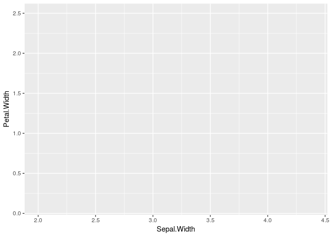
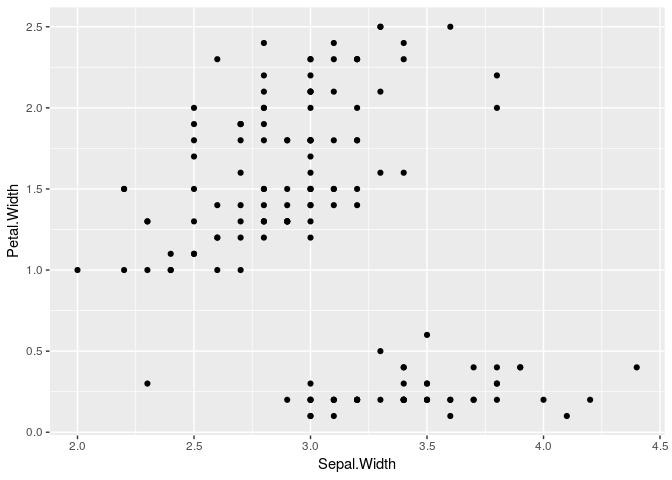
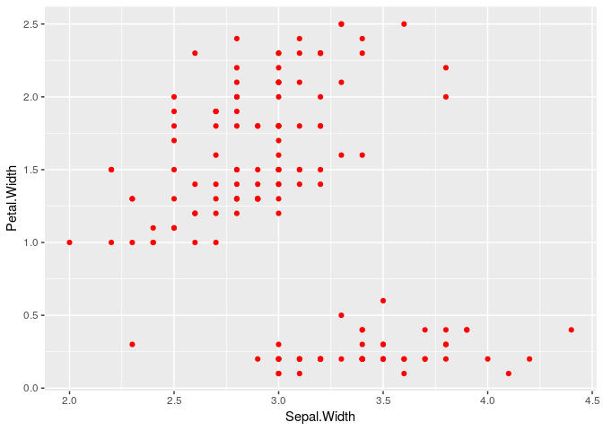

Class Introduction
================
Spencer Nystrom & Jamshaid Shahir

## Class Intro

  - Student introductions
  - class expectations:
      - work together
      - ask questions
      - be respectful of others
      - making mistakes is the best way to learn\!

## Rstudio.cloud setup

  - login w/ github account
  - disable “restore environemnt” setting in Rstudio
  - explain each window

<!-- end list -->

``` r
install.packages("tidyverse")
install.packages("gapminder")
```

### Create new folder for day1

### Talk about working directories

### R scripts vs. console

# Intro to R

## By default R spits out things to terminal

``` r
2 + 2
```

    ## [1] 4

``` r
100*100
```

    ## [1] 10000

``` r
"My name is Spencer"
```

    ## [1] "My name is Spencer"

## You can store things in **variables** with `<-`

``` r
myName <- "Spencer"
```

## R will spit it back out when you call it

``` r
myName
```

    ## [1] "Spencer"

## R can do operations on variables

``` r
myNumber <- 10

myNumber + 10
```

    ## [1] 20

# Data in R

`iris` is a built-in dataset that we will use today to cover some basic.
It contains measurements of 3 different species of flower.

We can look at the contents by printing it to the console (annoying for
large datasets)

``` r
iris
```

    ##     Sepal.Length Sepal.Width Petal.Length Petal.Width    Species
    ## 1            5.1         3.5          1.4         0.2     setosa
    ## 2            4.9         3.0          1.4         0.2     setosa
    ## 3            4.7         3.2          1.3         0.2     setosa
    ## 4            4.6         3.1          1.5         0.2     setosa
    ## 5            5.0         3.6          1.4         0.2     setosa
    ## 6            5.4         3.9          1.7         0.4     setosa
    ## 7            4.6         3.4          1.4         0.3     setosa
    ## 8            5.0         3.4          1.5         0.2     setosa
    ## 9            4.4         2.9          1.4         0.2     setosa
    ## 10           4.9         3.1          1.5         0.1     setosa
    ## 11           5.4         3.7          1.5         0.2     setosa
    ## 12           4.8         3.4          1.6         0.2     setosa
    ## 13           4.8         3.0          1.4         0.1     setosa
    ## 14           4.3         3.0          1.1         0.1     setosa
    ## 15           5.8         4.0          1.2         0.2     setosa
    ## 16           5.7         4.4          1.5         0.4     setosa
    ## 17           5.4         3.9          1.3         0.4     setosa
    ## 18           5.1         3.5          1.4         0.3     setosa
    ## 19           5.7         3.8          1.7         0.3     setosa
    ## 20           5.1         3.8          1.5         0.3     setosa
    ## 21           5.4         3.4          1.7         0.2     setosa
    ## 22           5.1         3.7          1.5         0.4     setosa
    ## 23           4.6         3.6          1.0         0.2     setosa
    ## 24           5.1         3.3          1.7         0.5     setosa
    ## 25           4.8         3.4          1.9         0.2     setosa
    ## 26           5.0         3.0          1.6         0.2     setosa
    ## 27           5.0         3.4          1.6         0.4     setosa
    ## 28           5.2         3.5          1.5         0.2     setosa
    ## 29           5.2         3.4          1.4         0.2     setosa
    ## 30           4.7         3.2          1.6         0.2     setosa
    ## 31           4.8         3.1          1.6         0.2     setosa
    ## 32           5.4         3.4          1.5         0.4     setosa
    ## 33           5.2         4.1          1.5         0.1     setosa
    ## 34           5.5         4.2          1.4         0.2     setosa
    ## 35           4.9         3.1          1.5         0.2     setosa
    ## 36           5.0         3.2          1.2         0.2     setosa
    ## 37           5.5         3.5          1.3         0.2     setosa
    ## 38           4.9         3.6          1.4         0.1     setosa
    ## 39           4.4         3.0          1.3         0.2     setosa
    ## 40           5.1         3.4          1.5         0.2     setosa
    ## 41           5.0         3.5          1.3         0.3     setosa
    ## 42           4.5         2.3          1.3         0.3     setosa
    ## 43           4.4         3.2          1.3         0.2     setosa
    ## 44           5.0         3.5          1.6         0.6     setosa
    ## 45           5.1         3.8          1.9         0.4     setosa
    ## 46           4.8         3.0          1.4         0.3     setosa
    ## 47           5.1         3.8          1.6         0.2     setosa
    ## 48           4.6         3.2          1.4         0.2     setosa
    ## 49           5.3         3.7          1.5         0.2     setosa
    ## 50           5.0         3.3          1.4         0.2     setosa
    ## 51           7.0         3.2          4.7         1.4 versicolor
    ## 52           6.4         3.2          4.5         1.5 versicolor
    ## 53           6.9         3.1          4.9         1.5 versicolor
    ## 54           5.5         2.3          4.0         1.3 versicolor
    ## 55           6.5         2.8          4.6         1.5 versicolor
    ## 56           5.7         2.8          4.5         1.3 versicolor
    ## 57           6.3         3.3          4.7         1.6 versicolor
    ## 58           4.9         2.4          3.3         1.0 versicolor
    ## 59           6.6         2.9          4.6         1.3 versicolor
    ## 60           5.2         2.7          3.9         1.4 versicolor
    ## 61           5.0         2.0          3.5         1.0 versicolor
    ## 62           5.9         3.0          4.2         1.5 versicolor
    ## 63           6.0         2.2          4.0         1.0 versicolor
    ## 64           6.1         2.9          4.7         1.4 versicolor
    ## 65           5.6         2.9          3.6         1.3 versicolor
    ## 66           6.7         3.1          4.4         1.4 versicolor
    ## 67           5.6         3.0          4.5         1.5 versicolor
    ## 68           5.8         2.7          4.1         1.0 versicolor
    ## 69           6.2         2.2          4.5         1.5 versicolor
    ## 70           5.6         2.5          3.9         1.1 versicolor
    ## 71           5.9         3.2          4.8         1.8 versicolor
    ## 72           6.1         2.8          4.0         1.3 versicolor
    ## 73           6.3         2.5          4.9         1.5 versicolor
    ## 74           6.1         2.8          4.7         1.2 versicolor
    ## 75           6.4         2.9          4.3         1.3 versicolor
    ## 76           6.6         3.0          4.4         1.4 versicolor
    ## 77           6.8         2.8          4.8         1.4 versicolor
    ## 78           6.7         3.0          5.0         1.7 versicolor
    ## 79           6.0         2.9          4.5         1.5 versicolor
    ## 80           5.7         2.6          3.5         1.0 versicolor
    ## 81           5.5         2.4          3.8         1.1 versicolor
    ## 82           5.5         2.4          3.7         1.0 versicolor
    ## 83           5.8         2.7          3.9         1.2 versicolor
    ## 84           6.0         2.7          5.1         1.6 versicolor
    ## 85           5.4         3.0          4.5         1.5 versicolor
    ## 86           6.0         3.4          4.5         1.6 versicolor
    ## 87           6.7         3.1          4.7         1.5 versicolor
    ## 88           6.3         2.3          4.4         1.3 versicolor
    ## 89           5.6         3.0          4.1         1.3 versicolor
    ## 90           5.5         2.5          4.0         1.3 versicolor
    ## 91           5.5         2.6          4.4         1.2 versicolor
    ## 92           6.1         3.0          4.6         1.4 versicolor
    ## 93           5.8         2.6          4.0         1.2 versicolor
    ## 94           5.0         2.3          3.3         1.0 versicolor
    ## 95           5.6         2.7          4.2         1.3 versicolor
    ## 96           5.7         3.0          4.2         1.2 versicolor
    ## 97           5.7         2.9          4.2         1.3 versicolor
    ## 98           6.2         2.9          4.3         1.3 versicolor
    ## 99           5.1         2.5          3.0         1.1 versicolor
    ## 100          5.7         2.8          4.1         1.3 versicolor
    ## 101          6.3         3.3          6.0         2.5  virginica
    ## 102          5.8         2.7          5.1         1.9  virginica
    ## 103          7.1         3.0          5.9         2.1  virginica
    ## 104          6.3         2.9          5.6         1.8  virginica
    ## 105          6.5         3.0          5.8         2.2  virginica
    ## 106          7.6         3.0          6.6         2.1  virginica
    ## 107          4.9         2.5          4.5         1.7  virginica
    ## 108          7.3         2.9          6.3         1.8  virginica
    ## 109          6.7         2.5          5.8         1.8  virginica
    ## 110          7.2         3.6          6.1         2.5  virginica
    ## 111          6.5         3.2          5.1         2.0  virginica
    ## 112          6.4         2.7          5.3         1.9  virginica
    ## 113          6.8         3.0          5.5         2.1  virginica
    ## 114          5.7         2.5          5.0         2.0  virginica
    ## 115          5.8         2.8          5.1         2.4  virginica
    ## 116          6.4         3.2          5.3         2.3  virginica
    ## 117          6.5         3.0          5.5         1.8  virginica
    ## 118          7.7         3.8          6.7         2.2  virginica
    ## 119          7.7         2.6          6.9         2.3  virginica
    ## 120          6.0         2.2          5.0         1.5  virginica
    ## 121          6.9         3.2          5.7         2.3  virginica
    ## 122          5.6         2.8          4.9         2.0  virginica
    ## 123          7.7         2.8          6.7         2.0  virginica
    ## 124          6.3         2.7          4.9         1.8  virginica
    ## 125          6.7         3.3          5.7         2.1  virginica
    ## 126          7.2         3.2          6.0         1.8  virginica
    ## 127          6.2         2.8          4.8         1.8  virginica
    ## 128          6.1         3.0          4.9         1.8  virginica
    ## 129          6.4         2.8          5.6         2.1  virginica
    ## 130          7.2         3.0          5.8         1.6  virginica
    ## 131          7.4         2.8          6.1         1.9  virginica
    ## 132          7.9         3.8          6.4         2.0  virginica
    ## 133          6.4         2.8          5.6         2.2  virginica
    ## 134          6.3         2.8          5.1         1.5  virginica
    ## 135          6.1         2.6          5.6         1.4  virginica
    ## 136          7.7         3.0          6.1         2.3  virginica
    ## 137          6.3         3.4          5.6         2.4  virginica
    ## 138          6.4         3.1          5.5         1.8  virginica
    ## 139          6.0         3.0          4.8         1.8  virginica
    ## 140          6.9         3.1          5.4         2.1  virginica
    ## 141          6.7         3.1          5.6         2.4  virginica
    ## 142          6.9         3.1          5.1         2.3  virginica
    ## 143          5.8         2.7          5.1         1.9  virginica
    ## 144          6.8         3.2          5.9         2.3  virginica
    ## 145          6.7         3.3          5.7         2.5  virginica
    ## 146          6.7         3.0          5.2         2.3  virginica
    ## 147          6.3         2.5          5.0         1.9  virginica
    ## 148          6.5         3.0          5.2         2.0  virginica
    ## 149          6.2         3.4          5.4         2.3  virginica
    ## 150          5.9         3.0          5.1         1.8  virginica

The `head()` function will print the first 6 rows

``` r
head(iris)
```

    ##   Sepal.Length Sepal.Width Petal.Length Petal.Width Species
    ## 1          5.1         3.5          1.4         0.2  setosa
    ## 2          4.9         3.0          1.4         0.2  setosa
    ## 3          4.7         3.2          1.3         0.2  setosa
    ## 4          4.6         3.1          1.5         0.2  setosa
    ## 5          5.0         3.6          1.4         0.2  setosa
    ## 6          5.4         3.9          1.7         0.4  setosa

The `View()` function will open the dataset in Rstudio’s data viewer.

``` r
View(iris)
```

Datasets can be stored in R as **data.frames**. `iris` is a data.frame.
You can think of these like excel tables.

What is special about data.frames is that each column contains data of a
certain type. R sees numbers and words as different things. Number
columns can be used in math operations, but word columns cannot.
**Note:** We will talk in more detail about these data types later

You can view the type of each column with the `str()` (Structure)
function. Here you can see that `Sepal.Length` is a number (`num`), but
`Species` is a type called a `Factor`.

``` r
str(iris)
```

    ## 'data.frame':    150 obs. of  5 variables:
    ##  $ Sepal.Length: num  5.1 4.9 4.7 4.6 5 5.4 4.6 5 4.4 4.9 ...
    ##  $ Sepal.Width : num  3.5 3 3.2 3.1 3.6 3.9 3.4 3.4 2.9 3.1 ...
    ##  $ Petal.Length: num  1.4 1.4 1.3 1.5 1.4 1.7 1.4 1.5 1.4 1.5 ...
    ##  $ Petal.Width : num  0.2 0.2 0.2 0.2 0.2 0.4 0.3 0.2 0.2 0.1 ...
    ##  $ Species     : Factor w/ 3 levels "setosa","versicolor",..: 1 1 1 1 1 1 1 1 1 1 ...

Individual columns can be referenced in R by using `$` to call a column
by
    name.

``` r
iris$Sepal.Length
```

    ##   [1] 5.1 4.9 4.7 4.6 5.0 5.4 4.6 5.0 4.4 4.9 5.4 4.8 4.8 4.3 5.8 5.7 5.4
    ##  [18] 5.1 5.7 5.1 5.4 5.1 4.6 5.1 4.8 5.0 5.0 5.2 5.2 4.7 4.8 5.4 5.2 5.5
    ##  [35] 4.9 5.0 5.5 4.9 4.4 5.1 5.0 4.5 4.4 5.0 5.1 4.8 5.1 4.6 5.3 5.0 7.0
    ##  [52] 6.4 6.9 5.5 6.5 5.7 6.3 4.9 6.6 5.2 5.0 5.9 6.0 6.1 5.6 6.7 5.6 5.8
    ##  [69] 6.2 5.6 5.9 6.1 6.3 6.1 6.4 6.6 6.8 6.7 6.0 5.7 5.5 5.5 5.8 6.0 5.4
    ##  [86] 6.0 6.7 6.3 5.6 5.5 5.5 6.1 5.8 5.0 5.6 5.7 5.7 6.2 5.1 5.7 6.3 5.8
    ## [103] 7.1 6.3 6.5 7.6 4.9 7.3 6.7 7.2 6.5 6.4 6.8 5.7 5.8 6.4 6.5 7.7 7.7
    ## [120] 6.0 6.9 5.6 7.7 6.3 6.7 7.2 6.2 6.1 6.4 7.2 7.4 7.9 6.4 6.3 6.1 7.7
    ## [137] 6.3 6.4 6.0 6.9 6.7 6.9 5.8 6.8 6.7 6.7 6.3 6.5 6.2 5.9

``` r
iris$Species
```

    ##   [1] setosa     setosa     setosa     setosa     setosa     setosa    
    ##   [7] setosa     setosa     setosa     setosa     setosa     setosa    
    ##  [13] setosa     setosa     setosa     setosa     setosa     setosa    
    ##  [19] setosa     setosa     setosa     setosa     setosa     setosa    
    ##  [25] setosa     setosa     setosa     setosa     setosa     setosa    
    ##  [31] setosa     setosa     setosa     setosa     setosa     setosa    
    ##  [37] setosa     setosa     setosa     setosa     setosa     setosa    
    ##  [43] setosa     setosa     setosa     setosa     setosa     setosa    
    ##  [49] setosa     setosa     versicolor versicolor versicolor versicolor
    ##  [55] versicolor versicolor versicolor versicolor versicolor versicolor
    ##  [61] versicolor versicolor versicolor versicolor versicolor versicolor
    ##  [67] versicolor versicolor versicolor versicolor versicolor versicolor
    ##  [73] versicolor versicolor versicolor versicolor versicolor versicolor
    ##  [79] versicolor versicolor versicolor versicolor versicolor versicolor
    ##  [85] versicolor versicolor versicolor versicolor versicolor versicolor
    ##  [91] versicolor versicolor versicolor versicolor versicolor versicolor
    ##  [97] versicolor versicolor versicolor versicolor virginica  virginica 
    ## [103] virginica  virginica  virginica  virginica  virginica  virginica 
    ## [109] virginica  virginica  virginica  virginica  virginica  virginica 
    ## [115] virginica  virginica  virginica  virginica  virginica  virginica 
    ## [121] virginica  virginica  virginica  virginica  virginica  virginica 
    ## [127] virginica  virginica  virginica  virginica  virginica  virginica 
    ## [133] virginica  virginica  virginica  virginica  virginica  virginica 
    ## [139] virginica  virginica  virginica  virginica  virginica  virginica 
    ## [145] virginica  virginica  virginica  virginica  virginica  virginica 
    ## Levels: setosa versicolor virginica

R will do operations along entire columns. To multiply all
`Sepal.Length` values by 2, for
    example:

``` r
iris$Sepal.Length * 2
```

    ##   [1] 10.2  9.8  9.4  9.2 10.0 10.8  9.2 10.0  8.8  9.8 10.8  9.6  9.6  8.6
    ##  [15] 11.6 11.4 10.8 10.2 11.4 10.2 10.8 10.2  9.2 10.2  9.6 10.0 10.0 10.4
    ##  [29] 10.4  9.4  9.6 10.8 10.4 11.0  9.8 10.0 11.0  9.8  8.8 10.2 10.0  9.0
    ##  [43]  8.8 10.0 10.2  9.6 10.2  9.2 10.6 10.0 14.0 12.8 13.8 11.0 13.0 11.4
    ##  [57] 12.6  9.8 13.2 10.4 10.0 11.8 12.0 12.2 11.2 13.4 11.2 11.6 12.4 11.2
    ##  [71] 11.8 12.2 12.6 12.2 12.8 13.2 13.6 13.4 12.0 11.4 11.0 11.0 11.6 12.0
    ##  [85] 10.8 12.0 13.4 12.6 11.2 11.0 11.0 12.2 11.6 10.0 11.2 11.4 11.4 12.4
    ##  [99] 10.2 11.4 12.6 11.6 14.2 12.6 13.0 15.2  9.8 14.6 13.4 14.4 13.0 12.8
    ## [113] 13.6 11.4 11.6 12.8 13.0 15.4 15.4 12.0 13.8 11.2 15.4 12.6 13.4 14.4
    ## [127] 12.4 12.2 12.8 14.4 14.8 15.8 12.8 12.6 12.2 15.4 12.6 12.8 12.0 13.8
    ## [141] 13.4 13.8 11.6 13.6 13.4 13.4 12.6 13.0 12.4 11.8

## Exercise (3 minutes):

  - print all values of `Petal.Width` to the terminal
  - You can ask for help in R using the `?` function. Try running
    `?mean` to find out what the `mean()` function does.
  - what is the mean value of `Petal.Width`?
  - what is the sum of all `Petal.Width`? (HINT: guess the function
    name, or google for it\!)

## Plotting

The package `ggplot2` is used for making plots from data.frames. Load
the package by calling `library(ggplot2)`. You only have to load
libraries once per script.

``` r
library(ggplot2)
```

    ## Registered S3 methods overwritten by 'ggplot2':
    ##   method         from 
    ##   [.quosures     rlang
    ##   c.quosures     rlang
    ##   print.quosures rlang

The function `ggplot()` is used to build plots from data. By calling
`ggplot` alone we build a totally empty plot.

``` r
ggplot()
```

<!-- -->
We tell ggplot to use a dataset by giving it a `data.frame` to the
`data` argument.

``` r
ggplot(data = iris)
```

<!-- -->
Lets make a scatterplot of Sepal width vs Petal width.

To do this we have to **map** the data onto the plot. Do do this we make
an **aesthetic** (with `aes()`). **aesthetics** are parts of the plot
that are **determined by the data**. Here we say that we want to plot
the `Sepal.Width` on the x-axis, and `Petal.Width` on the y-axis.

This creates a plotting area that is informed by the data in `iris`.

``` r
ggplot(data = iris, mapping = aes(x = Sepal.Width, y = Petal.Width)) 
```

<!-- -->
Now let’s add the points. We do this by adding a `geom`. In this case
`geom_point` for datapoints.

``` r
ggplot(data = iris, mapping = aes(x = Sepal.Width, y = Petal.Width)) +
  geom_point()
```

<!-- -->

Plots can be saved to variables just like
before

``` r
sepal.vs.petal <- ggplot(data = iris, mapping = aes(x = Sepal.Width, y = Petal.Width)) +
  geom_point()
```

``` r
sepal.vs.petal
```

<!-- -->

We can edit the parameters of geoms. For example, you can change the
color of the points by editing the `color` parameter.

``` r
ggplot(data = iris, mapping = aes(x = Sepal.Width, y = Petal.Width)) +
  geom_point(color = "red")
```

<!-- -->

## Exercise:

  - Let’s make the same scatterplot but color the points by their
    `Species`.

<!-- end list -->

``` r
ggplot(data = iris, mapping = aes(x = Sepal.Width, y = Petal.Width)) +
  geom_point(color = Species)
```
