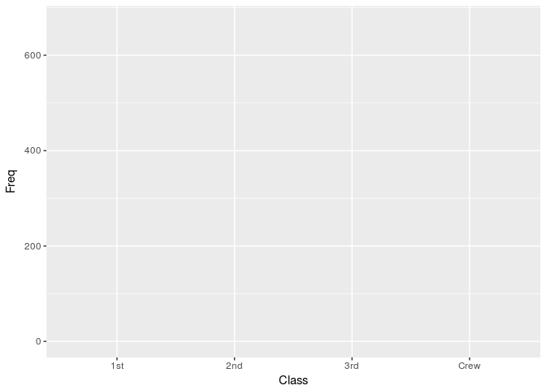

Class Introduction
================
Spencer Nystrom & Grace DiCecco

Login to Github
---------------

### Clone student repo to Rstudio.cloud

`install.packages("tidyverse")`

``` r
install.packages("tidyverse")
```

### Terminal:

`git config --global user.name <User>`

`git config --global user.email <user@email>`

### Create new folder for day1

### Talk about working directories

Introduce markdown
------------------

-   output: github\_document
-   knit

talk about commit and push
--------------------------

-   save, knit, and commit files to git
-   push changes to github
-   Check github to see output

Data in R
=========

``` r
titanic <- as.data.frame(Titanic)
head(titanic)
```

    ##   Class    Sex   Age Survived Freq
    ## 1   1st   Male Child       No    0
    ## 2   2nd   Male Child       No    0
    ## 3   3rd   Male Child       No   35
    ## 4  Crew   Male Child       No    0
    ## 5   1st Female Child       No    0
    ## 6   2nd Female Child       No    0

``` r
library(ggplot2)
```

``` r
ggplot(data = titanic, aes(x = Class, y = Freq)) # create the plotting space
```



``` r
ggplot(data = titanic, aes(x = Class, y = Freq)) +
    geom_col()
```


``` r
ggplot(titanic, aes(Class, Freq)) +
    geom_col(aes(fill = Survived))
```


``` r
ggplot(titanic, aes(Class, Freq)) +
    geom_col(aes(fill = Survived), position = "fill")
```


