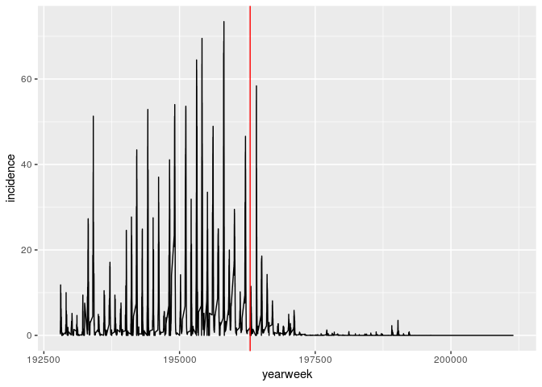

Data Import & Cleaning
================
25 June, 2019

``` r
library(ggplot2)
```

    ## Registered S3 methods overwritten by 'ggplot2':
    ##   method         from 
    ##   [.quosures     rlang
    ##   c.quosures     rlang
    ##   print.quosures rlang

``` r
library(dplyr)
```

    ## 
    ## Attaching package: 'dplyr'

    ## The following objects are masked from 'package:stats':
    ## 
    ##     filter, lag

    ## The following objects are masked from 'package:base':
    ## 
    ##     intersect, setdiff, setequal, union

``` r
library(readr) # Functions for importing & exporting files
```

R can read files from your computer, or it can use a weblink to a file.
Today we’ll read in this file I’ve put up on github so it’s easier to
distribute to all of you. If you wanted to read in your own data, you
would give R the path to your file on your machine.

    ## Parsed with column specification:
    ## cols(
    ##   Alice = col_character(),
    ##   `20` = col_double(),
    ##   Blue = col_character()
    ## )

    ## # A tibble: 4 x 3
    ##   Alice      `20` Blue  
    ##   <chr>     <dbl> <chr> 
    ## 1 Bob          18 Red   
    ## 2 Claire       23 Blue  
    ## 3 Doug         21 Orange
    ## 4 Elizabeth    18 Green

## People dataset

``` r
# These are 2 different data files hosted on Github. R can stream files from web links (not usually best way to get data).
people_link <- "https://raw.githubusercontent.com/UNC-HLC-R-Intro/lessons_2019/master/data_import/people.csv"
people2_link <- "https://raw.githubusercontent.com/UNC-HLC-R-Intro/lessons_2019/master/data_import/people2.csv"
```

``` r
people <- read_csv(people_link)
```

    ## Parsed with column specification:
    ## cols(
    ##   name = col_character(),
    ##   age = col_double(),
    ##   favorite_color = col_character()
    ## )

``` r
people
```

    ## # A tibble: 5 x 3
    ##   name        age favorite_color
    ##   <chr>     <dbl> <chr>         
    ## 1 Alice        20 Blue          
    ## 2 Bob          18 Red           
    ## 3 Claire       23 Blue          
    ## 4 Doug         21 Orange        
    ## 5 Elizabeth    18 Green

``` r
read_csv(people2_link)
```

    ## Parsed with column specification:
    ## cols(
    ##   `# This dataset contains information about people` = col_character(),
    ##   `their ages` = col_double(),
    ##   `and their favorite colors` = col_character()
    ## )

    ## # A tibble: 5 x 3
    ##   `# This dataset contains information… `their ages` `and their favorite c…
    ##   <chr>                                        <dbl> <chr>                 
    ## 1 Alice                                           20 Blue                  
    ## 2 Bob                                             18 Red                   
    ## 3 Claire                                          23 Blue                  
    ## 4 Doug                                            21 Orange                
    ## 5 Elizabeth                                       18 Green

### dplyr can rename columns

``` r
people_renamed <- people %>% 
  rename(color = favorite_color)
```

### Writing files

`readr` has several `write_<type>` functions.

``` r
write_csv(people_renamed, path = "people_renamed.csv", col_names = T)
```

`write_delim` is a generic writer that allows you to set the delimiter.

## reshaping & tidying data

    ## Parsed with column specification:
    ## cols(
    ##   .default = col_double(),
    ##   state = col_character(),
    ##   disease = col_character()
    ## )

    ## See spec(...) for full column specifications.

    ## Parsed with column specification:
    ## cols(
    ##   .default = col_double(),
    ##   state = col_character(),
    ##   disease = col_character()
    ## )

    ## See spec(...) for full column specifications.

``` r
tx_measles_link <- "https://raw.githubusercontent.com/UNC-HLC-R-Intro/lessons_2019/master/data/tycho_tx_measles_wide.csv"
```

``` r
tx_measles <- read_csv(tx_measles_link)
```

    ## Parsed with column specification:
    ## cols(
    ##   .default = col_double(),
    ##   state = col_character(),
    ##   disease = col_character()
    ## )

    ## See spec(...) for full column specifications.

This dataset tracks disease occurrance over time

``` r
tx_measles 
```

    ## # A tibble: 1 x 4,323
    ##   state disease `192801` `192802` `192803` `192804` `192805` `192806`
    ##   <chr> <chr>      <dbl>    <dbl>    <dbl>    <dbl>    <dbl>    <dbl>
    ## 1 TEXAS MEASLES     1.18     0.63     0.62     0.37     1.57     3.44
    ## # … with 4,315 more variables: `192807` <dbl>, `192808` <dbl>,
    ## #   `192809` <dbl>, `192810` <dbl>, `192811` <dbl>, `192812` <dbl>,
    ## #   `192813` <dbl>, `192814` <dbl>, `192815` <dbl>, `192816` <dbl>,
    ## #   `192817` <dbl>, `192818` <dbl>, `192819` <dbl>, `192820` <dbl>,
    ## #   `192821` <dbl>, `192822` <dbl>, `192823` <dbl>, `192824` <dbl>,
    ## #   `192825` <dbl>, `192826` <dbl>, `192827` <dbl>, `192828` <dbl>,
    ## #   `192829` <dbl>, `192830` <dbl>, `192831` <dbl>, `192832` <dbl>,
    ## #   `192833` <dbl>, `192834` <dbl>, `192835` <dbl>, `192836` <dbl>,
    ## #   `192837` <dbl>, `192838` <dbl>, `192839` <dbl>, `192840` <dbl>,
    ## #   `192841` <dbl>, `192842` <dbl>, `192843` <dbl>, `192844` <dbl>,
    ## #   `192845` <dbl>, `192846` <dbl>, `192847` <dbl>, `192848` <dbl>,
    ## #   `192849` <dbl>, `192850` <dbl>, `192851` <dbl>, `192852` <dbl>,
    ## #   `192901` <dbl>, `192902` <dbl>, `192903` <dbl>, `192904` <dbl>,
    ## #   `192905` <dbl>, `192906` <dbl>, `192907` <dbl>, `192908` <dbl>,
    ## #   `192909` <dbl>, `192910` <dbl>, `192911` <dbl>, `192912` <dbl>,
    ## #   `192913` <dbl>, `192914` <dbl>, `192915` <dbl>, `192916` <dbl>,
    ## #   `192917` <dbl>, `192918` <dbl>, `192919` <dbl>, `192920` <dbl>,
    ## #   `192921` <dbl>, `192922` <dbl>, `192923` <dbl>, `192924` <dbl>,
    ## #   `192925` <dbl>, `192926` <dbl>, `192927` <dbl>, `192928` <dbl>,
    ## #   `192929` <dbl>, `192930` <dbl>, `192931` <dbl>, `192932` <dbl>,
    ## #   `192933` <dbl>, `192934` <dbl>, `192935` <dbl>, `192936` <dbl>,
    ## #   `192937` <dbl>, `192938` <dbl>, `192939` <dbl>, `192940` <dbl>,
    ## #   `192941` <dbl>, `192942` <dbl>, `192943` <dbl>, `192944` <dbl>,
    ## #   `192945` <dbl>, `192946` <dbl>, `192947` <dbl>, `192948` <dbl>,
    ## #   `192949` <dbl>, `192950` <dbl>, `192951` <dbl>, `192952` <dbl>,
    ## #   `193001` <dbl>, `193002` <dbl>, …

## Exercise 2

How would you make a plot of these data?

``` r
library(reshape2)
```

Converting data from wide to long (sometimes called “tidy”) format is
called a “melt” or a “pivot”.

The `reshape2` library allows us to melt data

``` r
melt(tx_measles)
```

    ## Using state, disease as id variables

    ##      state disease variable value
    ## 1    TEXAS MEASLES   192801  1.18
    ## 2    TEXAS MEASLES   192802  0.63
    ## 3    TEXAS MEASLES   192803  0.62
    ## 4    TEXAS MEASLES   192804  0.37
    ## 5    TEXAS MEASLES   192805  1.57
    ## 6    TEXAS MEASLES   192806  3.44
    ## 7    TEXAS MEASLES   192807  2.08
    ## 8    TEXAS MEASLES   192808  2.34
    ## 9    TEXAS MEASLES   192809 11.82
    ## 10   TEXAS MEASLES   192810  7.74
    ## 11   TEXAS MEASLES   192811  2.20
    ## 12   TEXAS MEASLES   192812  8.65
    ## 13   TEXAS MEASLES   192813  2.13
    ## 14   TEXAS MEASLES   192814  9.89
    ## 15   TEXAS MEASLES   192815  4.70
    ## 16   TEXAS MEASLES   192816  4.97
    ## 17   TEXAS MEASLES   192817  1.81
    ## 18   TEXAS MEASLES   192818  6.24
    ## 19   TEXAS MEASLES   192819  3.42
    ## 20   TEXAS MEASLES   192820  1.81
    ## 21   TEXAS MEASLES   192821  2.04
    ## 22   TEXAS MEASLES   192822  4.33
    ## 23   TEXAS MEASLES   192823  4.18
    ## 24   TEXAS MEASLES   192824  0.90
    ## 25   TEXAS MEASLES   192825  1.52
    ## 26   TEXAS MEASLES   192826  1.83
    ## 27   TEXAS MEASLES   192827  0.79
    ## 28   TEXAS MEASLES   192828  0.97
    ## 29   TEXAS MEASLES   192829  0.41
    ## 30   TEXAS MEASLES   192830  0.00
    ## 31   TEXAS MEASLES   192831  0.11
    ## 32   TEXAS MEASLES   192832  0.11
    ## 33   TEXAS MEASLES   192833  0.05
    ## 34   TEXAS MEASLES   192834  0.05
    ## 35   TEXAS MEASLES   192835  0.00
    ## 36   TEXAS MEASLES   192836  0.02
    ## 37   TEXAS MEASLES   192837  0.02
    ## 38   TEXAS MEASLES   192838  0.05
    ## 39   TEXAS MEASLES   192839  0.11
    ## 40   TEXAS MEASLES   192840  0.16
    ## 41   TEXAS MEASLES   192841  0.00
    ## 42   TEXAS MEASLES   192842  0.35
    ## 43   TEXAS MEASLES   192843  0.09
    ## 44   TEXAS MEASLES   192844  0.04
    ## 45   TEXAS MEASLES   192845  0.09
    ## 46   TEXAS MEASLES   192846  0.26
    ## 47   TEXAS MEASLES   192847  0.04
    ## 48   TEXAS MEASLES   192848  0.55
    ## 49   TEXAS MEASLES   192849  0.07
    ## 50   TEXAS MEASLES   192850  0.25
    ## 51   TEXAS MEASLES   192851  0.26
    ## 52   TEXAS MEASLES   192852  0.09
    ## 53   TEXAS MEASLES   192901  0.75
    ## 54   TEXAS MEASLES   192902  1.54
    ## 55   TEXAS MEASLES   192903  0.35
    ## 56   TEXAS MEASLES   192904  2.52
    ## 57   TEXAS MEASLES   192905  1.25
    ## 58   TEXAS MEASLES   192906  0.82
    ## 59   TEXAS MEASLES   192907  0.89
    ## 60   TEXAS MEASLES   192908  1.49
    ## 61   TEXAS MEASLES   192909  1.30
    ## 62   TEXAS MEASLES   192910 10.01
    ## 63   TEXAS MEASLES   192911  0.75
    ## 64   TEXAS MEASLES   192912  2.60
    ## 65   TEXAS MEASLES   192913  2.07
    ## 66   TEXAS MEASLES   192914  3.59
    ## 67   TEXAS MEASLES   192915  5.78
    ## 68   TEXAS MEASLES   192916  1.74
    ## 69   TEXAS MEASLES   192917  2.22
    ## 70   TEXAS MEASLES   192918  3.05
    ## 71   TEXAS MEASLES   192919  4.27
    ## 72   TEXAS MEASLES   192920  2.71
    ## 73   TEXAS MEASLES   192921  4.88
    ## 74   TEXAS MEASLES   192922  2.99
    ## 75   TEXAS MEASLES   192923  2.43
    ## 76   TEXAS MEASLES   192924  2.19
    ## 77   TEXAS MEASLES   192925  1.58
    ## 78   TEXAS MEASLES   192926  1.18
    ## 79   TEXAS MEASLES   192927  1.06
    ## 80   TEXAS MEASLES   192928  0.59
    ## 81   TEXAS MEASLES   192929  0.21
    ## 82   TEXAS MEASLES   192930  0.07
    ## 83   TEXAS MEASLES   192931  0.17
    ## 84   TEXAS MEASLES   192932  0.10
    ## 85   TEXAS MEASLES   192933  0.09
    ## 86   TEXAS MEASLES   192934  0.14
    ## 87   TEXAS MEASLES   192935  0.03
    ## 88   TEXAS MEASLES   192936  0.05
    ## 89   TEXAS MEASLES   192937  0.10
    ## 90   TEXAS MEASLES   192938  0.02
    ## 91   TEXAS MEASLES   192939  0.02
    ## 92   TEXAS MEASLES   192940  0.03
    ## 93   TEXAS MEASLES   192941  0.03
    ## 94   TEXAS MEASLES   192942  0.02
    ## 95   TEXAS MEASLES   192943  0.07
    ## 96   TEXAS MEASLES   192944  0.09
    ## 97   TEXAS MEASLES   192945  1.86
    ## 98   TEXAS MEASLES   192946  0.03
    ## 99   TEXAS MEASLES   192947  0.07
    ## 100  TEXAS MEASLES   192948  0.03
    ## 101  TEXAS MEASLES   192949  0.03
    ## 102  TEXAS MEASLES   192950  0.36
    ## 103  TEXAS MEASLES   192951  0.17
    ## 104  TEXAS MEASLES   192952  0.89
    ## 105  TEXAS MEASLES   193001  0.14
    ## 106  TEXAS MEASLES   193002  0.10
    ## 107  TEXAS MEASLES   193003  1.35
    ## 108  TEXAS MEASLES   193004  1.61
    ## 109  TEXAS MEASLES   193005  1.95
    ## 110  TEXAS MEASLES   193006  1.80
    ## 111  TEXAS MEASLES   193007  2.05
    ## 112  TEXAS MEASLES   193008  2.45
    ## 113  TEXAS MEASLES   193009  2.58
    ## 114  TEXAS MEASLES   193010  3.29
    ## 115  TEXAS MEASLES   193011  1.81
    ## 116  TEXAS MEASLES   193012  2.21
    ## 117  TEXAS MEASLES   193013  2.29
    ## 118  TEXAS MEASLES   193014  3.05
    ## 119  TEXAS MEASLES   193015  3.08
    ## 120  TEXAS MEASLES   193016  2.91
    ## 121  TEXAS MEASLES   193017  3.30
    ## 122  TEXAS MEASLES   193018  3.94
    ## 123  TEXAS MEASLES   193019  5.15
    ## 124  TEXAS MEASLES   193020  4.43
    ## 125  TEXAS MEASLES   193021  3.97
    ## 126  TEXAS MEASLES   193022  3.71
    ## 127  TEXAS MEASLES   193023  3.13
    ## 128  TEXAS MEASLES   193024  1.76
    ## 129  TEXAS MEASLES   193025  1.23
    ## 130  TEXAS MEASLES   193026  0.92
    ## 131  TEXAS MEASLES   193027  0.87
    ## 132  TEXAS MEASLES   193028  0.24
    ## 133  TEXAS MEASLES   193029  0.79
    ## 134  TEXAS MEASLES   193030  0.48
    ## 135  TEXAS MEASLES   193031  0.10
    ## 136  TEXAS MEASLES   193032  0.36
    ## 137  TEXAS MEASLES   193033  0.12
    ## 138  TEXAS MEASLES   193034  0.26
    ## 139  TEXAS MEASLES   193035  0.03
    ## 140  TEXAS MEASLES   193036  0.14
    ## 141  TEXAS MEASLES   193037  0.02
    ## 142  TEXAS MEASLES   193038  0.03
    ## 143  TEXAS MEASLES   193039  0.00
    ## 144  TEXAS MEASLES   193040  0.03
    ## 145  TEXAS MEASLES   193041  0.03
    ## 146  TEXAS MEASLES   193042  0.15
    ## 147  TEXAS MEASLES   193043  0.07
    ## 148  TEXAS MEASLES   193044  0.22
    ## 149  TEXAS MEASLES   193045  0.14
    ## 150  TEXAS MEASLES   193046  0.44
    ## 151  TEXAS MEASLES   193047  0.44
    ## 152  TEXAS MEASLES   193048  0.02
    ## 153  TEXAS MEASLES   193049  0.75
    ## 154  TEXAS MEASLES   193050  0.92
    ## 155  TEXAS MEASLES   193051  0.87
    ## 156  TEXAS MEASLES   193052  1.39
    ## 157  TEXAS MEASLES   193101  1.02
    ## 158  TEXAS MEASLES   193102  0.15
    ## 159  TEXAS MEASLES   193103  2.39
    ## 160  TEXAS MEASLES   193104  2.51
    ## 161  TEXAS MEASLES   193105  1.69
    ## 162  TEXAS MEASLES   193106  1.54
    ## 163  TEXAS MEASLES   193107  2.73
    ## 164  TEXAS MEASLES   193108  1.88
    ## 165  TEXAS MEASLES   193109  1.56
    ## 166  TEXAS MEASLES   193110  4.67
    ## 167  TEXAS MEASLES   193111  1.20
    ## 168  TEXAS MEASLES   193112  1.68
    ## 169  TEXAS MEASLES   193113  1.66
    ## 170  TEXAS MEASLES   193114  1.13
    ## 171  TEXAS MEASLES   193115  0.96
    ## 172  TEXAS MEASLES   193116  0.05
    ## 173  TEXAS MEASLES   193117  1.24
    ## 174  TEXAS MEASLES   193118  1.93
    ## 175  TEXAS MEASLES   193119  0.76
    ## 176  TEXAS MEASLES   193120  0.98
    ## 177  TEXAS MEASLES   193121  1.22
    ## 178  TEXAS MEASLES   193122  1.51
    ## 179  TEXAS MEASLES   193123  1.30
    ## 180  TEXAS MEASLES   193124  0.30
    ## 181  TEXAS MEASLES   193125  1.17
    ## 182  TEXAS MEASLES   193126  0.44
    ## 183  TEXAS MEASLES   193127  0.30
    ## 184  TEXAS MEASLES   193128  0.32
    ## 185  TEXAS MEASLES   193129  0.02
    ## 186  TEXAS MEASLES   193130  0.10
    ## 187  TEXAS MEASLES   193131  0.02
    ## 188  TEXAS MEASLES   193132  0.07
    ## 189  TEXAS MEASLES   193133  0.00
    ## 190  TEXAS MEASLES   193134  0.05
    ## 191  TEXAS MEASLES   193135  0.02
    ## 192  TEXAS MEASLES   193136  0.00
    ## 193  TEXAS MEASLES   193137  0.00
    ## 194  TEXAS MEASLES   193138  0.00
    ## 195  TEXAS MEASLES   193139  0.02
    ## 196  TEXAS MEASLES   193140  0.03
    ## 197  TEXAS MEASLES   193141  0.07
    ## 198  TEXAS MEASLES   193142  0.00
    ## 199  TEXAS MEASLES   193143  0.24
    ## 200  TEXAS MEASLES   193144  0.19
    ## 201  TEXAS MEASLES   193145  0.10
    ## 202  TEXAS MEASLES   193146  0.03
    ## 203  TEXAS MEASLES   193147  0.19
    ## 204  TEXAS MEASLES   193148  0.00
    ## 205  TEXAS MEASLES   193149  0.05
    ## 206  TEXAS MEASLES   193150  0.07
    ## 207  TEXAS MEASLES   193151  0.00
    ## 208  TEXAS MEASLES   193152  0.00
    ## 209  TEXAS MEASLES   193201  0.22
    ## 210  TEXAS MEASLES   193202  0.03
    ## 211  TEXAS MEASLES   193203  0.17
    ## 212  TEXAS MEASLES   193204  0.35
    ## 213  TEXAS MEASLES   193205  0.25
    ## 214  TEXAS MEASLES   193206  0.81
    ## 215  TEXAS MEASLES   193207  0.74
    ## 216  TEXAS MEASLES   193208  0.47
    ## 217  TEXAS MEASLES   193209  0.30
    ## 218  TEXAS MEASLES   193210  0.44
    ## 219  TEXAS MEASLES   193211  0.45
    ## 220  TEXAS MEASLES   193212  0.59
    ## 221  TEXAS MEASLES   193213  0.54
    ## 222  TEXAS MEASLES   193214  0.96
    ## 223  TEXAS MEASLES   193215  5.50
    ## 224  TEXAS MEASLES   193216  6.43
    ## 225  TEXAS MEASLES   193217  7.08
    ## 226  TEXAS MEASLES   193218  9.26
    ## 227  TEXAS MEASLES   193219  9.44
    ## 228  TEXAS MEASLES   193220  1.49
    ## 229  TEXAS MEASLES   193221  0.50
    ## 230  TEXAS MEASLES   193222  5.65
    ## 231  TEXAS MEASLES   193223  1.27
    ## 232  TEXAS MEASLES   193224  0.69
    ## 233  TEXAS MEASLES   193225  0.37
    ## 234  TEXAS MEASLES   193226  0.27
    ## 235  TEXAS MEASLES   193227  1.53
    ## 236  TEXAS MEASLES   193228  0.15
    ## 237  TEXAS MEASLES   193229  0.15
    ## 238  TEXAS MEASLES   193230  0.08
    ## 239  TEXAS MEASLES   193231  0.22
    ## 240  TEXAS MEASLES   193232  0.12
    ## 241  TEXAS MEASLES   193233  0.12
    ## 242  TEXAS MEASLES   193234  0.13
    ## 243  TEXAS MEASLES   193235  0.07
    ## 244  TEXAS MEASLES   193236  0.03
    ## 245  TEXAS MEASLES   193237  0.00
    ## 246  TEXAS MEASLES   193238  0.02
    ## 247  TEXAS MEASLES   193239  0.05
    ## 248  TEXAS MEASLES   193240  0.00
    ## 249  TEXAS MEASLES   193241  0.05
    ## 250  TEXAS MEASLES   193242  0.17
    ## 251  TEXAS MEASLES   193243  0.00
    ## 252  TEXAS MEASLES   193244  0.07
    ## 253  TEXAS MEASLES   193245  0.10
    ## 254  TEXAS MEASLES   193246  0.00
    ## 255  TEXAS MEASLES   193247  0.02
    ## 256  TEXAS MEASLES   193248  0.74
    ## 257  TEXAS MEASLES   193249  0.99
    ## 258  TEXAS MEASLES   193250  3.89
    ## 259  TEXAS MEASLES   193251  6.06
    ## 260  TEXAS MEASLES   193252  7.55
    ## 261  TEXAS MEASLES   193301  0.33
    ## 262  TEXAS MEASLES   193302  9.03
    ## 263  TEXAS MEASLES   193303  3.82
    ## 264  TEXAS MEASLES   193304  1.21
    ## 265  TEXAS MEASLES   193305  9.28
    ## 266  TEXAS MEASLES   193306  8.35
    ## 267  TEXAS MEASLES   193307 11.29
    ## 268  TEXAS MEASLES   193308  8.66
    ## 269  TEXAS MEASLES   193309 10.23
    ## 270  TEXAS MEASLES   193310 11.91
    ## 271  TEXAS MEASLES   193311 12.47
    ## 272  TEXAS MEASLES   193312 19.62
    ## 273  TEXAS MEASLES   193313 20.10
    ## 274  TEXAS MEASLES   193314 18.94
    ## 275  TEXAS MEASLES   193315 21.00
    ## 276  TEXAS MEASLES   193316 27.19
    ## 277  TEXAS MEASLES   193317 27.30
    ## 278  TEXAS MEASLES   193318 23.08
    ## 279  TEXAS MEASLES   193319 26.09
    ## 280  TEXAS MEASLES   193320 18.09
    ## 281  TEXAS MEASLES   193321 11.37
    ## 282  TEXAS MEASLES   193322  6.85
    ## 283  TEXAS MEASLES   193323  9.15
    ## 284  TEXAS MEASLES   193324 12.52
    ## 285  TEXAS MEASLES   193325  3.36
    ## 286  TEXAS MEASLES   193326  4.21
    ## 287  TEXAS MEASLES   193327  2.54
    ## 288  TEXAS MEASLES   193328  2.58
    ## 289  TEXAS MEASLES   193329  1.88
    ## 290  TEXAS MEASLES   193330  1.15
    ## 291  TEXAS MEASLES   193331  2.46
    ## 292  TEXAS MEASLES   193332  1.36
    ## 293  TEXAS MEASLES   193333  0.35
    ## 294  TEXAS MEASLES   193334  0.47
    ## 295  TEXAS MEASLES   193335  0.18
    ## 296  TEXAS MEASLES   193336  0.23
    ## 297  TEXAS MEASLES   193337  0.32
    ## 298  TEXAS MEASLES   193338  0.25
    ## 299  TEXAS MEASLES   193339  0.52
    ## 300  TEXAS MEASLES   193340  0.20
    ## 301  TEXAS MEASLES   193341  0.07
    ## 302  TEXAS MEASLES   193342  0.13
    ## 303  TEXAS MEASLES   193343  0.17
    ## 304  TEXAS MEASLES   193344  0.20
    ## 305  TEXAS MEASLES   193345  0.22
    ## 306  TEXAS MEASLES   193346  0.58
    ## 307  TEXAS MEASLES   193347  0.18
    ## 308  TEXAS MEASLES   193348  0.32
    ## 309  TEXAS MEASLES   193349  1.16
    ## 310  TEXAS MEASLES   193350  3.21
    ## 311  TEXAS MEASLES   193351  2.33
    ## 312  TEXAS MEASLES   193352  2.89
    ## 313  TEXAS MEASLES   193401  4.46
    ## 314  TEXAS MEASLES   193402 18.75
    ## 315  TEXAS MEASLES   193403 14.97
    ## 316  TEXAS MEASLES   193404 12.24
    ## 317  TEXAS MEASLES   193405 16.37
    ## 318  TEXAS MEASLES   193406 14.51
    ## 319  TEXAS MEASLES   193407 30.00
    ## 320  TEXAS MEASLES   193408 33.50
    ## 321  TEXAS MEASLES   193409 38.20
    ## 322  TEXAS MEASLES   193410 18.68
    ## 323  TEXAS MEASLES   193411 51.31
    ## 324  TEXAS MEASLES   193412 24.14
    ## 325  TEXAS MEASLES   193413 22.67
    ## 326  TEXAS MEASLES   193414 24.65
    ## 327  TEXAS MEASLES   193415 26.53
    ## 328  TEXAS MEASLES   193416 15.56
    ## 329  TEXAS MEASLES   193417 17.08
    ## 330  TEXAS MEASLES   193418 14.08
    ## 331  TEXAS MEASLES   193419 12.79
    ## 332  TEXAS MEASLES   193420  8.76
    ## 333  TEXAS MEASLES   193421  7.91
    ## 334  TEXAS MEASLES   193422 13.70
    ## 335  TEXAS MEASLES   193423 14.46
    ## 336  TEXAS MEASLES   193424 12.42
    ## 337  TEXAS MEASLES   193425  2.91
    ## 338  TEXAS MEASLES   193426  2.43
    ## 339  TEXAS MEASLES   193427  3.62
    ## 340  TEXAS MEASLES   193428  2.10
    ## 341  TEXAS MEASLES   193429  2.91
    ## 342  TEXAS MEASLES   193430  0.99
    ## 343  TEXAS MEASLES   193431  0.83
    ## 344  TEXAS MEASLES   193432  0.71
    ## 345  TEXAS MEASLES   193433  0.41
    ## 346  TEXAS MEASLES   193434  0.10
    ## 347  TEXAS MEASLES   193435  0.61
    ## 348  TEXAS MEASLES   193436  0.45
    ## 349  TEXAS MEASLES   193437  0.17
    ## 350  TEXAS MEASLES   193438  0.08
    ## 351  TEXAS MEASLES   193439  0.08
    ## 352  TEXAS MEASLES   193440  0.21
    ## 353  TEXAS MEASLES   193441  0.38
    ## 354  TEXAS MEASLES   193442  0.18
    ## 355  TEXAS MEASLES   193443  0.64
    ## 356  TEXAS MEASLES   193444  0.20
    ## 357  TEXAS MEASLES   193445  0.73
    ## 358  TEXAS MEASLES   193446  0.12
    ## 359  TEXAS MEASLES   193447  0.10
    ## 360  TEXAS MEASLES   193448  0.18
    ## 361  TEXAS MEASLES   193449  0.30
    ## 362  TEXAS MEASLES   193450  0.31
    ## 363  TEXAS MEASLES   193451  0.64
    ## 364  TEXAS MEASLES   193452  0.53
    ## 365  TEXAS MEASLES   193501  1.44
    ## 366  TEXAS MEASLES   193502  0.83
    ## 367  TEXAS MEASLES   193503  4.92
    ## 368  TEXAS MEASLES   193504  2.52
    ## 369  TEXAS MEASLES   193505  2.53
    ## 370  TEXAS MEASLES   193506  2.01
    ## 371  TEXAS MEASLES   193507  3.30
    ## 372  TEXAS MEASLES   193508  4.36
    ## 373  TEXAS MEASLES   193509  3.05
    ## 374  TEXAS MEASLES   193510  2.66
    ## 375  TEXAS MEASLES   193511  2.53
    ## 376  TEXAS MEASLES   193512  2.14
    ## 377  TEXAS MEASLES   193513  2.69
    ## 378  TEXAS MEASLES   193514  2.66
    ## 379  TEXAS MEASLES   193515  4.41
    ## 380  TEXAS MEASLES   193516  3.02
    ## 381  TEXAS MEASLES   193517  3.50
    ## 382  TEXAS MEASLES   193518  1.11
    ## 383  TEXAS MEASLES   193519  2.63
    ## 384  TEXAS MEASLES   193520  1.91
    ## 385  TEXAS MEASLES   193521  0.88
    ## 386  TEXAS MEASLES   193522  0.87
    ## 387  TEXAS MEASLES   193523  1.39
    ## 388  TEXAS MEASLES   193524  0.36
    ## 389  TEXAS MEASLES   193525  0.36
    ## 390  TEXAS MEASLES   193526  0.82
    ## 391  TEXAS MEASLES   193527  0.80
    ## 392  TEXAS MEASLES   193528  0.26
    ## 393  TEXAS MEASLES   193529  0.24
    ## 394  TEXAS MEASLES   193530  0.23
    ## 395  TEXAS MEASLES   193531  0.31
    ## 396  TEXAS MEASLES   193532  0.64
    ## 397  TEXAS MEASLES   193533  0.08
    ## 398  TEXAS MEASLES   193534  0.00
    ## 399  TEXAS MEASLES   193535  0.47
    ## 400  TEXAS MEASLES   193536  0.02
    ## 401  TEXAS MEASLES   193537  0.00
    ## 402  TEXAS MEASLES   193538  0.11
    ## 403  TEXAS MEASLES   193539  0.16
    ## 404  TEXAS MEASLES   193540  0.26
    ## 405  TEXAS MEASLES   193541  0.02
    ## 406  TEXAS MEASLES   193542  0.05
    ## 407  TEXAS MEASLES   193543  0.11
    ## 408  TEXAS MEASLES   193544  0.05
    ## 409  TEXAS MEASLES   193545  0.20
    ## 410  TEXAS MEASLES   193546  0.23
    ## 411  TEXAS MEASLES   193547  0.05
    ## 412  TEXAS MEASLES   193548  0.08
    ## 413  TEXAS MEASLES   193549  0.07
    ## 414  TEXAS MEASLES   193550  0.26
    ## 415  TEXAS MEASLES   193551  0.23
    ## 416  TEXAS MEASLES   193552  0.24
    ## 417  TEXAS MEASLES   193601  0.03
    ## 418  TEXAS MEASLES   193602  0.37
    ## 419  TEXAS MEASLES   193603  2.96
    ## 420  TEXAS MEASLES   193604  0.86
    ## 421  TEXAS MEASLES   193605  1.13
    ## 422  TEXAS MEASLES   193606  2.03
    ## 423  TEXAS MEASLES   193607  1.50
    ## 424  TEXAS MEASLES   193608  2.81
    ## 425  TEXAS MEASLES   193609  6.75
    ## 426  TEXAS MEASLES   193610 10.47
    ## 427  TEXAS MEASLES   193611  7.67
    ## 428  TEXAS MEASLES   193612  6.33
    ## 429  TEXAS MEASLES   193613  7.11
    ## 430  TEXAS MEASLES   193614  6.83
    ## 431  TEXAS MEASLES   193615  7.80
    ## 432  TEXAS MEASLES   193616  6.75
    ## 433  TEXAS MEASLES   193617  3.97
    ## 434  TEXAS MEASLES   193618  9.43
    ## 435  TEXAS MEASLES   193619  7.27
    ## 436  TEXAS MEASLES   193620  5.25
    ## 437  TEXAS MEASLES   193621  3.49
    ## 438  TEXAS MEASLES   193622  4.52
    ## 439  TEXAS MEASLES   193623  3.89
    ## 440  TEXAS MEASLES   193624  2.02
    ## 441  TEXAS MEASLES   193625  2.55
    ## 442  TEXAS MEASLES   193626  1.61
    ## 443  TEXAS MEASLES   193627  1.39
    ## 444  TEXAS MEASLES   193628  1.23
    ## 445  TEXAS MEASLES   193629  0.89
    ## 446  TEXAS MEASLES   193630  0.55
    ## 447  TEXAS MEASLES   193631  0.29
    ## 448  TEXAS MEASLES   193632  0.53
    ## 449  TEXAS MEASLES   193633  0.19
    ## 450  TEXAS MEASLES   193634  0.42
    ## 451  TEXAS MEASLES   193635  0.29
    ## 452  TEXAS MEASLES   193636  0.13
    ## 453  TEXAS MEASLES   193637  0.15
    ## 454  TEXAS MEASLES   193638  0.16
    ## 455  TEXAS MEASLES   193639  0.00
    ## 456  TEXAS MEASLES   193640  0.06
    ## 457  TEXAS MEASLES   193641  0.10
    ## 458  TEXAS MEASLES   193642  0.05
    ## 459  TEXAS MEASLES   193643  0.06
    ## 460  TEXAS MEASLES   193644  0.29
    ## 461  TEXAS MEASLES   193645  0.36
    ## 462  TEXAS MEASLES   193646  0.24
    ## 463  TEXAS MEASLES   193647  0.15
    ## 464  TEXAS MEASLES   193648  0.40
    ## 465  TEXAS MEASLES   193649  1.26
    ## 466  TEXAS MEASLES   193650  0.99
    ## 467  TEXAS MEASLES   193651  0.00
    ## 468  TEXAS MEASLES   193652  0.00
    ## 469  TEXAS MEASLES   193701  2.56
    ## 470  TEXAS MEASLES   193702  4.77
    ## 471  TEXAS MEASLES   193703  7.07
    ## 472  TEXAS MEASLES   193704  5.18
    ## 473  TEXAS MEASLES   193705  6.82
    ## 474  TEXAS MEASLES   193706  5.28
    ## 475  TEXAS MEASLES   193707  8.35
    ## 476  TEXAS MEASLES   193708  4.96
    ## 477  TEXAS MEASLES   193709  8.61
    ## 478  TEXAS MEASLES   193710  6.72
    ## 479  TEXAS MEASLES   193711  7.62
    ## 480  TEXAS MEASLES   193712  8.29
    ## 481  TEXAS MEASLES   193713  9.98
    ## 482  TEXAS MEASLES   193714 10.69
    ## 483  TEXAS MEASLES   193715 16.18
    ## 484  TEXAS MEASLES   193716 12.98
    ## 485  TEXAS MEASLES   193717 14.88
    ## 486  TEXAS MEASLES   193718 17.12
    ## 487  TEXAS MEASLES   193719 12.13
    ## 488  TEXAS MEASLES   193720 16.05
    ## 489  TEXAS MEASLES   193721  7.97
    ## 490  TEXAS MEASLES   193722  6.22
    ## 491  TEXAS MEASLES   193723  5.86
    ## 492  TEXAS MEASLES   193724  3.82
    ## 493  TEXAS MEASLES   193725  4.37
    ## 494  TEXAS MEASLES   193726  2.74
    ## 495  TEXAS MEASLES   193727  2.35
    ## 496  TEXAS MEASLES   193728  2.42
    ## 497  TEXAS MEASLES   193729  1.66
    ## 498  TEXAS MEASLES   193730  1.06
    ## 499  TEXAS MEASLES   193731  0.58
    ## 500  TEXAS MEASLES   193732  1.09
    ## 501  TEXAS MEASLES   193733  0.82
    ## 502  TEXAS MEASLES   193734  0.13
    ## 503  TEXAS MEASLES   193735  0.13
    ## 504  TEXAS MEASLES   193736  0.48
    ## 505  TEXAS MEASLES   193737  0.32
    ## 506  TEXAS MEASLES   193738  0.67
    ## 507  TEXAS MEASLES   193739  0.21
    ## 508  TEXAS MEASLES   193740  0.32
    ## 509  TEXAS MEASLES   193741  0.29
    ## 510  TEXAS MEASLES   193742  0.35
    ## 511  TEXAS MEASLES   193743  0.13
    ## 512  TEXAS MEASLES   193744  0.29
    ## 513  TEXAS MEASLES   193745  0.30
    ## 514  TEXAS MEASLES   193746  0.70
    ## 515  TEXAS MEASLES   193747  0.37
    ## 516  TEXAS MEASLES   193748  1.28
    ## 517  TEXAS MEASLES   193749  1.02
    ## 518  TEXAS MEASLES   193750  0.58
    ## 519  TEXAS MEASLES   193751  0.00
    ## 520  TEXAS MEASLES   193752  0.37
    ## 521  TEXAS MEASLES   193801  0.81
    ## 522  TEXAS MEASLES   193802  1.33
    ## 523  TEXAS MEASLES   193803  1.65
    ## 524  TEXAS MEASLES   193804  0.95
    ## 525  TEXAS MEASLES   193805  2.22
    ## 526  TEXAS MEASLES   193806  2.65
    ## 527  TEXAS MEASLES   193807  2.70
    ## 528  TEXAS MEASLES   193808  5.11
    ## 529  TEXAS MEASLES   193809  9.43
    ## 530  TEXAS MEASLES   193810  4.90
    ## 531  TEXAS MEASLES   193811  2.03
    ## 532  TEXAS MEASLES   193812  6.63
    ## 533  TEXAS MEASLES   193813  2.24
    ## 534  TEXAS MEASLES   193814  6.92
    ## 535  TEXAS MEASLES   193815  8.49
    ## 536  TEXAS MEASLES   193816  3.30
    ## 537  TEXAS MEASLES   193817  3.95
    ## 538  TEXAS MEASLES   193818  2.65
    ## 539  TEXAS MEASLES   193819  1.75
    ## 540  TEXAS MEASLES   193820  4.13
    ## 541  TEXAS MEASLES   193821  1.25
    ## 542  TEXAS MEASLES   193822  2.79
    ## 543  TEXAS MEASLES   193823  0.60
    ## 544  TEXAS MEASLES   193824  1.43
    ## 545  TEXAS MEASLES   193825  0.90
    ## 546  TEXAS MEASLES   193826  2.71
    ## 547  TEXAS MEASLES   193827  0.63
    ## 548  TEXAS MEASLES   193828  1.57
    ## 549  TEXAS MEASLES   193829  0.98
    ## 550  TEXAS MEASLES   193830  0.65
    ## 551  TEXAS MEASLES   193831  0.32
    ## 552  TEXAS MEASLES   193832  0.71
    ## 553  TEXAS MEASLES   193833  0.52
    ## 554  TEXAS MEASLES   193834  0.21
    ## 555  TEXAS MEASLES   193835  0.17
    ## 556  TEXAS MEASLES   193836  0.26
    ## 557  TEXAS MEASLES   193837  0.13
    ## 558  TEXAS MEASLES   193838  0.06
    ## 559  TEXAS MEASLES   193839  0.21
    ## 560  TEXAS MEASLES   193840  0.23
    ## 561  TEXAS MEASLES   193841  0.24
    ## 562  TEXAS MEASLES   193842  0.21
    ## 563  TEXAS MEASLES   193843  0.21
    ## 564  TEXAS MEASLES   193844  0.16
    ## 565  TEXAS MEASLES   193845  0.10
    ## 566  TEXAS MEASLES   193846  0.39
    ## 567  TEXAS MEASLES   193847  0.21
    ## 568  TEXAS MEASLES   193848  0.73
    ## 569  TEXAS MEASLES   193849  0.62
    ## 570  TEXAS MEASLES   193850  0.49
    ## 571  TEXAS MEASLES   193851  0.46
    ## 572  TEXAS MEASLES   193852  1.35
    ## 573  TEXAS MEASLES   193901  0.79
    ## 574  TEXAS MEASLES   193902  2.36
    ## 575  TEXAS MEASLES   193903  2.35
    ## 576  TEXAS MEASLES   193904  0.97
    ## 577  TEXAS MEASLES   193905  1.45
    ## 578  TEXAS MEASLES   193906  2.04
    ## 579  TEXAS MEASLES   193907  3.58
    ## 580  TEXAS MEASLES   193908  1.92
    ## 581  TEXAS MEASLES   193909  5.19
    ## 582  TEXAS MEASLES   193910  2.19
    ## 583  TEXAS MEASLES   193911  4.36
    ## 584  TEXAS MEASLES   193912  4.56
    ## 585  TEXAS MEASLES   193913  6.18
    ## 586  TEXAS MEASLES   193914  4.73
    ## 587  TEXAS MEASLES   193915  6.21
    ## 588  TEXAS MEASLES   193916  4.92
    ## 589  TEXAS MEASLES   193917  5.15
    ## 590  TEXAS MEASLES   193918  5.20
    ## 591  TEXAS MEASLES   193919  4.84
    ## 592  TEXAS MEASLES   193920  5.44
    ## 593  TEXAS MEASLES   193921  7.58
    ## 594  TEXAS MEASLES   193922  4.69
    ## 595  TEXAS MEASLES   193923  6.87
    ## 596  TEXAS MEASLES   193924  3.14
    ## 597  TEXAS MEASLES   193925  2.74
    ## 598  TEXAS MEASLES   193926  2.00
    ## 599  TEXAS MEASLES   193927  1.56
    ## 600  TEXAS MEASLES   193928  1.34
    ## 601  TEXAS MEASLES   193929  0.85
    ## 602  TEXAS MEASLES   193930  0.58
    ## 603  TEXAS MEASLES   193931  0.53
    ## 604  TEXAS MEASLES   193932  0.09
    ## 605  TEXAS MEASLES   193933  0.13
    ## 606  TEXAS MEASLES   193934  0.25
    ## 607  TEXAS MEASLES   193935  0.42
    ## 608  TEXAS MEASLES   193936  0.44
    ## 609  TEXAS MEASLES   193937  0.61
    ## 610  TEXAS MEASLES   193938  0.11
    ## 611  TEXAS MEASLES   193939  0.64
    ## 612  TEXAS MEASLES   193940  0.25
    ## 613  TEXAS MEASLES   193941  0.00
    ## 614  TEXAS MEASLES   193942  0.60
    ## 615  TEXAS MEASLES   193943  0.20
    ## 616  TEXAS MEASLES   193944  0.44
    ## 617  TEXAS MEASLES   193945  0.46
    ## 618  TEXAS MEASLES   193946  0.19
    ## 619  TEXAS MEASLES   193947  1.37
    ## 620  TEXAS MEASLES   193948  0.23
    ## 621  TEXAS MEASLES   193949  0.45
    ## 622  TEXAS MEASLES   193950  0.57
    ## 623  TEXAS MEASLES   193951  1.34
    ## 624  TEXAS MEASLES   193952  0.88
    ## 625  TEXAS MEASLES   194001  1.07
    ## 626  TEXAS MEASLES   194002  4.78
    ## 627  TEXAS MEASLES   194003  4.06
    ## 628  TEXAS MEASLES   194004  2.11
    ## 629  TEXAS MEASLES   194005  2.82
    ## 630  TEXAS MEASLES   194006  3.11
    ## 631  TEXAS MEASLES   194007  4.14
    ## 632  TEXAS MEASLES   194008  6.44
    ## 633  TEXAS MEASLES   194009  7.24
    ## 634  TEXAS MEASLES   194010 11.60
    ## 635  TEXAS MEASLES   194011  8.47
    ## 636  TEXAS MEASLES   194012  8.48
    ## 637  TEXAS MEASLES   194013  9.20
    ## 638  TEXAS MEASLES   194014  9.27
    ## 639  TEXAS MEASLES   194015  9.94
    ## 640  TEXAS MEASLES   194016 11.31
    ## 641  TEXAS MEASLES   194017 12.96
    ## 642  TEXAS MEASLES   194018  0.00
    ## 643  TEXAS MEASLES   194019 24.50
    ## 644  TEXAS MEASLES   194020 24.59
    ## 645  TEXAS MEASLES   194021 21.01
    ## 646  TEXAS MEASLES   194022 16.47
    ## 647  TEXAS MEASLES   194023 14.72
    ## 648  TEXAS MEASLES   194024 10.41
    ## 649  TEXAS MEASLES   194025  4.30
    ## 650  TEXAS MEASLES   194026  2.89
    ## 651  TEXAS MEASLES   194027  2.10
    ## 652  TEXAS MEASLES   194028  1.63
    ## 653  TEXAS MEASLES   194029  1.34
    ## 654  TEXAS MEASLES   194030  1.40
    ## 655  TEXAS MEASLES   194031  0.81
    ## 656  TEXAS MEASLES   194032  0.46
    ## 657  TEXAS MEASLES   194033  0.00
    ## 658  TEXAS MEASLES   194034  0.31
    ## 659  TEXAS MEASLES   194035  0.44
    ## 660  TEXAS MEASLES   194036  0.33
    ## 661  TEXAS MEASLES   194037  0.34
    ## 662  TEXAS MEASLES   194038  0.00
    ## 663  TEXAS MEASLES   194039  0.09
    ## 664  TEXAS MEASLES   194040  0.23
    ## 665  TEXAS MEASLES   194041  0.17
    ## 666  TEXAS MEASLES   194042  0.26
    ## 667  TEXAS MEASLES   194043  0.26
    ## 668  TEXAS MEASLES   194044  0.16
    ## 669  TEXAS MEASLES   194045  0.59
    ## 670  TEXAS MEASLES   194046  0.64
    ## 671  TEXAS MEASLES   194047  0.03
    ## 672  TEXAS MEASLES   194048  0.37
    ## 673  TEXAS MEASLES   194049  1.00
    ## 674  TEXAS MEASLES   194050  0.31
    ## 675  TEXAS MEASLES   194051  0.00
    ## 676  TEXAS MEASLES   194052  0.72
    ## 677  TEXAS MEASLES   194101  0.29
    ## 678  TEXAS MEASLES   194102  0.76
    ## 679  TEXAS MEASLES   194103  2.70
    ## 680  TEXAS MEASLES   194104  1.28
    ## 681  TEXAS MEASLES   194105  1.55
    ## 682  TEXAS MEASLES   194106  3.31
    ## 683  TEXAS MEASLES   194107  7.87
    ## 684  TEXAS MEASLES   194109  8.76
    ## 685  TEXAS MEASLES   194110  9.42
    ## 686  TEXAS MEASLES   194111 11.65
    ## 687  TEXAS MEASLES   194112 21.50
    ## 688  TEXAS MEASLES   194113 18.98
    ## 689  TEXAS MEASLES   194114 27.71
    ## 690  TEXAS MEASLES   194115 15.25
    ## 691  TEXAS MEASLES   194116  0.00
    ## 692  TEXAS MEASLES   194117 17.62
    ## 693  TEXAS MEASLES   194118 23.40
    ## 694  TEXAS MEASLES   194119 22.11
    ## 695  TEXAS MEASLES   194120 16.80
    ## 696  TEXAS MEASLES   194121 18.95
    ## 697  TEXAS MEASLES   194122 13.67
    ## 698  TEXAS MEASLES   194123  8.53
    ## 699  TEXAS MEASLES   194124  7.84
    ## 700  TEXAS MEASLES   194125  7.43
    ## 701  TEXAS MEASLES   194126  4.60
    ## 702  TEXAS MEASLES   194127  2.98
    ## 703  TEXAS MEASLES   194128  2.20
    ## 704  TEXAS MEASLES   194129  1.21
    ## 705  TEXAS MEASLES   194130  1.56
    ## 706  TEXAS MEASLES   194131  1.53
    ## 707  TEXAS MEASLES   194132  1.61
    ## 708  TEXAS MEASLES   194133  0.00
    ## 709  TEXAS MEASLES   194134  0.00
    ## 710  TEXAS MEASLES   194135  0.53
    ## 711  TEXAS MEASLES   194136  0.73
    ## 712  TEXAS MEASLES   194137  0.73
    ## 713  TEXAS MEASLES   194138  0.62
    ## 714  TEXAS MEASLES   194139  0.32
    ## 715  TEXAS MEASLES   194140  0.15
    ## 716  TEXAS MEASLES   194141  0.17
    ## 717  TEXAS MEASLES   194142  0.21
    ## 718  TEXAS MEASLES   194143  0.00
    ## 719  TEXAS MEASLES   194144  0.58
    ## 720  TEXAS MEASLES   194145  0.67
    ## 721  TEXAS MEASLES   194146  0.74
    ## 722  TEXAS MEASLES   194147  1.70
    ## 723  TEXAS MEASLES   194148  2.14
    ## 724  TEXAS MEASLES   194149  3.80
    ## 725  TEXAS MEASLES   194150  3.58
    ## 726  TEXAS MEASLES   194151  4.10
    ## 727  TEXAS MEASLES   194152  4.50
    ## 728  TEXAS MEASLES   194201  7.44
    ## 729  TEXAS MEASLES   194202  9.69
    ## 730  TEXAS MEASLES   194203 16.35
    ## 731  TEXAS MEASLES   194204  9.96
    ## 732  TEXAS MEASLES   194205 28.45
    ## 733  TEXAS MEASLES   194206 30.17
    ## 734  TEXAS MEASLES   194207 28.03
    ## 735  TEXAS MEASLES   194208 27.46
    ## 736  TEXAS MEASLES   194209  0.00
    ## 737  TEXAS MEASLES   194210 41.95
    ## 738  TEXAS MEASLES   194211 35.21
    ## 739  TEXAS MEASLES   194212 43.42
    ## 740  TEXAS MEASLES   194213 31.87
    ## 741  TEXAS MEASLES   194214 36.61
    ## 742  TEXAS MEASLES   194215 32.69
    ## 743  TEXAS MEASLES   194216 29.41
    ## 744  TEXAS MEASLES   194217 25.63
    ## 745  TEXAS MEASLES   194218 19.27
    ## 746  TEXAS MEASLES   194219 14.77
    ## 747  TEXAS MEASLES   194220 10.92
    ## 748  TEXAS MEASLES   194221  8.96
    ## 749  TEXAS MEASLES   194222  6.30
    ## 750  TEXAS MEASLES   194223  3.35
    ## 751  TEXAS MEASLES   194224  4.87
    ## 752  TEXAS MEASLES   194225  2.15
    ## 753  TEXAS MEASLES   194226  1.48
    ## 754  TEXAS MEASLES   194227  1.01
    ## 755  TEXAS MEASLES   194228  0.77
    ## 756  TEXAS MEASLES   194229  1.45
    ## 757  TEXAS MEASLES   194230  0.54
    ## 758  TEXAS MEASLES   194231  0.43
    ## 759  TEXAS MEASLES   194232  0.61
    ## 760  TEXAS MEASLES   194233  0.37
    ## 761  TEXAS MEASLES   194234  0.49
    ## 762  TEXAS MEASLES   194235  0.51
    ## 763  TEXAS MEASLES   194236  0.03
    ## 764  TEXAS MEASLES   194237  0.16
    ## 765  TEXAS MEASLES   194238  0.13
    ## 766  TEXAS MEASLES   194239  0.06
    ## 767  TEXAS MEASLES   194240  0.22
    ## 768  TEXAS MEASLES   194241  0.00
    ## 769  TEXAS MEASLES   194242  0.04
    ## 770  TEXAS MEASLES   194243  0.37
    ## 771  TEXAS MEASLES   194244  0.27
    ## 772  TEXAS MEASLES   194245  0.31
    ## 773  TEXAS MEASLES   194246  0.10
    ## 774  TEXAS MEASLES   194247  0.07
    ## 775  TEXAS MEASLES   194248  1.98
    ## 776  TEXAS MEASLES   194249  0.19
    ## 777  TEXAS MEASLES   194250  0.07
    ## 778  TEXAS MEASLES   194251  0.24
    ## 779  TEXAS MEASLES   194252  0.40
    ## 780  TEXAS MEASLES   194301  0.31
    ## 781  TEXAS MEASLES   194302  0.90
    ## 782  TEXAS MEASLES   194303  0.63
    ## 783  TEXAS MEASLES   194304  9.03
    ## 784  TEXAS MEASLES   194305  2.84
    ## 785  TEXAS MEASLES   194306  4.62
    ## 786  TEXAS MEASLES   194307  5.41
    ## 787  TEXAS MEASLES   194308  9.94
    ## 788  TEXAS MEASLES   194309  6.73
    ## 789  TEXAS MEASLES   194310 17.98
    ## 790  TEXAS MEASLES   194311 16.54
    ## 791  TEXAS MEASLES   194312 19.38
    ## 792  TEXAS MEASLES   194313 24.50
    ## 793  TEXAS MEASLES   194314 16.40
    ## 794  TEXAS MEASLES   194315 24.89
    ## 795  TEXAS MEASLES   194316  8.71
    ## 796  TEXAS MEASLES   194317 10.54
    ## 797  TEXAS MEASLES   194318  9.23
    ## 798  TEXAS MEASLES   194319  6.16
    ## 799  TEXAS MEASLES   194320  6.32
    ## 800  TEXAS MEASLES   194321  6.66
    ## 801  TEXAS MEASLES   194322  0.00
    ## 802  TEXAS MEASLES   194323  3.25
    ## 803  TEXAS MEASLES   194324  2.44
    ## 804  TEXAS MEASLES   194325  2.65
    ## 805  TEXAS MEASLES   194326  2.22
    ## 806  TEXAS MEASLES   194327  1.68
    ## 807  TEXAS MEASLES   194328  1.68
    ## 808  TEXAS MEASLES   194329  0.00
    ## 809  TEXAS MEASLES   194330  0.74
    ## 810  TEXAS MEASLES   194331  0.77
    ## 811  TEXAS MEASLES   194332  0.71
    ## 812  TEXAS MEASLES   194333  0.61
    ## 813  TEXAS MEASLES   194334  0.58
    ## 814  TEXAS MEASLES   194335  0.66
    ## 815  TEXAS MEASLES   194336  0.36
    ## 816  TEXAS MEASLES   194337  0.00
    ## 817  TEXAS MEASLES   194338  0.21
    ## 818  TEXAS MEASLES   194339  0.24
    ## 819  TEXAS MEASLES   194340  0.20
    ## 820  TEXAS MEASLES   194341  0.36
    ## 821  TEXAS MEASLES   194342  0.50
    ## 822  TEXAS MEASLES   194343  0.24
    ## 823  TEXAS MEASLES   194344  0.48
    ## 824  TEXAS MEASLES   194345  0.39
    ## 825  TEXAS MEASLES   194346  0.90
    ## 826  TEXAS MEASLES   194347  0.00
    ## 827  TEXAS MEASLES   194348  0.94
    ## 828  TEXAS MEASLES   194349  1.11
    ## 829  TEXAS MEASLES   194350  0.00
    ## 830  TEXAS MEASLES   194351  0.84
    ## 831  TEXAS MEASLES   194352  0.94
    ## 832  TEXAS MEASLES   194401  0.00
    ## 833  TEXAS MEASLES   194402  3.78
    ## 834  TEXAS MEASLES   194403  5.40
    ## 835  TEXAS MEASLES   194404  4.94
    ## 836  TEXAS MEASLES   194405  6.92
    ## 837  TEXAS MEASLES   194406  0.00
    ## 838  TEXAS MEASLES   194407 10.63
    ## 839  TEXAS MEASLES   194408 17.34
    ## 840  TEXAS MEASLES   194409 14.78
    ## 841  TEXAS MEASLES   194410 24.42
    ## 842  TEXAS MEASLES   194411 29.64
    ## 843  TEXAS MEASLES   194412 29.13
    ## 844  TEXAS MEASLES   194413 44.20
    ## 845  TEXAS MEASLES   194414 43.02
    ## 846  TEXAS MEASLES   194415 49.46
    ## 847  TEXAS MEASLES   194416 52.88
    ## 848  TEXAS MEASLES   194417  0.00
    ## 849  TEXAS MEASLES   194418 26.47
    ## 850  TEXAS MEASLES   194419 24.34
    ## 851  TEXAS MEASLES   194420 38.74
    ## 852  TEXAS MEASLES   194421 33.17
    ## 853  TEXAS MEASLES   194422 26.47
    ## 854  TEXAS MEASLES   194423 17.04
    ## 855  TEXAS MEASLES   194424 10.75
    ## 856  TEXAS MEASLES   194425  0.00
    ## 857  TEXAS MEASLES   194426  6.43
    ## 858  TEXAS MEASLES   194427  4.03
    ## 859  TEXAS MEASLES   194428  3.45
    ## 860  TEXAS MEASLES   194429  1.82
    ## 861  TEXAS MEASLES   194430  1.28
    ## 862  TEXAS MEASLES   194431  1.75
    ## 863  TEXAS MEASLES   194432  1.09
    ## 864  TEXAS MEASLES   194433  0.63
    ## 865  TEXAS MEASLES   194434  0.48
    ## 866  TEXAS MEASLES   194435  0.41
    ## 867  TEXAS MEASLES   194436  0.36
    ## 868  TEXAS MEASLES   194437  0.26
    ## 869  TEXAS MEASLES   194438  0.47
    ## 870  TEXAS MEASLES   194439  0.35
    ## 871  TEXAS MEASLES   194440  0.36
    ## 872  TEXAS MEASLES   194441  0.64
    ## 873  TEXAS MEASLES   194442  0.35
    ## 874  TEXAS MEASLES   194443  0.49
    ## 875  TEXAS MEASLES   194444  0.42
    ## 876  TEXAS MEASLES   194445  0.22
    ## 877  TEXAS MEASLES   194446  0.23
    ## 878  TEXAS MEASLES   194447  0.39
    ## 879  TEXAS MEASLES   194448  0.00
    ## 880  TEXAS MEASLES   194449  0.36
    ## 881  TEXAS MEASLES   194450  0.74
    ## 882  TEXAS MEASLES   194451  0.64
    ## 883  TEXAS MEASLES   194452  1.03
    ## 884  TEXAS MEASLES   194501  1.32
    ## 885  TEXAS MEASLES   194502  1.27
    ## 886  TEXAS MEASLES   194503  3.53
    ## 887  TEXAS MEASLES   194504  2.53
    ## 888  TEXAS MEASLES   194505  2.01
    ## 889  TEXAS MEASLES   194506  2.20
    ## 890  TEXAS MEASLES   194507  4.54
    ## 891  TEXAS MEASLES   194508  4.97
    ## 892  TEXAS MEASLES   194509  6.31
    ## 893  TEXAS MEASLES   194510 10.78
    ## 894  TEXAS MEASLES   194511  6.49
    ## 895  TEXAS MEASLES   194512  9.52
    ## 896  TEXAS MEASLES   194513 27.52
    ## 897  TEXAS MEASLES   194514  7.11
    ## 898  TEXAS MEASLES   194515  7.84
    ## 899  TEXAS MEASLES   194516  7.18
    ## 900  TEXAS MEASLES   194517  9.58
    ## 901  TEXAS MEASLES   194518  4.81
    ## 902  TEXAS MEASLES   194519  6.46
    ## 903  TEXAS MEASLES   194520  6.18
    ## 904  TEXAS MEASLES   194521 20.06
    ## 905  TEXAS MEASLES   194522  5.05
    ## 906  TEXAS MEASLES   194523  3.97
    ## 907  TEXAS MEASLES   194524  4.69
    ## 908  TEXAS MEASLES   194525  3.81
    ## 909  TEXAS MEASLES   194526  3.05
    ## 910  TEXAS MEASLES   194527  2.14
    ## 911  TEXAS MEASLES   194528  1.98
    ## 912  TEXAS MEASLES   194529  0.00
    ## 913  TEXAS MEASLES   194530  1.20
    ## 914  TEXAS MEASLES   194531  0.76
    ## 915  TEXAS MEASLES   194532  0.73
    ## 916  TEXAS MEASLES   194533  0.45
    ## 917  TEXAS MEASLES   194534  0.64
    ## 918  TEXAS MEASLES   194535  0.32
    ## 919  TEXAS MEASLES   194536  0.56
    ## 920  TEXAS MEASLES   194537  0.45
    ## 921  TEXAS MEASLES   194538  0.44
    ## 922  TEXAS MEASLES   194539  0.50
    ## 923  TEXAS MEASLES   194540  0.32
    ## 924  TEXAS MEASLES   194541  0.51
    ## 925  TEXAS MEASLES   194542  0.34
    ## 926  TEXAS MEASLES   194543  0.50
    ## 927  TEXAS MEASLES   194544  0.75
    ## 928  TEXAS MEASLES   194545  0.62
    ## 929  TEXAS MEASLES   194546  0.66
    ## 930  TEXAS MEASLES   194547  0.00
    ## 931  TEXAS MEASLES   194548  0.00
    ## 932  TEXAS MEASLES   194549  0.76
    ## 933  TEXAS MEASLES   194550  0.00
    ## 934  TEXAS MEASLES   194551  0.72
    ## 935  TEXAS MEASLES   194552  0.73
    ## 936  TEXAS MEASLES   194601  1.26
    ## 937  TEXAS MEASLES   194602  2.43
    ## 938  TEXAS MEASLES   194603  2.26
    ## 939  TEXAS MEASLES   194604  4.81
    ## 940  TEXAS MEASLES   194605  4.82
    ## 941  TEXAS MEASLES   194606  5.72
    ## 942  TEXAS MEASLES   194607  6.14
    ## 943  TEXAS MEASLES   194608  7.20
    ## 944  TEXAS MEASLES   194609  7.98
    ## 945  TEXAS MEASLES   194610 21.41
    ## 946  TEXAS MEASLES   194611 18.20
    ## 947  TEXAS MEASLES   194612 17.49
    ## 948  TEXAS MEASLES   194613 26.72
    ## 949  TEXAS MEASLES   194614 37.04
    ## 950  TEXAS MEASLES   194615 18.35
    ## 951  TEXAS MEASLES   194616 27.86
    ## 952  TEXAS MEASLES   194617 31.12
    ## 953  TEXAS MEASLES   194618 26.37
    ## 954  TEXAS MEASLES   194619 23.54
    ## 955  TEXAS MEASLES   194620 21.91
    ## 956  TEXAS MEASLES   194621 11.47
    ## 957  TEXAS MEASLES   194622 21.88
    ## 958  TEXAS MEASLES   194623 13.89
    ## 959  TEXAS MEASLES   194624 10.82
    ## 960  TEXAS MEASLES   194625  7.57
    ## 961  TEXAS MEASLES   194626  6.13
    ## 962  TEXAS MEASLES   194627  3.45
    ## 963  TEXAS MEASLES   194628  3.70
    ## 964  TEXAS MEASLES   194629  2.45
    ## 965  TEXAS MEASLES   194630  1.49
    ## 966  TEXAS MEASLES   194631  1.51
    ## 967  TEXAS MEASLES   194632  1.46
    ## 968  TEXAS MEASLES   194633  0.89
    ## 969  TEXAS MEASLES   194634  1.01
    ## 970  TEXAS MEASLES   194635  0.40
    ## 971  TEXAS MEASLES   194636  0.26
    ## 972  TEXAS MEASLES   194637  0.19
    ## 973  TEXAS MEASLES   194638  0.68
    ## 974  TEXAS MEASLES   194639  0.54
    ## 975  TEXAS MEASLES   194640  0.35
    ## 976  TEXAS MEASLES   194641  0.43
    ## 977  TEXAS MEASLES   194642  0.33
    ## 978  TEXAS MEASLES   194643  0.75
    ## 979  TEXAS MEASLES   194644  0.67
    ## 980  TEXAS MEASLES   194645  0.72
    ## 981  TEXAS MEASLES   194646  0.92
    ## 982  TEXAS MEASLES   194647  0.58
    ## 983  TEXAS MEASLES   194648  0.68
    ## 984  TEXAS MEASLES   194649  0.60
    ## 985  TEXAS MEASLES   194650  0.81
    ## 986  TEXAS MEASLES   194651  0.29
    ## 987  TEXAS MEASLES   194652  0.58
    ## 988  TEXAS MEASLES   194702  0.80
    ## 989  TEXAS MEASLES   194703  0.96
    ## 990  TEXAS MEASLES   194704  1.56
    ## 991  TEXAS MEASLES   194705  1.08
    ## 992  TEXAS MEASLES   194706  1.45
    ## 993  TEXAS MEASLES   194707  1.35
    ## 994  TEXAS MEASLES   194708  4.53
    ## 995  TEXAS MEASLES   194709  3.87
    ## 996  TEXAS MEASLES   194710  3.40
    ## 997  TEXAS MEASLES   194711  4.18
    ## 998  TEXAS MEASLES   194712  2.92
    ## 999  TEXAS MEASLES   194713  3.91
    ## 1000 TEXAS MEASLES   194714  3.07
    ## 1001 TEXAS MEASLES   194715  5.06
    ## 1002 TEXAS MEASLES   194716  4.45
    ## 1003 TEXAS MEASLES   194717  5.32
    ## 1004 TEXAS MEASLES   194718  5.60
    ## 1005 TEXAS MEASLES   194719  5.22
    ## 1006 TEXAS MEASLES   194720  5.33
    ## 1007 TEXAS MEASLES   194721  5.50
    ## 1008 TEXAS MEASLES   194722  4.25
    ## 1009 TEXAS MEASLES   194723  2.77
    ## 1010 TEXAS MEASLES   194724  2.31
    ## 1011 TEXAS MEASLES   194725  2.29
    ## 1012 TEXAS MEASLES   194726  1.31
    ## 1013 TEXAS MEASLES   194727  1.57
    ## 1014 TEXAS MEASLES   194728  1.26
    ## 1015 TEXAS MEASLES   194729  1.18
    ## 1016 TEXAS MEASLES   194730  0.00
    ## 1017 TEXAS MEASLES   194731  0.79
    ## 1018 TEXAS MEASLES   194732  1.11
    ## 1019 TEXAS MEASLES   194733  0.51
    ## 1020 TEXAS MEASLES   194734  0.46
    ## 1021 TEXAS MEASLES   194735  0.32
    ## 1022 TEXAS MEASLES   194736  1.06
    ## 1023 TEXAS MEASLES   194737  0.53
    ## 1024 TEXAS MEASLES   194738  0.45
    ## 1025 TEXAS MEASLES   194739  1.48
    ## 1026 TEXAS MEASLES   194740  0.30
    ## 1027 TEXAS MEASLES   194741  0.55
    ## 1028 TEXAS MEASLES   194742  0.72
    ## 1029 TEXAS MEASLES   194743  1.00
    ## 1030 TEXAS MEASLES   194744  0.32
    ## 1031 TEXAS MEASLES   194745  0.69
    ## 1032 TEXAS MEASLES   194746  0.64
    ## 1033 TEXAS MEASLES   194747  0.45
    ## 1034 TEXAS MEASLES   194748  1.03
    ## 1035 TEXAS MEASLES   194749  2.64
    ## 1036 TEXAS MEASLES   194750  1.00
    ## 1037 TEXAS MEASLES   194751  4.16
    ## 1038 TEXAS MEASLES   194752  2.77
    ## 1039 TEXAS MEASLES   194801  6.87
    ## 1040 TEXAS MEASLES   194802  4.20
    ## 1041 TEXAS MEASLES   194803 10.20
    ## 1042 TEXAS MEASLES   194804  9.07
    ## 1043 TEXAS MEASLES   194805 17.93
    ## 1044 TEXAS MEASLES   194806 18.65
    ## 1045 TEXAS MEASLES   194807 18.82
    ## 1046 TEXAS MEASLES   194808 14.67
    ## 1047 TEXAS MEASLES   194809  0.00
    ## 1048 TEXAS MEASLES   194810 22.03
    ## 1049 TEXAS MEASLES   194811 20.71
    ## 1050 TEXAS MEASLES   194812 27.04
    ## 1051 TEXAS MEASLES   194813 26.92
    ## 1052 TEXAS MEASLES   194814 30.59
    ## 1053 TEXAS MEASLES   194815 38.38
    ## 1054 TEXAS MEASLES   194816 41.10
    ## 1055 TEXAS MEASLES   194817 34.47
    ## 1056 TEXAS MEASLES   194818 36.57
    ## 1057 TEXAS MEASLES   194819 31.83
    ## 1058 TEXAS MEASLES   194820  0.00
    ## 1059 TEXAS MEASLES   194821 29.60
    ## 1060 TEXAS MEASLES   194822  0.00
    ## 1061 TEXAS MEASLES   194823 19.60
    ## 1062 TEXAS MEASLES   194824 13.38
    ## 1063 TEXAS MEASLES   194825  9.65
    ## 1064 TEXAS MEASLES   194826  7.24
    ## 1065 TEXAS MEASLES   194827  4.98
    ## 1066 TEXAS MEASLES   194828  0.00
    ## 1067 TEXAS MEASLES   194829  0.00
    ## 1068 TEXAS MEASLES   194830  0.00
    ## 1069 TEXAS MEASLES   194831  2.69
    ## 1070 TEXAS MEASLES   194832  1.40
    ## 1071 TEXAS MEASLES   194833  0.00
    ## 1072 TEXAS MEASLES   194834  0.00
    ## 1073 TEXAS MEASLES   194835  1.52
    ## 1074 TEXAS MEASLES   194836  1.68
    ## 1075 TEXAS MEASLES   194837  1.68
    ## 1076 TEXAS MEASLES   194838  1.47
    ## 1077 TEXAS MEASLES   194839  1.08
    ## 1078 TEXAS MEASLES   194840  1.70
    ## 1079 TEXAS MEASLES   194841  3.34
    ## 1080 TEXAS MEASLES   194842  2.65
    ## 1081 TEXAS MEASLES   194843  2.75
    ## 1082 TEXAS MEASLES   194844  2.98
    ## 1083 TEXAS MEASLES   194845  3.42
    ## 1084 TEXAS MEASLES   194846  3.62
    ## 1085 TEXAS MEASLES   194847  6.01
    ## 1086 TEXAS MEASLES   194848  6.70
    ## 1087 TEXAS MEASLES   194849  9.59
    ## 1088 TEXAS MEASLES   194850  9.34
    ## 1089 TEXAS MEASLES   194851 11.70
    ## 1090 TEXAS MEASLES   194852 14.06
    ## 1091 TEXAS MEASLES   194901 23.21
    ## 1092 TEXAS MEASLES   194902 20.79
    ## 1093 TEXAS MEASLES   194903 26.30
    ## 1094 TEXAS MEASLES   194904 27.36
    ## 1095 TEXAS MEASLES   194905 32.22
    ## 1096 TEXAS MEASLES   194906 39.62
    ## 1097 TEXAS MEASLES   194907 35.21
    ## 1098 TEXAS MEASLES   194908 48.29
    ## 1099 TEXAS MEASLES   194909 51.28
    ## 1100 TEXAS MEASLES   194910 49.19
    ## 1101 TEXAS MEASLES   194911 36.39
    ## 1102 TEXAS MEASLES   194912 54.02
    ## 1103 TEXAS MEASLES   194913 44.61
    ## 1104 TEXAS MEASLES   194914 36.72
    ## 1105 TEXAS MEASLES   194915 39.53
    ## 1106 TEXAS MEASLES   194916 31.55
    ## 1107 TEXAS MEASLES   194917 30.30
    ## 1108 TEXAS MEASLES   194918 25.86
    ## 1109 TEXAS MEASLES   194919 21.36
    ## 1110 TEXAS MEASLES   194920 16.73
    ## 1111 TEXAS MEASLES   194921 12.08
    ## 1112 TEXAS MEASLES   194922 10.93
    ## 1113 TEXAS MEASLES   194923  8.71
    ## 1114 TEXAS MEASLES   194924  5.65
    ## 1115 TEXAS MEASLES   194925  2.94
    ## 1116 TEXAS MEASLES   194926  2.87
    ## 1117 TEXAS MEASLES   194927  2.15
    ## 1118 TEXAS MEASLES   194928  1.27
    ## 1119 TEXAS MEASLES   194929  1.48
    ## 1120 TEXAS MEASLES   194930  0.85
    ## 1121 TEXAS MEASLES   194931  1.12
    ## 1122 TEXAS MEASLES   194932  0.55
    ## 1123 TEXAS MEASLES   194933  0.43
    ## 1124 TEXAS MEASLES   194934  0.45
    ## 1125 TEXAS MEASLES   194935  0.41
    ## 1126 TEXAS MEASLES   194936  0.34
    ## 1127 TEXAS MEASLES   194937  0.41
    ## 1128 TEXAS MEASLES   194938  0.41
    ## 1129 TEXAS MEASLES   194939  0.45
    ## 1130 TEXAS MEASLES   194940  0.42
    ## 1131 TEXAS MEASLES   194941  0.30
    ## 1132 TEXAS MEASLES   194942  0.22
    ## 1133 TEXAS MEASLES   194943  0.24
    ## 1134 TEXAS MEASLES   194944  0.37
    ## 1135 TEXAS MEASLES   194945  0.35
    ## 1136 TEXAS MEASLES   194946  0.52
    ## 1137 TEXAS MEASLES   194947  0.49
    ## 1138 TEXAS MEASLES   194948  0.56
    ## 1139 TEXAS MEASLES   194949  0.52
    ## 1140 TEXAS MEASLES   194950  0.51
    ## 1141 TEXAS MEASLES   194951  0.34
    ## 1142 TEXAS MEASLES   194952  0.60
    ## 1143 TEXAS MEASLES   195001  0.00
    ## 1144 TEXAS MEASLES   195002  0.81
    ## 1145 TEXAS MEASLES   195003  1.26
    ## 1146 TEXAS MEASLES   195004  1.20
    ## 1147 TEXAS MEASLES   195005  2.33
    ## 1148 TEXAS MEASLES   195006  2.07
    ## 1149 TEXAS MEASLES   195007  2.74
    ## 1150 TEXAS MEASLES   195008  4.15
    ## 1151 TEXAS MEASLES   195009  2.82
    ## 1152 TEXAS MEASLES   195010  4.18
    ## 1153 TEXAS MEASLES   195011  5.57
    ## 1154 TEXAS MEASLES   195012  5.47
    ## 1155 TEXAS MEASLES   195013  5.67
    ## 1156 TEXAS MEASLES   195014  6.58
    ## 1157 TEXAS MEASLES   195015  9.40
    ## 1158 TEXAS MEASLES   195016 11.79
    ## 1159 TEXAS MEASLES   195017 13.73
    ## 1160 TEXAS MEASLES   195018 14.20
    ## 1161 TEXAS MEASLES   195020  9.35
    ## 1162 TEXAS MEASLES   195021 10.19
    ## 1163 TEXAS MEASLES   195022  8.77
    ## 1164 TEXAS MEASLES   195023  5.44
    ## 1165 TEXAS MEASLES   195024  5.80
    ## 1166 TEXAS MEASLES   195025  3.41
    ## 1167 TEXAS MEASLES   195026  3.41
    ## 1168 TEXAS MEASLES   195027  2.30
    ## 1169 TEXAS MEASLES   195028  2.16
    ## 1170 TEXAS MEASLES   195029  1.62
    ## 1171 TEXAS MEASLES   195030  1.35
    ## 1172 TEXAS MEASLES   195031  1.32
    ## 1173 TEXAS MEASLES   195032  1.48
    ## 1174 TEXAS MEASLES   195033  0.77
    ## 1175 TEXAS MEASLES   195034  0.94
    ## 1176 TEXAS MEASLES   195035  1.17
    ## 1177 TEXAS MEASLES   195036  0.60
    ## 1178 TEXAS MEASLES   195037  0.42
    ## 1179 TEXAS MEASLES   195038  0.48
    ## 1180 TEXAS MEASLES   195039  1.02
    ## 1181 TEXAS MEASLES   195040  0.64
    ## 1182 TEXAS MEASLES   195041  0.66
    ## 1183 TEXAS MEASLES   195042  0.93
    ## 1184 TEXAS MEASLES   195043  0.95
    ## 1185 TEXAS MEASLES   195044  0.82
    ## 1186 TEXAS MEASLES   195045  0.98
    ## 1187 TEXAS MEASLES   195046  1.08
    ## 1188 TEXAS MEASLES   195047  1.17
    ## 1189 TEXAS MEASLES   195048  1.57
    ## 1190 TEXAS MEASLES   195049  1.92
    ## 1191 TEXAS MEASLES   195050  2.58
    ## 1192 TEXAS MEASLES   195051  2.70
    ## 1193 TEXAS MEASLES   195052  3.68
    ## 1194 TEXAS MEASLES   195101  6.82
    ## 1195 TEXAS MEASLES   195102  9.21
    ## 1196 TEXAS MEASLES   195103 15.41
    ## 1197 TEXAS MEASLES   195104 17.99
    ## 1198 TEXAS MEASLES   195105 19.53
    ## 1199 TEXAS MEASLES   195106 31.98
    ## 1200 TEXAS MEASLES   195107 31.88
    ## 1201 TEXAS MEASLES   195108 36.59
    ## 1202 TEXAS MEASLES   195109 37.73
    ## 1203 TEXAS MEASLES   195110 42.37
    ## 1204 TEXAS MEASLES   195111 38.44
    ## 1205 TEXAS MEASLES   195112 43.77
    ## 1206 TEXAS MEASLES   195113 42.55
    ## 1207 TEXAS MEASLES   195114 47.82
    ## 1208 TEXAS MEASLES   195115 52.64
    ## 1209 TEXAS MEASLES   195116 53.63
    ## 1210 TEXAS MEASLES   195117 52.57
    ## 1211 TEXAS MEASLES   195118 43.74
    ## 1212 TEXAS MEASLES   195119 39.24
    ## 1213 TEXAS MEASLES   195120 35.00
    ## 1214 TEXAS MEASLES   195121 24.20
    ## 1215 TEXAS MEASLES   195122 18.74
    ## 1216 TEXAS MEASLES   195123 14.97
    ## 1217 TEXAS MEASLES   195124 11.68
    ## 1218 TEXAS MEASLES   195125  9.60
    ## 1219 TEXAS MEASLES   195126  6.00
    ## 1220 TEXAS MEASLES   195127  4.06
    ## 1221 TEXAS MEASLES   195128  4.88
    ## 1222 TEXAS MEASLES   195129  2.34
    ## 1223 TEXAS MEASLES   195130  1.84
    ## 1224 TEXAS MEASLES   195131  1.48
    ## 1225 TEXAS MEASLES   195132  1.39
    ## 1226 TEXAS MEASLES   195133  1.06
    ## 1227 TEXAS MEASLES   195134  0.63
    ## 1228 TEXAS MEASLES   195135  0.57
    ## 1229 TEXAS MEASLES   195136  0.64
    ## 1230 TEXAS MEASLES   195137  0.41
    ## 1231 TEXAS MEASLES   195138  0.32
    ## 1232 TEXAS MEASLES   195139  0.37
    ## 1233 TEXAS MEASLES   195140  0.39
    ## 1234 TEXAS MEASLES   195141  0.25
    ## 1235 TEXAS MEASLES   195142  0.47
    ## 1236 TEXAS MEASLES   195143  0.23
    ## 1237 TEXAS MEASLES   195144  0.30
    ## 1238 TEXAS MEASLES   195145  0.72
    ## 1239 TEXAS MEASLES   195146  0.48
    ## 1240 TEXAS MEASLES   195147  0.60
    ## 1241 TEXAS MEASLES   195148  0.52
    ## 1242 TEXAS MEASLES   195149  0.73
    ## 1243 TEXAS MEASLES   195201  1.06
    ## 1244 TEXAS MEASLES   195202  1.44
    ## 1245 TEXAS MEASLES   195203  1.18
    ## 1246 TEXAS MEASLES   195204  1.79
    ## 1247 TEXAS MEASLES   195205  1.27
    ## 1248 TEXAS MEASLES   195206  2.06
    ## 1249 TEXAS MEASLES   195207  2.45
    ## 1250 TEXAS MEASLES   195208 19.47
    ## 1251 TEXAS MEASLES   195209  0.00
    ## 1252 TEXAS MEASLES   195210  4.58
    ## 1253 TEXAS MEASLES   195211 21.13
    ## 1254 TEXAS MEASLES   195212  0.00
    ## 1255 TEXAS MEASLES   195213 27.04
    ## 1256 TEXAS MEASLES   195214 31.88
    ## 1257 TEXAS MEASLES   195215 15.64
    ## 1258 TEXAS MEASLES   195216 18.37
    ## 1259 TEXAS MEASLES   195217 19.10
    ## 1260 TEXAS MEASLES   195218  0.00
    ## 1261 TEXAS MEASLES   195219 19.29
    ## 1262 TEXAS MEASLES   195220 21.37
    ## 1263 TEXAS MEASLES   195221 13.25
    ## 1264 TEXAS MEASLES   195222 10.64
    ## 1265 TEXAS MEASLES   195223  0.00
    ## 1266 TEXAS MEASLES   195224  7.41
    ## 1267 TEXAS MEASLES   195225  5.26
    ## 1268 TEXAS MEASLES   195226  6.48
    ## 1269 TEXAS MEASLES   195227  2.07
    ## 1270 TEXAS MEASLES   195228  3.15
    ## 1271 TEXAS MEASLES   195229  2.35
    ## 1272 TEXAS MEASLES   195230  1.70
    ## 1273 TEXAS MEASLES   195231  1.66
    ## 1274 TEXAS MEASLES   195232  1.11
    ## 1275 TEXAS MEASLES   195233  1.15
    ## 1276 TEXAS MEASLES   195234  0.89
    ## 1277 TEXAS MEASLES   195235  0.73
    ## 1278 TEXAS MEASLES   195236  0.86
    ## 1279 TEXAS MEASLES   195237  0.63
    ## 1280 TEXAS MEASLES   195238  0.82
    ## 1281 TEXAS MEASLES   195239  0.49
    ## 1282 TEXAS MEASLES   195240  0.67
    ## 1283 TEXAS MEASLES   195241  0.37
    ## 1284 TEXAS MEASLES   195242  0.97
    ## 1285 TEXAS MEASLES   195243  0.51
    ## 1286 TEXAS MEASLES   195244  0.57
    ## 1287 TEXAS MEASLES   195245  0.91
    ## 1288 TEXAS MEASLES   195246  1.46
    ## 1289 TEXAS MEASLES   195247  1.09
    ## 1290 TEXAS MEASLES   195248  1.21
    ## 1291 TEXAS MEASLES   195249  1.04
    ## 1292 TEXAS MEASLES   195250  2.11
    ## 1293 TEXAS MEASLES   195251  0.99
    ## 1294 TEXAS MEASLES   195252  1.59
    ## 1295 TEXAS MEASLES   195301  0.32
    ## 1296 TEXAS MEASLES   195302  4.23
    ## 1297 TEXAS MEASLES   195303  9.06
    ## 1298 TEXAS MEASLES   195304 10.15
    ## 1299 TEXAS MEASLES   195305 11.46
    ## 1300 TEXAS MEASLES   195306 12.98
    ## 1301 TEXAS MEASLES   195307 17.05
    ## 1302 TEXAS MEASLES   195308 26.37
    ## 1303 TEXAS MEASLES   195309 26.15
    ## 1304 TEXAS MEASLES   195310 33.42
    ## 1305 TEXAS MEASLES   195311  0.00
    ## 1306 TEXAS MEASLES   195312 42.81
    ## 1307 TEXAS MEASLES   195313 56.97
    ## 1308 TEXAS MEASLES   195314 64.47
    ## 1309 TEXAS MEASLES   195315 51.13
    ## 1310 TEXAS MEASLES   195316 62.12
    ## 1311 TEXAS MEASLES   195317 53.21
    ## 1312 TEXAS MEASLES   195318 58.34
    ## 1313 TEXAS MEASLES   195319 46.16
    ## 1314 TEXAS MEASLES   195320 45.48
    ## 1315 TEXAS MEASLES   195321 46.55
    ## 1316 TEXAS MEASLES   195322 48.91
    ## 1317 TEXAS MEASLES   195323 28.53
    ## 1318 TEXAS MEASLES   195324 24.80
    ## 1319 TEXAS MEASLES   195325 18.32
    ## 1320 TEXAS MEASLES   195326 11.00
    ## 1321 TEXAS MEASLES   195327 10.71
    ## 1322 TEXAS MEASLES   195328  5.73
    ## 1323 TEXAS MEASLES   195329  5.53
    ## 1324 TEXAS MEASLES   195330  5.01
    ## 1325 TEXAS MEASLES   195331  2.84
    ## 1326 TEXAS MEASLES   195332 10.16
    ## 1327 TEXAS MEASLES   195333  1.92
    ## 1328 TEXAS MEASLES   195334  1.69
    ## 1329 TEXAS MEASLES   195335  1.67
    ## 1330 TEXAS MEASLES   195336  1.20
    ## 1331 TEXAS MEASLES   195337  2.50
    ## 1332 TEXAS MEASLES   195338  0.66
    ## 1333 TEXAS MEASLES   195339  1.60
    ## 1334 TEXAS MEASLES   195340  1.38
    ## 1335 TEXAS MEASLES   195341  0.86
    ## 1336 TEXAS MEASLES   195342  1.74
    ## 1337 TEXAS MEASLES   195343  1.86
    ## 1338 TEXAS MEASLES   195344  1.39
    ## 1339 TEXAS MEASLES   195345  1.48
    ## 1340 TEXAS MEASLES   195346  2.98
    ## 1341 TEXAS MEASLES   195347  0.00
    ## 1342 TEXAS MEASLES   195348  3.56
    ## 1343 TEXAS MEASLES   195349  3.91
    ## 1344 TEXAS MEASLES   195350  5.45
    ## 1345 TEXAS MEASLES   195401  6.91
    ## 1346 TEXAS MEASLES   195402  7.23
    ## 1347 TEXAS MEASLES   195403  8.08
    ## 1348 TEXAS MEASLES   195404 10.40
    ## 1349 TEXAS MEASLES   195405  0.00
    ## 1350 TEXAS MEASLES   195406 16.85
    ## 1351 TEXAS MEASLES   195407 20.48
    ## 1352 TEXAS MEASLES   195408 24.86
    ## 1353 TEXAS MEASLES   195409 34.43
    ## 1354 TEXAS MEASLES   195410 41.79
    ## 1355 TEXAS MEASLES   195411 41.58
    ## 1356 TEXAS MEASLES   195412 63.49
    ## 1357 TEXAS MEASLES   195413 57.05
    ## 1358 TEXAS MEASLES   195414 69.51
    ## 1359 TEXAS MEASLES   195415 56.92
    ## 1360 TEXAS MEASLES   195416 51.68
    ## 1361 TEXAS MEASLES   195417 54.41
    ## 1362 TEXAS MEASLES   195418 42.11
    ## 1363 TEXAS MEASLES   195419 44.87
    ## 1364 TEXAS MEASLES   195420 39.42
    ## 1365 TEXAS MEASLES   195421 40.93
    ## 1366 TEXAS MEASLES   195422 34.75
    ## 1367 TEXAS MEASLES   195423 26.50
    ## 1368 TEXAS MEASLES   195424 19.53
    ## 1369 TEXAS MEASLES   195425 14.15
    ## 1370 TEXAS MEASLES   195426 11.26
    ## 1371 TEXAS MEASLES   195427  8.30
    ## 1372 TEXAS MEASLES   195428  4.61
    ## 1373 TEXAS MEASLES   195429  5.33
    ## 1374 TEXAS MEASLES   195430  3.73
    ## 1375 TEXAS MEASLES   195431  2.96
    ## 1376 TEXAS MEASLES   195432  2.28
    ## 1377 TEXAS MEASLES   195433  2.61
    ## 1378 TEXAS MEASLES   195434  1.94
    ## 1379 TEXAS MEASLES   195435  1.85
    ## 1380 TEXAS MEASLES   195436  1.41
    ## 1381 TEXAS MEASLES   195437  1.36
    ## 1382 TEXAS MEASLES   195438  1.63
    ## 1383 TEXAS MEASLES   195439  1.68
    ## 1384 TEXAS MEASLES   195440  1.49
    ## 1385 TEXAS MEASLES   195441  1.41
    ## 1386 TEXAS MEASLES   195442  1.84
    ## 1387 TEXAS MEASLES   195443  1.43
    ## 1388 TEXAS MEASLES   195444  1.41
    ## 1389 TEXAS MEASLES   195445  2.00
    ## 1390 TEXAS MEASLES   195446  2.49
    ## 1391 TEXAS MEASLES   195447  1.97
    ## 1392 TEXAS MEASLES   195448  2.14
    ## 1393 TEXAS MEASLES   195449  3.29
    ## 1394 TEXAS MEASLES   195450  5.17
    ## 1395 TEXAS MEASLES   195451  2.60
    ## 1396 TEXAS MEASLES   195452  0.00
    ## 1397 TEXAS MEASLES   195501  7.91
    ## 1398 TEXAS MEASLES   195502  8.57
    ## 1399 TEXAS MEASLES   195503 10.37
    ## 1400 TEXAS MEASLES   195504  9.35
    ## 1401 TEXAS MEASLES   195505 11.80
    ## 1402 TEXAS MEASLES   195506 14.95
    ## 1403 TEXAS MEASLES   195507  0.00
    ## 1404 TEXAS MEASLES   195508 18.86
    ## 1405 TEXAS MEASLES   195509 19.64
    ## 1406 TEXAS MEASLES   195510 19.60
    ## 1407 TEXAS MEASLES   195511 24.60
    ## 1408 TEXAS MEASLES   195512 20.66
    ## 1409 TEXAS MEASLES   195513 19.64
    ## 1410 TEXAS MEASLES   195514 33.51
    ## 1411 TEXAS MEASLES   195515 22.61
    ## 1412 TEXAS MEASLES   195516 22.02
    ## 1413 TEXAS MEASLES   195517 22.93
    ## 1414 TEXAS MEASLES   195518 24.93
    ## 1415 TEXAS MEASLES   195519 20.38
    ## 1416 TEXAS MEASLES   195520 17.69
    ## 1417 TEXAS MEASLES   195521 13.79
    ## 1418 TEXAS MEASLES   195522 12.14
    ## 1419 TEXAS MEASLES   195523 11.37
    ## 1420 TEXAS MEASLES   195524  8.49
    ## 1421 TEXAS MEASLES   195525  7.11
    ## 1422 TEXAS MEASLES   195526  6.02
    ## 1423 TEXAS MEASLES   195527  5.01
    ## 1424 TEXAS MEASLES   195528  3.48
    ## 1425 TEXAS MEASLES   195529  2.97
    ## 1426 TEXAS MEASLES   195530  2.03
    ## 1427 TEXAS MEASLES   195531  1.87
    ## 1428 TEXAS MEASLES   195532  2.00
    ## 1429 TEXAS MEASLES   195533  1.65
    ## 1430 TEXAS MEASLES   195534  0.84
    ## 1431 TEXAS MEASLES   195535  0.00
    ## 1432 TEXAS MEASLES   195536  0.89
    ## 1433 TEXAS MEASLES   195537  0.72
    ## 1434 TEXAS MEASLES   195538  0.83
    ## 1435 TEXAS MEASLES   195539  1.30
    ## 1436 TEXAS MEASLES   195540  1.11
    ## 1437 TEXAS MEASLES   195541  1.32
    ## 1438 TEXAS MEASLES   195542  1.17
    ## 1439 TEXAS MEASLES   195543  0.89
    ## 1440 TEXAS MEASLES   195544  0.98
    ## 1441 TEXAS MEASLES   195545  0.75
    ## 1442 TEXAS MEASLES   195546  1.28
    ## 1443 TEXAS MEASLES   195547  1.82
    ## 1444 TEXAS MEASLES   195548  1.97
    ## 1445 TEXAS MEASLES   195549  3.72
    ## 1446 TEXAS MEASLES   195550  0.00
    ## 1447 TEXAS MEASLES   195551  2.98
    ## 1448 TEXAS MEASLES   195552  5.21
    ## 1449 TEXAS MEASLES   195601  4.78
    ## 1450 TEXAS MEASLES   195602  5.56
    ## 1451 TEXAS MEASLES   195603  7.28
    ## 1452 TEXAS MEASLES   195604 10.61
    ## 1453 TEXAS MEASLES   195605 16.55
    ## 1454 TEXAS MEASLES   195606 17.66
    ## 1455 TEXAS MEASLES   195607 28.77
    ## 1456 TEXAS MEASLES   195608 24.53
    ## 1457 TEXAS MEASLES   195609 25.66
    ## 1458 TEXAS MEASLES   195610 30.60
    ## 1459 TEXAS MEASLES   195611 27.13
    ## 1460 TEXAS MEASLES   195612 33.73
    ## 1461 TEXAS MEASLES   195613 42.34
    ## 1462 TEXAS MEASLES   195614 42.74
    ## 1463 TEXAS MEASLES   195615 46.41
    ## 1464 TEXAS MEASLES   195616 43.28
    ## 1465 TEXAS MEASLES   195617 43.01
    ## 1466 TEXAS MEASLES   195618 48.94
    ## 1467 TEXAS MEASLES   195619 48.40
    ## 1468 TEXAS MEASLES   195620 38.53
    ## 1469 TEXAS MEASLES   195621 27.84
    ## 1470 TEXAS MEASLES   195622 26.15
    ## 1471 TEXAS MEASLES   195623 18.89
    ## 1472 TEXAS MEASLES   195624 13.45
    ## 1473 TEXAS MEASLES   195625 13.66
    ## 1474 TEXAS MEASLES   195626  7.83
    ## 1475 TEXAS MEASLES   195627  5.89
    ## 1476 TEXAS MEASLES   195628  5.02
    ## 1477 TEXAS MEASLES   195629  3.45
    ## 1478 TEXAS MEASLES   195630  2.99
    ## 1479 TEXAS MEASLES   195631  2.23
    ## 1480 TEXAS MEASLES   195632  1.76
    ## 1481 TEXAS MEASLES   195633  1.82
    ## 1482 TEXAS MEASLES   195634  1.20
    ## 1483 TEXAS MEASLES   195635  1.34
    ## 1484 TEXAS MEASLES   195636  1.20
    ## 1485 TEXAS MEASLES   195637  1.73
    ## 1486 TEXAS MEASLES   195638  1.08
    ## 1487 TEXAS MEASLES   195639  0.84
    ## 1488 TEXAS MEASLES   195640  0.99
    ## 1489 TEXAS MEASLES   195641  0.93
    ## 1490 TEXAS MEASLES   195642  0.71
    ## 1491 TEXAS MEASLES   195643  1.34
    ## 1492 TEXAS MEASLES   195644  1.93
    ## 1493 TEXAS MEASLES   195645  1.36
    ## 1494 TEXAS MEASLES   195646  2.54
    ## 1495 TEXAS MEASLES   195647  2.16
    ## 1496 TEXAS MEASLES   195648  2.29
    ## 1497 TEXAS MEASLES   195649  2.64
    ## 1498 TEXAS MEASLES   195650  4.16
    ## 1499 TEXAS MEASLES   195651  4.86
    ## 1500 TEXAS MEASLES   195652  4.45
    ## 1501 TEXAS MEASLES   195701  8.62
    ## 1502 TEXAS MEASLES   195702 10.10
    ## 1503 TEXAS MEASLES   195703 11.75
    ## 1504 TEXAS MEASLES   195704 12.17
    ## 1505 TEXAS MEASLES   195705 18.06
    ## 1506 TEXAS MEASLES   195706 19.43
    ## 1507 TEXAS MEASLES   195707 17.42
    ## 1508 TEXAS MEASLES   195708 20.71
    ## 1509 TEXAS MEASLES   195709 22.11
    ## 1510 TEXAS MEASLES   195710 23.43
    ## 1511 TEXAS MEASLES   195711 23.87
    ## 1512 TEXAS MEASLES   195712 23.59
    ## 1513 TEXAS MEASLES   195713 24.94
    ## 1514 TEXAS MEASLES   195714 23.27
    ## 1515 TEXAS MEASLES   195715 24.88
    ## 1516 TEXAS MEASLES   195716 19.43
    ## 1517 TEXAS MEASLES   195717 19.31
    ## 1518 TEXAS MEASLES   195718 17.51
    ## 1519 TEXAS MEASLES   195720 20.93
    ## 1520 TEXAS MEASLES   195721 16.60
    ## 1521 TEXAS MEASLES   195722 16.62
    ## 1522 TEXAS MEASLES   195723 12.32
    ## 1523 TEXAS MEASLES   195724  7.17
    ## 1524 TEXAS MEASLES   195725  7.48
    ## 1525 TEXAS MEASLES   195726  5.36
    ## 1526 TEXAS MEASLES   195727  4.06
    ## 1527 TEXAS MEASLES   195728  4.43
    ## 1528 TEXAS MEASLES   195729  2.87
    ## 1529 TEXAS MEASLES   195730  2.95
    ## 1530 TEXAS MEASLES   195731  2.32
    ## 1531 TEXAS MEASLES   195732  2.49
    ## 1532 TEXAS MEASLES   195733  1.59
    ## 1533 TEXAS MEASLES   195734  1.50
    ## 1534 TEXAS MEASLES   195735  0.00
    ## 1535 TEXAS MEASLES   195736  0.98
    ## 1536 TEXAS MEASLES   195737  1.19
    ## 1537 TEXAS MEASLES   195738  1.01
    ## 1538 TEXAS MEASLES   195739  1.04
    ## 1539 TEXAS MEASLES   195740  0.99
    ## 1540 TEXAS MEASLES   195741  1.12
    ## 1541 TEXAS MEASLES   195742  0.89
    ## 1542 TEXAS MEASLES   195743  0.98
    ## 1543 TEXAS MEASLES   195744  0.00
    ## 1544 TEXAS MEASLES   195745  0.00
    ## 1545 TEXAS MEASLES   195746  0.97
    ## 1546 TEXAS MEASLES   195747  1.39
    ## 1547 TEXAS MEASLES   195748  1.57
    ## 1548 TEXAS MEASLES   195749  3.01
    ## 1549 TEXAS MEASLES   195750  2.33
    ## 1550 TEXAS MEASLES   195751  2.83
    ## 1551 TEXAS MEASLES   195752  2.28
    ## 1552 TEXAS MEASLES   195801  3.96
    ## 1553 TEXAS MEASLES   195802  4.22
    ## 1554 TEXAS MEASLES   195803  5.27
    ## 1555 TEXAS MEASLES   195804  7.97
    ## 1556 TEXAS MEASLES   195805 10.75
    ## 1557 TEXAS MEASLES   195806 16.27
    ## 1558 TEXAS MEASLES   195807 19.48
    ## 1559 TEXAS MEASLES   195808 18.76
    ## 1560 TEXAS MEASLES   195810 44.28
    ## 1561 TEXAS MEASLES   195811 42.63
    ## 1562 TEXAS MEASLES   195812 66.08
    ## 1563 TEXAS MEASLES   195813 62.76
    ## 1564 TEXAS MEASLES   195814 62.55
    ## 1565 TEXAS MEASLES   195815 68.84
    ## 1566 TEXAS MEASLES   195816 59.61
    ## 1567 TEXAS MEASLES   195817 58.73
    ## 1568 TEXAS MEASLES   195818 73.44
    ## 1569 TEXAS MEASLES   195819 53.46
    ## 1570 TEXAS MEASLES   195820 43.57
    ## 1571 TEXAS MEASLES   195821 39.85
    ## 1572 TEXAS MEASLES   195822 21.82
    ## 1573 TEXAS MEASLES   195823 25.43
    ## 1574 TEXAS MEASLES   195824 15.96
    ## 1575 TEXAS MEASLES   195825  0.00
    ## 1576 TEXAS MEASLES   195826  9.04
    ## 1577 TEXAS MEASLES   195827  3.75
    ## 1578 TEXAS MEASLES   195828  5.65
    ## 1579 TEXAS MEASLES   195829  5.07
    ## 1580 TEXAS MEASLES   195830  4.26
    ## 1581 TEXAS MEASLES   195831  2.92
    ## 1582 TEXAS MEASLES   195832  2.54
    ## 1583 TEXAS MEASLES   195833  1.86
    ## 1584 TEXAS MEASLES   195834  1.34
    ## 1585 TEXAS MEASLES   195835  1.57
    ## 1586 TEXAS MEASLES   195836  1.47
    ## 1587 TEXAS MEASLES   195837  1.17
    ## 1588 TEXAS MEASLES   195838  0.83
    ## 1589 TEXAS MEASLES   195839  1.13
    ## 1590 TEXAS MEASLES   195840  1.03
    ## 1591 TEXAS MEASLES   195841  1.70
    ## 1592 TEXAS MEASLES   195842  1.42
    ## 1593 TEXAS MEASLES   195843  1.45
    ## 1594 TEXAS MEASLES   195844  1.45
    ## 1595 TEXAS MEASLES   195845  1.05
    ## 1596 TEXAS MEASLES   195846  1.41
    ## 1597 TEXAS MEASLES   195847  2.08
    ## 1598 TEXAS MEASLES   195848  1.09
    ## 1599 TEXAS MEASLES   195849  1.92
    ## 1600 TEXAS MEASLES   195850  2.15
    ## 1601 TEXAS MEASLES   195851  3.27
    ## 1602 TEXAS MEASLES   195852  1.22
    ## 1603 TEXAS MEASLES   195901  6.02
    ## 1604 TEXAS MEASLES   195902  4.83
    ## 1605 TEXAS MEASLES   195903  6.35
    ## 1606 TEXAS MEASLES   195904  7.55
    ## 1607 TEXAS MEASLES   195905  8.29
    ## 1608 TEXAS MEASLES   195906  9.00
    ## 1609 TEXAS MEASLES   195907  8.38
    ## 1610 TEXAS MEASLES   195908 12.10
    ## 1611 TEXAS MEASLES   195909 14.63
    ## 1612 TEXAS MEASLES   195910 16.40
    ## 1613 TEXAS MEASLES   195911 16.43
    ## 1614 TEXAS MEASLES   195912 14.56
    ## 1615 TEXAS MEASLES   195913 17.87
    ## 1616 TEXAS MEASLES   195914 16.01
    ## 1617 TEXAS MEASLES   195915  8.81
    ## 1618 TEXAS MEASLES   195917 19.99
    ## 1619 TEXAS MEASLES   195918 19.98
    ## 1620 TEXAS MEASLES   195919 14.24
    ## 1621 TEXAS MEASLES   195920 14.94
    ## 1622 TEXAS MEASLES   195921 10.70
    ## 1623 TEXAS MEASLES   195922 10.02
    ## 1624 TEXAS MEASLES   195923  8.59
    ## 1625 TEXAS MEASLES   195924  8.41
    ## 1626 TEXAS MEASLES   195925  6.05
    ## 1627 TEXAS MEASLES   195926  4.14
    ## 1628 TEXAS MEASLES   195927  4.50
    ## 1629 TEXAS MEASLES   195928  4.40
    ## 1630 TEXAS MEASLES   195929  3.36
    ## 1631 TEXAS MEASLES   195930  3.73
    ## 1632 TEXAS MEASLES   195931  2.74
    ## 1633 TEXAS MEASLES   195933  1.91
    ## 1634 TEXAS MEASLES   195934  1.29
    ## 1635 TEXAS MEASLES   195936  1.25
    ## 1636 TEXAS MEASLES   195937  1.52
    ## 1637 TEXAS MEASLES   195938  1.69
    ## 1638 TEXAS MEASLES   195939  1.65
    ## 1639 TEXAS MEASLES   195940  1.22
    ## 1640 TEXAS MEASLES   195941  1.47
    ## 1641 TEXAS MEASLES   195942  1.83
    ## 1642 TEXAS MEASLES   195943  2.07
    ## 1643 TEXAS MEASLES   195944  2.02
    ## 1644 TEXAS MEASLES   195945  3.38
    ## 1645 TEXAS MEASLES   195946  4.61
    ## 1646 TEXAS MEASLES   195947  3.29
    ## 1647 TEXAS MEASLES   195948  6.89
    ## 1648 TEXAS MEASLES   195949  7.52
    ## 1649 TEXAS MEASLES   195950  7.15
    ## 1650 TEXAS MEASLES   195951  6.87
    ## 1651 TEXAS MEASLES   196001 16.00
    ## 1652 TEXAS MEASLES   196002 14.10
    ## 1653 TEXAS MEASLES   196003 16.53
    ## 1654 TEXAS MEASLES   196004 16.00
    ## 1655 TEXAS MEASLES   196005 17.27
    ## 1656 TEXAS MEASLES   196006 15.22
    ## 1657 TEXAS MEASLES   196007 17.29
    ## 1658 TEXAS MEASLES   196008 22.56
    ## 1659 TEXAS MEASLES   196009 26.03
    ## 1660 TEXAS MEASLES   196010 25.06
    ## 1661 TEXAS MEASLES   196011 29.50
    ## 1662 TEXAS MEASLES   196012 27.85
    ## 1663 TEXAS MEASLES   196013 28.65
    ## 1664 TEXAS MEASLES   196014 26.42
    ## 1665 TEXAS MEASLES   196015 25.07
    ## 1666 TEXAS MEASLES   196016 22.15
    ## 1667 TEXAS MEASLES   196017 22.94
    ## 1668 TEXAS MEASLES   196018 23.10
    ## 1669 TEXAS MEASLES   196019 17.89
    ## 1670 TEXAS MEASLES   196020 17.59
    ## 1671 TEXAS MEASLES   196021 15.88
    ## 1672 TEXAS MEASLES   196022 11.39
    ## 1673 TEXAS MEASLES   196023 12.17
    ## 1674 TEXAS MEASLES   196024  7.84
    ## 1675 TEXAS MEASLES   196025  7.11
    ## 1676 TEXAS MEASLES   196026  4.77
    ## 1677 TEXAS MEASLES   196027  2.89
    ## 1678 TEXAS MEASLES   196028  3.36
    ## 1679 TEXAS MEASLES   196029  2.37
    ## 1680 TEXAS MEASLES   196030  1.50
    ## 1681 TEXAS MEASLES   196031  1.51
    ## 1682 TEXAS MEASLES   196032  1.51
    ## 1683 TEXAS MEASLES   196033  1.32
    ## 1684 TEXAS MEASLES   196034  0.88
    ## 1685 TEXAS MEASLES   196035  1.09
    ## 1686 TEXAS MEASLES   196036  0.59
    ## 1687 TEXAS MEASLES   196037  0.76
    ## 1688 TEXAS MEASLES   196038  0.70
    ## 1689 TEXAS MEASLES   196039  0.48
    ## 1690 TEXAS MEASLES   196040  0.64
    ## 1691 TEXAS MEASLES   196041  0.65
    ## 1692 TEXAS MEASLES   196042  0.77
    ## 1693 TEXAS MEASLES   196043  0.59
    ## 1694 TEXAS MEASLES   196044  0.72
    ## 1695 TEXAS MEASLES   196045  1.19
    ## 1696 TEXAS MEASLES   196046  0.91
    ## 1697 TEXAS MEASLES   196047  0.75
    ## 1698 TEXAS MEASLES   196048  1.74
    ## 1699 TEXAS MEASLES   196049  0.98
    ## 1700 TEXAS MEASLES   196050  0.05
    ## 1701 TEXAS MEASLES   196051  0.77
    ## 1702 TEXAS MEASLES   196052  1.09
    ## 1703 TEXAS MEASLES   196101  1.77
    ## 1704 TEXAS MEASLES   196102  1.91
    ## 1705 TEXAS MEASLES   196103  2.64
    ## 1706 TEXAS MEASLES   196104  2.83
    ## 1707 TEXAS MEASLES   196105  2.85
    ## 1708 TEXAS MEASLES   196106  2.68
    ## 1709 TEXAS MEASLES   196107  3.11
    ## 1710 TEXAS MEASLES   196108  3.88
    ## 1711 TEXAS MEASLES   196109  3.51
    ## 1712 TEXAS MEASLES   196110  4.47
    ## 1713 TEXAS MEASLES   196111  5.09
    ## 1714 TEXAS MEASLES   196112  5.74
    ## 1715 TEXAS MEASLES   196113  4.74
    ## 1716 TEXAS MEASLES   196114  5.35
    ## 1717 TEXAS MEASLES   196116  6.55
    ## 1718 TEXAS MEASLES   196117 10.19
    ## 1719 TEXAS MEASLES   196118  9.31
    ## 1720 TEXAS MEASLES   196119  8.63
    ## 1721 TEXAS MEASLES   196120  7.70
    ## 1722 TEXAS MEASLES   196121  6.36
    ## 1723 TEXAS MEASLES   196122  5.96
    ## 1724 TEXAS MEASLES   196123  4.99
    ## 1725 TEXAS MEASLES   196124  4.37
    ## 1726 TEXAS MEASLES   196125  3.88
    ## 1727 TEXAS MEASLES   196126  3.18
    ## 1728 TEXAS MEASLES   196127  2.32
    ## 1729 TEXAS MEASLES   196128  1.66
    ## 1730 TEXAS MEASLES   196129  1.12
    ## 1731 TEXAS MEASLES   196130  1.77
    ## 1732 TEXAS MEASLES   196131  1.43
    ## 1733 TEXAS MEASLES   196132  1.45
    ## 1734 TEXAS MEASLES   196133  1.17
    ## 1735 TEXAS MEASLES   196134  0.64
    ## 1736 TEXAS MEASLES   196135  1.03
    ## 1737 TEXAS MEASLES   196136  0.90
    ## 1738 TEXAS MEASLES   196137  0.80
    ## 1739 TEXAS MEASLES   196138  0.80
    ## 1740 TEXAS MEASLES   196139  1.05
    ## 1741 TEXAS MEASLES   196140  1.28
    ## 1742 TEXAS MEASLES   196141  0.87
    ## 1743 TEXAS MEASLES   196142  1.53
    ## 1744 TEXAS MEASLES   196143  1.60
    ## 1745 TEXAS MEASLES   196144  1.79
    ## 1746 TEXAS MEASLES   196145  1.58
    ## 1747 TEXAS MEASLES   196146  2.05
    ## 1748 TEXAS MEASLES   196147  1.26
    ## 1749 TEXAS MEASLES   196148  2.92
    ## 1750 TEXAS MEASLES   196149  2.83
    ## 1751 TEXAS MEASLES   196150  3.18
    ## 1752 TEXAS MEASLES   196151  1.31
    ## 1753 TEXAS MEASLES   196152  4.04
    ## 1754 TEXAS MEASLES   196201  9.28
    ## 1755 TEXAS MEASLES   196202  7.57
    ## 1756 TEXAS MEASLES   196203 10.99
    ## 1757 TEXAS MEASLES   196204 16.93
    ## 1758 TEXAS MEASLES   196205 17.32
    ## 1759 TEXAS MEASLES   196206 28.98
    ## 1760 TEXAS MEASLES   196207 31.14
    ## 1761 TEXAS MEASLES   196208 26.29
    ## 1762 TEXAS MEASLES   196209 29.66
    ## 1763 TEXAS MEASLES   196210 29.54
    ## 1764 TEXAS MEASLES   196211 31.48
    ## 1765 TEXAS MEASLES   196212 41.54
    ## 1766 TEXAS MEASLES   196213 42.93
    ## 1767 TEXAS MEASLES   196214 37.85
    ## 1768 TEXAS MEASLES   196215 46.59
    ## 1769 TEXAS MEASLES   196216 38.54
    ## 1770 TEXAS MEASLES   196217 38.95
    ## 1771 TEXAS MEASLES   196218 35.12
    ## 1772 TEXAS MEASLES   196219 27.34
    ## 1773 TEXAS MEASLES   196220 20.95
    ## 1774 TEXAS MEASLES   196221 20.74
    ## 1775 TEXAS MEASLES   196222 13.90
    ## 1776 TEXAS MEASLES   196223 10.71
    ## 1777 TEXAS MEASLES   196224  9.21
    ## 1778 TEXAS MEASLES   196225  6.35
    ## 1779 TEXAS MEASLES   196226  5.25
    ## 1780 TEXAS MEASLES   196227  4.70
    ## 1781 TEXAS MEASLES   196228  2.59
    ## 1782 TEXAS MEASLES   196229  2.02
    ## 1783 TEXAS MEASLES   196230  1.94
    ## 1784 TEXAS MEASLES   196231  1.04
    ## 1785 TEXAS MEASLES   196232  1.22
    ## 1786 TEXAS MEASLES   196233  1.14
    ## 1787 TEXAS MEASLES   196234  1.23
    ## 1788 TEXAS MEASLES   196235  0.84
    ## 1789 TEXAS MEASLES   196236  0.90
    ## 1790 TEXAS MEASLES   196237  1.01
    ## 1791 TEXAS MEASLES   196238  0.58
    ## 1792 TEXAS MEASLES   196239  0.94
    ## 1793 TEXAS MEASLES   196240  0.70
    ## 1794 TEXAS MEASLES   196241  0.55
    ## 1795 TEXAS MEASLES   196242  0.95
    ## 1796 TEXAS MEASLES   196243  0.87
    ## 1797 TEXAS MEASLES   196244  0.63
    ## 1798 TEXAS MEASLES   196245  0.41
    ## 1799 TEXAS MEASLES   196246  0.61
    ## 1800 TEXAS MEASLES   196247  0.43
    ## 1801 TEXAS MEASLES   196248  1.09
    ## 1802 TEXAS MEASLES   196249  0.88
    ## 1803 TEXAS MEASLES   196250  1.22
    ## 1804 TEXAS MEASLES   196251  1.01
    ## 1805 TEXAS MEASLES   196252  0.96
    ## 1806 TEXAS MEASLES   196301  1.88
    ## 1807 TEXAS MEASLES   196302  0.00
    ## 1808 TEXAS MEASLES   196303  2.10
    ## 1809 TEXAS MEASLES   196304  3.54
    ## 1810 TEXAS MEASLES   196305  4.53
    ## 1811 TEXAS MEASLES   196306  5.53
    ## 1812 TEXAS MEASLES   196307  7.25
    ## 1813 TEXAS MEASLES   196308  8.15
    ## 1814 TEXAS MEASLES   196309  0.00
    ## 1815 TEXAS MEASLES   196310  9.79
    ## 1816 TEXAS MEASLES   196311  8.46
    ## 1817 TEXAS MEASLES   196312  0.00
    ## 1818 TEXAS MEASLES   196313  8.73
    ## 1819 TEXAS MEASLES   196314 11.45
    ## 1820 TEXAS MEASLES   196315 11.48
    ## 1821 TEXAS MEASLES   196316 10.18
    ## 1822 TEXAS MEASLES   196317 10.20
    ## 1823 TEXAS MEASLES   196318  0.00
    ## 1824 TEXAS MEASLES   196319  6.72
    ## 1825 TEXAS MEASLES   196320  6.69
    ## 1826 TEXAS MEASLES   196321  5.74
    ## 1827 TEXAS MEASLES   196322  3.68
    ## 1828 TEXAS MEASLES   196323  5.22
    ## 1829 TEXAS MEASLES   196324  3.73
    ## 1830 TEXAS MEASLES   196325  3.20
    ## 1831 TEXAS MEASLES   196326  1.99
    ## 1832 TEXAS MEASLES   196327  2.18
    ## 1833 TEXAS MEASLES   196328  1.80
    ## 1834 TEXAS MEASLES   196329  1.46
    ## 1835 TEXAS MEASLES   196330  1.23
    ## 1836 TEXAS MEASLES   196331  1.42
    ## 1837 TEXAS MEASLES   196332  0.97
    ## 1838 TEXAS MEASLES   196333  0.66
    ## 1839 TEXAS MEASLES   196334  0.73
    ## 1840 TEXAS MEASLES   196335  0.50
    ## 1841 TEXAS MEASLES   196336  0.59
    ## 1842 TEXAS MEASLES   196337  0.40
    ## 1843 TEXAS MEASLES   196338  0.61
    ## 1844 TEXAS MEASLES   196339  0.54
    ## 1845 TEXAS MEASLES   196340  0.70
    ## 1846 TEXAS MEASLES   196341  0.78
    ## 1847 TEXAS MEASLES   196342  0.47
    ## 1848 TEXAS MEASLES   196343  0.59
    ## 1849 TEXAS MEASLES   196344  0.85
    ## 1850 TEXAS MEASLES   196345  0.52
    ## 1851 TEXAS MEASLES   196346  0.69
    ## 1852 TEXAS MEASLES   196347  0.52
    ## 1853 TEXAS MEASLES   196348  0.50
    ## 1854 TEXAS MEASLES   196349  1.12
    ## 1855 TEXAS MEASLES   196350  1.44
    ## 1856 TEXAS MEASLES   196351  1.40
    ## 1857 TEXAS MEASLES   196352  1.45
    ## 1858 TEXAS MEASLES   196401  0.00
    ## 1859 TEXAS MEASLES   196402  0.00
    ## 1860 TEXAS MEASLES   196403  0.00
    ## 1861 TEXAS MEASLES   196404  0.00
    ## 1862 TEXAS MEASLES   196405  0.00
    ## 1863 TEXAS MEASLES   196406  0.00
    ## 1864 TEXAS MEASLES   196407  0.00
    ## 1865 TEXAS MEASLES   196408  0.00
    ## 1866 TEXAS MEASLES   196409  0.00
    ## 1867 TEXAS MEASLES   196410  0.00
    ## 1868 TEXAS MEASLES   196411  0.00
    ## 1869 TEXAS MEASLES   196412  0.00
    ## 1870 TEXAS MEASLES   196413  0.00
    ## 1871 TEXAS MEASLES   196414  0.00
    ## 1872 TEXAS MEASLES   196415 55.02
    ## 1873 TEXAS MEASLES   196416 49.70
    ## 1874 TEXAS MEASLES   196417 58.40
    ## 1875 TEXAS MEASLES   196418  0.00
    ## 1876 TEXAS MEASLES   196419 39.16
    ## 1877 TEXAS MEASLES   196420 35.13
    ## 1878 TEXAS MEASLES   196421 30.08
    ## 1879 TEXAS MEASLES   196422 22.64
    ## 1880 TEXAS MEASLES   196423 23.05
    ## 1881 TEXAS MEASLES   196424 13.29
    ## 1882 TEXAS MEASLES   196425  8.57
    ## 1883 TEXAS MEASLES   196426  8.28
    ## 1884 TEXAS MEASLES   196427  3.64
    ## 1885 TEXAS MEASLES   196428  4.45
    ## 1886 TEXAS MEASLES   196429  2.94
    ## 1887 TEXAS MEASLES   196430  2.40
    ## 1888 TEXAS MEASLES   196431  2.18
    ## 1889 TEXAS MEASLES   196432  1.39
    ## 1890 TEXAS MEASLES   196433  1.14
    ## 1891 TEXAS MEASLES   196434  1.19
    ## 1892 TEXAS MEASLES   196435  0.84
    ## 1893 TEXAS MEASLES   196436  0.64
    ## 1894 TEXAS MEASLES   196437  0.65
    ## 1895 TEXAS MEASLES   196438  0.64
    ## 1896 TEXAS MEASLES   196439  0.64
    ## 1897 TEXAS MEASLES   196440  0.44
    ## 1898 TEXAS MEASLES   196441  0.40
    ## 1899 TEXAS MEASLES   196442  0.87
    ## 1900 TEXAS MEASLES   196443  0.95
    ## 1901 TEXAS MEASLES   196444  0.95
    ## 1902 TEXAS MEASLES   196445  1.52
    ## 1903 TEXAS MEASLES   196446  1.36
    ## 1904 TEXAS MEASLES   196447  1.81
    ## 1905 TEXAS MEASLES   196448  1.65
    ## 1906 TEXAS MEASLES   196449  1.86
    ## 1907 TEXAS MEASLES   196450  2.14
    ## 1908 TEXAS MEASLES   196451  1.91
    ## 1909 TEXAS MEASLES   196452  1.26
    ## 1910 TEXAS MEASLES   196501  4.67
    ## 1911 TEXAS MEASLES   196502  3.46
    ## 1912 TEXAS MEASLES   196503  6.16
    ## 1913 TEXAS MEASLES   196504  5.69
    ## 1914 TEXAS MEASLES   196505  8.71
    ## 1915 TEXAS MEASLES   196506  9.56
    ## 1916 TEXAS MEASLES   196507 13.18
    ## 1917 TEXAS MEASLES   196508  0.00
    ## 1918 TEXAS MEASLES   196509 17.23
    ## 1919 TEXAS MEASLES   196510 15.68
    ## 1920 TEXAS MEASLES   196511 17.98
    ## 1921 TEXAS MEASLES   196512 15.48
    ## 1922 TEXAS MEASLES   196513 17.79
    ## 1923 TEXAS MEASLES   196514 13.78
    ## 1924 TEXAS MEASLES   196515 18.57
    ## 1925 TEXAS MEASLES   196516 18.14
    ## 1926 TEXAS MEASLES   196517 15.00
    ## 1927 TEXAS MEASLES   196518 14.20
    ## 1928 TEXAS MEASLES   196519  8.73
    ## 1929 TEXAS MEASLES   196520  9.69
    ## 1930 TEXAS MEASLES   196521  6.23
    ## 1931 TEXAS MEASLES   196522  8.10
    ## 1932 TEXAS MEASLES   196523  5.04
    ## 1933 TEXAS MEASLES   196524  3.78
    ## 1934 TEXAS MEASLES   196525  2.58
    ## 1935 TEXAS MEASLES   196526  2.15
    ## 1936 TEXAS MEASLES   196527  2.28
    ## 1937 TEXAS MEASLES   196528  1.00
    ## 1938 TEXAS MEASLES   196529  1.44
    ## 1939 TEXAS MEASLES   196530  1.04
    ## 1940 TEXAS MEASLES   196531  0.81
    ## 1941 TEXAS MEASLES   196532  0.88
    ## 1942 TEXAS MEASLES   196533  0.93
    ## 1943 TEXAS MEASLES   196534  0.77
    ## 1944 TEXAS MEASLES   196535  0.56
    ## 1945 TEXAS MEASLES   196536  0.72
    ## 1946 TEXAS MEASLES   196537  0.68
    ## 1947 TEXAS MEASLES   196538  0.65
    ## 1948 TEXAS MEASLES   196539  0.68
    ## 1949 TEXAS MEASLES   196540  0.62
    ## 1950 TEXAS MEASLES   196541  0.70
    ## 1951 TEXAS MEASLES   196542  0.56
    ## 1952 TEXAS MEASLES   196543  0.70
    ## 1953 TEXAS MEASLES   196544  0.71
    ## 1954 TEXAS MEASLES   196545  0.68
    ## 1955 TEXAS MEASLES   196546  0.81
    ## 1956 TEXAS MEASLES   196547  0.60
    ## 1957 TEXAS MEASLES   196548  1.37
    ## 1958 TEXAS MEASLES   196549  1.21
    ## 1959 TEXAS MEASLES   196550  0.84
    ## 1960 TEXAS MEASLES   196551  0.67
    ## 1961 TEXAS MEASLES   196552  0.83
    ## 1962 TEXAS MEASLES   196601  2.25
    ## 1963 TEXAS MEASLES   196602  2.16
    ## 1964 TEXAS MEASLES   196603  2.85
    ## 1965 TEXAS MEASLES   196604  2.91
    ## 1966 TEXAS MEASLES   196605  5.05
    ## 1967 TEXAS MEASLES   196606  5.39
    ## 1968 TEXAS MEASLES   196607  5.09
    ## 1969 TEXAS MEASLES   196608  7.26
    ## 1970 TEXAS MEASLES   196609  8.38
    ## 1971 TEXAS MEASLES   196610  9.62
    ## 1972 TEXAS MEASLES   196611 11.71
    ## 1973 TEXAS MEASLES   196612 12.35
    ## 1974 TEXAS MEASLES   196613 14.26
    ## 1975 TEXAS MEASLES   196614 11.23
    ## 1976 TEXAS MEASLES   196615 12.28
    ## 1977 TEXAS MEASLES   196616 10.97
    ## 1978 TEXAS MEASLES   196617 11.16
    ## 1979 TEXAS MEASLES   196618 10.56
    ## 1980 TEXAS MEASLES   196619 10.67
    ## 1981 TEXAS MEASLES   196620  9.65
    ## 1982 TEXAS MEASLES   196621  7.58
    ## 1983 TEXAS MEASLES   196622  7.40
    ## 1984 TEXAS MEASLES   196623  7.23
    ## 1985 TEXAS MEASLES   196624  5.83
    ## 1986 TEXAS MEASLES   196625  4.38
    ## 1987 TEXAS MEASLES   196626  3.56
    ## 1988 TEXAS MEASLES   196627  2.78
    ## 1989 TEXAS MEASLES   196628  2.53
    ## 1990 TEXAS MEASLES   196629  2.22
    ## 1991 TEXAS MEASLES   196630  1.70
    ## 1992 TEXAS MEASLES   196631  1.40
    ## 1993 TEXAS MEASLES   196632  1.13
    ## 1994 TEXAS MEASLES   196633  1.34
    ## 1995 TEXAS MEASLES   196634  0.99
    ## 1996 TEXAS MEASLES   196635  1.20
    ## 1997 TEXAS MEASLES   196636  0.82
    ## 1998 TEXAS MEASLES   196637  0.72
    ## 1999 TEXAS MEASLES   196638  0.71
    ## 2000 TEXAS MEASLES   196639  0.76
    ## 2001 TEXAS MEASLES   196640  0.83
    ## 2002 TEXAS MEASLES   196641  0.92
    ## 2003 TEXAS MEASLES   196642  1.20
    ## 2004 TEXAS MEASLES   196643  1.42
    ## 2005 TEXAS MEASLES   196644  0.92
    ## 2006 TEXAS MEASLES   196645  0.81
    ## 2007 TEXAS MEASLES   196646  1.90
    ## 2008 TEXAS MEASLES   196647  1.87
    ## 2009 TEXAS MEASLES   196648  3.03
    ## 2010 TEXAS MEASLES   196649  0.00
    ## 2011 TEXAS MEASLES   196650  3.00
    ## 2012 TEXAS MEASLES   196651  1.88
    ## 2013 TEXAS MEASLES   196652  2.09
    ## 2014 TEXAS MEASLES   196701  2.46
    ## 2015 TEXAS MEASLES   196702  2.81
    ## 2016 TEXAS MEASLES   196703  3.04
    ## 2017 TEXAS MEASLES   196704  2.83
    ## 2018 TEXAS MEASLES   196705  3.73
    ## 2019 TEXAS MEASLES   196706  4.31
    ## 2020 TEXAS MEASLES   196707  4.36
    ## 2021 TEXAS MEASLES   196708  4.76
    ## 2022 TEXAS MEASLES   196709  7.12
    ## 2023 TEXAS MEASLES   196710  6.30
    ## 2024 TEXAS MEASLES   196711  6.54
    ## 2025 TEXAS MEASLES   196712  8.09
    ## 2026 TEXAS MEASLES   196713  7.27
    ## 2027 TEXAS MEASLES   196714  6.89
    ## 2028 TEXAS MEASLES   196715  6.12
    ## 2029 TEXAS MEASLES   196716  3.73
    ## 2030 TEXAS MEASLES   196717  5.58
    ## 2031 TEXAS MEASLES   196718  5.37
    ## 2032 TEXAS MEASLES   196719  3.57
    ## 2033 TEXAS MEASLES   196720  3.35
    ## 2034 TEXAS MEASLES   196721  3.94
    ## 2035 TEXAS MEASLES   196722  3.03
    ## 2036 TEXAS MEASLES   196723  2.45
    ## 2037 TEXAS MEASLES   196724  1.67
    ## 2038 TEXAS MEASLES   196725  1.14
    ## 2039 TEXAS MEASLES   196726  1.08
    ## 2040 TEXAS MEASLES   196727  1.06
    ## 2041 TEXAS MEASLES   196728  0.76
    ## 2042 TEXAS MEASLES   196729  0.62
    ## 2043 TEXAS MEASLES   196730  0.31
    ## 2044 TEXAS MEASLES   196731  0.54
    ## 2045 TEXAS MEASLES   196732  0.49
    ## 2046 TEXAS MEASLES   196733  0.50
    ## 2047 TEXAS MEASLES   196734  0.32
    ## 2048 TEXAS MEASLES   196735  0.63
    ## 2049 TEXAS MEASLES   196736  0.47
    ## 2050 TEXAS MEASLES   196737  0.53
    ## 2051 TEXAS MEASLES   196738  0.44
    ## 2052 TEXAS MEASLES   196739  0.28
    ## 2053 TEXAS MEASLES   196740  0.65
    ## 2054 TEXAS MEASLES   196741  0.70
    ## 2055 TEXAS MEASLES   196742  0.52
    ## 2056 TEXAS MEASLES   196743  0.65
    ## 2057 TEXAS MEASLES   196744  0.58
    ## 2058 TEXAS MEASLES   196745  0.50
    ## 2059 TEXAS MEASLES   196746  0.50
    ## 2060 TEXAS MEASLES   196747  0.54
    ## 2061 TEXAS MEASLES   196748  0.39
    ## 2062 TEXAS MEASLES   196749  0.69
    ## 2063 TEXAS MEASLES   196750  0.45
    ## 2064 TEXAS MEASLES   196751  0.00
    ## 2065 TEXAS MEASLES   196752  0.66
    ## 2066 TEXAS MEASLES   196801  0.43
    ## 2067 TEXAS MEASLES   196802  0.53
    ## 2068 TEXAS MEASLES   196803  0.95
    ## 2069 TEXAS MEASLES   196804  1.07
    ## 2070 TEXAS MEASLES   196805  0.88
    ## 2071 TEXAS MEASLES   196806  2.14
    ## 2072 TEXAS MEASLES   196807  1.23
    ## 2073 TEXAS MEASLES   196808  1.24
    ## 2074 TEXAS MEASLES   196809  1.74
    ## 2075 TEXAS MEASLES   196810  1.86
    ## 2076 TEXAS MEASLES   196811  1.46
    ## 2077 TEXAS MEASLES   196812  2.15
    ## 2078 TEXAS MEASLES   196813  1.73
    ## 2079 TEXAS MEASLES   196814  2.71
    ## 2080 TEXAS MEASLES   196815  2.01
    ## 2081 TEXAS MEASLES   196816  2.42
    ## 2082 TEXAS MEASLES   196817  2.58
    ## 2083 TEXAS MEASLES   196818  1.75
    ## 2084 TEXAS MEASLES   196819  1.83
    ## 2085 TEXAS MEASLES   196820  2.73
    ## 2086 TEXAS MEASLES   196821  1.60
    ## 2087 TEXAS MEASLES   196822  1.48
    ## 2088 TEXAS MEASLES   196823  0.97
    ## 2089 TEXAS MEASLES   196824  0.75
    ## 2090 TEXAS MEASLES   196825  0.73
    ## 2091 TEXAS MEASLES   196826  0.67
    ## 2092 TEXAS MEASLES   196827  0.38
    ## 2093 TEXAS MEASLES   196828  0.35
    ## 2094 TEXAS MEASLES   196829  0.54
    ## 2095 TEXAS MEASLES   196830  0.36
    ## 2096 TEXAS MEASLES   196831  0.26
    ## 2097 TEXAS MEASLES   196832  0.26
    ## 2098 TEXAS MEASLES   196833  0.42
    ## 2099 TEXAS MEASLES   196834  0.00
    ## 2100 TEXAS MEASLES   196835  0.21
    ## 2101 TEXAS MEASLES   196836  0.19
    ## 2102 TEXAS MEASLES   196837  0.19
    ## 2103 TEXAS MEASLES   196838  0.19
    ## 2104 TEXAS MEASLES   196839  0.18
    ## 2105 TEXAS MEASLES   196840  0.16
    ## 2106 TEXAS MEASLES   196841  0.21
    ## 2107 TEXAS MEASLES   196842  0.27
    ## 2108 TEXAS MEASLES   196843  0.22
    ## 2109 TEXAS MEASLES   196844  0.43
    ## 2110 TEXAS MEASLES   196845  0.44
    ## 2111 TEXAS MEASLES   196846  0.60
    ## 2112 TEXAS MEASLES   196847  0.22
    ## 2113 TEXAS MEASLES   196848  0.23
    ## 2114 TEXAS MEASLES   196849  0.62
    ## 2115 TEXAS MEASLES   196850  0.41
    ## 2116 TEXAS MEASLES   196851  0.00
    ## 2117 TEXAS MEASLES   196852  0.60
    ## 2118 TEXAS MEASLES   196901  0.33
    ## 2119 TEXAS MEASLES   196902  0.43
    ## 2120 TEXAS MEASLES   196903  0.54
    ## 2121 TEXAS MEASLES   196904  1.10
    ## 2122 TEXAS MEASLES   196905  1.29
    ## 2123 TEXAS MEASLES   196906  0.97
    ## 2124 TEXAS MEASLES   196907  1.16
    ## 2125 TEXAS MEASLES   196908  0.81
    ## 2126 TEXAS MEASLES   196909  2.02
    ## 2127 TEXAS MEASLES   196910  1.57
    ## 2128 TEXAS MEASLES   196911  0.00
    ## 2129 TEXAS MEASLES   196912  2.18
    ## 2130 TEXAS MEASLES   196913  1.81
    ## 2131 TEXAS MEASLES   196914  1.19
    ## 2132 TEXAS MEASLES   196915  1.76
    ## 2133 TEXAS MEASLES   196916  1.88
    ## 2134 TEXAS MEASLES   196917  1.67
    ## 2135 TEXAS MEASLES   196918  2.02
    ## 2136 TEXAS MEASLES   196919  1.76
    ## 2137 TEXAS MEASLES   196920  1.98
    ## 2138 TEXAS MEASLES   196921  1.89
    ## 2139 TEXAS MEASLES   196922  1.02
    ## 2140 TEXAS MEASLES   196923  1.83
    ## 2141 TEXAS MEASLES   196924  1.00
    ## 2142 TEXAS MEASLES   196925  1.10
    ## 2143 TEXAS MEASLES   196926  0.80
    ## 2144 TEXAS MEASLES   196927  0.54
    ## 2145 TEXAS MEASLES   196928  0.52
    ## 2146 TEXAS MEASLES   196929  0.80
    ## 2147 TEXAS MEASLES   196930  0.54
    ## 2148 TEXAS MEASLES   196931  0.43
    ## 2149 TEXAS MEASLES   196932  0.18
    ## 2150 TEXAS MEASLES   196933  0.30
    ## 2151 TEXAS MEASLES   196934  0.33
    ## 2152 TEXAS MEASLES   196935  0.27
    ## 2153 TEXAS MEASLES   196936  0.36
    ## 2154 TEXAS MEASLES   196937  0.28
    ## 2155 TEXAS MEASLES   196938  0.27
    ## 2156 TEXAS MEASLES   196939  0.33
    ## 2157 TEXAS MEASLES   196940  0.30
    ## 2158 TEXAS MEASLES   196941  0.43
    ## 2159 TEXAS MEASLES   196942  0.25
    ## 2160 TEXAS MEASLES   196943  0.13
    ## 2161 TEXAS MEASLES   196944  0.46
    ## 2162 TEXAS MEASLES   196945  0.38
    ## 2163 TEXAS MEASLES   196946  0.55
    ## 2164 TEXAS MEASLES   196947  0.44
    ## 2165 TEXAS MEASLES   196948  0.61
    ## 2166 TEXAS MEASLES   196949  0.54
    ## 2167 TEXAS MEASLES   196950  0.58
    ## 2168 TEXAS MEASLES   196951  0.65
    ## 2169 TEXAS MEASLES   196952  0.29
    ## 2170 TEXAS MEASLES   197001  1.16
    ## 2171 TEXAS MEASLES   197002  1.23
    ## 2172 TEXAS MEASLES   197003  1.70
    ## 2173 TEXAS MEASLES   197004  1.47
    ## 2174 TEXAS MEASLES   197005  1.95
    ## 2175 TEXAS MEASLES   197006  2.00
    ## 2176 TEXAS MEASLES   197007  1.89
    ## 2177 TEXAS MEASLES   197008  3.08
    ## 2178 TEXAS MEASLES   197009  2.11
    ## 2179 TEXAS MEASLES   197010  3.18
    ## 2180 TEXAS MEASLES   197011  4.94
    ## 2181 TEXAS MEASLES   197012  2.69
    ## 2182 TEXAS MEASLES   197013  2.51
    ## 2183 TEXAS MEASLES   197014  2.81
    ## 2184 TEXAS MEASLES   197015  3.81
    ## 2185 TEXAS MEASLES   197016  3.45
    ## 2186 TEXAS MEASLES   197017  3.39
    ## 2187 TEXAS MEASLES   197018  2.88
    ## 2188 TEXAS MEASLES   197019  2.88
    ## 2189 TEXAS MEASLES   197020  2.22
    ## 2190 TEXAS MEASLES   197021  1.66
    ## 2191 TEXAS MEASLES   197022  1.64
    ## 2192 TEXAS MEASLES   197023  1.14
    ## 2193 TEXAS MEASLES   197024  0.80
    ## 2194 TEXAS MEASLES   197025  0.00
    ## 2195 TEXAS MEASLES   197026  0.39
    ## 2196 TEXAS MEASLES   197027  0.79
    ## 2197 TEXAS MEASLES   197028  0.47
    ## 2198 TEXAS MEASLES   197029  0.40
    ## 2199 TEXAS MEASLES   197030  0.30
    ## 2200 TEXAS MEASLES   197031  0.29
    ## 2201 TEXAS MEASLES   197032  0.27
    ## 2202 TEXAS MEASLES   197033  0.33
    ## 2203 TEXAS MEASLES   197034  0.29
    ## 2204 TEXAS MEASLES   197035  0.16
    ## 2205 TEXAS MEASLES   197036  0.25
    ## 2206 TEXAS MEASLES   197037  0.20
    ## 2207 TEXAS MEASLES   197038  0.13
    ## 2208 TEXAS MEASLES   197039  0.21
    ## 2209 TEXAS MEASLES   197040  0.22
    ## 2210 TEXAS MEASLES   197041  0.27
    ## 2211 TEXAS MEASLES   197042  0.23
    ## 2212 TEXAS MEASLES   197043  2.77
    ## 2213 TEXAS MEASLES   197045  0.34
    ## 2214 TEXAS MEASLES   197046  0.50
    ## 2215 TEXAS MEASLES   197047  1.00
    ## 2216 TEXAS MEASLES   197048  1.39
    ## 2217 TEXAS MEASLES   197049  0.88
    ## 2218 TEXAS MEASLES   197050  1.32
    ## 2219 TEXAS MEASLES   197051  1.78
    ## 2220 TEXAS MEASLES   197052  0.58
    ## 2221 TEXAS MEASLES   197101  1.56
    ## 2222 TEXAS MEASLES   197102  1.87
    ## 2223 TEXAS MEASLES   197103  1.68
    ## 2224 TEXAS MEASLES   197104  1.90
    ## 2225 TEXAS MEASLES   197105  1.90
    ## 2226 TEXAS MEASLES   197106  1.94
    ## 2227 TEXAS MEASLES   197107  4.54
    ## 2228 TEXAS MEASLES   197108  0.00
    ## 2229 TEXAS MEASLES   197109  3.95
    ## 2230 TEXAS MEASLES   197110  5.85
    ## 2231 TEXAS MEASLES   197111  4.42
    ## 2232 TEXAS MEASLES   197112  5.37
    ## 2233 TEXAS MEASLES   197113  2.82
    ## 2234 TEXAS MEASLES   197114  3.86
    ## 2235 TEXAS MEASLES   197115  4.80
    ## 2236 TEXAS MEASLES   197116  2.90
    ## 2237 TEXAS MEASLES   197117  4.40
    ## 2238 TEXAS MEASLES   197118  3.76
    ## 2239 TEXAS MEASLES   197119  2.97
    ## 2240 TEXAS MEASLES   197120  2.78
    ## 2241 TEXAS MEASLES   197121  0.42
    ## 2242 TEXAS MEASLES   197122  3.42
    ## 2243 TEXAS MEASLES   197123  1.60
    ## 2244 TEXAS MEASLES   197124  1.75
    ## 2245 TEXAS MEASLES   197125  0.60
    ## 2246 TEXAS MEASLES   197126  0.83
    ## 2247 TEXAS MEASLES   197127  0.57
    ## 2248 TEXAS MEASLES   197128  0.71
    ## 2249 TEXAS MEASLES   197129  0.23
    ## 2250 TEXAS MEASLES   197130  0.28
    ## 2251 TEXAS MEASLES   197131  0.20
    ## 2252 TEXAS MEASLES   197132  0.19
    ## 2253 TEXAS MEASLES   197133  0.24
    ## 2254 TEXAS MEASLES   197134  0.15
    ## 2255 TEXAS MEASLES   197135  0.37
    ## 2256 TEXAS MEASLES   197136  0.15
    ## 2257 TEXAS MEASLES   197137  0.21
    ## 2258 TEXAS MEASLES   197138  0.16
    ## 2259 TEXAS MEASLES   197139  0.17
    ## 2260 TEXAS MEASLES   197140  0.23
    ## 2261 TEXAS MEASLES   197141  0.12
    ## 2262 TEXAS MEASLES   197142  0.20
    ## 2263 TEXAS MEASLES   197143  0.21
    ## 2264 TEXAS MEASLES   197144  0.21
    ## 2265 TEXAS MEASLES   197145  0.09
    ## 2266 TEXAS MEASLES   197146  0.13
    ## 2267 TEXAS MEASLES   197147  0.12
    ## 2268 TEXAS MEASLES   197148  0.08
    ## 2269 TEXAS MEASLES   197149  0.20
    ## 2270 TEXAS MEASLES   197150  0.20
    ## 2271 TEXAS MEASLES   197151  0.03
    ## 2272 TEXAS MEASLES   197152  0.07
    ## 2273 TEXAS MEASLES   197201  0.17
    ## 2274 TEXAS MEASLES   197203  0.29
    ## 2275 TEXAS MEASLES   197204  0.17
    ## 2276 TEXAS MEASLES   197205  0.27
    ## 2277 TEXAS MEASLES   197206  0.36
    ## 2278 TEXAS MEASLES   197207  0.56
    ## 2279 TEXAS MEASLES   197208  0.27
    ## 2280 TEXAS MEASLES   197209  0.57
    ## 2281 TEXAS MEASLES   197210  0.42
    ## 2282 TEXAS MEASLES   197211  0.77
    ## 2283 TEXAS MEASLES   197212  0.56
    ## 2284 TEXAS MEASLES   197213  0.64
    ## 2285 TEXAS MEASLES   197214  0.39
    ## 2286 TEXAS MEASLES   197215  0.58
    ## 2287 TEXAS MEASLES   197216  0.52
    ## 2288 TEXAS MEASLES   197217  0.47
    ## 2289 TEXAS MEASLES   197218  0.34
    ## 2290 TEXAS MEASLES   197219  0.57
    ## 2291 TEXAS MEASLES   197220  0.51
    ## 2292 TEXAS MEASLES   197221  0.41
    ## 2293 TEXAS MEASLES   197222  0.22
    ## 2294 TEXAS MEASLES   197223  0.36
    ## 2295 TEXAS MEASLES   197224  0.25
    ## 2296 TEXAS MEASLES   197225  0.13
    ## 2297 TEXAS MEASLES   197226  0.14
    ## 2298 TEXAS MEASLES   197227  0.22
    ## 2299 TEXAS MEASLES   197228  0.12
    ## 2300 TEXAS MEASLES   197229  0.16
    ## 2301 TEXAS MEASLES   197230  0.07
    ## 2302 TEXAS MEASLES   197231  0.08
    ## 2303 TEXAS MEASLES   197232  0.14
    ## 2304 TEXAS MEASLES   197233  0.14
    ## 2305 TEXAS MEASLES   197235  0.11
    ## 2306 TEXAS MEASLES   197236  0.07
    ## 2307 TEXAS MEASLES   197237  0.09
    ## 2308 TEXAS MEASLES   197238  0.02
    ## 2309 TEXAS MEASLES   197239  0.12
    ## 2310 TEXAS MEASLES   197240  0.18
    ## 2311 TEXAS MEASLES   197241  0.03
    ## 2312 TEXAS MEASLES   197242  0.12
    ## 2313 TEXAS MEASLES   197243  0.15
    ## 2314 TEXAS MEASLES   197244  0.05
    ## 2315 TEXAS MEASLES   197245  0.27
    ## 2316 TEXAS MEASLES   197246  0.05
    ## 2317 TEXAS MEASLES   197247  0.16
    ## 2318 TEXAS MEASLES   197248  0.24
    ## 2319 TEXAS MEASLES   197249  0.21
    ## 2320 TEXAS MEASLES   197250  0.20
    ## 2321 TEXAS MEASLES   197251  0.00
    ## 2322 TEXAS MEASLES   197252  0.23
    ## 2323 TEXAS MEASLES   197301  0.24
    ## 2324 TEXAS MEASLES   197302  0.10
    ## 2325 TEXAS MEASLES   197303  0.11
    ## 2326 TEXAS MEASLES   197304  0.24
    ## 2327 TEXAS MEASLES   197305  0.16
    ## 2328 TEXAS MEASLES   197306  0.17
    ## 2329 TEXAS MEASLES   197307  0.30
    ## 2330 TEXAS MEASLES   197308  0.20
    ## 2331 TEXAS MEASLES   197309  0.08
    ## 2332 TEXAS MEASLES   197310  0.21
    ## 2333 TEXAS MEASLES   197311  0.24
    ## 2334 TEXAS MEASLES   197312  0.11
    ## 2335 TEXAS MEASLES   197313  0.11
    ## 2336 TEXAS MEASLES   197314  0.15
    ## 2337 TEXAS MEASLES   197315  0.08
    ## 2338 TEXAS MEASLES   197316  0.14
    ## 2339 TEXAS MEASLES   197317  0.27
    ## 2340 TEXAS MEASLES   197318  0.04
    ## 2341 TEXAS MEASLES   197319  0.05
    ## 2342 TEXAS MEASLES   197320  0.07
    ## 2343 TEXAS MEASLES   197321  0.10
    ## 2344 TEXAS MEASLES   197322  0.03
    ## 2345 TEXAS MEASLES   197323  0.07
    ## 2346 TEXAS MEASLES   197324  0.00
    ## 2347 TEXAS MEASLES   197325  0.02
    ## 2348 TEXAS MEASLES   197326  0.02
    ## 2349 TEXAS MEASLES   197327  0.02
    ## 2350 TEXAS MEASLES   197328  0.02
    ## 2351 TEXAS MEASLES   197329  0.02
    ## 2352 TEXAS MEASLES   197330  0.05
    ## 2353 TEXAS MEASLES   197331  0.03
    ## 2354 TEXAS MEASLES   197332  0.04
    ## 2355 TEXAS MEASLES   197333  0.04
    ## 2356 TEXAS MEASLES   197334  0.00
    ## 2357 TEXAS MEASLES   197335  0.06
    ## 2358 TEXAS MEASLES   197336  0.04
    ## 2359 TEXAS MEASLES   197337  0.07
    ## 2360 TEXAS MEASLES   197338  0.00
    ## 2361 TEXAS MEASLES   197339  0.02
    ## 2362 TEXAS MEASLES   197340  0.02
    ## 2363 TEXAS MEASLES   197341  0.05
    ## 2364 TEXAS MEASLES   197342  0.02
    ## 2365 TEXAS MEASLES   197343  0.02
    ## 2366 TEXAS MEASLES   197344  0.03
    ## 2367 TEXAS MEASLES   197345  0.02
    ## 2368 TEXAS MEASLES   197346  0.03
    ## 2369 TEXAS MEASLES   197347  0.05
    ## 2370 TEXAS MEASLES   197348  0.05
    ## 2371 TEXAS MEASLES   197349  0.02
    ## 2372 TEXAS MEASLES   197350  0.02
    ## 2373 TEXAS MEASLES   197351  0.00
    ## 2374 TEXAS MEASLES   197352  0.01
    ## 2375 TEXAS MEASLES   197401  0.04
    ## 2376 TEXAS MEASLES   197402  0.00
    ## 2377 TEXAS MEASLES   197403  0.04
    ## 2378 TEXAS MEASLES   197404  0.02
    ## 2379 TEXAS MEASLES   197405  0.02
    ## 2380 TEXAS MEASLES   197406  0.10
    ## 2381 TEXAS MEASLES   197407  0.06
    ## 2382 TEXAS MEASLES   197408  0.04
    ## 2383 TEXAS MEASLES   197409  0.02
    ## 2384 TEXAS MEASLES   197410  0.00
    ## 2385 TEXAS MEASLES   197411  0.08
    ## 2386 TEXAS MEASLES   197412  0.03
    ## 2387 TEXAS MEASLES   197413  0.00
    ## 2388 TEXAS MEASLES   197414  0.05
    ## 2389 TEXAS MEASLES   197415  0.00
    ## 2390 TEXAS MEASLES   197416  0.00
    ## 2391 TEXAS MEASLES   197417  0.03
    ## 2392 TEXAS MEASLES   197418  0.02
    ## 2393 TEXAS MEASLES   197419  0.06
    ## 2394 TEXAS MEASLES   197420  0.02
    ## 2395 TEXAS MEASLES   197421  0.03
    ## 2396 TEXAS MEASLES   197422  0.03
    ## 2397 TEXAS MEASLES   197423  0.00
    ## 2398 TEXAS MEASLES   197424  0.03
    ## 2399 TEXAS MEASLES   197425  0.05
    ## 2400 TEXAS MEASLES   197426  0.00
    ## 2401 TEXAS MEASLES   197427  0.01
    ## 2402 TEXAS MEASLES   197428  0.01
    ## 2403 TEXAS MEASLES   197429  0.02
    ## 2404 TEXAS MEASLES   197430  0.00
    ## 2405 TEXAS MEASLES   197431  0.04
    ## 2406 TEXAS MEASLES   197432  0.04
    ## 2407 TEXAS MEASLES   197433  0.03
    ## 2408 TEXAS MEASLES   197434  0.00
    ## 2409 TEXAS MEASLES   197435  0.03
    ## 2410 TEXAS MEASLES   197436  0.02
    ## 2411 TEXAS MEASLES   197437  0.01
    ## 2412 TEXAS MEASLES   197439  0.02
    ## 2413 TEXAS MEASLES   197440  0.02
    ## 2414 TEXAS MEASLES   197441  0.06
    ## 2415 TEXAS MEASLES   197442  0.02
    ## 2416 TEXAS MEASLES   197443  0.02
    ## 2417 TEXAS MEASLES   197444  0.01
    ## 2418 TEXAS MEASLES   197445  0.05
    ## 2419 TEXAS MEASLES   197446  0.03
    ## 2420 TEXAS MEASLES   197447  0.03
    ## 2421 TEXAS MEASLES   197448  0.08
    ## 2422 TEXAS MEASLES   197449  0.06
    ## 2423 TEXAS MEASLES   197450  0.02
    ## 2424 TEXAS MEASLES   197451  0.00
    ## 2425 TEXAS MEASLES   197452  0.03
    ## 2426 TEXAS MEASLES   197501  0.02
    ## 2427 TEXAS MEASLES   197502  0.03
    ## 2428 TEXAS MEASLES   197503  0.02
    ## 2429 TEXAS MEASLES   197504  0.01
    ## 2430 TEXAS MEASLES   197505  0.02
    ## 2431 TEXAS MEASLES   197506  0.03
    ## 2432 TEXAS MEASLES   197507  0.01
    ## 2433 TEXAS MEASLES   197508  0.06
    ## 2434 TEXAS MEASLES   197509  0.12
    ## 2435 TEXAS MEASLES   197510  0.09
    ## 2436 TEXAS MEASLES   197511  0.05
    ## 2437 TEXAS MEASLES   197512  0.05
    ## 2438 TEXAS MEASLES   197513  0.06
    ## 2439 TEXAS MEASLES   197514  0.03
    ## 2440 TEXAS MEASLES   197515  0.07
    ## 2441 TEXAS MEASLES   197516  0.00
    ## 2442 TEXAS MEASLES   197517  0.02
    ## 2443 TEXAS MEASLES   197518  0.06
    ## 2444 TEXAS MEASLES   197519  0.02
    ## 2445 TEXAS MEASLES   197520  0.05
    ## 2446 TEXAS MEASLES   197521  0.04
    ## 2447 TEXAS MEASLES   197522  0.00
    ## 2448 TEXAS MEASLES   197523  0.09
    ## 2449 TEXAS MEASLES   197524  0.02
    ## 2450 TEXAS MEASLES   197525  0.04
    ## 2451 TEXAS MEASLES   197526  0.09
    ## 2452 TEXAS MEASLES   197527  0.02
    ## 2453 TEXAS MEASLES   197528  0.02
    ## 2454 TEXAS MEASLES   197529  0.02
    ## 2455 TEXAS MEASLES   197530  0.02
    ## 2456 TEXAS MEASLES   197531  0.07
    ## 2457 TEXAS MEASLES   197532  0.03
    ## 2458 TEXAS MEASLES   197533  0.02
    ## 2459 TEXAS MEASLES   197534  0.04
    ## 2460 TEXAS MEASLES   197535  0.04
    ## 2461 TEXAS MEASLES   197536  0.01
    ## 2462 TEXAS MEASLES   197537  0.03
    ## 2463 TEXAS MEASLES   197538  0.10
    ## 2464 TEXAS MEASLES   197539  0.02
    ## 2465 TEXAS MEASLES   197540  0.03
    ## 2466 TEXAS MEASLES   197541  0.05
    ## 2467 TEXAS MEASLES   197542  0.01
    ## 2468 TEXAS MEASLES   197543  0.00
    ## 2469 TEXAS MEASLES   197544  0.03
    ## 2470 TEXAS MEASLES   197545  0.01
    ## 2471 TEXAS MEASLES   197546  0.15
    ## 2472 TEXAS MEASLES   197547  0.18
    ## 2473 TEXAS MEASLES   197548  0.12
    ## 2474 TEXAS MEASLES   197549  0.05
    ## 2475 TEXAS MEASLES   197550  0.03
    ## 2476 TEXAS MEASLES   197551  0.02
    ## 2477 TEXAS MEASLES   197552  0.01
    ## 2478 TEXAS MEASLES   197601  0.01
    ## 2479 TEXAS MEASLES   197602  0.03
    ## 2480 TEXAS MEASLES   197603  0.01
    ## 2481 TEXAS MEASLES   197604  0.01
    ## 2482 TEXAS MEASLES   197605  0.05
    ## 2483 TEXAS MEASLES   197606  0.02
    ## 2484 TEXAS MEASLES   197607  0.01
    ## 2485 TEXAS MEASLES   197608  0.41
    ## 2486 TEXAS MEASLES   197609  0.04
    ## 2487 TEXAS MEASLES   197610  0.08
    ## 2488 TEXAS MEASLES   197611  0.05
    ## 2489 TEXAS MEASLES   197612  0.04
    ## 2490 TEXAS MEASLES   197613  0.01
    ## 2491 TEXAS MEASLES   197614  0.05
    ## 2492 TEXAS MEASLES   197615  0.02
    ## 2493 TEXAS MEASLES   197616  0.06
    ## 2494 TEXAS MEASLES   197617  0.02
    ## 2495 TEXAS MEASLES   197618  0.05
    ## 2496 TEXAS MEASLES   197619  0.02
    ## 2497 TEXAS MEASLES   197620  0.06
    ## 2498 TEXAS MEASLES   197621  0.09
    ## 2499 TEXAS MEASLES   197622  0.02
    ## 2500 TEXAS MEASLES   197623  0.03
    ## 2501 TEXAS MEASLES   197624  0.02
    ## 2502 TEXAS MEASLES   197625  0.03
    ## 2503 TEXAS MEASLES   197626  0.02
    ## 2504 TEXAS MEASLES   197627  0.11
    ## 2505 TEXAS MEASLES   197628  0.03
    ## 2506 TEXAS MEASLES   197629  0.00
    ## 2507 TEXAS MEASLES   197630  0.03
    ## 2508 TEXAS MEASLES   197631  0.00
    ## 2509 TEXAS MEASLES   197632  0.08
    ## 2510 TEXAS MEASLES   197633  0.01
    ## 2511 TEXAS MEASLES   197634  0.01
    ## 2512 TEXAS MEASLES   197635  0.02
    ## 2513 TEXAS MEASLES   197636  0.03
    ## 2514 TEXAS MEASLES   197637  0.02
    ## 2515 TEXAS MEASLES   197638  0.02
    ## 2516 TEXAS MEASLES   197639  0.04
    ## 2517 TEXAS MEASLES   197640  0.00
    ## 2518 TEXAS MEASLES   197641  0.04
    ## 2519 TEXAS MEASLES   197642  0.03
    ## 2520 TEXAS MEASLES   197643  0.03
    ## 2521 TEXAS MEASLES   197644  0.01
    ## 2522 TEXAS MEASLES   197645  0.00
    ## 2523 TEXAS MEASLES   197646  0.08
    ## 2524 TEXAS MEASLES   197647  0.02
    ## 2525 TEXAS MEASLES   197648  0.02
    ## 2526 TEXAS MEASLES   197649  0.05
    ## 2527 TEXAS MEASLES   197650  0.05
    ## 2528 TEXAS MEASLES   197651  0.03
    ## 2529 TEXAS MEASLES   197652  0.02
    ## 2530 TEXAS MEASLES   197702  0.16
    ## 2531 TEXAS MEASLES   197703  0.30
    ## 2532 TEXAS MEASLES   197704  0.16
    ## 2533 TEXAS MEASLES   197705  0.34
    ## 2534 TEXAS MEASLES   197706  0.27
    ## 2535 TEXAS MEASLES   197707  0.59
    ## 2536 TEXAS MEASLES   197708  0.88
    ## 2537 TEXAS MEASLES   197709  0.00
    ## 2538 TEXAS MEASLES   197710  0.00
    ## 2539 TEXAS MEASLES   197711  0.98
    ## 2540 TEXAS MEASLES   197712  0.44
    ## 2541 TEXAS MEASLES   197713  1.27
    ## 2542 TEXAS MEASLES   197714  0.80
    ## 2543 TEXAS MEASLES   197715  1.00
    ## 2544 TEXAS MEASLES   197716  1.18
    ## 2545 TEXAS MEASLES   197717  0.73
    ## 2546 TEXAS MEASLES   197718  0.67
    ## 2547 TEXAS MEASLES   197719  0.31
    ## 2548 TEXAS MEASLES   197720  0.53
    ## 2549 TEXAS MEASLES   197721  0.34
    ## 2550 TEXAS MEASLES   197722  0.37
    ## 2551 TEXAS MEASLES   197723  0.24
    ## 2552 TEXAS MEASLES   197724  0.24
    ## 2553 TEXAS MEASLES   197725  0.10
    ## 2554 TEXAS MEASLES   197726  0.20
    ## 2555 TEXAS MEASLES   197727  0.14
    ## 2556 TEXAS MEASLES   197728  0.07
    ## 2557 TEXAS MEASLES   197729  0.03
    ## 2558 TEXAS MEASLES   197730  0.10
    ## 2559 TEXAS MEASLES   197731  0.07
    ## 2560 TEXAS MEASLES   197732  0.01
    ## 2561 TEXAS MEASLES   197733  0.10
    ## 2562 TEXAS MEASLES   197734  0.04
    ## 2563 TEXAS MEASLES   197735  0.07
    ## 2564 TEXAS MEASLES   197736  0.03
    ## 2565 TEXAS MEASLES   197737  0.03
    ## 2566 TEXAS MEASLES   197738  0.01
    ## 2567 TEXAS MEASLES   197739  0.41
    ## 2568 TEXAS MEASLES   197740  0.09
    ## 2569 TEXAS MEASLES   197741  0.01
    ## 2570 TEXAS MEASLES   197742  0.04
    ## 2571 TEXAS MEASLES   197743  0.06
    ## 2572 TEXAS MEASLES   197744  0.15
    ## 2573 TEXAS MEASLES   197745  0.01
    ## 2574 TEXAS MEASLES   197746  0.07
    ## 2575 TEXAS MEASLES   197747  0.14
    ## 2576 TEXAS MEASLES   197748  0.09
    ## 2577 TEXAS MEASLES   197749  0.05
    ## 2578 TEXAS MEASLES   197750  0.00
    ## 2579 TEXAS MEASLES   197751  0.06
    ## 2580 TEXAS MEASLES   197752  0.01
    ## 2581 TEXAS MEASLES   197801  0.02
    ## 2582 TEXAS MEASLES   197802  0.01
    ## 2583 TEXAS MEASLES   197803  0.10
    ## 2584 TEXAS MEASLES   197804  0.02
    ## 2585 TEXAS MEASLES   197805  0.06
    ## 2586 TEXAS MEASLES   197806  0.04
    ## 2587 TEXAS MEASLES   197807  0.14
    ## 2588 TEXAS MEASLES   197808  0.03
    ## 2589 TEXAS MEASLES   197809  0.15
    ## 2590 TEXAS MEASLES   197810  0.23
    ## 2591 TEXAS MEASLES   197811  0.02
    ## 2592 TEXAS MEASLES   197812  0.50
    ## 2593 TEXAS MEASLES   197813  0.39
    ## 2594 TEXAS MEASLES   197814  0.14
    ## 2595 TEXAS MEASLES   197815  0.44
    ## 2596 TEXAS MEASLES   197816  0.29
    ## 2597 TEXAS MEASLES   197817  0.33
    ## 2598 TEXAS MEASLES   197818  0.06
    ## 2599 TEXAS MEASLES   197819  0.32
    ## 2600 TEXAS MEASLES   197820  0.19
    ## 2601 TEXAS MEASLES   197821  0.19
    ## 2602 TEXAS MEASLES   197822  0.12
    ## 2603 TEXAS MEASLES   197823  0.11
    ## 2604 TEXAS MEASLES   197824  0.03
    ## 2605 TEXAS MEASLES   197825  0.17
    ## 2606 TEXAS MEASLES   197826  0.04
    ## 2607 TEXAS MEASLES   197827  0.09
    ## 2608 TEXAS MEASLES   197828  0.15
    ## 2609 TEXAS MEASLES   197829  0.04
    ## 2610 TEXAS MEASLES   197830  0.13
    ## 2611 TEXAS MEASLES   197831  0.09
    ## 2612 TEXAS MEASLES   197832  0.08
    ## 2613 TEXAS MEASLES   197833  0.08
    ## 2614 TEXAS MEASLES   197834  0.00
    ## 2615 TEXAS MEASLES   197835  0.20
    ## 2616 TEXAS MEASLES   197836  0.01
    ## 2617 TEXAS MEASLES   197837  0.08
    ## 2618 TEXAS MEASLES   197838  0.01
    ## 2619 TEXAS MEASLES   197839  0.12
    ## 2620 TEXAS MEASLES   197840  0.15
    ## 2621 TEXAS MEASLES   197841  0.09
    ## 2622 TEXAS MEASLES   197842  0.12
    ## 2623 TEXAS MEASLES   197843  0.13
    ## 2624 TEXAS MEASLES   197844  0.17
    ## 2625 TEXAS MEASLES   197845  0.21
    ## 2626 TEXAS MEASLES   197846  0.29
    ## 2627 TEXAS MEASLES   197847  0.04
    ## 2628 TEXAS MEASLES   197848  0.06
    ## 2629 TEXAS MEASLES   197849  0.18
    ## 2630 TEXAS MEASLES   197850  0.04
    ## 2631 TEXAS MEASLES   197851  0.77
    ## 2632 TEXAS MEASLES   197852  0.07
    ## 2633 TEXAS MEASLES   197901  0.14
    ## 2634 TEXAS MEASLES   197902  0.06
    ## 2635 TEXAS MEASLES   197903  0.08
    ## 2636 TEXAS MEASLES   197904  0.12
    ## 2637 TEXAS MEASLES   197905  0.09
    ## 2638 TEXAS MEASLES   197906  0.20
    ## 2639 TEXAS MEASLES   197907  0.06
    ## 2640 TEXAS MEASLES   197908  0.09
    ## 2641 TEXAS MEASLES   197909  0.31
    ## 2642 TEXAS MEASLES   197910  0.19
    ## 2643 TEXAS MEASLES   197911  0.25
    ## 2644 TEXAS MEASLES   197912  0.19
    ## 2645 TEXAS MEASLES   197913  0.22
    ## 2646 TEXAS MEASLES   197914  0.36
    ## 2647 TEXAS MEASLES   197915  0.30
    ## 2648 TEXAS MEASLES   197916  0.26
    ## 2649 TEXAS MEASLES   197917  0.11
    ## 2650 TEXAS MEASLES   197918  0.27
    ## 2651 TEXAS MEASLES   197919  0.08
    ## 2652 TEXAS MEASLES   197920  0.14
    ## 2653 TEXAS MEASLES   197921  0.12
    ## 2654 TEXAS MEASLES   197922  0.09
    ## 2655 TEXAS MEASLES   197923  0.04
    ## 2656 TEXAS MEASLES   197924  0.10
    ## 2657 TEXAS MEASLES   197925  0.04
    ## 2658 TEXAS MEASLES   197926  0.04
    ## 2659 TEXAS MEASLES   197927  0.01
    ## 2660 TEXAS MEASLES   197928  0.02
    ## 2661 TEXAS MEASLES   197929  0.00
    ## 2662 TEXAS MEASLES   197930  0.03
    ## 2663 TEXAS MEASLES   197931  0.00
    ## 2664 TEXAS MEASLES   197932  0.00
    ## 2665 TEXAS MEASLES   197933  0.05
    ## 2666 TEXAS MEASLES   197934  0.01
    ## 2667 TEXAS MEASLES   197935  0.04
    ## 2668 TEXAS MEASLES   197936  0.01
    ## 2669 TEXAS MEASLES   197937  0.01
    ## 2670 TEXAS MEASLES   197938  0.01
    ## 2671 TEXAS MEASLES   197939  0.10
    ## 2672 TEXAS MEASLES   197940  0.04
    ## 2673 TEXAS MEASLES   197941  0.02
    ## 2674 TEXAS MEASLES   197942  0.02
    ## 2675 TEXAS MEASLES   197943  0.01
    ## 2676 TEXAS MEASLES   197944  0.01
    ## 2677 TEXAS MEASLES   197945  0.01
    ## 2678 TEXAS MEASLES   197946  0.01
    ## 2679 TEXAS MEASLES   197947  0.03
    ## 2680 TEXAS MEASLES   197948  0.03
    ## 2681 TEXAS MEASLES   197949  0.04
    ## 2682 TEXAS MEASLES   197950  0.02
    ## 2683 TEXAS MEASLES   197951  0.01
    ## 2684 TEXAS MEASLES   197952  0.05
    ## 2685 TEXAS MEASLES   198001  0.01
    ## 2686 TEXAS MEASLES   198002  0.01
    ## 2687 TEXAS MEASLES   198003  0.00
    ## 2688 TEXAS MEASLES   198004  0.01
    ## 2689 TEXAS MEASLES   198005  0.05
    ## 2690 TEXAS MEASLES   198006  0.05
    ## 2691 TEXAS MEASLES   198007  0.13
    ## 2692 TEXAS MEASLES   198008  0.09
    ## 2693 TEXAS MEASLES   198009  0.01
    ## 2694 TEXAS MEASLES   198010  0.05
    ## 2695 TEXAS MEASLES   198011  0.04
    ## 2696 TEXAS MEASLES   198012  0.01
    ## 2697 TEXAS MEASLES   198013  0.07
    ## 2698 TEXAS MEASLES   198014  0.06
    ## 2699 TEXAS MEASLES   198015  0.03
    ## 2700 TEXAS MEASLES   198016  0.10
    ## 2701 TEXAS MEASLES   198017  0.03
    ## 2702 TEXAS MEASLES   198018  0.01
    ## 2703 TEXAS MEASLES   198019  0.01
    ## 2704 TEXAS MEASLES   198020  0.01
    ## 2705 TEXAS MEASLES   198021  0.00
    ## 2706 TEXAS MEASLES   198022  0.01
    ## 2707 TEXAS MEASLES   198023  0.01
    ## 2708 TEXAS MEASLES   198024  0.03
    ## 2709 TEXAS MEASLES   198025  0.03
    ## 2710 TEXAS MEASLES   198026  0.02
    ## 2711 TEXAS MEASLES   198027  0.00
    ## 2712 TEXAS MEASLES   198028  0.03
    ## 2713 TEXAS MEASLES   198029  0.03
    ## 2714 TEXAS MEASLES   198030  0.01
    ## 2715 TEXAS MEASLES   198031  0.03
    ## 2716 TEXAS MEASLES   198032  0.01
    ## 2717 TEXAS MEASLES   198033  0.01
    ## 2718 TEXAS MEASLES   198034  0.03
    ## 2719 TEXAS MEASLES   198035  0.02
    ## 2720 TEXAS MEASLES   198036  0.00
    ## 2721 TEXAS MEASLES   198037  0.01
    ## 2722 TEXAS MEASLES   198038  0.01
    ## 2723 TEXAS MEASLES   198039  0.01
    ## 2724 TEXAS MEASLES   198040  0.02
    ## 2725 TEXAS MEASLES   198041  0.02
    ## 2726 TEXAS MEASLES   198042  0.01
    ## 2727 TEXAS MEASLES   198043  0.05
    ## 2728 TEXAS MEASLES   198044  0.00
    ## 2729 TEXAS MEASLES   198045  0.03
    ## 2730 TEXAS MEASLES   198046  0.03
    ## 2731 TEXAS MEASLES   198047  0.04
    ## 2732 TEXAS MEASLES   198048  0.01
    ## 2733 TEXAS MEASLES   198049  0.01
    ## 2734 TEXAS MEASLES   198050  0.02
    ## 2735 TEXAS MEASLES   198051  0.02
    ## 2736 TEXAS MEASLES   198101  0.00
    ## 2737 TEXAS MEASLES   198102  0.03
    ## 2738 TEXAS MEASLES   198103  0.00
    ## 2739 TEXAS MEASLES   198104  0.02
    ## 2740 TEXAS MEASLES   198105  0.03
    ## 2741 TEXAS MEASLES   198106  0.03
    ## 2742 TEXAS MEASLES   198107  0.01
    ## 2743 TEXAS MEASLES   198108  0.01
    ## 2744 TEXAS MEASLES   198109  0.01
    ## 2745 TEXAS MEASLES   198110  0.03
    ## 2746 TEXAS MEASLES   198111  0.01
    ## 2747 TEXAS MEASLES   198112  0.03
    ## 2748 TEXAS MEASLES   198113  0.14
    ## 2749 TEXAS MEASLES   198114  0.10
    ## 2750 TEXAS MEASLES   198115  0.00
    ## 2751 TEXAS MEASLES   198116  0.36
    ## 2752 TEXAS MEASLES   198117  0.40
    ## 2753 TEXAS MEASLES   198118  0.71
    ## 2754 TEXAS MEASLES   198119  0.62
    ## 2755 TEXAS MEASLES   198120  0.46
    ## 2756 TEXAS MEASLES   198121  0.89
    ## 2757 TEXAS MEASLES   198122  0.44
    ## 2758 TEXAS MEASLES   198123  0.41
    ## 2759 TEXAS MEASLES   198124  0.17
    ## 2760 TEXAS MEASLES   198126  0.22
    ## 2761 TEXAS MEASLES   198127  0.10
    ## 2762 TEXAS MEASLES   198128  0.09
    ## 2763 TEXAS MEASLES   198129  0.12
    ## 2764 TEXAS MEASLES   198130  0.07
    ## 2765 TEXAS MEASLES   198131  0.02
    ## 2766 TEXAS MEASLES   198132  0.15
    ## 2767 TEXAS MEASLES   198133  0.05
    ## 2768 TEXAS MEASLES   198134  0.03
    ## 2769 TEXAS MEASLES   198135  0.01
    ## 2770 TEXAS MEASLES   198136  0.03
    ## 2771 TEXAS MEASLES   198137  0.01
    ## 2772 TEXAS MEASLES   198139  0.01
    ## 2773 TEXAS MEASLES   198140  0.01
    ## 2774 TEXAS MEASLES   198141  0.02
    ## 2775 TEXAS MEASLES   198142  0.03
    ## 2776 TEXAS MEASLES   198143  0.03
    ## 2777 TEXAS MEASLES   198144  0.02
    ## 2778 TEXAS MEASLES   198145  0.01
    ## 2779 TEXAS MEASLES   198146  0.01
    ## 2780 TEXAS MEASLES   198147  0.00
    ## 2781 TEXAS MEASLES   198148  0.03
    ## 2782 TEXAS MEASLES   198149  0.01
    ## 2783 TEXAS MEASLES   198150  0.01
    ## 2784 TEXAS MEASLES   198152  0.03
    ## 2785 TEXAS MEASLES   198201  0.00
    ## 2786 TEXAS MEASLES   198202  0.00
    ## 2787 TEXAS MEASLES   198203  0.00
    ## 2788 TEXAS MEASLES   198204  0.01
    ## 2789 TEXAS MEASLES   198205  0.02
    ## 2790 TEXAS MEASLES   198206  0.01
    ## 2791 TEXAS MEASLES   198207  0.01
    ## 2792 TEXAS MEASLES   198208  0.01
    ## 2793 TEXAS MEASLES   198209  0.01
    ## 2794 TEXAS MEASLES   198210  0.03
    ## 2795 TEXAS MEASLES   198211  0.03
    ## 2796 TEXAS MEASLES   198212  0.02
    ## 2797 TEXAS MEASLES   198213  0.01
    ## 2798 TEXAS MEASLES   198214  0.02
    ## 2799 TEXAS MEASLES   198215  0.02
    ## 2800 TEXAS MEASLES   198216  0.03
    ## 2801 TEXAS MEASLES   198217  0.02
    ## 2802 TEXAS MEASLES   198218  0.03
    ## 2803 TEXAS MEASLES   198219  0.01
    ## 2804 TEXAS MEASLES   198220  0.01
    ## 2805 TEXAS MEASLES   198221  0.03
    ## 2806 TEXAS MEASLES   198222  0.01
    ## 2807 TEXAS MEASLES   198223  0.01
    ## 2808 TEXAS MEASLES   198224  0.01
    ## 2809 TEXAS MEASLES   198225  0.00
    ## 2810 TEXAS MEASLES   198226  0.00
    ## 2811 TEXAS MEASLES   198227  0.00
    ## 2812 TEXAS MEASLES   198228  0.00
    ## 2813 TEXAS MEASLES   198229  0.01
    ## 2814 TEXAS MEASLES   198230  0.00
    ## 2815 TEXAS MEASLES   198231  0.02
    ## 2816 TEXAS MEASLES   198232  0.00
    ## 2817 TEXAS MEASLES   198233  0.00
    ## 2818 TEXAS MEASLES   198234  0.00
    ## 2819 TEXAS MEASLES   198235  0.00
    ## 2820 TEXAS MEASLES   198236  0.00
    ## 2821 TEXAS MEASLES   198237  0.00
    ## 2822 TEXAS MEASLES   198238  0.01
    ## 2823 TEXAS MEASLES   198239  0.03
    ## 2824 TEXAS MEASLES   198240  0.38
    ## 2825 TEXAS MEASLES   198241  0.15
    ## 2826 TEXAS MEASLES   198242  0.10
    ## 2827 TEXAS MEASLES   198243  0.02
    ## 2828 TEXAS MEASLES   198244  0.02
    ## 2829 TEXAS MEASLES   198245  0.00
    ## 2830 TEXAS MEASLES   198246  0.04
    ## 2831 TEXAS MEASLES   198247  0.00
    ## 2832 TEXAS MEASLES   198248  0.00
    ## 2833 TEXAS MEASLES   198249  0.00
    ## 2834 TEXAS MEASLES   198250  0.00
    ## 2835 TEXAS MEASLES   198251  0.00
    ## 2836 TEXAS MEASLES   198252  0.01
    ## 2837 TEXAS MEASLES   198302  0.00
    ## 2838 TEXAS MEASLES   198303  0.00
    ## 2839 TEXAS MEASLES   198304  0.01
    ## 2840 TEXAS MEASLES   198305  0.00
    ## 2841 TEXAS MEASLES   198306  0.00
    ## 2842 TEXAS MEASLES   198307  0.00
    ## 2843 TEXAS MEASLES   198308  0.00
    ## 2844 TEXAS MEASLES   198309  0.00
    ## 2845 TEXAS MEASLES   198310  0.00
    ## 2846 TEXAS MEASLES   198311  0.00
    ## 2847 TEXAS MEASLES   198312  0.19
    ## 2848 TEXAS MEASLES   198313  0.01
    ## 2849 TEXAS MEASLES   198314  0.00
    ## 2850 TEXAS MEASLES   198315  0.00
    ## 2851 TEXAS MEASLES   198316  0.00
    ## 2852 TEXAS MEASLES   198317  0.01
    ## 2853 TEXAS MEASLES   198318  0.00
    ## 2854 TEXAS MEASLES   198319  0.00
    ## 2855 TEXAS MEASLES   198320  0.00
    ## 2856 TEXAS MEASLES   198321  0.00
    ## 2857 TEXAS MEASLES   198322  0.00
    ## 2858 TEXAS MEASLES   198323  0.00
    ## 2859 TEXAS MEASLES   198324  0.00
    ## 2860 TEXAS MEASLES   198325  0.00
    ## 2861 TEXAS MEASLES   198326  0.00
    ## 2862 TEXAS MEASLES   198327  0.00
    ## 2863 TEXAS MEASLES   198328  0.00
    ## 2864 TEXAS MEASLES   198329  0.00
    ## 2865 TEXAS MEASLES   198330  0.01
    ## 2866 TEXAS MEASLES   198331  0.00
    ## 2867 TEXAS MEASLES   198332  0.00
    ## 2868 TEXAS MEASLES   198333  0.00
    ## 2869 TEXAS MEASLES   198334  0.00
    ## 2870 TEXAS MEASLES   198335  0.00
    ## 2871 TEXAS MEASLES   198336  0.00
    ## 2872 TEXAS MEASLES   198337  0.00
    ## 2873 TEXAS MEASLES   198338  0.00
    ## 2874 TEXAS MEASLES   198339  0.00
    ## 2875 TEXAS MEASLES   198340  0.00
    ## 2876 TEXAS MEASLES   198341  0.00
    ## 2877 TEXAS MEASLES   198342  0.00
    ## 2878 TEXAS MEASLES   198343  0.00
    ## 2879 TEXAS MEASLES   198344  0.00
    ## 2880 TEXAS MEASLES   198345  0.00
    ## 2881 TEXAS MEASLES   198346  0.00
    ## 2882 TEXAS MEASLES   198348  0.01
    ## 2883 TEXAS MEASLES   198349  0.00
    ## 2884 TEXAS MEASLES   198350  0.00
    ## 2885 TEXAS MEASLES   198351  0.00
    ## 2886 TEXAS MEASLES   198352  0.00
    ## 2887 TEXAS MEASLES   198401  0.00
    ## 2888 TEXAS MEASLES   198402  0.00
    ## 2889 TEXAS MEASLES   198403  0.00
    ## 2890 TEXAS MEASLES   198404  0.00
    ## 2891 TEXAS MEASLES   198405  0.04
    ## 2892 TEXAS MEASLES   198406  0.14
    ## 2893 TEXAS MEASLES   198407  0.02
    ## 2894 TEXAS MEASLES   198408  0.05
    ## 2895 TEXAS MEASLES   198409  0.00
    ## 2896 TEXAS MEASLES   198410  0.10
    ## 2897 TEXAS MEASLES   198411  0.08
    ## 2898 TEXAS MEASLES   198412  0.00
    ## 2899 TEXAS MEASLES   198413  0.12
    ## 2900 TEXAS MEASLES   198414  0.00
    ## 2901 TEXAS MEASLES   198415  0.00
    ## 2902 TEXAS MEASLES   198416  0.28
    ## 2903 TEXAS MEASLES   198417  0.15
    ## 2904 TEXAS MEASLES   198418  0.33
    ## 2905 TEXAS MEASLES   198419  0.16
    ## 2906 TEXAS MEASLES   198420  0.18
    ## 2907 TEXAS MEASLES   198421  0.11
    ## 2908 TEXAS MEASLES   198422  0.05
    ## 2909 TEXAS MEASLES   198423  0.17
    ## 2910 TEXAS MEASLES   198424  0.08
    ## 2911 TEXAS MEASLES   198425  0.00
    ## 2912 TEXAS MEASLES   198426  0.23
    ## 2913 TEXAS MEASLES   198427  0.00
    ## 2914 TEXAS MEASLES   198428  0.00
    ## 2915 TEXAS MEASLES   198429  0.17
    ## 2916 TEXAS MEASLES   198430  0.00
    ## 2917 TEXAS MEASLES   198431  0.13
    ## 2918 TEXAS MEASLES   198432  0.01
    ## 2919 TEXAS MEASLES   198433  0.04
    ## 2920 TEXAS MEASLES   198434  0.00
    ## 2921 TEXAS MEASLES   198435  0.00
    ## 2922 TEXAS MEASLES   198436  0.09
    ## 2923 TEXAS MEASLES   198437  0.02
    ## 2924 TEXAS MEASLES   198438  0.00
    ## 2925 TEXAS MEASLES   198439  0.00
    ## 2926 TEXAS MEASLES   198440  0.01
    ## 2927 TEXAS MEASLES   198441  0.13
    ## 2928 TEXAS MEASLES   198442  0.00
    ## 2929 TEXAS MEASLES   198443  0.06
    ## 2930 TEXAS MEASLES   198444  0.00
    ## 2931 TEXAS MEASLES   198445  0.00
    ## 2932 TEXAS MEASLES   198446  0.01
    ## 2933 TEXAS MEASLES   198447  0.31
    ## 2934 TEXAS MEASLES   198448  0.03
    ## 2935 TEXAS MEASLES   198449  0.00
    ## 2936 TEXAS MEASLES   198450  0.00
    ## 2937 TEXAS MEASLES   198451  0.03
    ## 2938 TEXAS MEASLES   198452  0.00
    ## 2939 TEXAS MEASLES   198501  0.00
    ## 2940 TEXAS MEASLES   198502  0.00
    ## 2941 TEXAS MEASLES   198503  0.00
    ## 2942 TEXAS MEASLES   198504  0.00
    ## 2943 TEXAS MEASLES   198505  0.00
    ## 2944 TEXAS MEASLES   198506  0.00
    ## 2945 TEXAS MEASLES   198507  0.00
    ## 2946 TEXAS MEASLES   198508  0.00
    ## 2947 TEXAS MEASLES   198509  0.01
    ## 2948 TEXAS MEASLES   198510  0.00
    ## 2949 TEXAS MEASLES   198511  0.00
    ## 2950 TEXAS MEASLES   198512  0.00
    ## 2951 TEXAS MEASLES   198513  0.01
    ## 2952 TEXAS MEASLES   198514  0.05
    ## 2953 TEXAS MEASLES   198515  0.07
    ## 2954 TEXAS MEASLES   198516  0.05
    ## 2955 TEXAS MEASLES   198517  0.10
    ## 2956 TEXAS MEASLES   198518  0.07
    ## 2957 TEXAS MEASLES   198519  0.00
    ## 2958 TEXAS MEASLES   198520  0.04
    ## 2959 TEXAS MEASLES   198521  0.05
    ## 2960 TEXAS MEASLES   198522  0.02
    ## 2961 TEXAS MEASLES   198523  0.07
    ## 2962 TEXAS MEASLES   198524  0.55
    ## 2963 TEXAS MEASLES   198525  0.10
    ## 2964 TEXAS MEASLES   198526  0.25
    ## 2965 TEXAS MEASLES   198527  0.21
    ## 2966 TEXAS MEASLES   198528  0.27
    ## 2967 TEXAS MEASLES   198529  0.10
    ## 2968 TEXAS MEASLES   198530  0.00
    ## 2969 TEXAS MEASLES   198531  0.08
    ## 2970 TEXAS MEASLES   198532  0.19
    ## 2971 TEXAS MEASLES   198533  0.08
    ## 2972 TEXAS MEASLES   198534  0.02
    ## 2973 TEXAS MEASLES   198535  0.00
    ## 2974 TEXAS MEASLES   198536  0.01
    ## 2975 TEXAS MEASLES   198537  0.00
    ## 2976 TEXAS MEASLES   198538  0.02
    ## 2977 TEXAS MEASLES   198539  0.01
    ## 2978 TEXAS MEASLES   198540  0.00
    ## 2979 TEXAS MEASLES   198541  0.00
    ## 2980 TEXAS MEASLES   198542  0.01
    ## 2981 TEXAS MEASLES   198543  0.01
    ## 2982 TEXAS MEASLES   198544  0.01
    ## 2983 TEXAS MEASLES   198545  0.01
    ## 2984 TEXAS MEASLES   198546  0.00
    ## 2985 TEXAS MEASLES   198547  0.00
    ## 2986 TEXAS MEASLES   198548  0.02
    ## 2987 TEXAS MEASLES   198549  0.07
    ## 2988 TEXAS MEASLES   198550  0.00
    ## 2989 TEXAS MEASLES   198551  0.00
    ## 2990 TEXAS MEASLES   198552  0.00
    ## 2991 TEXAS MEASLES   198601  0.00
    ## 2992 TEXAS MEASLES   198602  0.00
    ## 2993 TEXAS MEASLES   198603  0.00
    ## 2994 TEXAS MEASLES   198604  0.00
    ## 2995 TEXAS MEASLES   198605  0.00
    ## 2996 TEXAS MEASLES   198606  0.02
    ## 2997 TEXAS MEASLES   198607  0.00
    ## 2998 TEXAS MEASLES   198608  0.01
    ## 2999 TEXAS MEASLES   198609  0.05
    ## 3000 TEXAS MEASLES   198610  0.07
    ## 3001 TEXAS MEASLES   198611  0.00
    ## 3002 TEXAS MEASLES   198612  0.03
    ## 3003 TEXAS MEASLES   198613  0.00
    ## 3004 TEXAS MEASLES   198614  0.02
    ## 3005 TEXAS MEASLES   198615  0.01
    ## 3006 TEXAS MEASLES   198616  0.04
    ## 3007 TEXAS MEASLES   198617  0.07
    ## 3008 TEXAS MEASLES   198618  0.00
    ## 3009 TEXAS MEASLES   198619  0.00
    ## 3010 TEXAS MEASLES   198620  0.13
    ## 3011 TEXAS MEASLES   198621  0.13
    ## 3012 TEXAS MEASLES   198622  0.00
    ## 3013 TEXAS MEASLES   198623  0.82
    ## 3014 TEXAS MEASLES   198624  0.03
    ## 3015 TEXAS MEASLES   198625  0.00
    ## 3016 TEXAS MEASLES   198626  0.05
    ## 3017 TEXAS MEASLES   198627  0.00
    ## 3018 TEXAS MEASLES   198628  0.04
    ## 3019 TEXAS MEASLES   198629  0.04
    ## 3020 TEXAS MEASLES   198630  0.03
    ## 3021 TEXAS MEASLES   198631  0.03
    ## 3022 TEXAS MEASLES   198632  0.04
    ## 3023 TEXAS MEASLES   198633  0.00
    ## 3024 TEXAS MEASLES   198634  0.00
    ## 3025 TEXAS MEASLES   198635  0.08
    ## 3026 TEXAS MEASLES   198636  0.01
    ## 3027 TEXAS MEASLES   198637  0.02
    ## 3028 TEXAS MEASLES   198638  0.01
    ## 3029 TEXAS MEASLES   198639  0.03
    ## 3030 TEXAS MEASLES   198640  0.00
    ## 3031 TEXAS MEASLES   198641  0.00
    ## 3032 TEXAS MEASLES   198642  0.01
    ## 3033 TEXAS MEASLES   198643  0.22
    ## 3034 TEXAS MEASLES   198644  0.23
    ## 3035 TEXAS MEASLES   198645  0.00
    ## 3036 TEXAS MEASLES   198646  0.00
    ## 3037 TEXAS MEASLES   198647  0.00
    ## 3038 TEXAS MEASLES   198648  0.00
    ## 3039 TEXAS MEASLES   198649  0.00
    ## 3040 TEXAS MEASLES   198650  0.00
    ## 3041 TEXAS MEASLES   198652  0.00
    ## 3042 TEXAS MEASLES   198701  0.00
    ## 3043 TEXAS MEASLES   198702  0.00
    ## 3044 TEXAS MEASLES   198703  0.00
    ## 3045 TEXAS MEASLES   198704  0.00
    ## 3046 TEXAS MEASLES   198705  0.00
    ## 3047 TEXAS MEASLES   198706  0.01
    ## 3048 TEXAS MEASLES   198707  0.01
    ## 3049 TEXAS MEASLES   198708  0.00
    ## 3050 TEXAS MEASLES   198709  0.00
    ## 3051 TEXAS MEASLES   198710  0.02
    ## 3052 TEXAS MEASLES   198711  0.00
    ## 3053 TEXAS MEASLES   198712  0.00
    ## 3054 TEXAS MEASLES   198713  0.00
    ## 3055 TEXAS MEASLES   198714  0.00
    ## 3056 TEXAS MEASLES   198715  0.37
    ## 3057 TEXAS MEASLES   198716  0.04
    ## 3058 TEXAS MEASLES   198717  0.00
    ## 3059 TEXAS MEASLES   198718  0.00
    ## 3060 TEXAS MEASLES   198719  0.37
    ## 3061 TEXAS MEASLES   198720  0.00
    ## 3062 TEXAS MEASLES   198721  0.22
    ## 3063 TEXAS MEASLES   198722  0.03
    ## 3064 TEXAS MEASLES   198723  0.00
    ## 3065 TEXAS MEASLES   198724  0.05
    ## 3066 TEXAS MEASLES   198725  0.00
    ## 3067 TEXAS MEASLES   198726  0.04
    ## 3068 TEXAS MEASLES   198727  0.26
    ## 3069 TEXAS MEASLES   198728  0.32
    ## 3070 TEXAS MEASLES   198729  0.09
    ## 3071 TEXAS MEASLES   198730  0.04
    ## 3072 TEXAS MEASLES   198731  0.35
    ## 3073 TEXAS MEASLES   198732  0.00
    ## 3074 TEXAS MEASLES   198733  0.05
    ## 3075 TEXAS MEASLES   198734  0.01
    ## 3076 TEXAS MEASLES   198735  0.00
    ## 3077 TEXAS MEASLES   198736  0.00
    ## 3078 TEXAS MEASLES   198737  0.00
    ## 3079 TEXAS MEASLES   198738  0.00
    ## 3080 TEXAS MEASLES   198739  0.00
    ## 3081 TEXAS MEASLES   198740  0.00
    ## 3082 TEXAS MEASLES   198741  0.23
    ## 3083 TEXAS MEASLES   198742  0.00
    ## 3084 TEXAS MEASLES   198743  0.00
    ## 3085 TEXAS MEASLES   198744  0.00
    ## 3086 TEXAS MEASLES   198745  0.00
    ## 3087 TEXAS MEASLES   198746  0.00
    ## 3088 TEXAS MEASLES   198747  0.00
    ## 3089 TEXAS MEASLES   198748  0.00
    ## 3090 TEXAS MEASLES   198749  0.00
    ## 3091 TEXAS MEASLES   198750  0.00
    ## 3092 TEXAS MEASLES   198751  0.00
    ## 3093 TEXAS MEASLES   198752  0.00
    ## 3094 TEXAS MEASLES   198801  0.00
    ## 3095 TEXAS MEASLES   198802  0.00
    ## 3096 TEXAS MEASLES   198803  0.00
    ## 3097 TEXAS MEASLES   198804  0.00
    ## 3098 TEXAS MEASLES   198805  0.00
    ## 3099 TEXAS MEASLES   198806  0.00
    ## 3100 TEXAS MEASLES   198807  0.00
    ## 3101 TEXAS MEASLES   198808  0.00
    ## 3102 TEXAS MEASLES   198809  0.00
    ## 3103 TEXAS MEASLES   198810  0.00
    ## 3104 TEXAS MEASLES   198811  0.00
    ## 3105 TEXAS MEASLES   198812  0.00
    ## 3106 TEXAS MEASLES   198813  0.00
    ## 3107 TEXAS MEASLES   198814  0.01
    ## 3108 TEXAS MEASLES   198815  0.00
    ## 3109 TEXAS MEASLES   198816  0.00
    ## 3110 TEXAS MEASLES   198817  0.00
    ## 3111 TEXAS MEASLES   198818  0.00
    ## 3112 TEXAS MEASLES   198819  0.00
    ## 3113 TEXAS MEASLES   198820  0.00
    ## 3114 TEXAS MEASLES   198821  0.00
    ## 3115 TEXAS MEASLES   198822  0.00
    ## 3116 TEXAS MEASLES   198823  0.01
    ## 3117 TEXAS MEASLES   198824  0.00
    ## 3118 TEXAS MEASLES   198825  0.00
    ## 3119 TEXAS MEASLES   198826  0.00
    ## 3120 TEXAS MEASLES   198827  0.00
    ## 3121 TEXAS MEASLES   198828  0.00
    ## 3122 TEXAS MEASLES   198829  0.00
    ## 3123 TEXAS MEASLES   198830  0.00
    ## 3124 TEXAS MEASLES   198831  0.00
    ## 3125 TEXAS MEASLES   198832  0.00
    ## 3126 TEXAS MEASLES   198833  0.00
    ## 3127 TEXAS MEASLES   198834  0.00
    ## 3128 TEXAS MEASLES   198835  0.00
    ## 3129 TEXAS MEASLES   198836  0.00
    ## 3130 TEXAS MEASLES   198837  0.00
    ## 3131 TEXAS MEASLES   198838  0.02
    ## 3132 TEXAS MEASLES   198839  0.00
    ## 3133 TEXAS MEASLES   198840  0.00
    ## 3134 TEXAS MEASLES   198841  0.00
    ## 3135 TEXAS MEASLES   198842  0.00
    ## 3136 TEXAS MEASLES   198843  0.00
    ## 3137 TEXAS MEASLES   198844  0.00
    ## 3138 TEXAS MEASLES   198845  0.00
    ## 3139 TEXAS MEASLES   198846  0.00
    ## 3140 TEXAS MEASLES   198847  0.00
    ## 3141 TEXAS MEASLES   198848  0.00
    ## 3142 TEXAS MEASLES   198849  0.04
    ## 3143 TEXAS MEASLES   198850  0.00
    ## 3144 TEXAS MEASLES   198851  0.01
    ## 3145 TEXAS MEASLES   198852  0.00
    ## 3146 TEXAS MEASLES   198901  0.00
    ## 3147 TEXAS MEASLES   198902  0.00
    ## 3148 TEXAS MEASLES   198903  0.00
    ## 3149 TEXAS MEASLES   198904  0.00
    ## 3150 TEXAS MEASLES   198905  0.00
    ## 3151 TEXAS MEASLES   198906  0.00
    ## 3152 TEXAS MEASLES   198907  0.09
    ## 3153 TEXAS MEASLES   198908  0.38
    ## 3154 TEXAS MEASLES   198909  1.05
    ## 3155 TEXAS MEASLES   198910  0.99
    ## 3156 TEXAS MEASLES   198911  2.28
    ## 3157 TEXAS MEASLES   198912  0.66
    ## 3158 TEXAS MEASLES   198913  1.50
    ## 3159 TEXAS MEASLES   198914  0.99
    ## 3160 TEXAS MEASLES   198915  0.26
    ## 3161 TEXAS MEASLES   198916  0.29
    ## 3162 TEXAS MEASLES   198917  1.17
    ## 3163 TEXAS MEASLES   198918  0.81
    ## 3164 TEXAS MEASLES   198919  0.78
    ## 3165 TEXAS MEASLES   198920  0.99
    ## 3166 TEXAS MEASLES   198921  1.17
    ## 3167 TEXAS MEASLES   198922  0.35
    ## 3168 TEXAS MEASLES   198923  0.88
    ## 3169 TEXAS MEASLES   198924  0.65
    ## 3170 TEXAS MEASLES   198925  0.32
    ## 3171 TEXAS MEASLES   198926  0.69
    ## 3172 TEXAS MEASLES   198927  0.00
    ## 3173 TEXAS MEASLES   198928  0.44
    ## 3174 TEXAS MEASLES   198929  0.23
    ## 3175 TEXAS MEASLES   198930  0.37
    ## 3176 TEXAS MEASLES   198931  0.00
    ## 3177 TEXAS MEASLES   198932  0.60
    ## 3178 TEXAS MEASLES   198933  0.00
    ## 3179 TEXAS MEASLES   198934  0.00
    ## 3180 TEXAS MEASLES   198935  0.00
    ## 3181 TEXAS MEASLES   198936  0.08
    ## 3182 TEXAS MEASLES   198937  0.00
    ## 3183 TEXAS MEASLES   198938  0.06
    ## 3184 TEXAS MEASLES   198939  0.00
    ## 3185 TEXAS MEASLES   198940  0.12
    ## 3186 TEXAS MEASLES   198941  0.11
    ## 3187 TEXAS MEASLES   198942  0.00
    ## 3188 TEXAS MEASLES   198943  0.12
    ## 3189 TEXAS MEASLES   198944  0.00
    ## 3190 TEXAS MEASLES   198945  0.00
    ## 3191 TEXAS MEASLES   198946  0.00
    ## 3192 TEXAS MEASLES   198947  0.00
    ## 3193 TEXAS MEASLES   198948  0.00
    ## 3194 TEXAS MEASLES   198949  0.00
    ## 3195 TEXAS MEASLES   198950  0.00
    ## 3196 TEXAS MEASLES   198951  0.00
    ## 3197 TEXAS MEASLES   198952  0.00
    ## 3198 TEXAS MEASLES   199001  0.00
    ## 3199 TEXAS MEASLES   199002  0.00
    ## 3200 TEXAS MEASLES   199003  0.00
    ## 3201 TEXAS MEASLES   199004  0.00
    ## 3202 TEXAS MEASLES   199005  0.10
    ## 3203 TEXAS MEASLES   199006  0.00
    ## 3204 TEXAS MEASLES   199007  0.13
    ## 3205 TEXAS MEASLES   199008  0.28
    ## 3206 TEXAS MEASLES   199009  0.00
    ## 3207 TEXAS MEASLES   199010  0.15
    ## 3208 TEXAS MEASLES   199011  0.58
    ## 3209 TEXAS MEASLES   199012  0.31
    ## 3210 TEXAS MEASLES   199013  0.57
    ## 3211 TEXAS MEASLES   199014  0.01
    ## 3212 TEXAS MEASLES   199015  0.36
    ## 3213 TEXAS MEASLES   199016  0.29
    ## 3214 TEXAS MEASLES   199017  0.88
    ## 3215 TEXAS MEASLES   199018  0.94
    ## 3216 TEXAS MEASLES   199019  0.30
    ## 3217 TEXAS MEASLES   199020  0.00
    ## 3218 TEXAS MEASLES   199021  0.00
    ## 3219 TEXAS MEASLES   199022  1.80
    ## 3220 TEXAS MEASLES   199023  1.76
    ## 3221 TEXAS MEASLES   199024  3.28
    ## 3222 TEXAS MEASLES   199025  3.52
    ## 3223 TEXAS MEASLES   199026  2.45
    ## 3224 TEXAS MEASLES   199027  1.78
    ## 3225 TEXAS MEASLES   199028  0.84
    ## 3226 TEXAS MEASLES   199029  0.00
    ## 3227 TEXAS MEASLES   199030  0.00
    ## 3228 TEXAS MEASLES   199031  0.50
    ## 3229 TEXAS MEASLES   199032  0.01
    ## 3230 TEXAS MEASLES   199033  0.19
    ## 3231 TEXAS MEASLES   199034  0.31
    ## 3232 TEXAS MEASLES   199035  0.00
    ## 3233 TEXAS MEASLES   199036  0.18
    ## 3234 TEXAS MEASLES   199037  0.00
    ## 3235 TEXAS MEASLES   199038  1.03
    ## 3236 TEXAS MEASLES   199039  0.00
    ## 3237 TEXAS MEASLES   199040  0.00
    ## 3238 TEXAS MEASLES   199041  0.00
    ## 3239 TEXAS MEASLES   199042  0.00
    ## 3240 TEXAS MEASLES   199043  0.00
    ## 3241 TEXAS MEASLES   199044  0.00
    ## 3242 TEXAS MEASLES   199045  0.12
    ## 3243 TEXAS MEASLES   199046  0.00
    ## 3244 TEXAS MEASLES   199047  0.00
    ## 3245 TEXAS MEASLES   199048  0.00
    ## 3246 TEXAS MEASLES   199049  0.19
    ## 3247 TEXAS MEASLES   199050  0.00
    ## 3248 TEXAS MEASLES   199051  0.00
    ## 3249 TEXAS MEASLES   199052  0.00
    ## 3250 TEXAS MEASLES   199101  0.00
    ## 3251 TEXAS MEASLES   199102  0.00
    ## 3252 TEXAS MEASLES   199103  0.00
    ## 3253 TEXAS MEASLES   199104  0.00
    ## 3254 TEXAS MEASLES   199105  0.00
    ## 3255 TEXAS MEASLES   199106  0.00
    ## 3256 TEXAS MEASLES   199107  0.00
    ## 3257 TEXAS MEASLES   199108  0.00
    ## 3258 TEXAS MEASLES   199109  0.00
    ## 3259 TEXAS MEASLES   199110  0.00
    ## 3260 TEXAS MEASLES   199111  0.00
    ## 3261 TEXAS MEASLES   199112  0.00
    ## 3262 TEXAS MEASLES   199113  0.00
    ## 3263 TEXAS MEASLES   199114  0.00
    ## 3264 TEXAS MEASLES   199115  0.00
    ## 3265 TEXAS MEASLES   199116  0.00
    ## 3266 TEXAS MEASLES   199117  0.00
    ## 3267 TEXAS MEASLES   199118  0.00
    ## 3268 TEXAS MEASLES   199119  0.10
    ## 3269 TEXAS MEASLES   199120  0.00
    ## 3270 TEXAS MEASLES   199121  0.00
    ## 3271 TEXAS MEASLES   199122  0.09
    ## 3272 TEXAS MEASLES   199123  0.00
    ## 3273 TEXAS MEASLES   199124  0.00
    ## 3274 TEXAS MEASLES   199125  0.00
    ## 3275 TEXAS MEASLES   199126  0.10
    ## 3276 TEXAS MEASLES   199127  0.41
    ## 3277 TEXAS MEASLES   199128  0.00
    ## 3278 TEXAS MEASLES   199129  0.00
    ## 3279 TEXAS MEASLES   199130  0.00
    ## 3280 TEXAS MEASLES   199131  0.18
    ## 3281 TEXAS MEASLES   199132  0.01
    ## 3282 TEXAS MEASLES   199133  0.02
    ## 3283 TEXAS MEASLES   199134  0.00
    ## 3284 TEXAS MEASLES   199135  0.11
    ## 3285 TEXAS MEASLES   199136  0.00
    ## 3286 TEXAS MEASLES   199137  0.04
    ## 3287 TEXAS MEASLES   199138  0.03
    ## 3288 TEXAS MEASLES   199139  0.02
    ## 3289 TEXAS MEASLES   199140  0.00
    ## 3290 TEXAS MEASLES   199141  0.00
    ## 3291 TEXAS MEASLES   199142  0.01
    ## 3292 TEXAS MEASLES   199143  0.00
    ## 3293 TEXAS MEASLES   199144  0.00
    ## 3294 TEXAS MEASLES   199145  0.00
    ## 3295 TEXAS MEASLES   199146  0.07
    ## 3296 TEXAS MEASLES   199147  0.03
    ## 3297 TEXAS MEASLES   199148  0.00
    ## 3298 TEXAS MEASLES   199149  0.00
    ## 3299 TEXAS MEASLES   199150  0.01
    ## 3300 TEXAS MEASLES   199151  0.00
    ## 3301 TEXAS MEASLES   199152  0.00
    ## 3302 TEXAS MEASLES   199201  0.00
    ## 3303 TEXAS MEASLES   199202  0.00
    ## 3304 TEXAS MEASLES   199203  0.00
    ## 3305 TEXAS MEASLES   199204  0.00
    ## 3306 TEXAS MEASLES   199205  0.00
    ## 3307 TEXAS MEASLES   199206  0.00
    ## 3308 TEXAS MEASLES   199207  0.00
    ## 3309 TEXAS MEASLES   199208  0.00
    ## 3310 TEXAS MEASLES   199209  0.00
    ## 3311 TEXAS MEASLES   199210  0.00
    ## 3312 TEXAS MEASLES   199211  0.00
    ## 3313 TEXAS MEASLES   199212  0.00
    ## 3314 TEXAS MEASLES   199213  0.00
    ## 3315 TEXAS MEASLES   199214  0.00
    ## 3316 TEXAS MEASLES   199215  0.00
    ## 3317 TEXAS MEASLES   199216  0.00
    ## 3318 TEXAS MEASLES   199217  0.00
    ## 3319 TEXAS MEASLES   199218  0.00
    ## 3320 TEXAS MEASLES   199220  0.00
    ## 3321 TEXAS MEASLES   199221  0.00
    ## 3322 TEXAS MEASLES   199222  0.63
    ## 3323 TEXAS MEASLES   199223  0.00
    ## 3324 TEXAS MEASLES   199224  0.00
    ## 3325 TEXAS MEASLES   199225  0.00
    ## 3326 TEXAS MEASLES   199226  0.32
    ## 3327 TEXAS MEASLES   199227  0.28
    ## 3328 TEXAS MEASLES   199228  0.06
    ## 3329 TEXAS MEASLES   199229  0.35
    ## 3330 TEXAS MEASLES   199230  0.01
    ## 3331 TEXAS MEASLES   199231  0.84
    ## 3332 TEXAS MEASLES   199232  0.74
    ## 3333 TEXAS MEASLES   199233  0.47
    ## 3334 TEXAS MEASLES   199234  0.43
    ## 3335 TEXAS MEASLES   199235  0.17
    ## 3336 TEXAS MEASLES   199236  0.42
    ## 3337 TEXAS MEASLES   199237  0.01
    ## 3338 TEXAS MEASLES   199238  0.23
    ## 3339 TEXAS MEASLES   199239  0.15
    ## 3340 TEXAS MEASLES   199240  0.26
    ## 3341 TEXAS MEASLES   199241  0.01
    ## 3342 TEXAS MEASLES   199242  0.00
    ## 3343 TEXAS MEASLES   199243  0.24
    ## 3344 TEXAS MEASLES   199245  0.00
    ## 3345 TEXAS MEASLES   199246  0.00
    ## 3346 TEXAS MEASLES   199247  0.05
    ## 3347 TEXAS MEASLES   199248  0.00
    ## 3348 TEXAS MEASLES   199249  0.00
    ## 3349 TEXAS MEASLES   199250  0.00
    ## 3350 TEXAS MEASLES   199251  0.00
    ## 3351 TEXAS MEASLES   199252  0.00
    ## 3352 TEXAS MEASLES   199301  0.00
    ## 3353 TEXAS MEASLES   199302  0.00
    ## 3354 TEXAS MEASLES   199303  0.00
    ## 3355 TEXAS MEASLES   199304  0.00
    ## 3356 TEXAS MEASLES   199305  0.00
    ## 3357 TEXAS MEASLES   199306  0.00
    ## 3358 TEXAS MEASLES   199307  0.00
    ## 3359 TEXAS MEASLES   199308  0.00
    ## 3360 TEXAS MEASLES   199309  0.00
    ## 3361 TEXAS MEASLES   199310  0.00
    ## 3362 TEXAS MEASLES   199311  0.00
    ## 3363 TEXAS MEASLES   199313  0.00
    ## 3364 TEXAS MEASLES   199314  0.00
    ## 3365 TEXAS MEASLES   199315  0.00
    ## 3366 TEXAS MEASLES   199316  0.00
    ## 3367 TEXAS MEASLES   199317  0.00
    ## 3368 TEXAS MEASLES   199318  0.00
    ## 3369 TEXAS MEASLES   199319  0.00
    ## 3370 TEXAS MEASLES   199320  0.00
    ## 3371 TEXAS MEASLES   199321  0.00
    ## 3372 TEXAS MEASLES   199322  0.00
    ## 3373 TEXAS MEASLES   199323  0.00
    ## 3374 TEXAS MEASLES   199324  0.00
    ## 3375 TEXAS MEASLES   199325  0.00
    ## 3376 TEXAS MEASLES   199326  0.00
    ## 3377 TEXAS MEASLES   199327  0.00
    ## 3378 TEXAS MEASLES   199328  0.00
    ## 3379 TEXAS MEASLES   199329  0.00
    ## 3380 TEXAS MEASLES   199330  0.02
    ## 3381 TEXAS MEASLES   199331  0.00
    ## 3382 TEXAS MEASLES   199332  0.00
    ## 3383 TEXAS MEASLES   199333  0.00
    ## 3384 TEXAS MEASLES   199334  0.00
    ## 3385 TEXAS MEASLES   199335  0.00
    ## 3386 TEXAS MEASLES   199336  0.02
    ## 3387 TEXAS MEASLES   199337  0.01
    ## 3388 TEXAS MEASLES   199338  0.00
    ## 3389 TEXAS MEASLES   199339  0.00
    ## 3390 TEXAS MEASLES   199340  0.01
    ## 3391 TEXAS MEASLES   199341  0.00
    ## 3392 TEXAS MEASLES   199342  0.00
    ## 3393 TEXAS MEASLES   199343  0.00
    ## 3394 TEXAS MEASLES   199344  0.00
    ## 3395 TEXAS MEASLES   199345  0.00
    ## 3396 TEXAS MEASLES   199346  0.00
    ## 3397 TEXAS MEASLES   199347  0.00
    ## 3398 TEXAS MEASLES   199348  0.00
    ## 3399 TEXAS MEASLES   199349  0.00
    ## 3400 TEXAS MEASLES   199350  0.00
    ## 3401 TEXAS MEASLES   199351  0.00
    ## 3402 TEXAS MEASLES   199352  0.00
    ## 3403 TEXAS MEASLES   199401  0.00
    ## 3404 TEXAS MEASLES   199402  0.00
    ## 3405 TEXAS MEASLES   199403  0.00
    ## 3406 TEXAS MEASLES   199404  0.00
    ## 3407 TEXAS MEASLES   199405  0.00
    ## 3408 TEXAS MEASLES   199406  0.00
    ## 3409 TEXAS MEASLES   199407  0.00
    ## 3410 TEXAS MEASLES   199408  0.00
    ## 3411 TEXAS MEASLES   199409  0.00
    ## 3412 TEXAS MEASLES   199410  0.02
    ## 3413 TEXAS MEASLES   199411  0.01
    ## 3414 TEXAS MEASLES   199412  0.00
    ## 3415 TEXAS MEASLES   199413  0.00
    ## 3416 TEXAS MEASLES   199414  0.00
    ## 3417 TEXAS MEASLES   199415  0.00
    ## 3418 TEXAS MEASLES   199416  0.02
    ## 3419 TEXAS MEASLES   199417  0.00
    ## 3420 TEXAS MEASLES   199418  0.00
    ## 3421 TEXAS MEASLES   199419  0.00
    ## 3422 TEXAS MEASLES   199420  0.00
    ## 3423 TEXAS MEASLES   199421  0.00
    ## 3424 TEXAS MEASLES   199422  0.00
    ## 3425 TEXAS MEASLES   199423  0.00
    ## 3426 TEXAS MEASLES   199424  0.00
    ## 3427 TEXAS MEASLES   199425  0.00
    ## 3428 TEXAS MEASLES   199426  0.02
    ## 3429 TEXAS MEASLES   199427  0.01
    ## 3430 TEXAS MEASLES   199428  0.00
    ## 3431 TEXAS MEASLES   199429  0.00
    ## 3432 TEXAS MEASLES   199430  0.00
    ## 3433 TEXAS MEASLES   199431  0.00
    ## 3434 TEXAS MEASLES   199432  0.00
    ## 3435 TEXAS MEASLES   199433  0.00
    ## 3436 TEXAS MEASLES   199434  0.00
    ## 3437 TEXAS MEASLES   199435  0.00
    ## 3438 TEXAS MEASLES   199436  0.00
    ## 3439 TEXAS MEASLES   199437  0.00
    ## 3440 TEXAS MEASLES   199438  0.00
    ## 3441 TEXAS MEASLES   199439  0.00
    ## 3442 TEXAS MEASLES   199440  0.00
    ## 3443 TEXAS MEASLES   199441  0.01
    ## 3444 TEXAS MEASLES   199442  0.00
    ## 3445 TEXAS MEASLES   199443  0.00
    ## 3446 TEXAS MEASLES   199444  0.00
    ## 3447 TEXAS MEASLES   199445  0.01
    ## 3448 TEXAS MEASLES   199446  0.00
    ## 3449 TEXAS MEASLES   199447  0.00
    ## 3450 TEXAS MEASLES   199448  0.00
    ## 3451 TEXAS MEASLES   199449  0.00
    ## 3452 TEXAS MEASLES   199450  0.00
    ## 3453 TEXAS MEASLES   199451  0.00
    ## 3454 TEXAS MEASLES   199452  0.00
    ## 3455 TEXAS MEASLES   199501  0.00
    ## 3456 TEXAS MEASLES   199502  0.00
    ## 3457 TEXAS MEASLES   199503  0.01
    ## 3458 TEXAS MEASLES   199504  0.00
    ## 3459 TEXAS MEASLES   199505  0.00
    ## 3460 TEXAS MEASLES   199506  0.00
    ## 3461 TEXAS MEASLES   199507  0.00
    ## 3462 TEXAS MEASLES   199508  0.00
    ## 3463 TEXAS MEASLES   199509  0.00
    ## 3464 TEXAS MEASLES   199510  0.00
    ## 3465 TEXAS MEASLES   199511  0.00
    ## 3466 TEXAS MEASLES   199512  0.00
    ## 3467 TEXAS MEASLES   199513  0.00
    ## 3468 TEXAS MEASLES   199514  0.00
    ## 3469 TEXAS MEASLES   199515  0.00
    ## 3470 TEXAS MEASLES   199516  0.00
    ## 3471 TEXAS MEASLES   199517  0.00
    ## 3472 TEXAS MEASLES   199518  0.00
    ## 3473 TEXAS MEASLES   199519  0.00
    ## 3474 TEXAS MEASLES   199520  0.00
    ## 3475 TEXAS MEASLES   199521  0.00
    ## 3476 TEXAS MEASLES   199522  0.00
    ## 3477 TEXAS MEASLES   199523  0.00
    ## 3478 TEXAS MEASLES   199524  0.00
    ## 3479 TEXAS MEASLES   199525  0.00
    ## 3480 TEXAS MEASLES   199526  0.00
    ## 3481 TEXAS MEASLES   199527  0.00
    ## 3482 TEXAS MEASLES   199528  0.00
    ## 3483 TEXAS MEASLES   199529  0.00
    ## 3484 TEXAS MEASLES   199530  0.00
    ## 3485 TEXAS MEASLES   199531  0.00
    ## 3486 TEXAS MEASLES   199532  0.00
    ## 3487 TEXAS MEASLES   199533  0.00
    ## 3488 TEXAS MEASLES   199534  0.00
    ## 3489 TEXAS MEASLES   199535  0.00
    ## 3490 TEXAS MEASLES   199536  0.00
    ## 3491 TEXAS MEASLES   199537  0.01
    ## 3492 TEXAS MEASLES   199538  0.01
    ## 3493 TEXAS MEASLES   199539  0.00
    ## 3494 TEXAS MEASLES   199540  0.01
    ## 3495 TEXAS MEASLES   199541  0.02
    ## 3496 TEXAS MEASLES   199542  0.01
    ## 3497 TEXAS MEASLES   199543  0.00
    ## 3498 TEXAS MEASLES   199544  0.00
    ## 3499 TEXAS MEASLES   199545  0.01
    ## 3500 TEXAS MEASLES   199546  0.01
    ## 3501 TEXAS MEASLES   199547  0.00
    ## 3502 TEXAS MEASLES   199548  0.00
    ## 3503 TEXAS MEASLES   199549  0.00
    ## 3504 TEXAS MEASLES   199550  0.00
    ## 3505 TEXAS MEASLES   199551  0.00
    ## 3506 TEXAS MEASLES   199552  0.00
    ## 3507 TEXAS MEASLES   199601  0.00
    ## 3508 TEXAS MEASLES   199602  0.00
    ## 3509 TEXAS MEASLES   199603  0.00
    ## 3510 TEXAS MEASLES   199604  0.00
    ## 3511 TEXAS MEASLES   199605  0.00
    ## 3512 TEXAS MEASLES   199606  0.00
    ## 3513 TEXAS MEASLES   199607  0.00
    ## 3514 TEXAS MEASLES   199608  0.00
    ## 3515 TEXAS MEASLES   199609  0.00
    ## 3516 TEXAS MEASLES   199610  0.00
    ## 3517 TEXAS MEASLES   199611  0.00
    ## 3518 TEXAS MEASLES   199612  0.00
    ## 3519 TEXAS MEASLES   199613  0.00
    ## 3520 TEXAS MEASLES   199614  0.00
    ## 3521 TEXAS MEASLES   199615  0.00
    ## 3522 TEXAS MEASLES   199616  0.00
    ## 3523 TEXAS MEASLES   199617  0.00
    ## 3524 TEXAS MEASLES   199618  0.00
    ## 3525 TEXAS MEASLES   199619  0.01
    ## 3526 TEXAS MEASLES   199620  0.00
    ## 3527 TEXAS MEASLES   199621  0.00
    ## 3528 TEXAS MEASLES   199622  0.00
    ## 3529 TEXAS MEASLES   199623  0.00
    ## 3530 TEXAS MEASLES   199624  0.00
    ## 3531 TEXAS MEASLES   199625  0.00
    ## 3532 TEXAS MEASLES   199626  0.00
    ## 3533 TEXAS MEASLES   199627  0.01
    ## 3534 TEXAS MEASLES   199628  0.05
    ## 3535 TEXAS MEASLES   199629  0.02
    ## 3536 TEXAS MEASLES   199630  0.02
    ## 3537 TEXAS MEASLES   199631  0.01
    ## 3538 TEXAS MEASLES   199632  0.03
    ## 3539 TEXAS MEASLES   199633  0.01
    ## 3540 TEXAS MEASLES   199634  0.01
    ## 3541 TEXAS MEASLES   199635  0.00
    ## 3542 TEXAS MEASLES   199636  0.01
    ## 3543 TEXAS MEASLES   199637  0.00
    ## 3544 TEXAS MEASLES   199638  0.00
    ## 3545 TEXAS MEASLES   199639  0.00
    ## 3546 TEXAS MEASLES   199640  0.00
    ## 3547 TEXAS MEASLES   199641  0.00
    ## 3548 TEXAS MEASLES   199642  0.00
    ## 3549 TEXAS MEASLES   199643  0.00
    ## 3550 TEXAS MEASLES   199644  0.00
    ## 3551 TEXAS MEASLES   199645  0.00
    ## 3552 TEXAS MEASLES   199646  0.00
    ## 3553 TEXAS MEASLES   199647  0.00
    ## 3554 TEXAS MEASLES   199648  0.00
    ## 3555 TEXAS MEASLES   199649  0.00
    ## 3556 TEXAS MEASLES   199650  0.00
    ## 3557 TEXAS MEASLES   199651  0.00
    ## 3558 TEXAS MEASLES   199652  0.00
    ## 3559 TEXAS MEASLES   199701  0.00
    ## 3560 TEXAS MEASLES   199703  0.00
    ## 3561 TEXAS MEASLES   199704  0.00
    ## 3562 TEXAS MEASLES   199705  0.00
    ## 3563 TEXAS MEASLES   199706  0.00
    ## 3564 TEXAS MEASLES   199707  0.01
    ## 3565 TEXAS MEASLES   199708  0.00
    ## 3566 TEXAS MEASLES   199709  0.01
    ## 3567 TEXAS MEASLES   199710  0.00
    ## 3568 TEXAS MEASLES   199711  0.00
    ## 3569 TEXAS MEASLES   199712  0.00
    ## 3570 TEXAS MEASLES   199713  0.00
    ## 3571 TEXAS MEASLES   199714  0.00
    ## 3572 TEXAS MEASLES   199715  0.00
    ## 3573 TEXAS MEASLES   199716  0.01
    ## 3574 TEXAS MEASLES   199717  0.00
    ## 3575 TEXAS MEASLES   199718  0.00
    ## 3576 TEXAS MEASLES   199719  0.01
    ## 3577 TEXAS MEASLES   199720  0.01
    ## 3578 TEXAS MEASLES   199721  0.00
    ## 3579 TEXAS MEASLES   199722  0.00
    ## 3580 TEXAS MEASLES   199723  0.00
    ## 3581 TEXAS MEASLES   199724  0.00
    ## 3582 TEXAS MEASLES   199725  0.00
    ## 3583 TEXAS MEASLES   199726  0.00
    ## 3584 TEXAS MEASLES   199727  0.00
    ## 3585 TEXAS MEASLES   199728  0.00
    ## 3586 TEXAS MEASLES   199729  0.00
    ## 3587 TEXAS MEASLES   199730  0.00
    ## 3588 TEXAS MEASLES   199731  0.01
    ## 3589 TEXAS MEASLES   199732  0.01
    ## 3590 TEXAS MEASLES   199733  0.00
    ## 3591 TEXAS MEASLES   199734  0.00
    ## 3592 TEXAS MEASLES   199735  0.00
    ## 3593 TEXAS MEASLES   199736  0.00
    ## 3594 TEXAS MEASLES   199737  0.00
    ## 3595 TEXAS MEASLES   199738  0.00
    ## 3596 TEXAS MEASLES   199739  0.00
    ## 3597 TEXAS MEASLES   199740  0.00
    ## 3598 TEXAS MEASLES   199741  0.00
    ## 3599 TEXAS MEASLES   199742  0.00
    ## 3600 TEXAS MEASLES   199743  0.00
    ## 3601 TEXAS MEASLES   199744  0.00
    ## 3602 TEXAS MEASLES   199745  0.00
    ## 3603 TEXAS MEASLES   199746  0.00
    ## 3604 TEXAS MEASLES   199747  0.00
    ## 3605 TEXAS MEASLES   199748  0.00
    ## 3606 TEXAS MEASLES   199749  0.00
    ## 3607 TEXAS MEASLES   199750  0.00
    ## 3608 TEXAS MEASLES   199751  0.00
    ## 3609 TEXAS MEASLES   199752  0.00
    ## 3610 TEXAS MEASLES   199801  0.00
    ## 3611 TEXAS MEASLES   199802  0.00
    ## 3612 TEXAS MEASLES   199803  0.00
    ## 3613 TEXAS MEASLES   199804  0.00
    ## 3614 TEXAS MEASLES   199805  0.00
    ## 3615 TEXAS MEASLES   199806  0.00
    ## 3616 TEXAS MEASLES   199807  0.00
    ## 3617 TEXAS MEASLES   199808  0.00
    ## 3618 TEXAS MEASLES   199809  0.00
    ## 3619 TEXAS MEASLES   199810  0.00
    ## 3620 TEXAS MEASLES   199811  0.00
    ## 3621 TEXAS MEASLES   199812  0.00
    ## 3622 TEXAS MEASLES   199813  0.00
    ## 3623 TEXAS MEASLES   199814  0.00
    ## 3624 TEXAS MEASLES   199815  0.00
    ## 3625 TEXAS MEASLES   199817  0.00
    ## 3626 TEXAS MEASLES   199818  0.00
    ## 3627 TEXAS MEASLES   199819  0.00
    ## 3628 TEXAS MEASLES   199820  0.00
    ## 3629 TEXAS MEASLES   199821  0.00
    ## 3630 TEXAS MEASLES   199822  0.00
    ## 3631 TEXAS MEASLES   199823  0.00
    ## 3632 TEXAS MEASLES   199824  0.00
    ## 3633 TEXAS MEASLES   199825  0.00
    ## 3634 TEXAS MEASLES   199826  0.00
    ## 3635 TEXAS MEASLES   199827  0.00
    ## 3636 TEXAS MEASLES   199828  0.00
    ## 3637 TEXAS MEASLES   199829  0.00
    ## 3638 TEXAS MEASLES   199830  0.00
    ## 3639 TEXAS MEASLES   199832  0.00
    ## 3640 TEXAS MEASLES   199833  0.00
    ## 3641 TEXAS MEASLES   199834  0.00
    ## 3642 TEXAS MEASLES   199835  0.00
    ## 3643 TEXAS MEASLES   199836  0.00
    ## 3644 TEXAS MEASLES   199837  0.00
    ## 3645 TEXAS MEASLES   199838  0.00
    ## 3646 TEXAS MEASLES   199839  0.00
    ## 3647 TEXAS MEASLES   199840  0.00
    ## 3648 TEXAS MEASLES   199841  0.00
    ## 3649 TEXAS MEASLES   199842  0.00
    ## 3650 TEXAS MEASLES   199843  0.00
    ## 3651 TEXAS MEASLES   199844  0.00
    ## 3652 TEXAS MEASLES   199845  0.00
    ## 3653 TEXAS MEASLES   199846  0.00
    ## 3654 TEXAS MEASLES   199847  0.00
    ## 3655 TEXAS MEASLES   199848  0.00
    ## 3656 TEXAS MEASLES   199849  0.00
    ## 3657 TEXAS MEASLES   199850  0.00
    ## 3658 TEXAS MEASLES   199851  0.00
    ## 3659 TEXAS MEASLES   199852  0.00
    ## 3660 TEXAS MEASLES   199901  0.00
    ## 3661 TEXAS MEASLES   199902  0.00
    ## 3662 TEXAS MEASLES   199903  0.00
    ## 3663 TEXAS MEASLES   199904  0.00
    ## 3664 TEXAS MEASLES   199905  0.00
    ## 3665 TEXAS MEASLES   199906  0.00
    ## 3666 TEXAS MEASLES   199907  0.00
    ## 3667 TEXAS MEASLES   199908  0.00
    ## 3668 TEXAS MEASLES   199909  0.00
    ## 3669 TEXAS MEASLES   199910  0.00
    ## 3670 TEXAS MEASLES   199911  0.00
    ## 3671 TEXAS MEASLES   199912  0.00
    ## 3672 TEXAS MEASLES   199913  0.00
    ## 3673 TEXAS MEASLES   199914  0.00
    ## 3674 TEXAS MEASLES   199915  0.00
    ## 3675 TEXAS MEASLES   199916  0.00
    ## 3676 TEXAS MEASLES   199917  0.00
    ## 3677 TEXAS MEASLES   199918  0.00
    ## 3678 TEXAS MEASLES   199919  0.00
    ## 3679 TEXAS MEASLES   199920  0.00
    ## 3680 TEXAS MEASLES   199921  0.00
    ## 3681 TEXAS MEASLES   199922  0.00
    ## 3682 TEXAS MEASLES   199923  0.00
    ## 3683 TEXAS MEASLES   199924  0.00
    ## 3684 TEXAS MEASLES   199925  0.00
    ## 3685 TEXAS MEASLES   199926  0.00
    ## 3686 TEXAS MEASLES   199927  0.00
    ## 3687 TEXAS MEASLES   199928  0.00
    ## 3688 TEXAS MEASLES   199929  0.01
    ## 3689 TEXAS MEASLES   199930  0.00
    ## 3690 TEXAS MEASLES   199931  0.00
    ## 3691 TEXAS MEASLES   199932  0.00
    ## 3692 TEXAS MEASLES   199933  0.00
    ## 3693 TEXAS MEASLES   199934  0.00
    ## 3694 TEXAS MEASLES   199935  0.00
    ## 3695 TEXAS MEASLES   199936  0.00
    ## 3696 TEXAS MEASLES   199937  0.00
    ## 3697 TEXAS MEASLES   199938  0.00
    ## 3698 TEXAS MEASLES   199939  0.00
    ## 3699 TEXAS MEASLES   199940  0.00
    ## 3700 TEXAS MEASLES   199941  0.00
    ## 3701 TEXAS MEASLES   199942  0.00
    ## 3702 TEXAS MEASLES   199943  0.00
    ## 3703 TEXAS MEASLES   199944  0.00
    ## 3704 TEXAS MEASLES   199945  0.00
    ## 3705 TEXAS MEASLES   199946  0.00
    ## 3706 TEXAS MEASLES   199947  0.00
    ## 3707 TEXAS MEASLES   199948  0.00
    ## 3708 TEXAS MEASLES   199949  0.00
    ## 3709 TEXAS MEASLES   199950  0.00
    ## 3710 TEXAS MEASLES   199951  0.00
    ## 3711 TEXAS MEASLES   200001  0.00
    ## 3712 TEXAS MEASLES   200002  0.00
    ## 3713 TEXAS MEASLES   200003  0.00
    ## 3714 TEXAS MEASLES   200004  0.00
    ## 3715 TEXAS MEASLES   200005  0.00
    ## 3716 TEXAS MEASLES   200006  0.00
    ## 3717 TEXAS MEASLES   200007  0.00
    ## 3718 TEXAS MEASLES   200008  0.00
    ## 3719 TEXAS MEASLES   200009  0.00
    ## 3720 TEXAS MEASLES   200010  0.00
    ## 3721 TEXAS MEASLES   200011  0.00
    ## 3722 TEXAS MEASLES   200012  0.00
    ## 3723 TEXAS MEASLES   200013  0.00
    ## 3724 TEXAS MEASLES   200014  0.00
    ## 3725 TEXAS MEASLES   200015  0.00
    ## 3726 TEXAS MEASLES   200016  0.00
    ## 3727 TEXAS MEASLES   200017  0.00
    ## 3728 TEXAS MEASLES   200018  0.00
    ## 3729 TEXAS MEASLES   200019  0.00
    ## 3730 TEXAS MEASLES   200020  0.00
    ## 3731 TEXAS MEASLES   200021  0.00
    ## 3732 TEXAS MEASLES   200022  0.00
    ## 3733 TEXAS MEASLES   200023  0.00
    ## 3734 TEXAS MEASLES   200024  0.00
    ## 3735 TEXAS MEASLES   200025  0.00
    ## 3736 TEXAS MEASLES   200026  0.00
    ## 3737 TEXAS MEASLES   200027  0.00
    ## 3738 TEXAS MEASLES   200028  0.00
    ## 3739 TEXAS MEASLES   200029  0.00
    ## 3740 TEXAS MEASLES   200030  0.00
    ## 3741 TEXAS MEASLES   200031  0.00
    ## 3742 TEXAS MEASLES   200032  0.00
    ## 3743 TEXAS MEASLES   200033  0.00
    ## 3744 TEXAS MEASLES   200034  0.00
    ## 3745 TEXAS MEASLES   200035  0.00
    ## 3746 TEXAS MEASLES   200036  0.00
    ## 3747 TEXAS MEASLES   200037  0.00
    ## 3748 TEXAS MEASLES   200038  0.00
    ## 3749 TEXAS MEASLES   200039  0.00
    ## 3750 TEXAS MEASLES   200040  0.00
    ## 3751 TEXAS MEASLES   200041  0.00
    ## 3752 TEXAS MEASLES   200042  0.00
    ## 3753 TEXAS MEASLES   200043  0.00
    ## 3754 TEXAS MEASLES   200044  0.00
    ## 3755 TEXAS MEASLES   200045  0.00
    ## 3756 TEXAS MEASLES   200046  0.00
    ## 3757 TEXAS MEASLES   200047  0.00
    ## 3758 TEXAS MEASLES   200048  0.00
    ## 3759 TEXAS MEASLES   200049  0.00
    ## 3760 TEXAS MEASLES   200050  0.00
    ## 3761 TEXAS MEASLES   200051  0.00
    ## 3762 TEXAS MEASLES   200052  0.00
    ## 3763 TEXAS MEASLES   200101  0.00
    ## 3764 TEXAS MEASLES   200102  0.00
    ## 3765 TEXAS MEASLES   200103  0.00
    ## 3766 TEXAS MEASLES   200104  0.00
    ## 3767 TEXAS MEASLES   200105  0.00
    ## 3768 TEXAS MEASLES   200106  0.00
    ## 3769 TEXAS MEASLES   200107  0.00
    ## 3770 TEXAS MEASLES   200108  0.00
    ## 3771 TEXAS MEASLES   200109  0.00
    ## 3772 TEXAS MEASLES   200110  0.00
    ## 3773 TEXAS MEASLES   200111  0.00
    ## 3774 TEXAS MEASLES   200112  0.00
    ## 3775 TEXAS MEASLES   200113  0.00
    ## 3776 TEXAS MEASLES   200114  0.00
    ## 3777 TEXAS MEASLES   200115  0.00
    ## 3778 TEXAS MEASLES   200116  0.00
    ## 3779 TEXAS MEASLES   200117  0.00
    ## 3780 TEXAS MEASLES   200118  0.00
    ## 3781 TEXAS MEASLES   200119  0.00
    ## 3782 TEXAS MEASLES   200120  0.00
    ## 3783 TEXAS MEASLES   200121  0.00
    ## 3784 TEXAS MEASLES   200122  0.00
    ## 3785 TEXAS MEASLES   200123  0.00
    ## 3786 TEXAS MEASLES   200124  0.00
    ## 3787 TEXAS MEASLES   200125  0.00
    ## 3788 TEXAS MEASLES   200126  0.00
    ## 3789 TEXAS MEASLES   200127  0.00
    ## 3790 TEXAS MEASLES   200128  0.00
    ## 3791 TEXAS MEASLES   200129  0.00
    ## 3792 TEXAS MEASLES   200130  0.00
    ## 3793 TEXAS MEASLES   200131  0.00
    ## 3794 TEXAS MEASLES   200132  0.00
    ## 3795 TEXAS MEASLES   200133  0.00
    ## 3796 TEXAS MEASLES   200134  0.00
    ## 3797 TEXAS MEASLES   200135  0.00
    ## 3798 TEXAS MEASLES   200136  0.00
    ## 3799 TEXAS MEASLES   200137  0.00
    ## 3800 TEXAS MEASLES   200138  0.00
    ## 3801 TEXAS MEASLES   200139  0.00
    ## 3802 TEXAS MEASLES   200140  0.00
    ## 3803 TEXAS MEASLES   200141  0.00
    ## 3804 TEXAS MEASLES   200142  0.00
    ## 3805 TEXAS MEASLES   200143  0.00
    ## 3806 TEXAS MEASLES   200145  0.00
    ## 3807 TEXAS MEASLES   200146  0.00
    ## 3808 TEXAS MEASLES   200147  0.00
    ## 3809 TEXAS MEASLES   200148  0.00
    ## 3810 TEXAS MEASLES   200149  0.00
    ## 3811 TEXAS MEASLES   200150  0.00
    ## 3812 TEXAS MEASLES   200151  0.00
    ## 3813 TEXAS MEASLES   200152  0.00
    ## 3814 TEXAS MEASLES   200201  0.00
    ## 3815 TEXAS MEASLES   200203  0.00
    ## 3816 TEXAS MEASLES   200204  0.00
    ## 3817 TEXAS MEASLES   200205  0.00
    ## 3818 TEXAS MEASLES   200206  0.00
    ## 3819 TEXAS MEASLES   200207  0.00
    ## 3820 TEXAS MEASLES   200208  0.00
    ## 3821 TEXAS MEASLES   200209  0.00
    ## 3822 TEXAS MEASLES   200210  0.00
    ## 3823 TEXAS MEASLES   200211  0.00
    ## 3824 TEXAS MEASLES   200212  0.00
    ## 3825 TEXAS MEASLES   200213  0.00
    ## 3826 TEXAS MEASLES   200214  0.00
    ## 3827 TEXAS MEASLES   200215  0.00
    ## 3828 TEXAS MEASLES   200216  0.00
    ## 3829 TEXAS MEASLES   200217  0.00
    ## 3830 TEXAS MEASLES   200218  0.00
    ## 3831 TEXAS MEASLES   200219  0.00
    ## 3832 TEXAS MEASLES   200220  0.00
    ## 3833 TEXAS MEASLES   200221  0.00
    ## 3834 TEXAS MEASLES   200222  0.00
    ## 3835 TEXAS MEASLES   200223  0.00
    ## 3836 TEXAS MEASLES   200224  0.00
    ## 3837 TEXAS MEASLES   200225  0.00
    ## 3838 TEXAS MEASLES   200226  0.00
    ## 3839 TEXAS MEASLES   200227  0.00
    ## 3840 TEXAS MEASLES   200228  0.00
    ## 3841 TEXAS MEASLES   200229  0.00
    ## 3842 TEXAS MEASLES   200230  0.00
    ## 3843 TEXAS MEASLES   200231  0.00
    ## 3844 TEXAS MEASLES   200232  0.00
    ## 3845 TEXAS MEASLES   200233  0.00
    ## 3846 TEXAS MEASLES   200234  0.00
    ## 3847 TEXAS MEASLES   200235  0.00
    ## 3848 TEXAS MEASLES   200236  0.00
    ## 3849 TEXAS MEASLES   200237  0.00
    ## 3850 TEXAS MEASLES   200238  0.00
    ## 3851 TEXAS MEASLES   200239  0.00
    ## 3852 TEXAS MEASLES   200240  0.00
    ## 3853 TEXAS MEASLES   200241  0.00
    ## 3854 TEXAS MEASLES   200242  0.00
    ## 3855 TEXAS MEASLES   200243  0.00
    ## 3856 TEXAS MEASLES   200244  0.00
    ## 3857 TEXAS MEASLES   200245  0.00
    ## 3858 TEXAS MEASLES   200246  0.00
    ## 3859 TEXAS MEASLES   200247  0.00
    ## 3860 TEXAS MEASLES   200248  0.00
    ## 3861 TEXAS MEASLES   200251  0.00
    ## 3862 TEXAS MEASLES   200252  0.00
    ## 3863 TEXAS MEASLES   200301  0.00
    ## 3864 TEXAS MEASLES   200303  0.00
    ## 3865 TEXAS MEASLES   200304  0.00
    ## 3866 TEXAS MEASLES   200305  0.00
    ## 3867 TEXAS MEASLES   200306  0.00
    ## 3868 TEXAS MEASLES   200307  0.00
    ## 3869 TEXAS MEASLES   200308  0.00
    ## 3870 TEXAS MEASLES   200311  0.00
    ## 3871 TEXAS MEASLES   200312  0.00
    ## 3872 TEXAS MEASLES   200313  0.00
    ## 3873 TEXAS MEASLES   200314  0.00
    ## 3874 TEXAS MEASLES   200315  0.00
    ## 3875 TEXAS MEASLES   200316  0.00
    ## 3876 TEXAS MEASLES   200317  0.00
    ## 3877 TEXAS MEASLES   200318  0.00
    ## 3878 TEXAS MEASLES   200319  0.00
    ## 3879 TEXAS MEASLES   200320  0.00
    ## 3880 TEXAS MEASLES   200321  0.00
    ## 3881 TEXAS MEASLES   200322  0.00
    ## 3882 TEXAS MEASLES   200323  0.00
    ## 3883 TEXAS MEASLES   200324  0.00
    ## 3884 TEXAS MEASLES   200325  0.00
    ## 3885 TEXAS MEASLES   200326  0.00
    ## 3886 TEXAS MEASLES   200327  0.00
    ## 3887 TEXAS MEASLES   200328  0.00
    ## 3888 TEXAS MEASLES   200329  0.00
    ## 3889 TEXAS MEASLES   200330  0.00
    ## 3890 TEXAS MEASLES   200331  0.00
    ## 3891 TEXAS MEASLES   200334  0.00
    ## 3892 TEXAS MEASLES   200335  0.00
    ## 3893 TEXAS MEASLES   200336  0.00
    ## 3894 TEXAS MEASLES   200337  0.00
    ## 3895 TEXAS MEASLES   200338  0.00
    ## 3896 TEXAS MEASLES   200339  0.00
    ## 3897 TEXAS MEASLES   200340  0.00
    ## 3898 TEXAS MEASLES   200341  0.00
    ## 3899 TEXAS MEASLES   200342  0.00
    ## 3900 TEXAS MEASLES   200343  0.00
    ## 3901 TEXAS MEASLES   200344  0.00
    ## 3902 TEXAS MEASLES   200345  0.00
    ## 3903 TEXAS MEASLES   200346  0.00
    ## 3904 TEXAS MEASLES   200347  0.00
    ## 3905 TEXAS MEASLES   200348  0.00
    ## 3906 TEXAS MEASLES   200349  0.00
    ## 3907 TEXAS MEASLES   200350  0.00
    ## 3908 TEXAS MEASLES   200351  0.00
    ## 3909 TEXAS MEASLES   200352  0.00
    ## 3910 TEXAS MEASLES   200401  0.00
    ## 3911 TEXAS MEASLES   200403  0.00
    ## 3912 TEXAS MEASLES   200404  0.00
    ## 3913 TEXAS MEASLES   200405  0.00
    ## 3914 TEXAS MEASLES   200406  0.00
    ## 3915 TEXAS MEASLES   200407  0.00
    ## 3916 TEXAS MEASLES   200410  0.00
    ## 3917 TEXAS MEASLES   200411  0.00
    ## 3918 TEXAS MEASLES   200412  0.00
    ## 3919 TEXAS MEASLES   200413  0.00
    ## 3920 TEXAS MEASLES   200414  0.00
    ## 3921 TEXAS MEASLES   200415  0.00
    ## 3922 TEXAS MEASLES   200416  0.00
    ## 3923 TEXAS MEASLES   200417  0.00
    ## 3924 TEXAS MEASLES   200418  0.00
    ## 3925 TEXAS MEASLES   200419  0.00
    ## 3926 TEXAS MEASLES   200420  0.00
    ## 3927 TEXAS MEASLES   200421  0.00
    ## 3928 TEXAS MEASLES   200422  0.00
    ## 3929 TEXAS MEASLES   200423  0.00
    ## 3930 TEXAS MEASLES   200424  0.00
    ## 3931 TEXAS MEASLES   200425  0.00
    ## 3932 TEXAS MEASLES   200426  0.00
    ## 3933 TEXAS MEASLES   200427  0.00
    ## 3934 TEXAS MEASLES   200428  0.00
    ## 3935 TEXAS MEASLES   200429  0.00
    ## 3936 TEXAS MEASLES   200430  0.00
    ## 3937 TEXAS MEASLES   200431  0.00
    ## 3938 TEXAS MEASLES   200432  0.00
    ## 3939 TEXAS MEASLES   200433  0.00
    ## 3940 TEXAS MEASLES   200434  0.00
    ## 3941 TEXAS MEASLES   200435  0.00
    ## 3942 TEXAS MEASLES   200436  0.00
    ## 3943 TEXAS MEASLES   200437  0.00
    ## 3944 TEXAS MEASLES   200438  0.00
    ## 3945 TEXAS MEASLES   200439  0.00
    ## 3946 TEXAS MEASLES   200440  0.00
    ## 3947 TEXAS MEASLES   200441  0.00
    ## 3948 TEXAS MEASLES   200442  0.00
    ## 3949 TEXAS MEASLES   200443  0.00
    ## 3950 TEXAS MEASLES   200444  0.00
    ## 3951 TEXAS MEASLES   200445  0.00
    ## 3952 TEXAS MEASLES   200446  0.00
    ## 3953 TEXAS MEASLES   200447  0.00
    ## 3954 TEXAS MEASLES   200448  0.00
    ## 3955 TEXAS MEASLES   200449  0.00
    ## 3956 TEXAS MEASLES   200450  0.00
    ## 3957 TEXAS MEASLES   200451  0.00
    ## 3958 TEXAS MEASLES   200452  0.00
    ## 3959 TEXAS MEASLES   200501  0.00
    ## 3960 TEXAS MEASLES   200503  0.00
    ## 3961 TEXAS MEASLES   200504  0.00
    ## 3962 TEXAS MEASLES   200505  0.00
    ## 3963 TEXAS MEASLES   200506  0.00
    ## 3964 TEXAS MEASLES   200507  0.00
    ## 3965 TEXAS MEASLES   200508  0.00
    ## 3966 TEXAS MEASLES   200509  0.00
    ## 3967 TEXAS MEASLES   200510  0.00
    ## 3968 TEXAS MEASLES   200511  0.00
    ## 3969 TEXAS MEASLES   200512  0.00
    ## 3970 TEXAS MEASLES   200513  0.00
    ## 3971 TEXAS MEASLES   200514  0.00
    ## 3972 TEXAS MEASLES   200515  0.00
    ## 3973 TEXAS MEASLES   200516  0.00
    ## 3974 TEXAS MEASLES   200517  0.00
    ## 3975 TEXAS MEASLES   200518  0.00
    ## 3976 TEXAS MEASLES   200519  0.00
    ## 3977 TEXAS MEASLES   200520  0.00
    ## 3978 TEXAS MEASLES   200521  0.00
    ## 3979 TEXAS MEASLES   200522  0.00
    ## 3980 TEXAS MEASLES   200523  0.00
    ## 3981 TEXAS MEASLES   200524  0.00
    ## 3982 TEXAS MEASLES   200525  0.00
    ## 3983 TEXAS MEASLES   200526  0.00
    ## 3984 TEXAS MEASLES   200527  0.00
    ## 3985 TEXAS MEASLES   200528  0.00
    ## 3986 TEXAS MEASLES   200529  0.00
    ## 3987 TEXAS MEASLES   200530  0.00
    ## 3988 TEXAS MEASLES   200531  0.00
    ## 3989 TEXAS MEASLES   200532  0.00
    ## 3990 TEXAS MEASLES   200533  0.00
    ## 3991 TEXAS MEASLES   200534  0.00
    ## 3992 TEXAS MEASLES   200535  0.00
    ## 3993 TEXAS MEASLES   200536  0.00
    ## 3994 TEXAS MEASLES   200537  0.00
    ## 3995 TEXAS MEASLES   200538  0.00
    ## 3996 TEXAS MEASLES   200539  0.00
    ## 3997 TEXAS MEASLES   200540  0.00
    ## 3998 TEXAS MEASLES   200541  0.00
    ## 3999 TEXAS MEASLES   200542  0.00
    ## 4000 TEXAS MEASLES   200543  0.00
    ## 4001 TEXAS MEASLES   200544  0.00
    ## 4002 TEXAS MEASLES   200545  0.00
    ## 4003 TEXAS MEASLES   200546  0.00
    ## 4004 TEXAS MEASLES   200547  0.00
    ## 4005 TEXAS MEASLES   200548  0.00
    ## 4006 TEXAS MEASLES   200549  0.00
    ## 4007 TEXAS MEASLES   200550  0.00
    ## 4008 TEXAS MEASLES   200551  0.00
    ## 4009 TEXAS MEASLES   200552  0.00
    ## 4010 TEXAS MEASLES   200601  0.00
    ## 4011 TEXAS MEASLES   200602  0.00
    ## 4012 TEXAS MEASLES   200603  0.00
    ## 4013 TEXAS MEASLES   200604  0.00
    ## 4014 TEXAS MEASLES   200605  0.00
    ## 4015 TEXAS MEASLES   200606  0.00
    ## 4016 TEXAS MEASLES   200607  0.00
    ## 4017 TEXAS MEASLES   200608  0.00
    ## 4018 TEXAS MEASLES   200609  0.00
    ## 4019 TEXAS MEASLES   200610  0.00
    ## 4020 TEXAS MEASLES   200611  0.00
    ## 4021 TEXAS MEASLES   200612  0.00
    ## 4022 TEXAS MEASLES   200613  0.00
    ## 4023 TEXAS MEASLES   200614  0.00
    ## 4024 TEXAS MEASLES   200615  0.00
    ## 4025 TEXAS MEASLES   200616  0.00
    ## 4026 TEXAS MEASLES   200617  0.00
    ## 4027 TEXAS MEASLES   200618  0.00
    ## 4028 TEXAS MEASLES   200619  0.00
    ## 4029 TEXAS MEASLES   200620  0.00
    ## 4030 TEXAS MEASLES   200621  0.00
    ## 4031 TEXAS MEASLES   200622  0.00
    ## 4032 TEXAS MEASLES   200623  0.00
    ## 4033 TEXAS MEASLES   200624  0.00
    ## 4034 TEXAS MEASLES   200625  0.00
    ## 4035 TEXAS MEASLES   200626  0.00
    ## 4036 TEXAS MEASLES   200627  0.00
    ## 4037 TEXAS MEASLES   200628  0.00
    ## 4038 TEXAS MEASLES   200629  0.00
    ## 4039 TEXAS MEASLES   200630  0.00
    ## 4040 TEXAS MEASLES   200631  0.00
    ## 4041 TEXAS MEASLES   200632  0.00
    ## 4042 TEXAS MEASLES   200633  0.00
    ## 4043 TEXAS MEASLES   200634  0.00
    ## 4044 TEXAS MEASLES   200635  0.00
    ## 4045 TEXAS MEASLES   200636  0.00
    ## 4046 TEXAS MEASLES   200637  0.00
    ## 4047 TEXAS MEASLES   200638  0.00
    ## 4048 TEXAS MEASLES   200639  0.00
    ## 4049 TEXAS MEASLES   200640  0.00
    ## 4050 TEXAS MEASLES   200641  0.00
    ## 4051 TEXAS MEASLES   200642  0.00
    ## 4052 TEXAS MEASLES   200643  0.00
    ## 4053 TEXAS MEASLES   200644  0.00
    ## 4054 TEXAS MEASLES   200645  0.00
    ## 4055 TEXAS MEASLES   200646  0.00
    ## 4056 TEXAS MEASLES   200647  0.00
    ## 4057 TEXAS MEASLES   200648  0.00
    ## 4058 TEXAS MEASLES   200649  0.00
    ## 4059 TEXAS MEASLES   200650  0.00
    ## 4060 TEXAS MEASLES   200651  0.00
    ## 4061 TEXAS MEASLES   200652  0.00
    ## 4062 TEXAS MEASLES   200701  0.00
    ## 4063 TEXAS MEASLES   200702  0.00
    ## 4064 TEXAS MEASLES   200703  0.00
    ## 4065 TEXAS MEASLES   200704  0.00
    ## 4066 TEXAS MEASLES   200705  0.00
    ## 4067 TEXAS MEASLES   200706  0.00
    ## 4068 TEXAS MEASLES   200707  0.00
    ## 4069 TEXAS MEASLES   200708  0.00
    ## 4070 TEXAS MEASLES   200709  0.00
    ## 4071 TEXAS MEASLES   200710  0.00
    ## 4072 TEXAS MEASLES   200711  0.00
    ## 4073 TEXAS MEASLES   200712  0.00
    ## 4074 TEXAS MEASLES   200713  0.00
    ## 4075 TEXAS MEASLES   200714  0.00
    ## 4076 TEXAS MEASLES   200715  0.00
    ## 4077 TEXAS MEASLES   200716  0.00
    ## 4078 TEXAS MEASLES   200717  0.00
    ## 4079 TEXAS MEASLES   200718  0.00
    ## 4080 TEXAS MEASLES   200719  0.00
    ## 4081 TEXAS MEASLES   200720  0.00
    ## 4082 TEXAS MEASLES   200721  0.00
    ## 4083 TEXAS MEASLES   200722  0.00
    ## 4084 TEXAS MEASLES   200723  0.00
    ## 4085 TEXAS MEASLES   200724  0.00
    ## 4086 TEXAS MEASLES   200725  0.00
    ## 4087 TEXAS MEASLES   200726  0.00
    ## 4088 TEXAS MEASLES   200727  0.00
    ## 4089 TEXAS MEASLES   200728  0.00
    ## 4090 TEXAS MEASLES   200729  0.00
    ## 4091 TEXAS MEASLES   200730  0.00
    ## 4092 TEXAS MEASLES   200731  0.00
    ## 4093 TEXAS MEASLES   200732  0.00
    ## 4094 TEXAS MEASLES   200733  0.00
    ## 4095 TEXAS MEASLES   200734  0.00
    ## 4096 TEXAS MEASLES   200735  0.00
    ## 4097 TEXAS MEASLES   200736  0.00
    ## 4098 TEXAS MEASLES   200737  0.00
    ## 4099 TEXAS MEASLES   200738  0.00
    ## 4100 TEXAS MEASLES   200739  0.00
    ## 4101 TEXAS MEASLES   200740  0.00
    ## 4102 TEXAS MEASLES   200741  0.00
    ## 4103 TEXAS MEASLES   200742  0.00
    ## 4104 TEXAS MEASLES   200743  0.00
    ## 4105 TEXAS MEASLES   200744  0.00
    ## 4106 TEXAS MEASLES   200745  0.00
    ## 4107 TEXAS MEASLES   200746  0.00
    ## 4108 TEXAS MEASLES   200747  0.00
    ## 4109 TEXAS MEASLES   200748  0.00
    ## 4110 TEXAS MEASLES   200749  0.00
    ## 4111 TEXAS MEASLES   200750  0.00
    ## 4112 TEXAS MEASLES   200751  0.00
    ## 4113 TEXAS MEASLES   200752  0.00
    ## 4114 TEXAS MEASLES   200801  0.00
    ## 4115 TEXAS MEASLES   200802  0.00
    ## 4116 TEXAS MEASLES   200803  0.00
    ## 4117 TEXAS MEASLES   200804  0.00
    ## 4118 TEXAS MEASLES   200805  0.00
    ## 4119 TEXAS MEASLES   200806  0.00
    ## 4120 TEXAS MEASLES   200807  0.00
    ## 4121 TEXAS MEASLES   200808  0.00
    ## 4122 TEXAS MEASLES   200809  0.00
    ## 4123 TEXAS MEASLES   200810  0.00
    ## 4124 TEXAS MEASLES   200811  0.00
    ## 4125 TEXAS MEASLES   200812  0.00
    ## 4126 TEXAS MEASLES   200813  0.00
    ## 4127 TEXAS MEASLES   200814  0.00
    ## 4128 TEXAS MEASLES   200815  0.00
    ## 4129 TEXAS MEASLES   200816  0.00
    ## 4130 TEXAS MEASLES   200817  0.00
    ## 4131 TEXAS MEASLES   200818  0.00
    ## 4132 TEXAS MEASLES   200819  0.00
    ## 4133 TEXAS MEASLES   200820  0.00
    ## 4134 TEXAS MEASLES   200821  0.00
    ## 4135 TEXAS MEASLES   200822  0.00
    ## 4136 TEXAS MEASLES   200823  0.00
    ## 4137 TEXAS MEASLES   200824  0.00
    ## 4138 TEXAS MEASLES   200825  0.00
    ## 4139 TEXAS MEASLES   200826  0.00
    ## 4140 TEXAS MEASLES   200827  0.00
    ## 4141 TEXAS MEASLES   200828  0.00
    ## 4142 TEXAS MEASLES   200829  0.00
    ## 4143 TEXAS MEASLES   200830  0.00
    ## 4144 TEXAS MEASLES   200831  0.00
    ## 4145 TEXAS MEASLES   200832  0.00
    ## 4146 TEXAS MEASLES   200833  0.00
    ## 4147 TEXAS MEASLES   200834  0.00
    ## 4148 TEXAS MEASLES   200835  0.00
    ## 4149 TEXAS MEASLES   200836  0.00
    ## 4150 TEXAS MEASLES   200837  0.00
    ## 4151 TEXAS MEASLES   200838  0.00
    ## 4152 TEXAS MEASLES   200839  0.00
    ## 4153 TEXAS MEASLES   200840  0.00
    ## 4154 TEXAS MEASLES   200841  0.00
    ## 4155 TEXAS MEASLES   200842  0.00
    ## 4156 TEXAS MEASLES   200843  0.00
    ## 4157 TEXAS MEASLES   200844  0.00
    ## 4158 TEXAS MEASLES   200845  0.00
    ## 4159 TEXAS MEASLES   200846  0.00
    ## 4160 TEXAS MEASLES   200847  0.00
    ## 4161 TEXAS MEASLES   200848  0.00
    ## 4162 TEXAS MEASLES   200849  0.00
    ## 4163 TEXAS MEASLES   200850  0.00
    ## 4164 TEXAS MEASLES   200851  0.00
    ## 4165 TEXAS MEASLES   200852  0.00
    ## 4166 TEXAS MEASLES   200901  0.00
    ## 4167 TEXAS MEASLES   200902  0.00
    ## 4168 TEXAS MEASLES   200903  0.00
    ## 4169 TEXAS MEASLES   200904  0.00
    ## 4170 TEXAS MEASLES   200905  0.00
    ## 4171 TEXAS MEASLES   200906  0.00
    ## 4172 TEXAS MEASLES   200907  0.00
    ## 4173 TEXAS MEASLES   200908  0.00
    ## 4174 TEXAS MEASLES   200909  0.00
    ## 4175 TEXAS MEASLES   200910  0.00
    ## 4176 TEXAS MEASLES   200911  0.00
    ## 4177 TEXAS MEASLES   200912  0.00
    ## 4178 TEXAS MEASLES   200913  0.00
    ## 4179 TEXAS MEASLES   200914  0.00
    ## 4180 TEXAS MEASLES   200915  0.00
    ## 4181 TEXAS MEASLES   200916  0.00
    ## 4182 TEXAS MEASLES   200917  0.00
    ## 4183 TEXAS MEASLES   200918  0.00
    ## 4184 TEXAS MEASLES   200919  0.00
    ## 4185 TEXAS MEASLES   200920  0.00
    ## 4186 TEXAS MEASLES   200921  0.00
    ## 4187 TEXAS MEASLES   200922  0.00
    ## 4188 TEXAS MEASLES   200923  0.00
    ## 4189 TEXAS MEASLES   200924  0.00
    ## 4190 TEXAS MEASLES   200925  0.00
    ## 4191 TEXAS MEASLES   200926  0.00
    ## 4192 TEXAS MEASLES   200927  0.00
    ## 4193 TEXAS MEASLES   200928  0.00
    ## 4194 TEXAS MEASLES   200929  0.00
    ## 4195 TEXAS MEASLES   200930  0.00
    ## 4196 TEXAS MEASLES   200931  0.00
    ## 4197 TEXAS MEASLES   200932  0.00
    ## 4198 TEXAS MEASLES   200933  0.00
    ## 4199 TEXAS MEASLES   200934  0.00
    ## 4200 TEXAS MEASLES   200935  0.00
    ## 4201 TEXAS MEASLES   200936  0.00
    ## 4202 TEXAS MEASLES   200937  0.00
    ## 4203 TEXAS MEASLES   200938  0.00
    ## 4204 TEXAS MEASLES   200939  0.00
    ## 4205 TEXAS MEASLES   200940  0.00
    ## 4206 TEXAS MEASLES   200941  0.00
    ## 4207 TEXAS MEASLES   200942  0.00
    ## 4208 TEXAS MEASLES   200943  0.00
    ## 4209 TEXAS MEASLES   200944  0.00
    ## 4210 TEXAS MEASLES   200945  0.00
    ## 4211 TEXAS MEASLES   200946  0.00
    ## 4212 TEXAS MEASLES   200947  0.00
    ## 4213 TEXAS MEASLES   200948  0.00
    ## 4214 TEXAS MEASLES   200949  0.00
    ## 4215 TEXAS MEASLES   200950  0.00
    ## 4216 TEXAS MEASLES   200951  0.00
    ## 4217 TEXAS MEASLES   200952  0.00
    ## 4218 TEXAS MEASLES   201001  0.00
    ## 4219 TEXAS MEASLES   201002  0.00
    ## 4220 TEXAS MEASLES   201003  0.00
    ## 4221 TEXAS MEASLES   201004  0.00
    ## 4222 TEXAS MEASLES   201005  0.00
    ## 4223 TEXAS MEASLES   201006  0.00
    ## 4224 TEXAS MEASLES   201007  0.00
    ## 4225 TEXAS MEASLES   201008  0.00
    ## 4226 TEXAS MEASLES   201009  0.00
    ## 4227 TEXAS MEASLES   201010  0.00
    ## 4228 TEXAS MEASLES   201011  0.00
    ## 4229 TEXAS MEASLES   201012  0.00
    ## 4230 TEXAS MEASLES   201013  0.00
    ## 4231 TEXAS MEASLES   201014  0.00
    ## 4232 TEXAS MEASLES   201015  0.00
    ## 4233 TEXAS MEASLES   201016  0.00
    ## 4234 TEXAS MEASLES   201017  0.00
    ## 4235 TEXAS MEASLES   201018  0.00
    ## 4236 TEXAS MEASLES   201019  0.00
    ## 4237 TEXAS MEASLES   201020  0.00
    ## 4238 TEXAS MEASLES   201021  0.00
    ## 4239 TEXAS MEASLES   201022  0.00
    ## 4240 TEXAS MEASLES   201023  0.00
    ## 4241 TEXAS MEASLES   201024  0.00
    ## 4242 TEXAS MEASLES   201025  0.00
    ## 4243 TEXAS MEASLES   201026  0.00
    ## 4244 TEXAS MEASLES   201027  0.00
    ## 4245 TEXAS MEASLES   201028  0.00
    ## 4246 TEXAS MEASLES   201029  0.00
    ## 4247 TEXAS MEASLES   201030  0.00
    ## 4248 TEXAS MEASLES   201031  0.00
    ## 4249 TEXAS MEASLES   201032  0.00
    ## 4250 TEXAS MEASLES   201033  0.00
    ## 4251 TEXAS MEASLES   201034  0.00
    ## 4252 TEXAS MEASLES   201035  0.00
    ## 4253 TEXAS MEASLES   201036  0.00
    ## 4254 TEXAS MEASLES   201037  0.00
    ## 4255 TEXAS MEASLES   201038  0.00
    ## 4256 TEXAS MEASLES   201039  0.00
    ## 4257 TEXAS MEASLES   201040  0.00
    ## 4258 TEXAS MEASLES   201041  0.00
    ## 4259 TEXAS MEASLES   201042  0.00
    ## 4260 TEXAS MEASLES   201043  0.00
    ## 4261 TEXAS MEASLES   201044  0.00
    ## 4262 TEXAS MEASLES   201045  0.00
    ## 4263 TEXAS MEASLES   201046  0.00
    ## 4264 TEXAS MEASLES   201047  0.00
    ## 4265 TEXAS MEASLES   201048  0.00
    ## 4266 TEXAS MEASLES   201049  0.00
    ## 4267 TEXAS MEASLES   201050  0.00
    ## 4268 TEXAS MEASLES   201051  0.00
    ## 4269 TEXAS MEASLES   201052  0.00
    ## 4270 TEXAS MEASLES   201101  0.00
    ## 4271 TEXAS MEASLES   201102  0.00
    ## 4272 TEXAS MEASLES   201103  0.00
    ## 4273 TEXAS MEASLES   201104  0.00
    ## 4274 TEXAS MEASLES   201105  0.00
    ## 4275 TEXAS MEASLES   201106  0.00
    ## 4276 TEXAS MEASLES   201107  0.00
    ## 4277 TEXAS MEASLES   201108  0.00
    ## 4278 TEXAS MEASLES   201109  0.00
    ## 4279 TEXAS MEASLES   201110  0.00
    ## 4280 TEXAS MEASLES   201111  0.00
    ## 4281 TEXAS MEASLES   201112  0.00
    ## 4282 TEXAS MEASLES   201113  0.00
    ## 4283 TEXAS MEASLES   201114  0.00
    ## 4284 TEXAS MEASLES   201115  0.00
    ## 4285 TEXAS MEASLES   201116  0.00
    ## 4286 TEXAS MEASLES   201117  0.00
    ## 4287 TEXAS MEASLES   201118  0.00
    ## 4288 TEXAS MEASLES   201119  0.00
    ## 4289 TEXAS MEASLES   201120  0.00
    ## 4290 TEXAS MEASLES   201121  0.00
    ## 4291 TEXAS MEASLES   201122  0.00
    ## 4292 TEXAS MEASLES   201123  0.00
    ## 4293 TEXAS MEASLES   201124  0.00
    ## 4294 TEXAS MEASLES   201125  0.00
    ## 4295 TEXAS MEASLES   201126  0.00
    ## 4296 TEXAS MEASLES   201127  0.00
    ## 4297 TEXAS MEASLES   201128  0.00
    ## 4298 TEXAS MEASLES   201129  0.00
    ## 4299 TEXAS MEASLES   201130  0.00
    ## 4300 TEXAS MEASLES   201131  0.00
    ## 4301 TEXAS MEASLES   201132  0.00
    ## 4302 TEXAS MEASLES   201133  0.00
    ## 4303 TEXAS MEASLES   201134  0.00
    ## 4304 TEXAS MEASLES   201135  0.00
    ## 4305 TEXAS MEASLES   201136  0.00
    ## 4306 TEXAS MEASLES   201137  0.00
    ## 4307 TEXAS MEASLES   201138  0.00
    ## 4308 TEXAS MEASLES   201139  0.00
    ## 4309 TEXAS MEASLES   201140  0.00
    ## 4310 TEXAS MEASLES   201141  0.00
    ## 4311 TEXAS MEASLES   201142  0.00
    ## 4312 TEXAS MEASLES   201143  0.00
    ## 4313 TEXAS MEASLES   201144  0.00
    ## 4314 TEXAS MEASLES   201145  0.00
    ## 4315 TEXAS MEASLES   201146  0.00
    ## 4316 TEXAS MEASLES   201147  0.00
    ## 4317 TEXAS MEASLES   201148  0.00
    ## 4318 TEXAS MEASLES   201149  0.00
    ## 4319 TEXAS MEASLES   201150  0.00
    ## 4320 TEXAS MEASLES   201151  0.00
    ## 4321 TEXAS MEASLES   201152  0.00

## Exercise 3

Read the help documentation for `melt`. How can you set the names of the
`variable` and `value` columns?

**Hint:** `melt` has different behavior for different data types, you
might have to go to a second help page under “details”.

    ##   state disease yearweek incidence
    ## 1 TEXAS MEASLES   192801      1.18
    ## 2 TEXAS MEASLES   192802      0.63
    ## 3 TEXAS MEASLES   192803      0.62
    ## 4 TEXAS MEASLES   192804      0.37
    ## 5 TEXAS MEASLES   192805      1.57
    ## 6 TEXAS MEASLES   192806      3.44

<!-- -->

## Full tycho example

``` r
tycho_link <- "https://raw.githubusercontent.com/UNC-HLC-R-Intro/lessons_2019/master/data/tycho_wide_time-disease.csv"
```

``` r
tycho <- read_csv(tycho_link)
```

    ## Parsed with column specification:
    ## cols(
    ##   .default = col_double(),
    ##   state = col_character()
    ## )

    ## See spec(...) for full column specifications.

This dataset tracks diseases over time

``` r
head(tycho)
```

    ## # A tibble: 6 x 15,548
    ##   state `192801_MEASLES` `192801_POLIO` `192801_SMALLPO… `192802_MEASLES`
    ##   <chr>            <dbl>          <dbl>            <dbl>            <dbl>
    ## 1 ALAB…             3.67           0                0.04             6.25
    ## 2 ALAS…             0              0                0                0   
    ## 3 ARIZ…             1.9            0                0                6.4 
    ## 4 ARKA…             4.11           0                0.38             9.91
    ## 5 CALI…             1.38           0.17             0.34             1.8 
    ## 6 COLO…             8.38           0.39             3.06             6.02
    ## # … with 15,543 more variables: `192802_POLIO` <dbl>,
    ## #   `192802_SMALLPOX` <dbl>, `192803_MEASLES` <dbl>, `192803_POLIO` <dbl>,
    ## #   `192803_SMALLPOX` <dbl>, `192804_MEASLES` <dbl>, `192804_POLIO` <dbl>,
    ## #   `192804_SMALLPOX` <dbl>, `192805_MEASLES` <dbl>, `192805_POLIO` <dbl>,
    ## #   `192805_SMALLPOX` <dbl>, `192806_MEASLES` <dbl>, `192806_POLIO` <dbl>,
    ## #   `192806_SMALLPOX` <dbl>, `192807_MEASLES` <dbl>, `192807_POLIO` <dbl>,
    ## #   `192807_SMALLPOX` <dbl>, `192808_MEASLES` <dbl>, `192808_POLIO` <dbl>,
    ## #   `192808_SMALLPOX` <dbl>, `192809_MEASLES` <dbl>, `192809_POLIO` <dbl>,
    ## #   `192809_SMALLPOX` <dbl>, `192810_MEASLES` <dbl>, `192810_POLIO` <dbl>,
    ## #   `192810_SMALLPOX` <dbl>, `192811_MEASLES` <dbl>, `192811_POLIO` <dbl>,
    ## #   `192811_SMALLPOX` <dbl>, `192812_MEASLES` <dbl>, `192812_POLIO` <dbl>,
    ## #   `192812_SMALLPOX` <dbl>, `192813_MEASLES` <dbl>, `192813_POLIO` <dbl>,
    ## #   `192813_SMALLPOX` <dbl>, `192814_MEASLES` <dbl>, `192814_POLIO` <dbl>,
    ## #   `192814_SMALLPOX` <dbl>, `192815_MEASLES` <dbl>, `192815_POLIO` <dbl>,
    ## #   `192815_SMALLPOX` <dbl>, `192816_MEASLES` <dbl>, `192816_POLIO` <dbl>,
    ## #   `192816_SMALLPOX` <dbl>, `192817_MEASLES` <dbl>, `192817_POLIO` <dbl>,
    ## #   `192817_SMALLPOX` <dbl>, `192818_MEASLES` <dbl>, `192818_POLIO` <dbl>,
    ## #   `192818_SMALLPOX` <dbl>, `192819_MEASLES` <dbl>, `192819_POLIO` <dbl>,
    ## #   `192819_SMALLPOX` <dbl>, `192820_MEASLES` <dbl>, `192820_POLIO` <dbl>,
    ## #   `192820_SMALLPOX` <dbl>, `192821_MEASLES` <dbl>, `192821_POLIO` <dbl>,
    ## #   `192821_SMALLPOX` <dbl>, `192822_MEASLES` <dbl>, `192822_POLIO` <dbl>,
    ## #   `192822_SMALLPOX` <dbl>, `192823_MEASLES` <dbl>, `192823_POLIO` <dbl>,
    ## #   `192823_SMALLPOX` <dbl>, `192824_MEASLES` <dbl>, `192824_POLIO` <dbl>,
    ## #   `192824_SMALLPOX` <dbl>, `192825_MEASLES` <dbl>, `192825_POLIO` <dbl>,
    ## #   `192825_SMALLPOX` <dbl>, `192826_MEASLES` <dbl>, `192826_POLIO` <dbl>,
    ## #   `192826_SMALLPOX` <dbl>, `192827_MEASLES` <dbl>, `192827_POLIO` <dbl>,
    ## #   `192827_SMALLPOX` <dbl>, `192828_MEASLES` <dbl>, `192828_POLIO` <dbl>,
    ## #   `192828_SMALLPOX` <dbl>, `192829_MEASLES` <dbl>, `192829_POLIO` <dbl>,
    ## #   `192829_SMALLPOX` <dbl>, `192830_MEASLES` <dbl>, `192830_POLIO` <dbl>,
    ## #   `192830_SMALLPOX` <dbl>, `192831_MEASLES` <dbl>, `192831_POLIO` <dbl>,
    ## #   `192831_SMALLPOX` <dbl>, `192832_MEASLES` <dbl>, `192832_POLIO` <dbl>,
    ## #   `192832_SMALLPOX` <dbl>, `192833_MEASLES` <dbl>, `192833_POLIO` <dbl>,
    ## #   `192833_SMALLPOX` <dbl>, `192834_MEASLES` <dbl>, `192834_POLIO` <dbl>,
    ## #   `192834_SMALLPOX` <dbl>, `192835_MEASLES` <dbl>, `192835_POLIO` <dbl>,
    ## #   …

## Exercise

Tidy this dataset with reshape2

## Tidyr provides functions to manipulate data into tidy format

``` r
library(tidyr)
```

    ## 
    ## Attaching package: 'tidyr'

    ## The following object is masked from 'package:reshape2':
    ## 
    ##     smiths

## Exercise use tidyr to split year and disease
