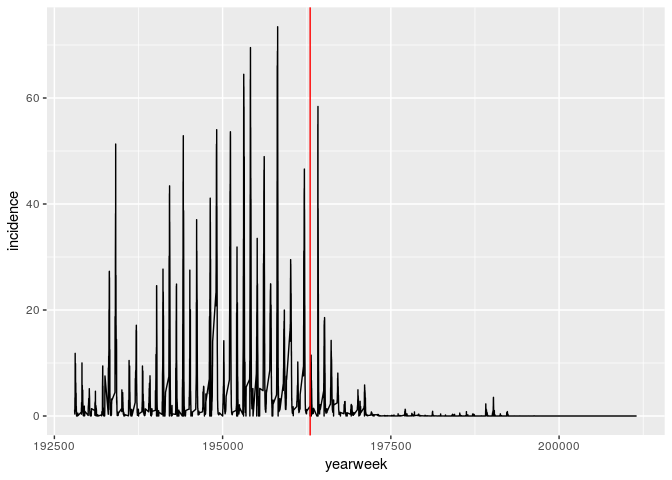

Data Import & Cleaning
================
25 June, 2019

``` r
library(ggplot2)
```

    ## Registered S3 methods overwritten by 'ggplot2':
    ##   method         from 
    ##   [.quosures     rlang
    ##   c.quosures     rlang
    ##   print.quosures rlang

``` r
library(dplyr)
```

    ## 
    ## Attaching package: 'dplyr'

    ## The following objects are masked from 'package:stats':
    ## 
    ##     filter, lag

    ## The following objects are masked from 'package:base':
    ## 
    ##     intersect, setdiff, setequal, union

``` r
library(readr) # Functions for importing & exporting files
```

R can read files from your computer, or it can use a weblink to a file.
Today we’ll read in this file I’ve put up on github so it’s easier to
distribute to all of you. If you wanted to read in your own data, you
would give R the path to your file on your machine.

    ## Parsed with column specification:
    ## cols(
    ##   Alice = col_character(),
    ##   `20` = col_double(),
    ##   Blue = col_character()
    ## )

    ## # A tibble: 4 x 3
    ##   Alice      `20` Blue  
    ##   <chr>     <dbl> <chr> 
    ## 1 Bob          18 Red   
    ## 2 Claire       23 Blue  
    ## 3 Doug         21 Orange
    ## 4 Elizabeth    18 Green

## People dataset

``` r
# These are 2 different data files hosted on Github. R can stream files from web links (not usually best way to get data).
people_link <- "https://raw.githubusercontent.com/UNC-HLC-R-Intro/lessons_2019/master/data_import/people.csv"
people2_link <- "https://raw.githubusercontent.com/UNC-HLC-R-Intro/lessons_2019/master/data_import/people2.csv"
```

``` r
people <- read_csv(people_link)
```

    ## Parsed with column specification:
    ## cols(
    ##   name = col_character(),
    ##   age = col_double(),
    ##   favorite_color = col_character()
    ## )

``` r
people
```

    ## # A tibble: 5 x 3
    ##   name        age favorite_color
    ##   <chr>     <dbl> <chr>         
    ## 1 Alice        20 Blue          
    ## 2 Bob          18 Red           
    ## 3 Claire       23 Blue          
    ## 4 Doug         21 Orange        
    ## 5 Elizabeth    18 Green

``` r
read_csv(people2_link)
```

    ## Parsed with column specification:
    ## cols(
    ##   `# This dataset contains information about people` = col_character(),
    ##   `their ages` = col_double(),
    ##   `and their favorite colors` = col_character()
    ## )

    ## # A tibble: 5 x 3
    ##   `# This dataset contains information… `their ages` `and their favorite c…
    ##   <chr>                                        <dbl> <chr>                 
    ## 1 Alice                                           20 Blue                  
    ## 2 Bob                                             18 Red                   
    ## 3 Claire                                          23 Blue                  
    ## 4 Doug                                            21 Orange                
    ## 5 Elizabeth                                       18 Green

### dplyr can rename columns

``` r
people_renamed <- people %>% 
  rename(color = favorite_color)
```

### Writing files

`readr` has several `write_<type>` functions.

``` r
write_csv(people_renamed, path = "people_renamed.csv", col_names = T)
```

`write_delim` is a generic writer that allows you to set the delimiter.

## reshaping & tidying data

    ## Parsed with column specification:
    ## cols(
    ##   .default = col_double(),
    ##   state = col_character(),
    ##   disease = col_character()
    ## )

    ## See spec(...) for full column specifications.

    ## Parsed with column specification:
    ## cols(
    ##   .default = col_double(),
    ##   state = col_character(),
    ##   disease = col_character()
    ## )

    ## See spec(...) for full column specifications.

``` r
tx_measles_link <- "https://raw.githubusercontent.com/UNC-HLC-R-Intro/lessons_2019/master/data/tycho_tx_measles_wide.csv"
```

``` r
tx_measles <- read_csv(tx_measles_link)
```

    ## Parsed with column specification:
    ## cols(
    ##   .default = col_double(),
    ##   state = col_character(),
    ##   disease = col_character()
    ## )

    ## See spec(...) for full column specifications.

This dataset tracks disease occurrance over time

``` r
tx_measles 
```

    ## # A tibble: 1 x 4,323
    ##   state disease `192801` `192802` `192803` `192804` `192805` `192806`
    ##   <chr> <chr>      <dbl>    <dbl>    <dbl>    <dbl>    <dbl>    <dbl>
    ## 1 TEXAS MEASLES     1.18     0.63     0.62     0.37     1.57     3.44
    ## # … with 4,315 more variables: `192807` <dbl>, `192808` <dbl>,
    ## #   `192809` <dbl>, `192810` <dbl>, `192811` <dbl>, `192812` <dbl>,
    ## #   `192813` <dbl>, `192814` <dbl>, `192815` <dbl>, `192816` <dbl>,
    ## #   `192817` <dbl>, `192818` <dbl>, `192819` <dbl>, `192820` <dbl>,
    ## #   `192821` <dbl>, `192822` <dbl>, `192823` <dbl>, `192824` <dbl>,
    ## #   `192825` <dbl>, `192826` <dbl>, `192827` <dbl>, `192828` <dbl>,
    ## #   `192829` <dbl>, `192830` <dbl>, `192831` <dbl>, `192832` <dbl>,
    ## #   `192833` <dbl>, `192834` <dbl>, `192835` <dbl>, `192836` <dbl>,
    ## #   `192837` <dbl>, `192838` <dbl>, `192839` <dbl>, `192840` <dbl>,
    ## #   `192841` <dbl>, `192842` <dbl>, `192843` <dbl>, `192844` <dbl>,
    ## #   `192845` <dbl>, `192846` <dbl>, `192847` <dbl>, `192848` <dbl>,
    ## #   `192849` <dbl>, `192850` <dbl>, `192851` <dbl>, `192852` <dbl>,
    ## #   `192901` <dbl>, `192902` <dbl>, `192903` <dbl>, `192904` <dbl>,
    ## #   `192905` <dbl>, `192906` <dbl>, `192907` <dbl>, `192908` <dbl>,
    ## #   `192909` <dbl>, `192910` <dbl>, `192911` <dbl>, `192912` <dbl>,
    ## #   `192913` <dbl>, `192914` <dbl>, `192915` <dbl>, `192916` <dbl>,
    ## #   `192917` <dbl>, `192918` <dbl>, `192919` <dbl>, `192920` <dbl>,
    ## #   `192921` <dbl>, `192922` <dbl>, `192923` <dbl>, `192924` <dbl>,
    ## #   `192925` <dbl>, `192926` <dbl>, `192927` <dbl>, `192928` <dbl>,
    ## #   `192929` <dbl>, `192930` <dbl>, `192931` <dbl>, `192932` <dbl>,
    ## #   `192933` <dbl>, `192934` <dbl>, `192935` <dbl>, `192936` <dbl>,
    ## #   `192937` <dbl>, `192938` <dbl>, `192939` <dbl>, `192940` <dbl>,
    ## #   `192941` <dbl>, `192942` <dbl>, `192943` <dbl>, `192944` <dbl>,
    ## #   `192945` <dbl>, `192946` <dbl>, `192947` <dbl>, `192948` <dbl>,
    ## #   `192949` <dbl>, `192950` <dbl>, `192951` <dbl>, `192952` <dbl>,
    ## #   `193001` <dbl>, `193002` <dbl>, …

## Exercise 2

How would you make a plot of these data?

``` r
library(reshape2)
```

Converting data from wide to long (sometimes called “tidy”) format is
called a “melt” or a “pivot”.

The `reshape2` library allows us to melt data

``` r
melt(tx_measles) 
```

    ## Using state, disease as id variables

    ##   state disease variable value
    ## 1 TEXAS MEASLES   192801  1.18
    ## 2 TEXAS MEASLES   192802  0.63
    ## 3 TEXAS MEASLES   192803  0.62
    ## 4 TEXAS MEASLES   192804  0.37
    ## 5 TEXAS MEASLES   192805  1.57
    ## 6 TEXAS MEASLES   192806  3.44

## Exercise 3

Read the help documentation for `melt`. How can you set the names of the
`variable` and `value` columns?

**Hint:** `melt` has different behavior for different data types, you
might have to go to a second help page under “details”.

    ##   state disease yearweek incidence
    ## 1 TEXAS MEASLES   192801      1.18
    ## 2 TEXAS MEASLES   192802      0.63
    ## 3 TEXAS MEASLES   192803      0.62
    ## 4 TEXAS MEASLES   192804      0.37
    ## 5 TEXAS MEASLES   192805      1.57
    ## 6 TEXAS MEASLES   192806      3.44

<!-- -->

## Full tycho example

``` r
tycho_link <- "https://raw.githubusercontent.com/UNC-HLC-R-Intro/lessons_2019/master/data/tycho_wide_time-disease.csv"
```

``` r
tycho <- read_csv(tycho_link)
```

    ## Parsed with column specification:
    ## cols(
    ##   .default = col_double(),
    ##   state = col_character()
    ## )

    ## See spec(...) for full column specifications.

This dataset tracks diseases over time

``` r
head(tycho)
```

    ## # A tibble: 6 x 15,548
    ##   state `192801_MEASLES` `192801_POLIO` `192801_SMALLPO… `192802_MEASLES`
    ##   <chr>            <dbl>          <dbl>            <dbl>            <dbl>
    ## 1 ALAB…             3.67           0                0.04             6.25
    ## 2 ALAS…             0              0                0                0   
    ## 3 ARIZ…             1.9            0                0                6.4 
    ## 4 ARKA…             4.11           0                0.38             9.91
    ## 5 CALI…             1.38           0.17             0.34             1.8 
    ## 6 COLO…             8.38           0.39             3.06             6.02
    ## # … with 15,543 more variables: `192802_POLIO` <dbl>,
    ## #   `192802_SMALLPOX` <dbl>, `192803_MEASLES` <dbl>, `192803_POLIO` <dbl>,
    ## #   `192803_SMALLPOX` <dbl>, `192804_MEASLES` <dbl>, `192804_POLIO` <dbl>,
    ## #   `192804_SMALLPOX` <dbl>, `192805_MEASLES` <dbl>, `192805_POLIO` <dbl>,
    ## #   `192805_SMALLPOX` <dbl>, `192806_MEASLES` <dbl>, `192806_POLIO` <dbl>,
    ## #   `192806_SMALLPOX` <dbl>, `192807_MEASLES` <dbl>, `192807_POLIO` <dbl>,
    ## #   `192807_SMALLPOX` <dbl>, `192808_MEASLES` <dbl>, `192808_POLIO` <dbl>,
    ## #   `192808_SMALLPOX` <dbl>, `192809_MEASLES` <dbl>, `192809_POLIO` <dbl>,
    ## #   `192809_SMALLPOX` <dbl>, `192810_MEASLES` <dbl>, `192810_POLIO` <dbl>,
    ## #   `192810_SMALLPOX` <dbl>, `192811_MEASLES` <dbl>, `192811_POLIO` <dbl>,
    ## #   `192811_SMALLPOX` <dbl>, `192812_MEASLES` <dbl>, `192812_POLIO` <dbl>,
    ## #   `192812_SMALLPOX` <dbl>, `192813_MEASLES` <dbl>, `192813_POLIO` <dbl>,
    ## #   `192813_SMALLPOX` <dbl>, `192814_MEASLES` <dbl>, `192814_POLIO` <dbl>,
    ## #   `192814_SMALLPOX` <dbl>, `192815_MEASLES` <dbl>, `192815_POLIO` <dbl>,
    ## #   `192815_SMALLPOX` <dbl>, `192816_MEASLES` <dbl>, `192816_POLIO` <dbl>,
    ## #   `192816_SMALLPOX` <dbl>, `192817_MEASLES` <dbl>, `192817_POLIO` <dbl>,
    ## #   `192817_SMALLPOX` <dbl>, `192818_MEASLES` <dbl>, `192818_POLIO` <dbl>,
    ## #   `192818_SMALLPOX` <dbl>, `192819_MEASLES` <dbl>, `192819_POLIO` <dbl>,
    ## #   `192819_SMALLPOX` <dbl>, `192820_MEASLES` <dbl>, `192820_POLIO` <dbl>,
    ## #   `192820_SMALLPOX` <dbl>, `192821_MEASLES` <dbl>, `192821_POLIO` <dbl>,
    ## #   `192821_SMALLPOX` <dbl>, `192822_MEASLES` <dbl>, `192822_POLIO` <dbl>,
    ## #   `192822_SMALLPOX` <dbl>, `192823_MEASLES` <dbl>, `192823_POLIO` <dbl>,
    ## #   `192823_SMALLPOX` <dbl>, `192824_MEASLES` <dbl>, `192824_POLIO` <dbl>,
    ## #   `192824_SMALLPOX` <dbl>, `192825_MEASLES` <dbl>, `192825_POLIO` <dbl>,
    ## #   `192825_SMALLPOX` <dbl>, `192826_MEASLES` <dbl>, `192826_POLIO` <dbl>,
    ## #   `192826_SMALLPOX` <dbl>, `192827_MEASLES` <dbl>, `192827_POLIO` <dbl>,
    ## #   `192827_SMALLPOX` <dbl>, `192828_MEASLES` <dbl>, `192828_POLIO` <dbl>,
    ## #   `192828_SMALLPOX` <dbl>, `192829_MEASLES` <dbl>, `192829_POLIO` <dbl>,
    ## #   `192829_SMALLPOX` <dbl>, `192830_MEASLES` <dbl>, `192830_POLIO` <dbl>,
    ## #   `192830_SMALLPOX` <dbl>, `192831_MEASLES` <dbl>, `192831_POLIO` <dbl>,
    ## #   `192831_SMALLPOX` <dbl>, `192832_MEASLES` <dbl>, `192832_POLIO` <dbl>,
    ## #   `192832_SMALLPOX` <dbl>, `192833_MEASLES` <dbl>, `192833_POLIO` <dbl>,
    ## #   `192833_SMALLPOX` <dbl>, `192834_MEASLES` <dbl>, `192834_POLIO` <dbl>,
    ## #   `192834_SMALLPOX` <dbl>, `192835_MEASLES` <dbl>, `192835_POLIO` <dbl>,
    ## #   …

## Exercise

Tidy this dataset with reshape2

## Tidyr provides functions to manipulate data into tidy format

``` r
library(tidyr)
```

    ## 
    ## Attaching package: 'tidyr'

    ## The following object is masked from 'package:reshape2':
    ## 
    ##     smiths

## Exercise use tidyr to split year and disease
