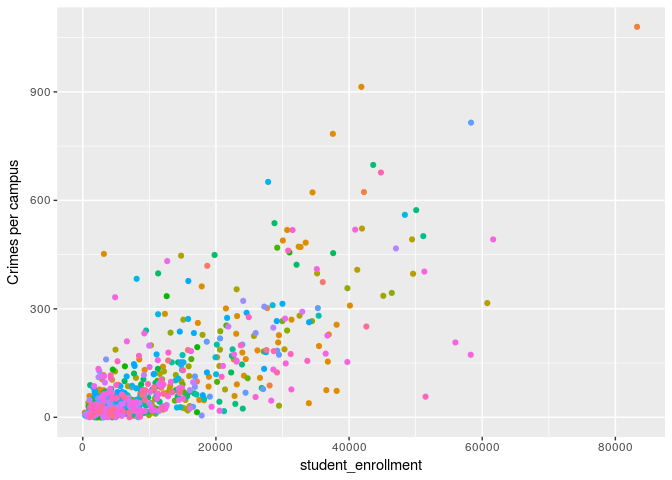

Reading & Cleaning Data Example
================

# Topics:

  - discuss `readr::read_csv` and why it’s better than `read.csv`
  - `readxl::read_xls` to show how to import excel tables
  - introduce `skip` and `comment` parameters
  - discuss regular expression **basics** & `gsub` command for replacing
    characters

<!-- end list -->

``` r
library(tidyverse)
```

    ## ── Attaching packages ──────────────────────────────────────────────────────────────────────────── tidyverse 1.2.1 ──

    ## ✔ ggplot2 2.2.1     ✔ purrr   0.2.4
    ## ✔ tibble  1.4.2     ✔ dplyr   0.7.5
    ## ✔ tidyr   0.8.1     ✔ stringr 1.3.1
    ## ✔ readr   1.1.1     ✔ forcats 0.3.0

    ## ── Conflicts ─────────────────────────────────────────────────────────────────────────────── tidyverse_conflicts() ──
    ## ✖ dplyr::filter() masks stats::filter()
    ## ✖ dplyr::lag()    masks stats::lag()

``` r
library(readxl)
library(magrittr)
```

    ## 
    ## Attaching package: 'magrittr'

    ## The following object is masked from 'package:purrr':
    ## 
    ##     set_names

    ## The following object is masked from 'package:tidyr':
    ## 
    ##     extract

# Download example dataset:

``` r
link <- "https://ucr.fbi.gov/crime-in-the-u.s/2015/crime-in-the-u.s.-2015/tables/table-9/table_9_offenses_known_to_law_enforcement_by_state_by_university_and_college_2015.xls"
file <- "crime.xls"
download.file(link, file)
```

The `readxl` package allows you to import Excel spreadsheets (.xls/.xlsx
files) directly into R.

``` r
read_xls(file)
```

    ## # A tibble: 691 x 19
    ##    `Table 9`  X__1   X__2  X__3  X__4  X__5  X__6  X__7  X__8  X__9  X__10
    ##    <chr>      <chr>  <chr> <chr> <chr> <chr> <chr> <chr> <chr> <chr> <chr>
    ##  1 Offenses … <NA>   <NA>  <NA>  <NA>  <NA>  <NA>  <NA>  <NA>  <NA>  <NA> 
    ##  2 by State … <NA>   <NA>  <NA>  <NA>  <NA>  <NA>  <NA>  <NA>  <NA>  <NA> 
    ##  3 State      Unive… Camp… "Stu… "Vio… "Mur… "Rap… "Rap… Robb… "Agg… "Pro…
    ##  4 ALABAMA    Alaba… <NA>  5333  12    0     2     <NA>  3     7     78   
    ##  5 <NA>       Jacks… <NA>  8659  7     0     0     <NA>  0     7     59   
    ##  6 <NA>       Samfo… <NA>  4933  3     0     0     <NA>  0     3     46   
    ##  7 <NA>       Tuske… <NA>  3103  5     0     0     <NA>  1     4     112  
    ##  8 <NA>       Unive… Birm… 18698 24    0     2     <NA>  3     19    395  
    ##  9 <NA>       <NA>   Hunt… 7348  10    0     1     <NA>  1     8     73   
    ## 10 <NA>       <NA>   Tusc… 36047 15    0     3     <NA>  9     3     359  
    ## # ... with 681 more rows, and 8 more variables: X__11 <chr>, X__12 <chr>,
    ## #   X__13 <chr>, X__14 <chr>, X__15 <lgl>, X__16 <lgl>, X__17 <lgl>,
    ## #   X__18 <lgl>

Looks like the data we want is actually a litter lower down in the file.
We can skip over lines at the top with the `skip` parameter.

``` r
(crime <- read_xls(file, skip = 3))
```

    ## # A tibble: 688 x 19
    ##    State  `University/College`  Campus  `Student\nenroll… `Violent\ncrime`
    ##    <chr>  <chr>                 <chr>               <dbl>            <dbl>
    ##  1 ALABA… Alabama A&M Universi… <NA>                 5333               12
    ##  2 <NA>   Jacksonville State U… <NA>                 8659                7
    ##  3 <NA>   Samford University    <NA>                 4933                3
    ##  4 <NA>   Tuskegee University   <NA>                 3103                5
    ##  5 <NA>   University of Alabam… Birmin…             18698               24
    ##  6 <NA>   <NA>                  Huntsv…              7348               10
    ##  7 <NA>   <NA>                  Tuscal…             36047               15
    ##  8 <NA>   University of South … <NA>                15805               21
    ##  9 ALASKA University of Alaska: Anchor…             17151                4
    ## 10 <NA>   <NA>                  Fairba…              8620                3
    ## # ... with 678 more rows, and 14 more variables: `Murder
    ## #   and\nnonnegligent\nmanslaughter` <dbl>,
    ## #   `Rape\n(revised\ndefinition)2` <dbl>,
    ## #   `Rape\n(legacy\ndefinition)3` <dbl>, Robbery <dbl>,
    ## #   `Aggravated\nassault` <dbl>, `Property\ncrime` <dbl>, Burglary <dbl>,
    ## #   `Larceny-\ntheft` <dbl>, `Motor\nvehicle\ntheft` <dbl>, Arson4 <dbl>,
    ## #   X__1 <lgl>, X__2 <lgl>, X__3 <lgl>, X__4 <lgl>

Even though it’s good to look at the **top** of the data, you should
also look at the **bottom**\! This is often overlooked and has caused
problems for many people in the past. You can do this easily with
`tail()`.

``` r
tail(crime)
```

    ## # A tibble: 6 x 19
    ##   State          `University/Col… Campus `Student\nenrol… `Violent\ncrime`
    ##   <chr>          <chr>            <chr>             <dbl>            <dbl>
    ## 1 3 The figures… <NA>             <NA>                 NA               NA
    ## 2 4 The FBI doe… <NA>             <NA>                 NA               NA
    ## 3 5 This agency… <NA>             <NA>                 NA               NA
    ## 4 6 Student enr… <NA>             <NA>                 NA               NA
    ## 5 7 Because of … <NA>             <NA>                 NA               NA
    ## 6 NOTE:  Cautio… <NA>             <NA>                 NA               NA
    ## # ... with 14 more variables: `Murder
    ## #   and\nnonnegligent\nmanslaughter` <dbl>,
    ## #   `Rape\n(revised\ndefinition)2` <dbl>,
    ## #   `Rape\n(legacy\ndefinition)3` <dbl>, Robbery <dbl>,
    ## #   `Aggravated\nassault` <dbl>, `Property\ncrime` <dbl>, Burglary <dbl>,
    ## #   `Larceny-\ntheft` <dbl>, `Motor\nvehicle\ntheft` <dbl>, Arson4 <dbl>,
    ## #   X__1 <lgl>, X__2 <lgl>, X__3 <lgl>, X__4 <lgl>

Lo’ and behold, this doesn’t look right.

Looks like the last 8 rows of the data.frame are not part of our data.
We should remove these.

``` r
tail(crime, 10)
```

    ## # A tibble: 10 x 19
    ##    State         `University/Col… Campus `Student\nenrol… `Violent\ncrime`
    ##    <chr>         <chr>            <chr>             <dbl>            <dbl>
    ##  1 WYOMING       Northern Wyomin… <NA>               4374                3
    ##  2 <NA>          University of W… <NA>              12820                1
    ##  3 1 The studen… <NA>             <NA>                 NA               NA
    ##  4 2 The figure… <NA>             <NA>                 NA               NA
    ##  5 3 The figure… <NA>             <NA>                 NA               NA
    ##  6 4 The FBI do… <NA>             <NA>                 NA               NA
    ##  7 5 This agenc… <NA>             <NA>                 NA               NA
    ##  8 6 Student en… <NA>             <NA>                 NA               NA
    ##  9 7 Because of… <NA>             <NA>                 NA               NA
    ## 10 NOTE:  Cauti… <NA>             <NA>                 NA               NA
    ## # ... with 14 more variables: `Murder
    ## #   and\nnonnegligent\nmanslaughter` <dbl>,
    ## #   `Rape\n(revised\ndefinition)2` <dbl>,
    ## #   `Rape\n(legacy\ndefinition)3` <dbl>, Robbery <dbl>,
    ## #   `Aggravated\nassault` <dbl>, `Property\ncrime` <dbl>, Burglary <dbl>,
    ## #   `Larceny-\ntheft` <dbl>, `Motor\nvehicle\ntheft` <dbl>, Arson4 <dbl>,
    ## #   X__1 <lgl>, X__2 <lgl>, X__3 <lgl>, X__4 <lgl>

I like using base subsetting for these problems since usually the reason
you’re removing rows at the bottom is because a tool will output extra
information at the bottom of an output file. In case you rerun the tool
later with more data and the length of the file changes, you can’t rely
on reading in a set number of lines. If the tool always outputs the same
number of lines at the end of the file, it’s safer to just drop the last
`n` lines from the data after reading. We’ll do this here by removing
the last 8 lines.

``` r
keep <- 1:(nrow(crime) - 8) # create a vector of rows to keep
crime <- crime[keep,] # subset by row
```

Now our data is correct at the top and the bottom.

``` r
head(crime)
```

    ## # A tibble: 6 x 19
    ##   State  `University/College`  Campus  `Student\nenrollm… `Violent\ncrime`
    ##   <chr>  <chr>                 <chr>                <dbl>            <dbl>
    ## 1 ALABA… Alabama A&M Universi… <NA>                  5333               12
    ## 2 <NA>   Jacksonville State U… <NA>                  8659                7
    ## 3 <NA>   Samford University    <NA>                  4933                3
    ## 4 <NA>   Tuskegee University   <NA>                  3103                5
    ## 5 <NA>   University of Alabam… Birmin…              18698               24
    ## 6 <NA>   <NA>                  Huntsv…               7348               10
    ## # ... with 14 more variables: `Murder
    ## #   and\nnonnegligent\nmanslaughter` <dbl>,
    ## #   `Rape\n(revised\ndefinition)2` <dbl>,
    ## #   `Rape\n(legacy\ndefinition)3` <dbl>, Robbery <dbl>,
    ## #   `Aggravated\nassault` <dbl>, `Property\ncrime` <dbl>, Burglary <dbl>,
    ## #   `Larceny-\ntheft` <dbl>, `Motor\nvehicle\ntheft` <dbl>, Arson4 <dbl>,
    ## #   X__1 <lgl>, X__2 <lgl>, X__3 <lgl>, X__4 <lgl>

``` r
tail(crime)
```

    ## # A tibble: 6 x 19
    ##   State  `University/College`   Campus  `Student\nenroll… `Violent\ncrime`
    ##   <chr>  <chr>                  <chr>               <dbl>            <dbl>
    ## 1 <NA>   <NA>                   Steven…              9330                1
    ## 2 <NA>   <NA>                   Stout                9394                5
    ## 3 <NA>   <NA>                   Superi…              2600                0
    ## 4 <NA>   <NA>                   Whitew…             12176                3
    ## 5 WYOMI… Northern Wyoming Comm… <NA>                 4374                3
    ## 6 <NA>   University of Wyoming  <NA>                12820                1
    ## # ... with 14 more variables: `Murder
    ## #   and\nnonnegligent\nmanslaughter` <dbl>,
    ## #   `Rape\n(revised\ndefinition)2` <dbl>,
    ## #   `Rape\n(legacy\ndefinition)3` <dbl>, Robbery <dbl>,
    ## #   `Aggravated\nassault` <dbl>, `Property\ncrime` <dbl>, Burglary <dbl>,
    ## #   `Larceny-\ntheft` <dbl>, `Motor\nvehicle\ntheft` <dbl>, Arson4 <dbl>,
    ## #   X__1 <lgl>, X__2 <lgl>, X__3 <lgl>, X__4 <lgl>

Let’s take another close look at the
    dataset:

``` r
str(crime)
```

    ## Classes 'tbl_df', 'tbl' and 'data.frame':    680 obs. of  19 variables:
    ##  $ State                                 : chr  "ALABAMA" NA NA NA ...
    ##  $ University/College                    : chr  "Alabama A&M University" "Jacksonville State University" "Samford University" "Tuskegee University" ...
    ##  $ Campus                                : chr  NA NA NA NA ...
    ##  $ Student
    ## enrollment1                  : num  5333 8659 4933 3103 18698 ...
    ##  $ Violent
    ## crime                        : num  12 7 3 5 24 10 15 21 4 3 ...
    ##  $ Murder and
    ## nonnegligent
    ## manslaughter: num  0 0 0 0 0 0 0 0 0 0 ...
    ##  $ Rape
    ## (revised
    ## definition)2          : num  2 0 0 0 2 1 3 1 1 2 ...
    ##  $ Rape
    ## (legacy
    ## definition)3           : num  NA NA NA NA NA NA NA NA NA NA ...
    ##  $ Robbery                               : num  3 0 0 1 3 1 9 3 0 0 ...
    ##  $ Aggravated
    ## assault                   : num  7 7 3 4 19 8 3 17 3 1 ...
    ##  $ Property
    ## crime                       : num  78 59 46 112 395 73 359 165 95 50 ...
    ##  $ Burglary                              : num  1 9 8 12 5 18 36 28 4 3 ...
    ##  $ Larceny-
    ## theft                       : num  75 50 34 97 379 55 316 136 88 44 ...
    ##  $ Motor
    ## vehicle
    ## theft                 : num  2 0 4 3 11 0 7 1 3 3 ...
    ##  $ Arson4                                : num  NA NA NA NA NA NA NA NA 0 0 ...
    ##  $ X__1                                  : logi  NA NA NA NA NA NA ...
    ##  $ X__2                                  : logi  NA NA NA NA NA NA ...
    ##  $ X__3                                  : logi  NA NA NA NA NA NA ...
    ##  $ X__4                                  : logi  NA NA NA NA NA NA ...

Note that the `X__1` through `X__4` columns look empty. We can check
that by looking at the unique values in each column:

``` r
crime$X__1 %>% unique
```

    ## [1] NA

``` r
crime$X__2 %>% unique
```

    ## [1] NA

``` r
crime$X__3 %>% unique
```

    ## [1] NA

``` r
crime$X__4 %>% unique
```

    ## [1] NA

Retyping is annoying. We can use pattern matching to select these all at
once, and looking at their `summary`.

We can see that they only contian `NA` values, so there’s no reason to
keep them.

``` r
crime %>% 
  select(matches("X_")) %>% 
  summary()
```

    ##    X__1           X__2           X__3           X__4        
    ##  Mode:logical   Mode:logical   Mode:logical   Mode:logical  
    ##  NA's:680       NA's:680       NA's:680       NA's:680

We can drop them by matching a pattern as above using `-`.

``` r
crime %<>% 
  select(-matches("X_")) # drop any columns that match the pattern "X_"
```

Check that the columns were dropped. Also note that the remaining column
names are poorly formatted.

Whats the deal with the `\n`?

``` r
names(crime)
```

    ##  [1] "State"                                 
    ##  [2] "University/College"                    
    ##  [3] "Campus"                                
    ##  [4] "Student\nenrollment1"                  
    ##  [5] "Violent\ncrime"                        
    ##  [6] "Murder and\nnonnegligent\nmanslaughter"
    ##  [7] "Rape\n(revised\ndefinition)2"          
    ##  [8] "Rape\n(legacy\ndefinition)3"           
    ##  [9] "Robbery"                               
    ## [10] "Aggravated\nassault"                   
    ## [11] "Property\ncrime"                       
    ## [12] "Burglary"                              
    ## [13] "Larceny-\ntheft"                       
    ## [14] "Motor\nvehicle\ntheft"                 
    ## [15] "Arson4"

`\n` along with `\t` and `\r` are special characters that often appear
in files. `\n` and `\r` are codes that stand in place for a newline
(like pressing enter). `\r` is called the ‘carriage return’ character
which is usually only added when files are created using a Windows OS.
`\t` stands for a tab.

In the above example the column names have newline characters in them,
which will make it impossible to reference by name since newlines are
sometimes meaningful in R.

For example: Try to autocomplete the following:

``` r
# Rstudio should autocomplete this:
crime$`Murder and
nonnegligent
manslaughter`
# But it will return an error because of the newlines (it will run if you highlight the whole thing and run the code)
```

    ## Warning: Unknown or uninitialised column: 'Murder and'.

``` r
# this won't work either because the column name requires newlines
crime$`Murder and nonnegligent manslaughter`
```

We need a way to replace newline characters found in all colnames of
`crimes`. One easy way to do this is with **regular expressions**.

**Regular expressions** (also called **Regex’s**) are a way of matching
patterns in text. The `gsub` command will use regular expressions to
match a pattern and replace it for a different one.

Here are a few simple
examples:

``` r
gsub("Bob", "Tom", "Bob and Sally") # Replace Tom for Bob in the string "Bob and Sally"
```

    ## [1] "Tom and Sally"

``` r
myString <- "My Birthday is January 01"
gsub("01", "10", myString)
```

    ## [1] "My Birthday is January 10"

``` r
gsub(" ", "_", myString) # replace all spaces for _
```

    ## [1] "My_Birthday_is_January_01"

## rename with regex

**Note to teachers:** This is a good opportunity to let the students
play with the code on their own to get these solutions.

Lets first drop out the `\n`

``` r
names(crime) %>%
  gsub("\n", "_", .)
```

    ##  [1] "State"                               
    ##  [2] "University/College"                  
    ##  [3] "Campus"                              
    ##  [4] "Student_enrollment1"                 
    ##  [5] "Violent_crime"                       
    ##  [6] "Murder and_nonnegligent_manslaughter"
    ##  [7] "Rape_(revised_definition)2"          
    ##  [8] "Rape_(legacy_definition)3"           
    ##  [9] "Robbery"                             
    ## [10] "Aggravated_assault"                  
    ## [11] "Property_crime"                      
    ## [12] "Burglary"                            
    ## [13] "Larceny-_theft"                      
    ## [14] "Motor_vehicle_theft"                 
    ## [15] "Arson4"

When renaming colnames in batch like this, I like to string together all
my regexes and monitor the output as I add them on to make sure things
make sense, then I’ll go back and save the changes once I’m happy with
the results. We’ll take that approach here by continually adding new
`gsub` commands until we get colnames we like.

Now that we’ve solved the newline issue, what other issues exist? Take a
look at the `/`. This is a bad character in a colname because R needs to
escape it to access it. Let’s change it to ‘.’

``` r
names(crime) %>%
  gsub("\n", "_", .) %>% 
  gsub("/", ".", .) 
```

    ##  [1] "State"                               
    ##  [2] "University.College"                  
    ##  [3] "Campus"                              
    ##  [4] "Student_enrollment1"                 
    ##  [5] "Violent_crime"                       
    ##  [6] "Murder and_nonnegligent_manslaughter"
    ##  [7] "Rape_(revised_definition)2"          
    ##  [8] "Rape_(legacy_definition)3"           
    ##  [9] "Robbery"                             
    ## [10] "Aggravated_assault"                  
    ## [11] "Property_crime"                      
    ## [12] "Burglary"                            
    ## [13] "Larceny-_theft"                      
    ## [14] "Motor_vehicle_theft"                 
    ## [15] "Arson4"

While we’re at it, let’s also drop out the `-` because this means
“subtract” in R, so it is also a bad character for colnames. We’ll
just delete it. To delete things with regex’s, you can replace a pattern
with an empty string: ""

``` r
names(crime) %>%
  gsub("\n", "_", .) %>% 
  gsub("/", ".", .) %>% 
  # replacing for an empty string will delete a character/pattern
  gsub("-", "", .) 
```

    ##  [1] "State"                               
    ##  [2] "University.College"                  
    ##  [3] "Campus"                              
    ##  [4] "Student_enrollment1"                 
    ##  [5] "Violent_crime"                       
    ##  [6] "Murder and_nonnegligent_manslaughter"
    ##  [7] "Rape_(revised_definition)2"          
    ##  [8] "Rape_(legacy_definition)3"           
    ##  [9] "Robbery"                             
    ## [10] "Aggravated_assault"                  
    ## [11] "Property_crime"                      
    ## [12] "Burglary"                            
    ## [13] "Larceny_theft"                       
    ## [14] "Motor_vehicle_theft"                 
    ## [15] "Arson4"

There are also some spaces in the colnames (look carefully\!). We don’t
want those either, so change them to "\_".

``` r
names(crime) %>%
  gsub("\n", "_", .) %>% 
  gsub("/", ".", .) %>% 
  gsub("-", "", .) %>% 
  gsub(" ", "_", .)
```

    ##  [1] "State"                               
    ##  [2] "University.College"                  
    ##  [3] "Campus"                              
    ##  [4] "Student_enrollment1"                 
    ##  [5] "Violent_crime"                       
    ##  [6] "Murder_and_nonnegligent_manslaughter"
    ##  [7] "Rape_(revised_definition)2"          
    ##  [8] "Rape_(legacy_definition)3"           
    ##  [9] "Robbery"                             
    ## [10] "Aggravated_assault"                  
    ## [11] "Property_crime"                      
    ## [12] "Burglary"                            
    ## [13] "Larceny_theft"                       
    ## [14] "Motor_vehicle_theft"                 
    ## [15] "Arson4"

You’ll also notice that some columns end in numbers. These aren’t
descriptive, so let’s delete them too.

We can use the special regex character `\d` which means “match any
number”. Because R is weird, you have to escape the first `\` when you
call `\d` in regex’s. This is often true for other regex characters like
‘.’ (match any character) which has to be written as `\\.` in R. This
might not make sense right now, but if you work more with regex’s later,
keep this in mind\!

``` r
names(crime) %>%
  gsub("\n", "_", .) %>% 
  gsub("/", ".", .) %>% 
  gsub("-", "", .) %>% 
  gsub(" ", "_", .) %>% 
  gsub("\\d", "", .)
```

    ##  [1] "State"                               
    ##  [2] "University.College"                  
    ##  [3] "Campus"                              
    ##  [4] "Student_enrollment"                  
    ##  [5] "Violent_crime"                       
    ##  [6] "Murder_and_nonnegligent_manslaughter"
    ##  [7] "Rape_(revised_definition)"           
    ##  [8] "Rape_(legacy_definition)"            
    ##  [9] "Robbery"                             
    ## [10] "Aggravated_assault"                  
    ## [11] "Property_crime"                      
    ## [12] "Burglary"                            
    ## [13] "Larceny_theft"                       
    ## [14] "Motor_vehicle_theft"                 
    ## [15] "Arson"

Next, let’s get rid of the parentheses. We can use another regex pattern
`[]` which will match any characters inside the square brackets to
delete both “(” and “)”.

``` r
names(crime) %>%
  gsub("\n", "_", .) %>% 
  gsub("/", ".", .) %>% 
  gsub("-", "", .) %>% 
  gsub(" ", "_", .) %>% 
  gsub("\\d", "", .) %>% 
  gsub("[()]", "", .)
```

    ##  [1] "State"                               
    ##  [2] "University.College"                  
    ##  [3] "Campus"                              
    ##  [4] "Student_enrollment"                  
    ##  [5] "Violent_crime"                       
    ##  [6] "Murder_and_nonnegligent_manslaughter"
    ##  [7] "Rape_revised_definition"             
    ##  [8] "Rape_legacy_definition"              
    ##  [9] "Robbery"                             
    ## [10] "Aggravated_assault"                  
    ## [11] "Property_crime"                      
    ## [12] "Burglary"                            
    ## [13] "Larceny_theft"                       
    ## [14] "Motor_vehicle_theft"                 
    ## [15] "Arson"

Finally, let’s get rid of the capitalization in the colnames to make it
consistent. We’ll convert everything to lowercase with the function
`tolower()`.

``` r
names(crime) %>%
  gsub("\n", "_", .) %>% 
  gsub("/", ".", .) %>% 
  gsub("-", "", .) %>% 
  gsub(" ", "_", .) %>% 
  gsub("\\d", "", .) %>% 
  gsub("[()]", "", .) %>% 
  tolower()
```

    ##  [1] "state"                               
    ##  [2] "university.college"                  
    ##  [3] "campus"                              
    ##  [4] "student_enrollment"                  
    ##  [5] "violent_crime"                       
    ##  [6] "murder_and_nonnegligent_manslaughter"
    ##  [7] "rape_revised_definition"             
    ##  [8] "rape_legacy_definition"              
    ##  [9] "robbery"                             
    ## [10] "aggravated_assault"                  
    ## [11] "property_crime"                      
    ## [12] "burglary"                            
    ## [13] "larceny_theft"                       
    ## [14] "motor_vehicle_theft"                 
    ## [15] "arson"

Now save the new names with `%<>%` which will send the final output back
as input.

``` r
names(crime) %<>%
  gsub("\n", "_", .) %>% 
  gsub("/", ".", .) %>% 
  gsub("-", "", .) %>% 
  gsub(" ", "_", .) %>% 
  gsub("\\d", "", .) %>% 
  gsub("[()]", "", .) %>% 
  tolower()
```

``` r
names(crime)
```

    ##  [1] "state"                               
    ##  [2] "university.college"                  
    ##  [3] "campus"                              
    ##  [4] "student_enrollment"                  
    ##  [5] "violent_crime"                       
    ##  [6] "murder_and_nonnegligent_manslaughter"
    ##  [7] "rape_revised_definition"             
    ##  [8] "rape_legacy_definition"              
    ##  [9] "robbery"                             
    ## [10] "aggravated_assault"                  
    ## [11] "property_crime"                      
    ## [12] "burglary"                            
    ## [13] "larceny_theft"                       
    ## [14] "motor_vehicle_theft"                 
    ## [15] "arson"

For more reading on regex’s check: [Regex
cheatsheet](http://regexlib.com/\(X\(1\)A\(xSygfbbpgXfgBpYdzZKZbaM80NvGWFKqz8H3p14z0goMZmVZU6P1V8S_EcyNeeY0ryvSsa9Ndw9_54dwIXQI5fjTdwJzOo1NhOnVqmLTuZ1NDcdA-UseLK7W01hB-KYIvuVOGgWiImZ-T7mf0uWFBNQbtY1KXM9TgHosz31NGuevvup3lyGMYJLwdgybbcAg0\)\)/CheatSheet.aspx)

# Fill in missing values

Take a look at the `state` and `university.college` columns. Each row
labeled as `NA` takes the value of the previously assigned row. We need
a way to fill these values down.

``` r
crime
```

    ## # A tibble: 680 x 15
    ##    state   university.college     campus   student_enrollme… violent_crime
    ##    <chr>   <chr>                  <chr>                <dbl>         <dbl>
    ##  1 ALABAMA Alabama A&M University <NA>                  5333            12
    ##  2 <NA>    Jacksonville State Un… <NA>                  8659             7
    ##  3 <NA>    Samford University     <NA>                  4933             3
    ##  4 <NA>    Tuskegee University    <NA>                  3103             5
    ##  5 <NA>    University of Alabama: Birming…             18698            24
    ##  6 <NA>    <NA>                   Huntsvi…              7348            10
    ##  7 <NA>    <NA>                   Tuscalo…             36047            15
    ##  8 <NA>    University of South A… <NA>                 15805            21
    ##  9 ALASKA  University of Alaska:  Anchora…             17151             4
    ## 10 <NA>    <NA>                   Fairban…              8620             3
    ## # ... with 670 more rows, and 10 more variables:
    ## #   murder_and_nonnegligent_manslaughter <dbl>,
    ## #   rape_revised_definition <dbl>, rape_legacy_definition <dbl>,
    ## #   robbery <dbl>, aggravated_assault <dbl>, property_crime <dbl>,
    ## #   burglary <dbl>, larceny_theft <dbl>, motor_vehicle_theft <dbl>,
    ## #   arson <dbl>

To do this, we can use the `tidyr` package, whose function `fill()` will
do just this:

``` r
library(tidyr)
(crime %<>% 
  fill(state, university.college))
```

    ## # A tibble: 680 x 15
    ##    state   university.college     campus   student_enrollme… violent_crime
    ##    <chr>   <chr>                  <chr>                <dbl>         <dbl>
    ##  1 ALABAMA Alabama A&M University <NA>                  5333            12
    ##  2 ALABAMA Jacksonville State Un… <NA>                  8659             7
    ##  3 ALABAMA Samford University     <NA>                  4933             3
    ##  4 ALABAMA Tuskegee University    <NA>                  3103             5
    ##  5 ALABAMA University of Alabama: Birming…             18698            24
    ##  6 ALABAMA University of Alabama: Huntsvi…              7348            10
    ##  7 ALABAMA University of Alabama: Tuscalo…             36047            15
    ##  8 ALABAMA University of South A… <NA>                 15805            21
    ##  9 ALASKA  University of Alaska:  Anchora…             17151             4
    ## 10 ALASKA  University of Alaska:  Fairban…              8620             3
    ## # ... with 670 more rows, and 10 more variables:
    ## #   murder_and_nonnegligent_manslaughter <dbl>,
    ## #   rape_revised_definition <dbl>, rape_legacy_definition <dbl>,
    ## #   robbery <dbl>, aggravated_assault <dbl>, property_crime <dbl>,
    ## #   burglary <dbl>, larceny_theft <dbl>, motor_vehicle_theft <dbl>,
    ## #   arson <dbl>

## Make a plot with your new tidy data\!

``` r
library(ggplot2)
crime %>% 
  ggplot(aes(student_enrollment, violent_crime + property_crime)) +
    geom_point(aes(color = state)) + 
    theme(legend.position = "none") +
    ylab("Crimes per campus")
```

    ## Warning: Removed 22 rows containing missing values (geom_point).

<!-- -->

## Save the cleaned data:

It’s always a good idea to save the clean data for easy sharing with
others later.

``` r
readr::write_csv(crime, "crime_cleaned.csv")
```

# Additional Import Functions

The `readr` package [documentation
here](https://readr.tidyverse.org/index.html) provides several
user-friendly functions for reading comma-separated (`.csv` with
`readr::read_csv()`), tab-separated (`.tsv` with `readr::read_tsv()`),
and other delimited files (`readr::read_delim()`). You should prefer
these functions over base-R implementations like `read.csv()` or
`read.delim()`, as the `readr` functions have more consistent and
reproducible behavior across filesystems, and they use more sensible
defaults.
