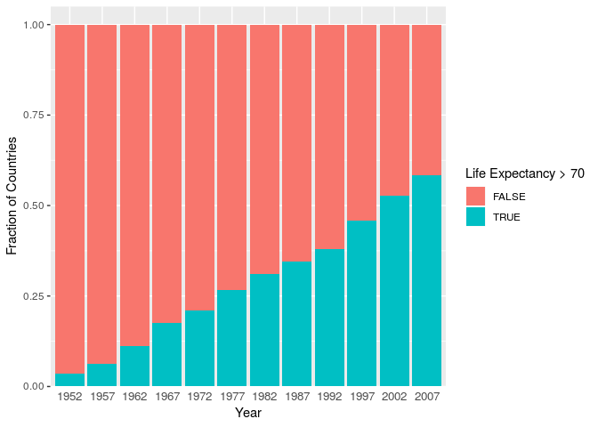

Data Manipulation
================

``` r
library(gapminder)
library(ggplot2)
```

    ## Registered S3 methods overwritten by 'ggplot2':
    ##   method         from 
    ##   [.quosures     rlang
    ##   c.quosures     rlang
    ##   print.quosures rlang

``` r
library(dplyr)
```

    ## 
    ## Attaching package: 'dplyr'

    ## The following objects are masked from 'package:stats':
    ## 
    ##     filter, lag

    ## The following objects are masked from 'package:base':
    ## 
    ##     intersect, setdiff, setequal, union

## Replicate this plot

**Hints:**

  - this plot uses the following subset of the Gapminder data
  - this plot uses facets to show the different years
  - a linear trendline
  - log10 x-axis
  - altered transparency of the points
  - renamed legend titles
  - axis text is resized to 12
  - axis title text is resized to 14
  - facet titles are resized to 14

<!-- end list -->

``` r
finalExampleData <- dplyr::filter(gapminder, year %in% c(1952, 2007))
```

<!-- -->

## select

``` r
pop_by_year <- select(gapminder, country, year, pop)

pop_by_year
```

    ## # A tibble: 1,704 x 3
    ##    country      year      pop
    ##    <fct>       <int>    <int>
    ##  1 Afghanistan  1952  8425333
    ##  2 Afghanistan  1957  9240934
    ##  3 Afghanistan  1962 10267083
    ##  4 Afghanistan  1967 11537966
    ##  5 Afghanistan  1972 13079460
    ##  6 Afghanistan  1977 14880372
    ##  7 Afghanistan  1982 12881816
    ##  8 Afghanistan  1987 13867957
    ##  9 Afghanistan  1992 16317921
    ## 10 Afghanistan  1997 22227415
    ## # … with 1,694 more rows

## arrange

``` r
arrange(pop_by_year, year)
```

    ## # A tibble: 1,704 x 3
    ##    country      year      pop
    ##    <fct>       <int>    <int>
    ##  1 Afghanistan  1952  8425333
    ##  2 Albania      1952  1282697
    ##  3 Algeria      1952  9279525
    ##  4 Angola       1952  4232095
    ##  5 Argentina    1952 17876956
    ##  6 Australia    1952  8691212
    ##  7 Austria      1952  6927772
    ##  8 Bahrain      1952   120447
    ##  9 Bangladesh   1952 46886859
    ## 10 Belgium      1952  8730405
    ## # … with 1,694 more rows

`desc()` will sort in descending order.

``` r
arrange(pop_by_year, desc(year))
```

    ## # A tibble: 1,704 x 3
    ##    country      year       pop
    ##    <fct>       <int>     <int>
    ##  1 Afghanistan  2007  31889923
    ##  2 Albania      2007   3600523
    ##  3 Algeria      2007  33333216
    ##  4 Angola       2007  12420476
    ##  5 Argentina    2007  40301927
    ##  6 Australia    2007  20434176
    ##  7 Austria      2007   8199783
    ##  8 Bahrain      2007    708573
    ##  9 Bangladesh   2007 150448339
    ## 10 Belgium      2007  10392226
    ## # … with 1,694 more rows

### Exercise 1

Which country in which year has the highest population?

## filter

| Operator |        Meaning        |
| :------: | :-------------------: |
|   \==    |        Equals         |
|   \!=    |      Not Equals       |
|   %in%   |     within vector     |
|    \>    |     greater than      |
|   \>=    | greater than or equal |
|    \<    |       less than       |
|   \=\<   |  less than or equal   |

``` r
filter(gapminder, country == "United States")
```

    ## # A tibble: 12 x 6
    ##    country       continent  year lifeExp       pop gdpPercap
    ##    <fct>         <fct>     <int>   <dbl>     <int>     <dbl>
    ##  1 United States Americas   1952    68.4 157553000    13990.
    ##  2 United States Americas   1957    69.5 171984000    14847.
    ##  3 United States Americas   1962    70.2 186538000    16173.
    ##  4 United States Americas   1967    70.8 198712000    19530.
    ##  5 United States Americas   1972    71.3 209896000    21806.
    ##  6 United States Americas   1977    73.4 220239000    24073.
    ##  7 United States Americas   1982    74.6 232187835    25010.
    ##  8 United States Americas   1987    75.0 242803533    29884.
    ##  9 United States Americas   1992    76.1 256894189    32004.
    ## 10 United States Americas   1997    76.8 272911760    35767.
    ## 11 United States Americas   2002    77.3 287675526    39097.
    ## 12 United States Americas   2007    78.2 301139947    42952.

``` r
filter(gapminder, year > 2000)
```

    ## # A tibble: 284 x 6
    ##    country     continent  year lifeExp      pop gdpPercap
    ##    <fct>       <fct>     <int>   <dbl>    <int>     <dbl>
    ##  1 Afghanistan Asia       2002    42.1 25268405      727.
    ##  2 Afghanistan Asia       2007    43.8 31889923      975.
    ##  3 Albania     Europe     2002    75.7  3508512     4604.
    ##  4 Albania     Europe     2007    76.4  3600523     5937.
    ##  5 Algeria     Africa     2002    71.0 31287142     5288.
    ##  6 Algeria     Africa     2007    72.3 33333216     6223.
    ##  7 Angola      Africa     2002    41.0 10866106     2773.
    ##  8 Angola      Africa     2007    42.7 12420476     4797.
    ##  9 Argentina   Americas   2002    74.3 38331121     8798.
    ## 10 Argentina   Americas   2007    75.3 40301927    12779.
    ## # … with 274 more rows

Multiple filters simultaneously (AND logic).

It is usually a good idea to have line breaks.

``` r
filter(gapminder, 
       year > 2000, 
       country == "United States")
```

    ## # A tibble: 2 x 6
    ##   country       continent  year lifeExp       pop gdpPercap
    ##   <fct>         <fct>     <int>   <dbl>     <int>     <dbl>
    ## 1 United States Americas   2002    77.3 287675526    39097.
    ## 2 United States Americas   2007    78.2 301139947    42952.

## mutate

gdpPercap is adjusted for population (GDP/Population). We can recompute
the original GDP by multiplying gdpPercap by population.

``` r
mutate(gapminder, GDP = pop*gdpPercap)
```

    ## # A tibble: 1,704 x 7
    ##    country     continent  year lifeExp      pop gdpPercap          GDP
    ##    <fct>       <fct>     <int>   <dbl>    <int>     <dbl>        <dbl>
    ##  1 Afghanistan Asia       1952    28.8  8425333      779.  6567086330.
    ##  2 Afghanistan Asia       1957    30.3  9240934      821.  7585448670.
    ##  3 Afghanistan Asia       1962    32.0 10267083      853.  8758855797.
    ##  4 Afghanistan Asia       1967    34.0 11537966      836.  9648014150.
    ##  5 Afghanistan Asia       1972    36.1 13079460      740.  9678553274.
    ##  6 Afghanistan Asia       1977    38.4 14880372      786. 11697659231.
    ##  7 Afghanistan Asia       1982    39.9 12881816      978. 12598563401.
    ##  8 Afghanistan Asia       1987    40.8 13867957      852. 11820990309.
    ##  9 Afghanistan Asia       1992    41.7 16317921      649. 10595901589.
    ## 10 Afghanistan Asia       1997    41.8 22227415      635. 14121995875.
    ## # … with 1,694 more rows

## group\_by & summarize

``` r
byCountry <- group_by(gapminder, country)

byCountry
```

    ## # A tibble: 1,704 x 6
    ## # Groups:   country [142]
    ##    country     continent  year lifeExp      pop gdpPercap
    ##    <fct>       <fct>     <int>   <dbl>    <int>     <dbl>
    ##  1 Afghanistan Asia       1952    28.8  8425333      779.
    ##  2 Afghanistan Asia       1957    30.3  9240934      821.
    ##  3 Afghanistan Asia       1962    32.0 10267083      853.
    ##  4 Afghanistan Asia       1967    34.0 11537966      836.
    ##  5 Afghanistan Asia       1972    36.1 13079460      740.
    ##  6 Afghanistan Asia       1977    38.4 14880372      786.
    ##  7 Afghanistan Asia       1982    39.9 12881816      978.
    ##  8 Afghanistan Asia       1987    40.8 13867957      852.
    ##  9 Afghanistan Asia       1992    41.7 16317921      649.
    ## 10 Afghanistan Asia       1997    41.8 22227415      635.
    ## # … with 1,694 more rows

``` r
summarize(byCountry, mean(lifeExp))
```

    ## # A tibble: 142 x 2
    ##    country     `mean(lifeExp)`
    ##    <fct>                 <dbl>
    ##  1 Afghanistan            37.5
    ##  2 Albania                68.4
    ##  3 Algeria                59.0
    ##  4 Angola                 37.9
    ##  5 Argentina              69.1
    ##  6 Australia              74.7
    ##  7 Austria                73.1
    ##  8 Bahrain                65.6
    ##  9 Bangladesh             49.8
    ## 10 Belgium                73.6
    ## # … with 132 more rows

## pipes

Pipes send the output of 1 command to the 1st input of the next command.

``` r
gapminder %>% 
  filter(year > 2000)
```

    ## # A tibble: 284 x 6
    ##    country     continent  year lifeExp      pop gdpPercap
    ##    <fct>       <fct>     <int>   <dbl>    <int>     <dbl>
    ##  1 Afghanistan Asia       2002    42.1 25268405      727.
    ##  2 Afghanistan Asia       2007    43.8 31889923      975.
    ##  3 Albania     Europe     2002    75.7  3508512     4604.
    ##  4 Albania     Europe     2007    76.4  3600523     5937.
    ##  5 Algeria     Africa     2002    71.0 31287142     5288.
    ##  6 Algeria     Africa     2007    72.3 33333216     6223.
    ##  7 Angola      Africa     2002    41.0 10866106     2773.
    ##  8 Angola      Africa     2007    42.7 12420476     4797.
    ##  9 Argentina   Americas   2002    74.3 38331121     8798.
    ## 10 Argentina   Americas   2007    75.3 40301927    12779.
    ## # … with 274 more rows

We can string together complicated operations with pipes

``` r
gapminder %>% 
  filter(year > 2000) %>% 
  filter(continent == "Asia") %>% 
  group_by(country) %>% 
  summarize(mean_pop = mean(pop)) %>% 
  arrange(desc(mean_pop))
```

    ## # A tibble: 33 x 2
    ##    country        mean_pop
    ##    <fct>             <dbl>
    ##  1 China       1299541548 
    ##  2 India       1072284439 
    ##  3 Indonesia    217303500 
    ##  4 Pakistan     161337070.
    ##  5 Bangladesh   143052564.
    ##  6 Japan        127266906.
    ##  7 Philippines   87036188.
    ##  8 Vietnam       83085252.
    ##  9 Iran          68180698 
    ## 10 Thailand      63937448.
    ## # … with 23 more rows

## Exercise 2

What is the mean life expectancy in each continent for the year 1967?

## Exercise 3

Make a new variable `expOver70` that determines whether lifeExpectancy
is greater than 70 years old.

Which country/countries was the first to have a life expectancy over 70?

Make a bar plot showing the fraction of countries with life expectancy
over 70 over time.

**Bonus:**

  - Make the bar plot edges touch x axis
  - Remove x axis ticks
  - Resize x axis text
    <!-- -->
