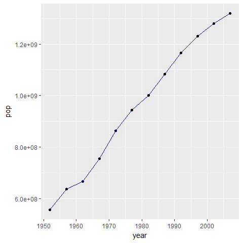
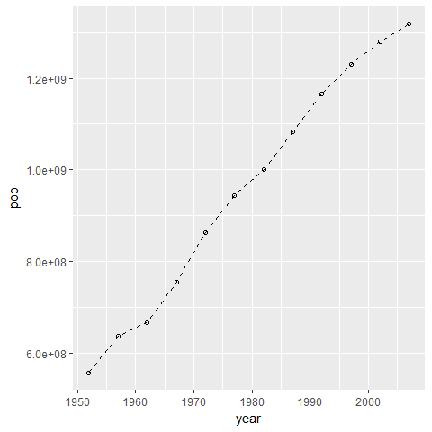
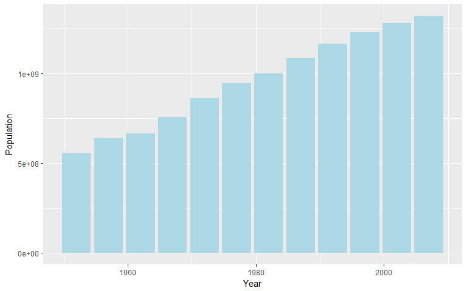
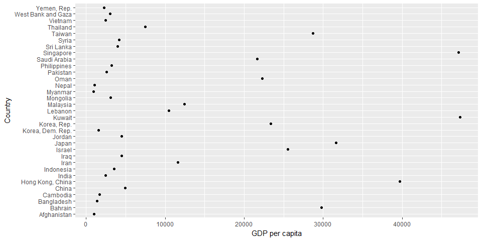
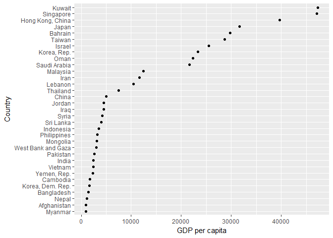
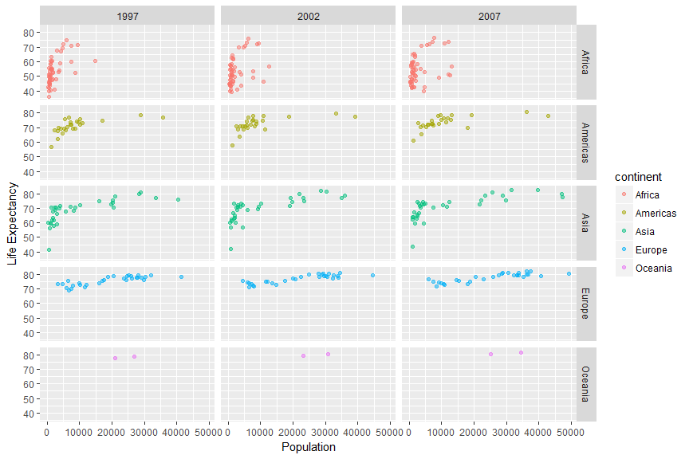

Intro to ggplot2
================
Grace Di Cecco
June 4, 2018

### Using this document

-   Code blocks and R code have a grey background (note, code nested in the text is not highlighted in the pdf version of this document but is a different font).
-   \# indicates a comment, and anything after a comment will not be evaluated in R
-   The comments beginning with \#\# under the code in the grey code boxes are the output from the code directly above; any comments added by us will start with a single \#
-   While you can copy and paste code into R, you will learn faster if you type out the commands yourself.
-   Read through the document after class. This is meant to be a reference, and ideally, you should be able to understand every line of code. If there is something you do not understand please email us with questions or ask in the following class (you're probably not the only one with the same question!).

### Expectations

1.  Understand basic `ggplot` syntax
2.  Know how `ggplot` views factors and how to relevel them for plotting
3.  Be able to adjust graphical output in Rmarkdown chunks

### Introduction to ggplot

The package `ggplot2` is a popular alternative to base plotting operations in R (e.g. functions such as `plot`, `boxplot`, `hist`) and is one of the libraries installed with tidyverse, a set of packages for data science in R. In future classes, we'll talk about handling data using other widely used tidyverse packages such as `dplyr` and `tidyr`.

Useful resources for this class include this document, the `ggplot2` CRAN documentation, as well as [Chapter 3](http://r4ds.had.co.nz/data-visualisation.html) on data visualization of Wickham & Grolemund's "R for Data Science".

#### The Gapminder dataset

In this class, we'll use a dataset provided by the Gapminder Foundation in R. This dataset contains a time series of demographic data for 142 countries from 1952 to 2007. Installing the package `gapminder` will give you the dataset. Use `install.packages`, and then try the code below:

``` r
library(gapminder)
## Warning: package 'gapminder' was built under R version 3.4.4

head(gapminder)
## # A tibble: 6 x 6
##       country continent  year lifeExp      pop gdpPercap
##        <fctr>    <fctr> <int>   <dbl>    <int>     <dbl>
## 1 Afghanistan      Asia  1952  28.801  8425333  779.4453
## 2 Afghanistan      Asia  1957  30.332  9240934  820.8530
## 3 Afghanistan      Asia  1962  31.997 10267083  853.1007
## 4 Afghanistan      Asia  1967  34.020 11537966  836.1971
## 5 Afghanistan      Asia  1972  36.088 13079460  739.9811
## 6 Afghanistan      Asia  1977  38.438 14880372  786.1134
```

You'll notice that the Gapminder dataset is called a "tibble". This is similar to a data frame, but is the format used in the tidyverse. The two main differences are in printing and subsetting. The default `print` of a tibble always contains only ten rows and the class of the data is shown underneath the name of each column (similar to `str`). When subsetting a tibble, using `[` returns another tibble, and `[[` always returns a vector.

### Figures in Rmarkdown

Dimensions of output from code chunks, such as plots, can be manipulated using arguments such as `fig.height` and `fig.width`. These arguments go in the first line of the code chunk within the curly brackets, and can be changed to produce appropriately proportioned figures. (e.g. `{r, fig.height = 5, fig.width = 5}`).

``` r
# Don't worry too much about the code used to create the figure - this will all be discussed more thoroughly below.
library(ggplot2)
library(dplyr)
## Warning: package 'dplyr' was built under R version 3.4.2
## 
## Attaching package: 'dplyr'
## The following objects are masked from 'package:stats':
## 
##     filter, lag
## The following objects are masked from 'package:base':
## 
##     intersect, setdiff, setequal, union
ggplot(data = filter(gapminder, country == "China"),
       mapping = aes(x = year, y = lifeExp, color = country)) +
  geom_line(cex = 1) + 
  theme(legend.position = "none") + xlab("Year") + ylab("Life expectancy")
```


Try changing the figure height and figure width values to get a sense for how they work on your display.

#### Basic ggplot grammar

``` r
# ggplot loads automatically with the tidyverse:
library(tidyverse)
## Warning: package 'tidyverse' was built under R version 3.4.2
## -- Attaching packages ----------------------------------------------------------------------------------------- tidyverse 1.2.1 --
## v tibble  1.3.4     v purrr   0.2.4
## v tidyr   0.7.2     v stringr 1.2.0
## v readr   1.1.1     v forcats 0.2.0
## Warning: package 'tidyr' was built under R version 3.4.2
## Warning: package 'readr' was built under R version 3.4.2
## Warning: package 'purrr' was built under R version 3.4.2
## Warning: package 'forcats' was built under R version 3.4.2
## -- Conflicts -------------------------------------------------------------------------------------------- tidyverse_conflicts() --
## x dplyr::filter() masks stats::filter()
## x dplyr::lag()    masks stats::lag()

# or it can be loaded on its own:
library(ggplot2)
```

The structure of `ggplot` code relies on a specific grammar. Plots start out with a command containing the data to use, and the mapping of the data. "Mapping" indicates which variable goes on which axis, and also can contain aesthetics such as a variable to color points or lines by. Plot attributes (points, lines, labels, etc.) are added using layers, which are strung together using the + operator to create plots.

`geoms` are used to add plot layers such as points, lines, or bars (e.g. points = `geom_point`; lines = `geom_line`). Mapping from the `ggplot` function is passed to `geoms`. Local aesthetics can also be placed within `geoms` that won't apply to any other features of the plot.

``` r
# This plot subsets the gapminder data to just include China
# We'll use a filtering function from a package called dplyr, which we'll talk about more in the next lesson

ggplot(data = filter(gapminder, country == "China"), 
       mapping = aes(x = year, y = pop)) + 
  geom_point() +
  geom_line(color = "blue") # the color blue is only applied to the lines, not the points
```



Note that line breaks in the code above ended in a +, indicating that the next lines were a part of the same plot.

*Exercise 1*

Using the resources above or Google, which `geom` is used to create histograms in `ggplot`?

#### Customizing plots

Point type can be modified using `shape`, while linetype can be modified using `lty`. Different types of points and lines are indicated using a series of numerical codes to indicate different styles.

``` r
ggplot(data = filter(gapminder, country == "China"), 
       mapping = aes(x = year, y = pop)) + 
  geom_point(shape = 1) + 
  geom_line(lty = 2)
```



X and Y axis labels default to the variable name, and can be changed using `xlab` and `ylab`:

``` r
ggplot(data = filter(gapminder, country == "China"), 
       mapping = aes(x = year, y = pop)) + 
  geom_point() + 
  geom_line(lty = 2) + 
  xlab("Year") + ylab("Population")
```


Color, linetype, and shape can be locally assigned to individual `geoms` manually (as we've done in the last few examples), or they can be mapped to a variable. By assigning color to the variable `country` in `aes`, `ggplot` will automatically assign a color to each value in the variable and create a legend:

``` r

ggplot(data = filter(gapminder, continent == "Asia"), 
       mapping = aes(x = year, y = pop, color = country)) +
  geom_point() + 
  geom_line() +
  xlab("Year") + ylab("Population")
```


Color is used as an argument for points and lines, while fill is used to change the color in barplots:

``` r
ggplot(data = filter(gapminder, country == "China"), 
       mapping = aes(x = year, y = pop)) + 
  geom_col(fill = "lightblue") + 
  xlab("Year") + ylab("Population")
```



*Exercise 2*

Which numerical linetype code is used in `ggplot` to indicate a dotted line? Which shape code changes points to + symbols?

*Exercise 3*

Using the resources above or Google, find the arguments/functions used to do the following operations and try them out on a plot from earlier in the lesson (code chunk below):

1.  Change the transparency of a point or a line.
2.  Change the y axis to a log scale
3.  Change the title of a legend using the function `guides`
4.  Read the documentation for `dplyr::filter` to find out how to filter by two criteria. Plot the population trends for countries in Asia with more than 100 million people.

``` r
ggplot(data = filter(gapminder, continent == "Asia"), 
       mapping = aes(x = year, y = pop, color = country)) + 
  geom_point() + geom_line() + xlab("Year") + ylab("Population")
```


### Factors in ggplot

Factors are a class for truly categorical data in R. While they appear to us as character strings, they are encoded in R as numbers (called "levels"). Note that the columns `country` and `continent` in the `gapminder` are factors. `ggplot` will plot factors in the order of their numerical code. As a result, they are plotted in the arbitrary order they are listed in in the original dataset, which may not be very useful or pretty in plots.

``` r
ggplot(data = filter(gapminder, continent == "Asia", year == 2007), 
       mapping = aes(x = gdpPercap, y = country)) + 
  geom_point() + xlab("GDP per capita") + ylab("Country")
```



`forcats` is a package useful for reordering factors. It is installed with the tidyverse package, but not loaded automatically. Here, we reorder the countries by their per capita GDP using `fct_reorder`, making for a cleaner and easier to comprehend plot:

``` r
library(forcats)

ggplot(data = filter(gapminder, continent == "Asia", year == 2007), 
       mapping = aes(x = gdpPercap, y = fct_reorder(country, gdpPercap))) + 
  geom_point() + xlab("GDP per capita") + ylab("Country")
```



*Exercise 4*

Referring to the help page for `forcats` and the [Stat 545 page](http://stat545.com/block029_factors.html) on the package, reorder the countries in the plot above alphabetically, such that Afghanistan is at the top of the y axis and Yemen is at the bottom.

#### Facetting

Facets produce plots for subsets of data in `ggplot`. `facet_wrap` is used to subset by one variable, while `facet_grid` is used to subset data by two variables. Variables used for subsetting should be discrete. The `~` is followed by the variable used to subset the data within the `facet_wrap` command. The number of rows or columns for the plots can also be specified in `facet_wrap`.

``` r
ggplot(filter(gapminder, year > 1995), aes(x = gdpPercap, y = lifeExp, color = continent)) +
  geom_point(alpha = 0.5) + 
  ylab("Life Expectancy") + xlab("Population") +
  facet_wrap(~ year, nrow = 2)
```


Note that we've dropped the 'data =' and 'mapping =' from the first ggplot command above. As long as your data and aesthetics are in the right order, you don't need to label those arguments each time.

To subset by two variables using `facet_grid`, the formula used is `var1 ~ var2`.

``` r
ggplot(filter(gapminder, year > 1995), aes(x = gdpPercap, y = lifeExp, color = continent)) +
  geom_point(alpha = 0.5) + 
  ylab("Life Expectancy") + xlab("Population") +
  facet_grid(continent ~ year)
```



*Exercise 5*

To check your understanding of `ggplot` and topics covered in this lesson, replicate the plot below of data from the Gapminder dataset. Make use of your resources in this document, the `ggplot2` CRAN documentation, R for Data Science, and Google.

Hint: this plot uses a subset of the Gapminder data and a linear trendline.


Today we've just scratched the surface of `ggplot2` and complementary packages such as `forcats`, so we encourage you to make use of the additional resources linked in this lesson and others to learn more.
