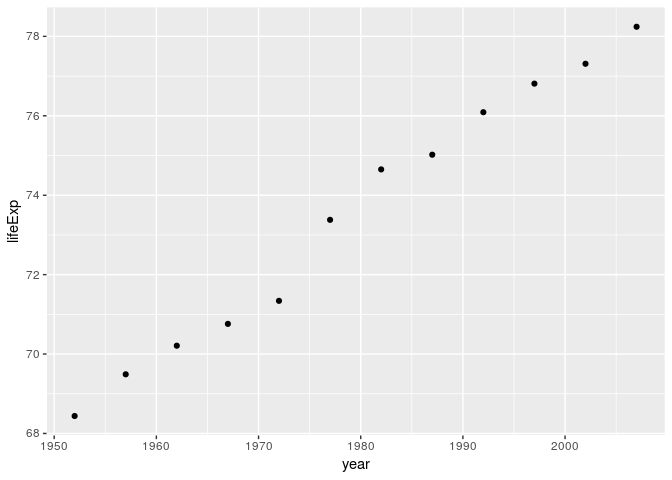
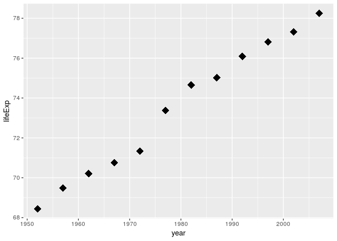
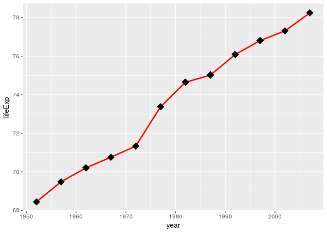
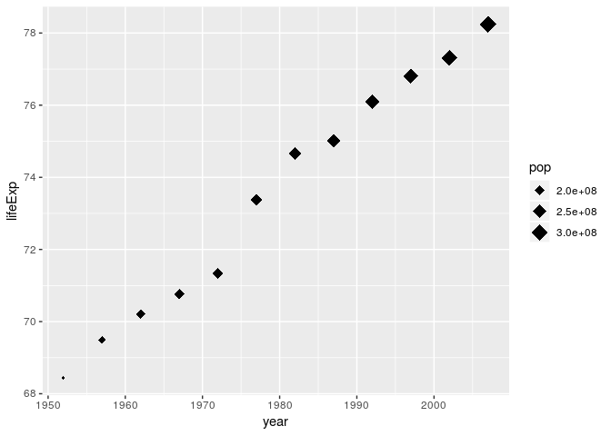
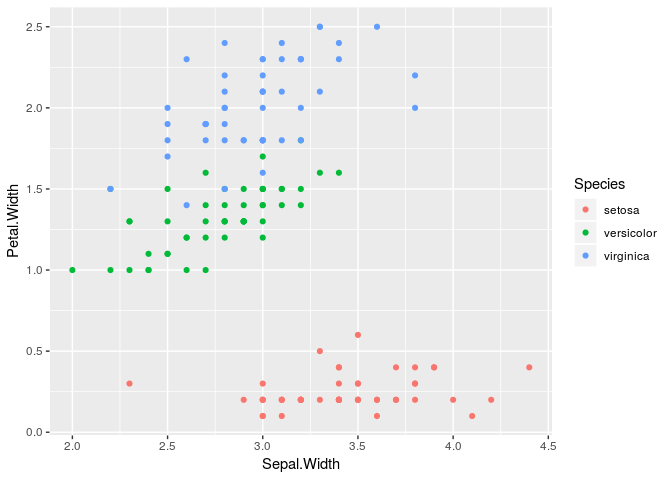
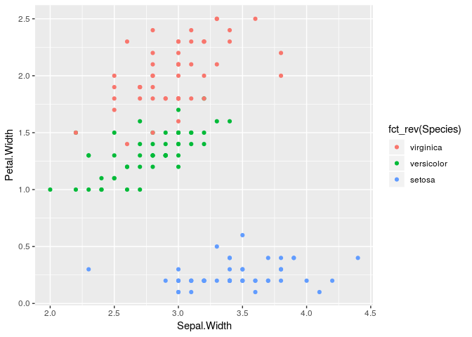
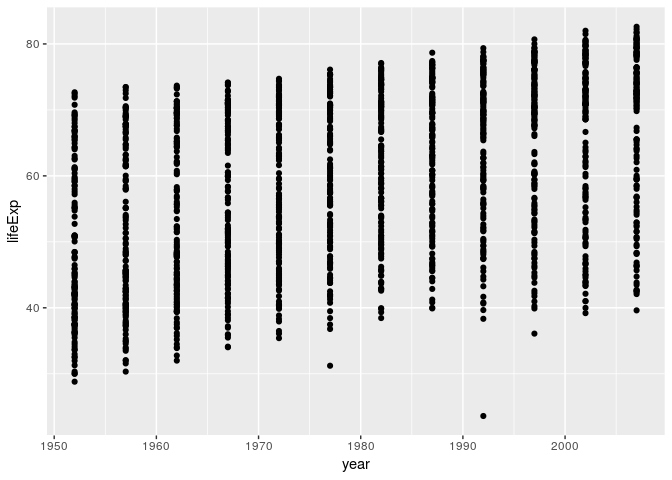
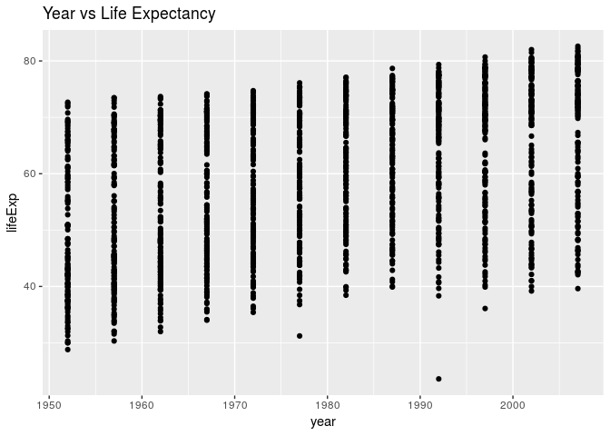
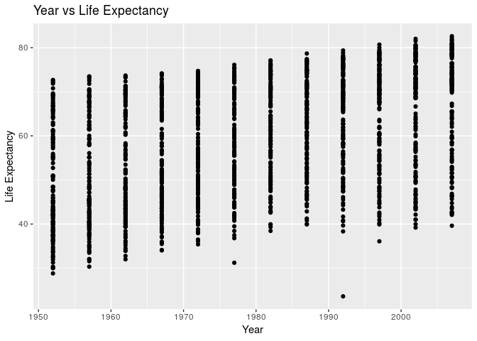
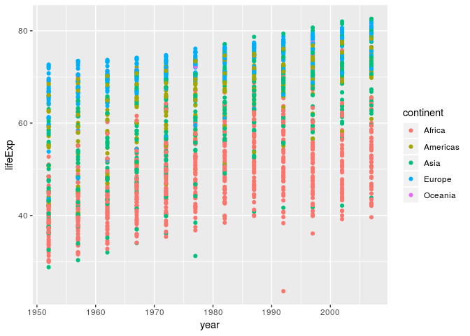

Intro to ggplot2
================
Spencer Nystrom

### Expectations

1.  Understand basic `ggplot` syntax
2.  Know how `ggplot` views factors and how to relevel them for plotting

Install the `gapminder` dataset

``` r
install.packages("gapminder")
```

Next we will load the sample data and subset it. We will cover how to do
this in detail next week, but for now run the following code to generate
a `data.frame` tracking life-expectancy, population, & gdp over time in
the United States.

``` r
library(gapminder)
# We'll cover dplyr next week!
usa <- dplyr::filter(gapminder, country == "United States")
```

Don’t forget to load the `ggplot2` library

``` r
library(ggplot2)
## Registered S3 methods overwritten by 'ggplot2':
##   method         from 
##   [.quosures     rlang
##   c.quosures     rlang
##   print.quosures rlang
```

## Exercise 1

  - Recall last class’s lesson on ggplot. Try to recreate the following
    scatterplot of life expectancy over time:

<!-- -->

## Exercise 2

  - Change the point shape to diamonds
  - increase the point size to 5
    <!-- -->

## Layered grammar of graphics

ggplot adds things in layers. The order of addition matters\! Lets add a
line to our scatterplot. Observe that the line is plotted over the
points.

I’ve increased the line thickness with the `size` argument so it renders
well on a projector.

``` r
ggplot(data = usa, mapping = aes(x = year, y = lifeExp)) +
  geom_point(shape = 18, size = 5) +
  geom_line(color = "red", size = 1)
```

<!-- -->

## Exercise 3

  - redo the above plot so that the points are on top of the line.
    <!-- -->

## Exercise 4

  - set the point size to scale with the population (`pop` column)
  - what happens if you set the color to scale with the population?
  - what happens if you set the color to distinguish the continent?
    <!-- -->

# Data Types in ggplot2

Recall the following example:

``` r
ggplot(iris, aes(Sepal.Width, Petal.Width)) +
  geom_point(aes(color = Species))
```

<!-- -->

ggplot interprets categorical variables as `factors` in order to assign
their order in the legend, and the color on the plot.

### Factors are ordered categorical data with “Levels”

By default the levels are in **alphabetical order**.

Note how in the below example the ‘levels’ of `myFactors` are arranged
alphabetically.

``` r
myFactors <- factor(c("One", "Two", "Two", "Three"))

myFactors
## [1] One   Two   Two   Three
## Levels: One Three Two
```

In the iris dataset, `Species` is already a factor

``` r
iris$Species
##   [1] setosa     setosa     setosa     setosa     setosa     setosa    
##   [7] setosa     setosa     setosa     setosa     setosa     setosa    
##  [13] setosa     setosa     setosa     setosa     setosa     setosa    
##  [19] setosa     setosa     setosa     setosa     setosa     setosa    
##  [25] setosa     setosa     setosa     setosa     setosa     setosa    
##  [31] setosa     setosa     setosa     setosa     setosa     setosa    
##  [37] setosa     setosa     setosa     setosa     setosa     setosa    
##  [43] setosa     setosa     setosa     setosa     setosa     setosa    
##  [49] setosa     setosa     versicolor versicolor versicolor versicolor
##  [55] versicolor versicolor versicolor versicolor versicolor versicolor
##  [61] versicolor versicolor versicolor versicolor versicolor versicolor
##  [67] versicolor versicolor versicolor versicolor versicolor versicolor
##  [73] versicolor versicolor versicolor versicolor versicolor versicolor
##  [79] versicolor versicolor versicolor versicolor versicolor versicolor
##  [85] versicolor versicolor versicolor versicolor versicolor versicolor
##  [91] versicolor versicolor versicolor versicolor versicolor versicolor
##  [97] versicolor versicolor versicolor versicolor virginica  virginica 
## [103] virginica  virginica  virginica  virginica  virginica  virginica 
## [109] virginica  virginica  virginica  virginica  virginica  virginica 
## [115] virginica  virginica  virginica  virginica  virginica  virginica 
## [121] virginica  virginica  virginica  virginica  virginica  virginica 
## [127] virginica  virginica  virginica  virginica  virginica  virginica 
## [133] virginica  virginica  virginica  virginica  virginica  virginica 
## [139] virginica  virginica  virginica  virginica  virginica  virginica 
## [145] virginica  virginica  virginica  virginica  virginica  virginica 
## Levels: setosa versicolor virginica
```

## Factors can have their order set on assignment

``` r
myFactors2 <- factor(c("One", "Two", "Two", "Three"), levels = c("One", "Two", "Three"))

myFactors2
## [1] One   Two   Two   Three
## Levels: One Two Three
```

## Factors can be reordered after the fact

Use the `forcats` library\! It’s built for dealing with factors\!

``` r
library(forcats)

myFactors
## [1] One   Two   Two   Three
## Levels: One Three Two
```

all forcats functions start with `fct_`

`fct_relevel` lets you reorder factors

``` r
fct_relevel(myFactors, c("One", "Two", "Three"))
## [1] One   Two   Two   Three
## Levels: One Two Three
```

`fct_rev` reverses the order of levels

``` r
myFactors2
## [1] One   Two   Two   Three
## Levels: One Two Three
```

``` r
fct_rev(myFactors2)
## [1] One   Two   Two   Three
## Levels: Three Two One
```

## ggplot customization

``` r
ggplot(iris, aes(Sepal.Width, Petal.Width)) +
  geom_point(aes(color = Species))
```

<!-- -->

The order of the factors in the legend (and thus the default color
assignment) can be changed by reordering the factor levels\!

``` r
ggplot(iris, aes(Sepal.Width, Petal.Width)) +
  geom_point(aes(color = fct_rev(Species)))
```

<!-- -->

## Setting axis labels & title

For these examples I’m going to use the whole gapminder dataset. To save
typing I will save a scatterplot of year vs lifeExp to
`myPlot`.

``` r
myPlot <- ggplot(data = gapminder, mapping = aes(x = year, y = lifeExp)) +
    geom_point()

myPlot
```

<!-- -->

Titles can be added with `ggtitle()`

``` r
myPlot +
  ggtitle("Year vs Life Expectancy")
```

<!-- -->

Axis titles can be customized with `xlab()` and `ylab()`

``` r
myPlot +
  ggtitle("Year vs Life Expectancy") +
  xlab("Year") +
  ylab("Life Expectancy")
```

<!-- -->

``` r
myPlot +
  ggtitle("Year vs Life Expectancy") +
  xlab("Year") +
  ylab("Life Expectancy")
```

<!-- -->

global aesthetics can be added to the whole plot

``` r
myPlot +
  aes(color = continent)
```

<!-- -->

## Final Exercise

To check your understanding of `ggplot` and topics covered in this
lesson, replicate the plot below of data from the Gapminder dataset.
Make use of your resources in this document, the `ggplot2`
documentation, R for Data Science, and Google.

**Hints:** - this plot uses the following subset of the Gapminder data -
this plot uses facets to show the different years - a linear trendline -
log10 x-axis - altered transparency of the points - renamed legend
titles - axis text is resized to 12 - axis title text is resized to 14 -
facet titles are resized to 14

``` r
finalExampleData <- dplyr::filter(gapminder, year %in% c(1952, 2007))
```

<!-- -->
