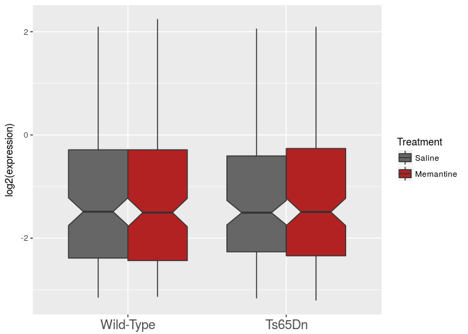
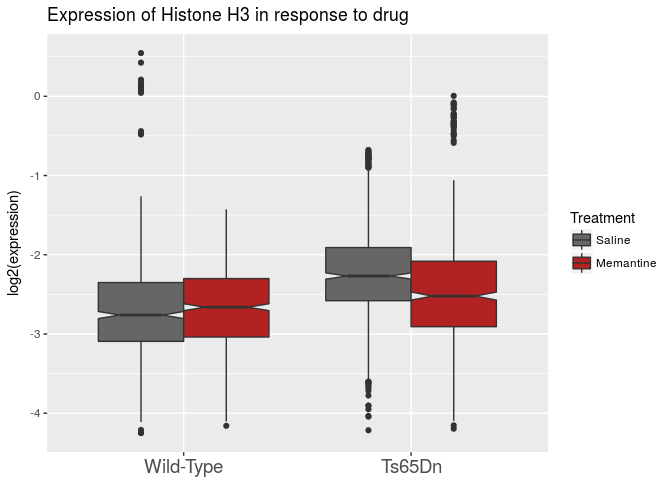

R Notebook
================

``` r
library(tidyverse)
```

    ## ── Attaching packages ──────────────────────────────────────────────────────────────────────────── tidyverse 1.2.1 ──

    ## ✔ ggplot2 2.2.1     ✔ purrr   0.2.4
    ## ✔ tibble  1.4.2     ✔ dplyr   0.7.5
    ## ✔ tidyr   0.8.1     ✔ stringr 1.3.1
    ## ✔ readr   1.1.1     ✔ forcats 0.3.0

    ## ── Conflicts ─────────────────────────────────────────────────────────────────────────────── tidyverse_conflicts() ──
    ## ✖ dplyr::filter() masks stats::filter()
    ## ✖ dplyr::lag()    masks stats::lag()

``` r
library(magrittr)
```

    ## 
    ## Attaching package: 'magrittr'

    ## The following object is masked from 'package:purrr':
    ## 
    ##     set_names

    ## The following object is masked from 'package:tidyr':
    ## 
    ##     extract

``` r
knitr::opts_chunk$set(echo = F)
```

[Data](https://archive.ics.uci.edu/ml/datasets/Mice+Protein+Expression)

    ## # A tibble: 6 x 82
    ##   MouseID DYRK1A_N ITSN1_N BDNF_N NR1_N NR2A_N pAKT_N pBRAF_N pCAMKII_N
    ##   <chr>      <dbl>   <dbl>  <dbl> <dbl>  <dbl>  <dbl>   <dbl>     <dbl>
    ## 1 309_1      0.504   0.747  0.430  2.82   5.99  0.219   0.178      2.37
    ## 2 309_2      0.515   0.689  0.412  2.79   5.69  0.212   0.173      2.29
    ## 3 309_3      0.509   0.730  0.418  2.69   5.62  0.209   0.176      2.28
    ## 4 309_4      0.442   0.617  0.359  2.47   4.98  0.223   0.176      2.15
    ## 5 309_5      0.435   0.617  0.359  2.37   4.72  0.213   0.174      2.13
    ## 6 309_6      0.448   0.628  0.367  2.39   4.81  0.219   0.176      2.14
    ## # ... with 73 more variables: pCREB_N <dbl>, pELK_N <dbl>, pERK_N <dbl>,
    ## #   pJNK_N <dbl>, PKCA_N <dbl>, pMEK_N <dbl>, pNR1_N <dbl>, pNR2A_N <dbl>,
    ## #   pNR2B_N <dbl>, pPKCAB_N <dbl>, pRSK_N <dbl>, AKT_N <dbl>,
    ## #   BRAF_N <dbl>, CAMKII_N <dbl>, CREB_N <dbl>, ELK_N <dbl>, ERK_N <dbl>,
    ## #   GSK3B_N <dbl>, JNK_N <dbl>, MEK_N <dbl>, TRKA_N <dbl>, RSK_N <dbl>,
    ## #   APP_N <dbl>, Bcatenin_N <dbl>, SOD1_N <dbl>, MTOR_N <dbl>,
    ## #   P38_N <dbl>, pMTOR_N <dbl>, DSCR1_N <dbl>, AMPKA_N <dbl>,
    ## #   NR2B_N <dbl>, pNUMB_N <dbl>, RAPTOR_N <dbl>, TIAM1_N <dbl>,
    ## #   pP70S6_N <dbl>, NUMB_N <dbl>, P70S6_N <dbl>, pGSK3B_N <dbl>,
    ## #   pPKCG_N <dbl>, CDK5_N <dbl>, S6_N <dbl>, ADARB1_N <dbl>,
    ## #   AcetylH3K9_N <dbl>, RRP1_N <dbl>, BAX_N <dbl>, ARC_N <dbl>,
    ## #   ERBB4_N <dbl>, nNOS_N <dbl>, Tau_N <dbl>, GFAP_N <dbl>, GluR3_N <dbl>,
    ## #   GluR4_N <dbl>, IL1B_N <dbl>, P3525_N <dbl>, pCASP9_N <dbl>,
    ## #   PSD95_N <dbl>, SNCA_N <dbl>, Ubiquitin_N <dbl>, pGSK3B_Tyr216_N <dbl>,
    ## #   SHH_N <dbl>, BAD_N <dbl>, BCL2_N <dbl>, pS6_N <dbl>, pCFOS_N <dbl>,
    ## #   SYP_N <dbl>, H3AcK18_N <dbl>, EGR1_N <dbl>, H3MeK4_N <dbl>,
    ## #   CaNA_N <dbl>, Genotype <chr>, Treatment <chr>, Behavior <chr>,
    ## #   class <chr>

## Write a function that will tidy your melted data

  - rename “MouseID” column to “id”
  - rename all column names as lowercase
  - remove the "\_N" from the end of all protein names
  - rename the “Control” genotype to
“Wild-Type”

## Write a function that plots a ggplot boxplot comparing genotype on the x-axis, log2(expression) on the y-axis where each boxplot is colored by drug/nodrug treatment

<!-- -->

## Using group\_by, summarise, and tidyr::spread(), rank all genes by their fold-change in response to drug overall.

### Q: What are the top 5 proteins that increase following drug treatment?

**Hint:** You’ll first want to use tidyr::drop\_na() to remove missing
data or else you’ll get NA values\!

Your output should look something like this:

    ## # A tibble: 77 x 4
    ##    gene    Memantine Saline fold_change
    ##    <chr>       <dbl>  <dbl>       <dbl>
    ##  1 gene_1      3.77   3.28         1.15
    ##  2 gene_2      0.433  0.396        1.09
    ##  3 gene_3      0.785  0.730        1.07
    ##  4 gene_4      0.544  0.509        1.07
    ##  5 gene_5      0.749  0.703        1.07
    ##  6 gene_6      0.322  0.303        1.06
    ##  7 gene_7      1.27   1.20         1.06
    ##  8 gene_8      0.187  0.176        1.06
    ##  9 gene_9      0.600  0.569        1.05
    ## 10 gene_10     0.238  0.227        1.05
    ## # ... with 67 more rows

#### Top 5 Increasing Genes:

#### Top 5 Decreasing Genes:

## Use the grep command to find any proteins that match histone H3 (“H3”)

**Bonus:** Are there any other histones in this dataset? Use regular
expressions to find
them.

## Using your boxplot function, plot the expression level of all H3 proteins (in aggregate) for WT vs Mut, Drug/noDrug

### Q: What appears to be the trend?

    ## Warning: Removed 450 rows containing non-finite values (stat_boxplot).

<!-- -->

## Make a boxplot for each histone gene comparing Wild-Type to Mutant drug/nodrug

**Hint:** Try using facets

### Q: What is the effect of drug treatment on AcetylH3K9?

(Although you would do stats in real life, don’t worry about that
now)

### A: Ts65Dn mice have much higher levels of H3K9Ac than Wild-type before drug treatment. While drug treatment has little effect in WT on H3K9Ac levels, drug treatment reduces the level of H3K9Ac.
