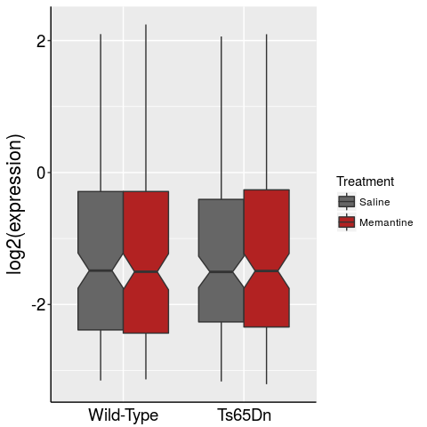

Final Project: Mouse Cortex Protein Expression
================

## Answer the following questions about the mouse cortex expression data, export your results as a github\_document.

``` r
library(tidyverse)
library(magrittr)
```

[Explanation of
Data](https://archive.ics.uci.edu/ml/datasets/Mice+Protein+Expression)

``` r
cortex_url <- "https://archive.ics.uci.edu/ml/machine-learning-databases/00342/Data_Cortex_Nuclear.xls"

download.file(destfile = "cortex.xls", url = cortex_url)
```

### Raw Data:

    ## # A tibble: 4 x 4
    ##   MouseID DYRK1A_N ITSN1_N BDNF_N
    ##   <chr>      <dbl>   <dbl>  <dbl>
    ## 1 309_1      0.504   0.747  0.430
    ## 2 309_2      0.515   0.689  0.412
    ## 3 309_3      0.509   0.730  0.418
    ## 4 309_4      0.442   0.617  0.359

## Transform the raw data into a melted data.frame

### Melted Data:

    ##   MouseID Treatment Behavior  class Genotype  protein expression
    ## 1   309_1 Memantine      C/S c-CS-m  Control DYRK1A_N  0.5036439
    ## 2   309_2 Memantine      C/S c-CS-m  Control DYRK1A_N  0.5146171
    ## 3   309_3 Memantine      C/S c-CS-m  Control DYRK1A_N  0.5091831
    ## 4   309_4 Memantine      C/S c-CS-m  Control DYRK1A_N  0.4421067
    ## 5   309_5 Memantine      C/S c-CS-m  Control DYRK1A_N  0.4349402
    ## 6   309_6 Memantine      C/S c-CS-m  Control DYRK1A_N  0.4475064

## Write a function that will tidy your melted data

  - rename “MouseID” column to “id”
  - rename all column names as lowercase
  - remove the "\_N" from the end of all protein names
  - rename the “Control” genotype to “Wild-Type”

### Example of output:

    ##      id treatment behavior  class  genotype protein expression
    ## 1 309_1 Memantine      C/S c-CS-m Wild-Type  DYRK1A  0.5036439
    ## 2 309_2 Memantine      C/S c-CS-m Wild-Type  DYRK1A  0.5146171
    ## 3 309_3 Memantine      C/S c-CS-m Wild-Type  DYRK1A  0.5091831
    ## 4 309_4 Memantine      C/S c-CS-m Wild-Type  DYRK1A  0.4421067
    ## 5 309_5 Memantine      C/S c-CS-m Wild-Type  DYRK1A  0.4349402
    ## 6 309_6 Memantine      C/S c-CS-m Wild-Type  DYRK1A  0.4475064

## How many proteins are being measured?

## How many measurements per genotype/treatment group are there?

## Do all mice have measurements for all proteins?

## Write a function that plots a ggplot boxplot comparing genotype on the x-axis, log2(expression) on the y-axis where each boxplot is colored by drug/nodrug treatment

  - Customize the theme of the plot to your liking.
  - At a minimum, pick non-default colors for your conditions, and
    resize text labels
  - **Bonus:** Put Wild-Type first in the
plot

<!-- -->

## Using group\_by, summarise, and tidyr::spread(), rank all proteins by their fold-change in response to drug overall.

### Q: What are the top 5 proteins that increase following drug treatment?

**Hint:** You’ll first want to use tidyr::drop\_na() to remove missing
data or else you’ll get NA values\!

Your output should look something like this:

(But “protein\_\#” will be an actual protein name)

    ## # A tibble: 77 x 4
    ##    protein    Memantine Saline fold_change
    ##    <chr>          <dbl>  <dbl>       <dbl>
    ##  1 protein_1      3.77   3.28         1.15
    ##  2 protein_2      0.433  0.396        1.09
    ##  3 protein_3      0.785  0.730        1.07
    ##  4 protein_4      0.544  0.509        1.07
    ##  5 protein_5      0.749  0.703        1.07
    ##  6 protein_6      0.322  0.303        1.06
    ##  7 protein_7      1.27   1.20         1.06
    ##  8 protein_8      0.187  0.176        1.06
    ##  9 protein_9      0.600  0.569        1.05
    ## 10 protein_10     0.238  0.227        1.05
    ## # ... with 67 more rows

#### Top 5 Increasing proteins:

#### Top 5 Decreasing proteins:

## Use the grep command to find any proteins that match histone H3 (“H3”)

**Bonus:** Are there any other histones in this dataset? Use regular
expressions to find
them.

## Using your boxplot function, plot the expression level of all H3 proteins (in aggregate) for WT vs Mut, Drug/noDrug

**Hint:** The `grepl` function can be combined with `filter` to select
things that match a
regex.

### Q: What appears to be the trend?

## Make a boxplot for each histone protein comparing Wild-Type to Mutant drug/nodrug

**Hint:** Try using facets **Bonus:** use regex & backreference to
rename histone marks in conventional format (ie “H3K9Ac” instead of
“AcetylH3K9”. Format = “\<Histone\#\>\<amino-acid\#\><modification>”)

### Q: What is the effect of drug treatment on AcetylH3K9?

(Although you would do stats in real life, don’t worry about that now)
