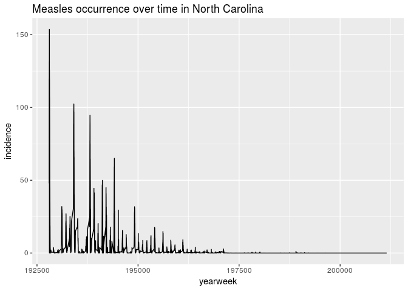
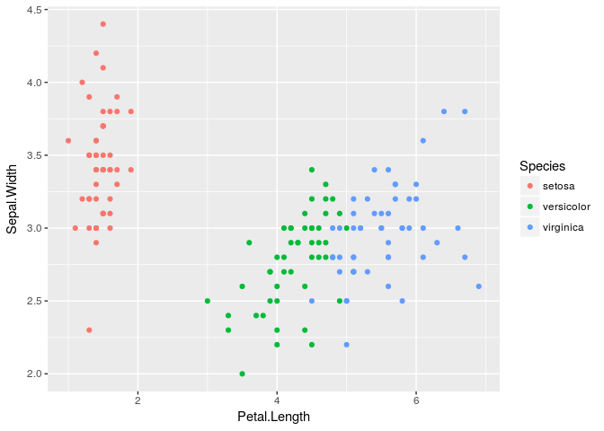
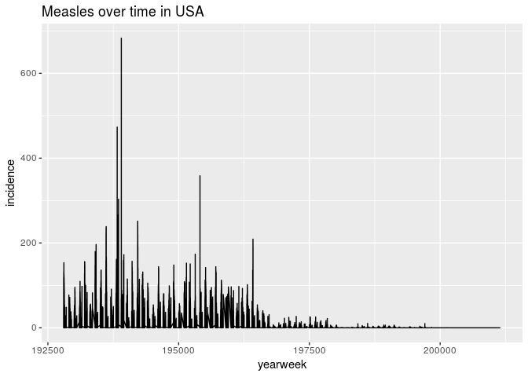

Tidy Data
================

Today we will be working with a dataset from [Project
Tycho](https://www.tycho.pitt.edu/) which tracks disease infection over
time.

Today’s dataset tracks long-term infection rates of various diseases in
America by
    State.

``` r
library(tidyverse)
```

    ## ── Attaching packages ──────────────────────────────────────────────────────────────────────────── tidyverse 1.2.1 ──

    ## ✔ ggplot2 2.2.1     ✔ purrr   0.2.4
    ## ✔ tibble  1.4.2     ✔ dplyr   0.7.5
    ## ✔ tidyr   0.8.1     ✔ stringr 1.3.1
    ## ✔ readr   1.1.1     ✔ forcats 0.3.0

    ## ── Conflicts ─────────────────────────────────────────────────────────────────────────────── tidyverse_conflicts() ──
    ## ✖ dplyr::filter() masks stats::filter()
    ## ✖ dplyr::lag()    masks stats::lag()

``` r
# The data is uploaded to github
tycho_timeOnly_link <- "https://raw.githubusercontent.com/UNC-HLC-R-Intro/lessons/import/data/tycho_wide_timeOnly.csv?token=AQdxTdVbMVfOF85YawF5KGZrS_i0xTxDks5bUKzswA%3D%3D"
```

``` r
tycho <- readr::read_csv(tycho_timeOnly_link)
```

    ## Parsed with column specification:
    ## cols(
    ##   .default = col_double(),
    ##   state = col_character(),
    ##   disease = col_character()
    ## )

    ## See spec(...) for full column specifications.

# Description of data

**state** - American state

**disease** - disease tracked on that row

**column names** - the year & week (ex **192802** is the ***2nd week***
of **1928**) of the measurement

**column values** - the incidence of disease per 100000 people in each
state. (Infection normalized to population size)

``` r
head(tycho)
```

    ## # A tibble: 6 x 4,323
    ##   state   disease    `192801` `192802` `192803` `192804` `192805` `192806`
    ##   <chr>   <chr>         <dbl>    <dbl>    <dbl>    <dbl>    <dbl>    <dbl>
    ## 1 ALABAMA HEPATITIS…     0        0        0         0       0        0   
    ## 2 ALABAMA MEASLES        3.67     6.25     7.95     12.6     8.03     7.27
    ## 3 ALABAMA MUMPS          0        0        0         0       0        0   
    ## 4 ALABAMA PERTUSSIS      0        0        0         0       0        0   
    ## 5 ALABAMA POLIO          0        0        0.04      0       0        0   
    ## 6 ALABAMA RUBELLA        0        0        0         0       0        0   
    ## # ... with 4,315 more variables: `192807` <dbl>, `192808` <dbl>,
    ## #   `192809` <dbl>, `192810` <dbl>, `192811` <dbl>, `192812` <dbl>,
    ## #   `192813` <dbl>, `192814` <dbl>, `192815` <dbl>, `192816` <dbl>,
    ## #   `192817` <dbl>, `192818` <dbl>, `192819` <dbl>, `192820` <dbl>,
    ## #   `192821` <dbl>, `192822` <dbl>, `192823` <dbl>, `192824` <dbl>,
    ## #   `192825` <dbl>, `192826` <dbl>, `192827` <dbl>, `192828` <dbl>,
    ## #   `192829` <dbl>, `192830` <dbl>, `192831` <dbl>, `192832` <dbl>,
    ## #   `192833` <dbl>, `192834` <dbl>, `192835` <dbl>, `192836` <dbl>,
    ## #   `192837` <dbl>, `192838` <dbl>, `192839` <dbl>, `192840` <dbl>,
    ## #   `192841` <dbl>, `192842` <dbl>, `192843` <dbl>, `192844` <dbl>,
    ## #   `192845` <dbl>, `192846` <dbl>, `192847` <dbl>, `192848` <dbl>,
    ## #   `192849` <dbl>, `192850` <dbl>, `192851` <dbl>, `192852` <dbl>,
    ## #   `192901` <dbl>, `192902` <dbl>, `192903` <dbl>, `192904` <dbl>,
    ## #   `192905` <dbl>, `192906` <dbl>, `192907` <dbl>, `192908` <dbl>,
    ## #   `192909` <dbl>, `192910` <dbl>, `192911` <dbl>, `192912` <dbl>,
    ## #   `192913` <dbl>, `192914` <dbl>, `192915` <dbl>, `192916` <dbl>,
    ## #   `192917` <dbl>, `192918` <dbl>, `192919` <dbl>, `192920` <dbl>,
    ## #   `192921` <dbl>, `192922` <dbl>, `192923` <dbl>, `192924` <dbl>,
    ## #   `192925` <dbl>, `192926` <dbl>, `192927` <dbl>, `192928` <dbl>,
    ## #   `192929` <dbl>, `192930` <dbl>, `192931` <dbl>, `192932` <dbl>,
    ## #   `192933` <dbl>, `192934` <dbl>, `192935` <dbl>, `192936` <dbl>,
    ## #   `192937` <dbl>, `192938` <dbl>, `192939` <dbl>, `192940` <dbl>,
    ## #   `192941` <dbl>, `192942` <dbl>, `192943` <dbl>, `192944` <dbl>,
    ## #   `192945` <dbl>, `192946` <dbl>, `192947` <dbl>, `192948` <dbl>,
    ## #   `192949` <dbl>, `192950` <dbl>, `192951` <dbl>, `192952` <dbl>,
    ## #   `193001` <dbl>, `193002` <dbl>, …

## Exercise 1 (5 minutes in groups of ~4)

**Hint:** Use `summarize`, `group_by`, and the `count`
functions

### Are all states in this datset?

### What diseases are being tracked?

### Do all states have entries for all diseases being tracked?

# What if we want to plot this data?

### Use ggplot2 to plot the disease occurrance of Measles over time in North Carolina (3 minutes)

<!-- -->
**Hint:** Recall `ggplot2` syntax

``` r
iris %>% 
  ggplot(aes(Petal.Length, Sepal.Width)) +
    geom_point(aes(color = Species))
```

<!-- -->

# Reshaping/Melting data


The `reshape2` package uses a function called `melt` to move from “wide”
to “long” form
data

## Exercise 2

### Melt the tycho dataframe so that each timepoint is a row (named “yearweek”) and the values are in 1 column (“incidence”)

    ##     state     disease yearweek incidence
    ## 1 ALABAMA HEPATITIS A   192801      0.00
    ## 2 ALABAMA     MEASLES   192801      3.67
    ## 3 ALABAMA       MUMPS   192801      0.00
    ## 4 ALABAMA   PERTUSSIS   192801      0.00
    ## 5 ALABAMA       POLIO   192801      0.00
    ## 6 ALABAMA     RUBELLA   192801      0.00

### Now try plotting the data like above

<!-- -->

### Plot all Measles data over time in America

<!-- -->

### What year was the Measles vaccine introduced? How did this affect incidence of disease?

**Hint:** Think of a good way to plot this\!
