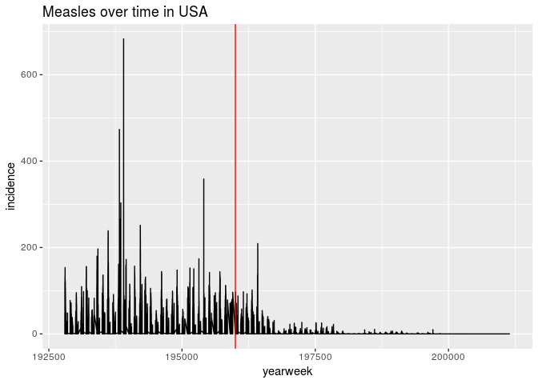

Tidy Data day 2
================

``` r
library(tidyverse)
library(reshape2)
```

# Homework Solution:

    ## Parsed with column specification:
    ## cols(
    ##   .default = col_double(),
    ##   state = col_character(),
    ##   disease = col_character()
    ## )

    ## See spec(...) for full column specifications.

Specify names of melted columns with reshape

``` r
tycho_melt <- tycho %>% 
  reshape2::melt(id.vars = c("state", "disease"), value.name = "incidence", variable.name = "yearweek") 
```

Convert yearweek from **factor** to **numeric**.

With `as.character(yearweek) %>% as.numeric`

You have to do it this way because R sees factors as numbers first
unless you say otherwise.

`yearweek %>% as.numeric` would output `1,2,3,4,5...` because these are
the factor **levels**

The measles vaccine came out in 1960, so that yearweek code is 196001

``` r
tycho_melt %>% 
  dplyr::filter(disease == "MEASLES") %>% 
  dplyr::mutate(yearweek = as.character(yearweek) %>% as.numeric) %>% 
  ggplot(aes(yearweek, incidence)) +
    geom_line(aes(group = disease)) +
    ggtitle("Measles over time in USA") +
    geom_vline(xintercept = 196001, color = "red")
```

<!-- -->

# Day2:

Today we will work with the same data, but in a slightly more difficult
format.

``` r
tycho_wide_timeDisease_link <- "https://raw.githubusercontent.com/UNC-HLC-R-Intro/lessons/import/data/tycho_wide_time-disease.csv?token=AQdxTfHxKKtnxxzNvQeWm5VXTBq9gZ0-ks5bUKzQwA%3D%3D"
```

``` r
tycho <- readr::read_csv(tycho_wide_timeDisease_link)
```

    ## Parsed with column specification:
    ## cols(
    ##   .default = col_double(),
    ##   state = col_character(),
    ##   `192840_SMALLPOX` = col_integer(),
    ##   `194033_MEASLES` = col_integer(),
    ##   `194043_POLIO` = col_integer(),
    ##   `194115_POLIO` = col_integer(),
    ##   `194116_MEASLES` = col_integer(),
    ##   `194133_MEASLES` = col_integer(),
    ##   `194133_POLIO` = col_integer(),
    ##   `194241_MEASLES` = col_integer(),
    ##   `194334_SMALLPOX` = col_integer(),
    ##   `194533_SMALLPOX` = col_integer(),
    ##   `194706_SMALLPOX` = col_integer(),
    ##   `194724_SMALLPOX` = col_integer(),
    ##   `194728_SMALLPOX` = col_integer(),
    ##   `194729_SMALLPOX` = col_integer(),
    ##   `194733_SMALLPOX` = col_integer(),
    ##   `194735_SMALLPOX` = col_integer(),
    ##   `194737_SMALLPOX` = col_integer(),
    ##   `194739_SMALLPOX` = col_integer(),
    ##   `194743_SMALLPOX` = col_integer()
    ##   # ... with 498 more columns
    ## )

    ## See spec(...) for full column specifications.

# `tidyr` package for more complicated data manipulation

``` r
tycho %>% 
  head
```

    ## # A tibble: 6 x 15,548
    ##   state  `192801_MEASLES` `192801_POLIO` `192801_SMALLPO… `192802_MEASLES`
    ##   <chr>             <dbl>          <dbl>            <dbl>            <dbl>
    ## 1 ALABA…             3.67           0                0.04             6.25
    ## 2 ALASKA             0              0                0                0   
    ## 3 ARIZO…             1.9            0                0                6.4 
    ## 4 ARKAN…             4.11           0                0.38             9.91
    ## 5 CALIF…             1.38           0.17             0.34             1.8 
    ## 6 COLOR…             8.38           0.39             3.06             6.02
    ## # ... with 15,543 more variables: `192802_POLIO` <dbl>,
    ## #   `192802_SMALLPOX` <dbl>, `192803_MEASLES` <dbl>, `192803_POLIO` <dbl>,
    ## #   `192803_SMALLPOX` <dbl>, `192804_MEASLES` <dbl>, `192804_POLIO` <dbl>,
    ## #   `192804_SMALLPOX` <dbl>, `192805_MEASLES` <dbl>, `192805_POLIO` <dbl>,
    ## #   `192805_SMALLPOX` <dbl>, `192806_MEASLES` <dbl>, `192806_POLIO` <dbl>,
    ## #   `192806_SMALLPOX` <dbl>, `192807_MEASLES` <dbl>, `192807_POLIO` <dbl>,
    ## #   `192807_SMALLPOX` <dbl>, `192808_MEASLES` <dbl>, `192808_POLIO` <dbl>,
    ## #   `192808_SMALLPOX` <dbl>, `192809_MEASLES` <dbl>, `192809_POLIO` <dbl>,
    ## #   `192809_SMALLPOX` <dbl>, `192810_MEASLES` <dbl>, `192810_POLIO` <dbl>,
    ## #   `192810_SMALLPOX` <dbl>, `192811_MEASLES` <dbl>, `192811_POLIO` <dbl>,
    ## #   `192811_SMALLPOX` <dbl>, `192812_MEASLES` <dbl>, `192812_POLIO` <dbl>,
    ## #   `192812_SMALLPOX` <dbl>, `192813_MEASLES` <dbl>, `192813_POLIO` <dbl>,
    ## #   `192813_SMALLPOX` <dbl>, `192814_MEASLES` <dbl>, `192814_POLIO` <dbl>,
    ## #   `192814_SMALLPOX` <dbl>, `192815_MEASLES` <dbl>, `192815_POLIO` <dbl>,
    ## #   `192815_SMALLPOX` <dbl>, `192816_MEASLES` <dbl>, `192816_POLIO` <dbl>,
    ## #   `192816_SMALLPOX` <dbl>, `192817_MEASLES` <dbl>, `192817_POLIO` <dbl>,
    ## #   `192817_SMALLPOX` <dbl>, `192818_MEASLES` <dbl>, `192818_POLIO` <dbl>,
    ## #   `192818_SMALLPOX` <dbl>, `192819_MEASLES` <dbl>, `192819_POLIO` <dbl>,
    ## #   `192819_SMALLPOX` <dbl>, `192820_MEASLES` <dbl>, `192820_POLIO` <dbl>,
    ## #   `192820_SMALLPOX` <dbl>, `192821_MEASLES` <dbl>, `192821_POLIO` <dbl>,
    ## #   `192821_SMALLPOX` <dbl>, `192822_MEASLES` <dbl>, `192822_POLIO` <dbl>,
    ## #   `192822_SMALLPOX` <dbl>, `192823_MEASLES` <dbl>, `192823_POLIO` <dbl>,
    ## #   `192823_SMALLPOX` <dbl>, `192824_MEASLES` <dbl>, `192824_POLIO` <dbl>,
    ## #   `192824_SMALLPOX` <dbl>, `192825_MEASLES` <dbl>, `192825_POLIO` <dbl>,
    ## #   `192825_SMALLPOX` <dbl>, `192826_MEASLES` <dbl>, `192826_POLIO` <dbl>,
    ## #   `192826_SMALLPOX` <dbl>, `192827_MEASLES` <dbl>, `192827_POLIO` <dbl>,
    ## #   `192827_SMALLPOX` <dbl>, `192828_MEASLES` <dbl>, `192828_POLIO` <dbl>,
    ## #   `192828_SMALLPOX` <dbl>, `192829_MEASLES` <dbl>, `192829_POLIO` <dbl>,
    ## #   `192829_SMALLPOX` <dbl>, `192830_MEASLES` <dbl>, `192830_POLIO` <dbl>,
    ## #   `192830_SMALLPOX` <dbl>, `192831_MEASLES` <dbl>, `192831_POLIO` <dbl>,
    ## #   `192831_SMALLPOX` <dbl>, `192832_MEASLES` <dbl>, `192832_POLIO` <dbl>,
    ## #   `192832_SMALLPOX` <dbl>, `192833_MEASLES` <dbl>, `192833_POLIO` <dbl>,
    ## #   `192833_SMALLPOX` <dbl>, `192834_MEASLES` <dbl>, `192834_POLIO` <dbl>,
    ## #   `192834_SMALLPOX` <dbl>, `192835_MEASLES` <dbl>, `192835_POLIO` <dbl>,
    ## #   …

The goal of today is to reproduce the above plot from this more
complicated data structure. We’ll be using another package from the
`tidyverse` called `tidyr`
([documentation](https://tidyr.tidyverse.org/reference/index.html))

One good way to think about reshaping data is to work *backwards* from
what you want, and come up with the steps to get to the end.

We want our data to look like this:

    ## Using state as id variables

    ##        state yearweek disease value
    ## 1    ALABAMA   192801 MEASLES  3.67
    ## 2     ALASKA   192801 MEASLES  0.00
    ## 3    ARIZONA   192801 MEASLES  1.90
    ## 4   ARKANSAS   192801 MEASLES  4.11
    ## 5 CALIFORNIA   192801 MEASLES  1.38
    ## 6   COLORADO   192801 MEASLES  8.38

So we should make data that first looks like this:

    ## Using state as id variables

    ##        state       variable value
    ## 1    ALABAMA 192801_MEASLES  3.67
    ## 2     ALASKA 192801_MEASLES  0.00
    ## 3    ARIZONA 192801_MEASLES  1.90
    ## 4   ARKANSAS 192801_MEASLES  4.11
    ## 5 CALIFORNIA 192801_MEASLES  1.38
    ## 6   COLORADO 192801_MEASLES  8.38

And then separate the `variable` column into two new columns, `yearweek`
and `disease`.

It is very easy to separate two values from eachother if they are
delimited by a separator character (in this case "\_").

The `tidyr` package provides several functions for manupulating data
frames that are in tidy format.

For more reading: - [R for Data Science
Chapter](http://r4ds.had.co.nz/tidy-data.html)

  - [Tidyr
    tutorial](https://www.r-bloggers.com/data-manipulation-with-tidyr/amp/)

## Exercise 1

Melt `tycho` to make it tidy.

    ## Using state as id variables

    ##                       state           variable incidence
    ## 1                   ALABAMA     192801_MEASLES      3.67
    ## 2                    ALASKA     192801_MEASLES      0.00
    ## 3                   ARIZONA     192801_MEASLES      1.90
    ## 4                  ARKANSAS     192801_MEASLES      4.11
    ## 5                CALIFORNIA     192801_MEASLES      1.38
    ## 6                  COLORADO     192801_MEASLES      8.38
    ## 7               CONNECTICUT     192801_MEASLES      4.50
    ## 8                  DELAWARE     192801_MEASLES      8.58
    ## 9      DISTRICT OF COLUMBIA     192801_MEASLES      0.00
    ## 10                  FLORIDA     192801_MEASLES      0.21
    ## 11                  GEORGIA     192801_MEASLES      1.17
    ## 12                   HAWAII     192801_MEASLES      0.00
    ## 13                    IDAHO     192801_MEASLES      0.00
    ## 14                 ILLINOIS     192801_MEASLES      0.50
    ## 15                  INDIANA     192801_MEASLES      1.34
    ## 16                     IOWA     192801_MEASLES      0.16
    ## 17                   KANSAS     192801_MEASLES      0.81
    ## 18                 KENTUCKY     192801_MEASLES      3.08
    ## 19                LOUISIANA     192801_MEASLES      1.89
    ## 20                    MAINE     192801_MEASLES      4.52
    ## 21                 MARYLAND     192801_MEASLES     10.87
    ## 22            MASSACHUSETTS     192801_MEASLES     25.66
    ## 23                 MICHIGAN     192801_MEASLES      5.68
    ## 24                MINNESOTA     192801_MEASLES      0.31
    ## 25              MISSISSIPPI     192801_MEASLES      0.00
    ## 26                 MISSOURI     192801_MEASLES      1.19
    ## 27                  MONTANA     192801_MEASLES      0.18
    ## 28                 NEBRASKA     192801_MEASLES      1.60
    ## 29                   NEVADA     192801_MEASLES      0.00
    ## 30            NEW HAMPSHIRE     192801_MEASLES      0.00
    ## 31               NEW JERSEY     192801_MEASLES      3.55
    ## 32               NEW MEXICO     192801_MEASLES     14.90
    ## 33                 NEW YORK     192801_MEASLES      7.60
    ## 34           NORTH CAROLINA     192801_MEASLES     47.86
    ## 35             NORTH DAKOTA     192801_MEASLES      0.00
    ## 36                     OHIO     192801_MEASLES      2.51
    ## 37                 OKLAHOMA     192801_MEASLES      4.86
    ## 38                   OREGON     192801_MEASLES      4.91
    ## 39             PENNSYLVANIA     192801_MEASLES      6.97
    ## 40             RHODE ISLAND     192801_MEASLES      1.18
    ## 41           SOUTH CAROLINA     192801_MEASLES     42.04
    ## 42             SOUTH DAKOTA     192801_MEASLES      5.69
    ## 43                TENNESSEE     192801_MEASLES     22.03
    ## 44                    TEXAS     192801_MEASLES      1.18
    ## 45                     UTAH     192801_MEASLES      0.40
    ## 46                  VERMONT     192801_MEASLES      0.28
    ## 47                 VIRGINIA     192801_MEASLES      0.00
    ## 48               WASHINGTON     192801_MEASLES     14.83
    ## 49            WEST VIRGINIA     192801_MEASLES      3.36
    ## 50                WISCONSIN     192801_MEASLES      1.54
    ## 51                  WYOMING     192801_MEASLES      0.91
    ## 52                  ALABAMA       192801_POLIO      0.00
    ## 53                   ALASKA       192801_POLIO      0.00
    ## 54                  ARIZONA       192801_POLIO      0.00
    ## 55                 ARKANSAS       192801_POLIO      0.00
    ## 56               CALIFORNIA       192801_POLIO      0.17
    ## 57                 COLORADO       192801_POLIO      0.39
    ## 58              CONNECTICUT       192801_POLIO      0.00
    ## 59                 DELAWARE       192801_POLIO      0.00
    ## 60     DISTRICT OF COLUMBIA       192801_POLIO      0.00
    ## 61                  FLORIDA       192801_POLIO      0.00
    ## 62                  GEORGIA       192801_POLIO      0.03
    ## 63                   HAWAII       192801_POLIO      0.00
    ## 64                    IDAHO       192801_POLIO      0.00
    ## 65                 ILLINOIS       192801_POLIO      0.03
    ## 66                  INDIANA       192801_POLIO      0.03
    ## 67                     IOWA       192801_POLIO      0.08
    ## 68                   KANSAS       192801_POLIO      0.00
    ## 69                 KENTUCKY       192801_POLIO      0.00
    ## 70                LOUISIANA       192801_POLIO      0.00
    ## 71                    MAINE       192801_POLIO      0.00
    ## 72                 MARYLAND       192801_POLIO      0.06
    ## 73            MASSACHUSETTS       192801_POLIO      0.14
    ## 74                 MICHIGAN       192801_POLIO      0.04
    ## 75                MINNESOTA       192801_POLIO      0.00
    ## 76              MISSISSIPPI       192801_POLIO      0.00
    ## 77                 MISSOURI       192801_POLIO      0.03
    ## 78                  MONTANA       192801_POLIO      0.18
    ## 79                 NEBRASKA       192801_POLIO      0.07
    ## 80                   NEVADA       192801_POLIO      0.00
    ## 81            NEW HAMPSHIRE       192801_POLIO      0.00
    ## 82               NEW JERSEY       192801_POLIO      0.08
    ## 83               NEW MEXICO       192801_POLIO      0.00
    ## 84                 NEW YORK       192801_POLIO      0.08
    ## 85           NORTH CAROLINA       192801_POLIO      0.00
    ## 86             NORTH DAKOTA       192801_POLIO      0.00
    ## 87                     OHIO       192801_POLIO      0.02
    ## 88                 OKLAHOMA       192801_POLIO      0.00
    ## 89                   OREGON       192801_POLIO      0.64
    ## 90             PENNSYLVANIA       192801_POLIO      0.00
    ## 91             RHODE ISLAND       192801_POLIO      0.00
    ## 92           SOUTH CAROLINA       192801_POLIO      0.06
    ## 93             SOUTH DAKOTA       192801_POLIO      0.00
    ## 94                TENNESSEE       192801_POLIO      0.04
    ## 95                    TEXAS       192801_POLIO      0.05
    ## 96                     UTAH       192801_POLIO      0.00
    ## 97                  VERMONT       192801_POLIO      0.00
    ## 98                 VIRGINIA       192801_POLIO      0.00
    ## 99               WASHINGTON       192801_POLIO      0.26
    ## 100           WEST VIRGINIA       192801_POLIO      0.06
    ## 101               WISCONSIN       192801_POLIO      0.03
    ## 102                 WYOMING       192801_POLIO      0.00
    ## 103                 ALABAMA    192801_SMALLPOX      0.04
    ## 104                  ALASKA    192801_SMALLPOX      0.00
    ## 105                 ARIZONA    192801_SMALLPOX      0.00
    ## 106                ARKANSAS    192801_SMALLPOX      0.38
    ## 107              CALIFORNIA    192801_SMALLPOX      0.34
    ## 108                COLORADO    192801_SMALLPOX      3.06
    ## 109             CONNECTICUT    192801_SMALLPOX      1.65
    ## 110                DELAWARE    192801_SMALLPOX      0.00
    ## 111    DISTRICT OF COLUMBIA    192801_SMALLPOX      0.00
    ## 112                 FLORIDA    192801_SMALLPOX      0.07
    ## 113                 GEORGIA    192801_SMALLPOX      0.00
    ## 114                  HAWAII    192801_SMALLPOX      0.00
    ## 115                   IDAHO    192801_SMALLPOX      0.89
    ## 116                ILLINOIS    192801_SMALLPOX      0.40
    ## 117                 INDIANA    192801_SMALLPOX      4.14
    ## 118                    IOWA    192801_SMALLPOX      2.37
    ## 119                  KANSAS    192801_SMALLPOX      3.95
    ## 120                KENTUCKY    192801_SMALLPOX      0.62
    ## 121               LOUISIANA    192801_SMALLPOX      0.48
    ## 122                   MAINE    192801_SMALLPOX      0.00
    ## 123                MARYLAND    192801_SMALLPOX      0.00
    ## 124           MASSACHUSETTS    192801_SMALLPOX      0.00
    ## 125                MICHIGAN    192801_SMALLPOX      0.36
    ## 126               MINNESOTA    192801_SMALLPOX      0.08
    ## 127             MISSISSIPPI    192801_SMALLPOX      0.05
    ## 128                MISSOURI    192801_SMALLPOX      1.06
    ## 129                 MONTANA    192801_SMALLPOX      6.65
    ## 130                NEBRASKA    192801_SMALLPOX      0.88
    ## 131                  NEVADA    192801_SMALLPOX      0.00
    ## 132           NEW HAMPSHIRE    192801_SMALLPOX      0.00
    ## 133              NEW JERSEY    192801_SMALLPOX      0.08
    ## 134              NEW MEXICO    192801_SMALLPOX      0.24
    ## 135                NEW YORK    192801_SMALLPOX      0.03
    ## 136          NORTH CAROLINA    192801_SMALLPOX      2.04
    ## 137            NORTH DAKOTA    192801_SMALLPOX      0.00
    ## 138                    OHIO    192801_SMALLPOX      0.29
    ## 139                OKLAHOMA    192801_SMALLPOX      4.61
    ## 140                  OREGON    192801_SMALLPOX      3.42
    ## 141            PENNSYLVANIA    192801_SMALLPOX      0.01
    ## 142            RHODE ISLAND    192801_SMALLPOX      0.00
    ## 143          SOUTH CAROLINA    192801_SMALLPOX      1.09
    ## 144            SOUTH DAKOTA    192801_SMALLPOX      0.88
    ## 145               TENNESSEE    192801_SMALLPOX      0.19
    ## 146                   TEXAS    192801_SMALLPOX      0.51
    ## 147                    UTAH    192801_SMALLPOX      3.77
    ## 148                 VERMONT    192801_SMALLPOX      0.00
    ## 149                VIRGINIA    192801_SMALLPOX      0.00
    ## 150              WASHINGTON    192801_SMALLPOX      2.00
    ## 151           WEST VIRGINIA    192801_SMALLPOX      0.65
    ## 152               WISCONSIN    192801_SMALLPOX      0.92
    ## 153                 WYOMING    192801_SMALLPOX      2.27
    ## 154                 ALABAMA     192802_MEASLES      6.25
    ## 155                  ALASKA     192802_MEASLES      0.00
    ## 156                 ARIZONA     192802_MEASLES      6.40
    ## 157                ARKANSAS     192802_MEASLES      9.91
    ## 158              CALIFORNIA     192802_MEASLES      1.80
    ## 159                COLORADO     192802_MEASLES      6.02
    ## 160             CONNECTICUT     192802_MEASLES      9.00
    ## 161                DELAWARE     192802_MEASLES      7.30
    ## 162    DISTRICT OF COLUMBIA     192802_MEASLES      0.00
    ## 163                 FLORIDA     192802_MEASLES      0.49
    ## 164                 GEORGIA     192802_MEASLES      5.96
    ## 165                  HAWAII     192802_MEASLES      0.00
    ## 166                   IDAHO     192802_MEASLES      0.45
    ## 167                ILLINOIS     192802_MEASLES      0.77
    ## 168                 INDIANA     192802_MEASLES      2.71
    ## 169                    IOWA     192802_MEASLES      0.00
    ## 170                  KANSAS     192802_MEASLES      1.35
    ## 171                KENTUCKY     192802_MEASLES      1.99
    ## 172               LOUISIANA     192802_MEASLES      3.00
    ## 173                   MAINE     192802_MEASLES      7.40
    ## 174                MARYLAND     192802_MEASLES     15.47
    ## 175           MASSACHUSETTS     192802_MEASLES     28.50
    ## 176                MICHIGAN     192802_MEASLES      7.59
    ## 177               MINNESOTA     192802_MEASLES      0.23
    ## 178             MISSISSIPPI     192802_MEASLES      0.00
    ## 179                MISSOURI     192802_MEASLES      0.83
    ## 180                 MONTANA     192802_MEASLES      0.18
    ## 181                NEBRASKA     192802_MEASLES      0.29
    ## 182                  NEVADA     192802_MEASLES      0.00
    ## 183           NEW HAMPSHIRE     192802_MEASLES      0.00
    ## 184              NEW JERSEY     192802_MEASLES      4.74
    ## 185              NEW MEXICO     192802_MEASLES     11.06
    ## 186                NEW YORK     192802_MEASLES      9.65
    ## 187          NORTH CAROLINA     192802_MEASLES    119.70
    ## 188            NORTH DAKOTA     192802_MEASLES      0.15
    ## 189                    OHIO     192802_MEASLES      0.00
    ## 190                OKLAHOMA     192802_MEASLES      2.56
    ## 191                  OREGON     192802_MEASLES      4.91
    ## 192            PENNSYLVANIA     192802_MEASLES      8.74
    ## 193            RHODE ISLAND     192802_MEASLES      0.74
    ## 194          SOUTH CAROLINA     192802_MEASLES     83.90
    ## 195            SOUTH DAKOTA     192802_MEASLES      6.57
    ## 196               TENNESSEE     192802_MEASLES     16.96
    ## 197                   TEXAS     192802_MEASLES      0.63
    ## 198                    UTAH     192802_MEASLES      0.00
    ## 199                 VERMONT     192802_MEASLES      0.56
    ## 200                VIRGINIA     192802_MEASLES      0.00
    ## 201              WASHINGTON     192802_MEASLES     17.34
    ## 202           WEST VIRGINIA     192802_MEASLES      4.19
    ## 203               WISCONSIN     192802_MEASLES      0.96
    ## 204                 WYOMING     192802_MEASLES      0.00
    ## 205                 ALABAMA       192802_POLIO      0.00
    ## 206                  ALASKA       192802_POLIO      0.00
    ## 207                 ARIZONA       192802_POLIO      0.00
    ## 208                ARKANSAS       192802_POLIO      0.00
    ## 209              CALIFORNIA       192802_POLIO      0.15
    ## 210                COLORADO       192802_POLIO      0.20
    ## 211             CONNECTICUT       192802_POLIO      0.00
    ## 212                DELAWARE       192802_POLIO      0.00
    ## 213    DISTRICT OF COLUMBIA       192802_POLIO      0.00
    ## 214                 FLORIDA       192802_POLIO      0.00
    ## 215                 GEORGIA       192802_POLIO      0.00
    ## 216                  HAWAII       192802_POLIO      0.00
    ## 217                   IDAHO       192802_POLIO      0.00
    ## 218                ILLINOIS       192802_POLIO      0.01
    ## 219                 INDIANA       192802_POLIO      0.03
    ## 220                    IOWA       192802_POLIO      0.00
    ## 221                  KANSAS       192802_POLIO      0.22
    ## 222                KENTUCKY       192802_POLIO      0.00
    ## 223               LOUISIANA       192802_POLIO      0.05
    ## 224                   MAINE       192802_POLIO      0.13
    ## 225                MARYLAND       192802_POLIO      0.06
    ## 226           MASSACHUSETTS       192802_POLIO      0.14
    ## 227                MICHIGAN       192802_POLIO      0.04
    ## 228               MINNESOTA       192802_POLIO      0.04
    ## 229             MISSISSIPPI       192802_POLIO      0.00
    ## 230                MISSOURI       192802_POLIO      0.06
    ## 231                 MONTANA       192802_POLIO      0.00
    ## 232                NEBRASKA       192802_POLIO      0.07
    ## 233                  NEVADA       192802_POLIO      0.00
    ## 234           NEW HAMPSHIRE       192802_POLIO      0.00
    ## 235              NEW JERSEY       192802_POLIO      0.03
    ## 236              NEW MEXICO       192802_POLIO      0.00
    ## 237                NEW YORK       192802_POLIO      0.05
    ## 238          NORTH CAROLINA       192802_POLIO      0.03
    ## 239            NORTH DAKOTA       192802_POLIO      0.45
    ## 240                    OHIO       192802_POLIO      0.00
    ## 241                OKLAHOMA       192802_POLIO      0.04
    ## 242                  OREGON       192802_POLIO      0.43
    ## 243            PENNSYLVANIA       192802_POLIO      0.03
    ## 244            RHODE ISLAND       192802_POLIO      0.00
    ## 245          SOUTH CAROLINA       192802_POLIO      0.06
    ## 246            SOUTH DAKOTA       192802_POLIO      0.00
    ## 247               TENNESSEE       192802_POLIO      0.04
    ## 248                   TEXAS       192802_POLIO      0.04
    ## 249                    UTAH       192802_POLIO      0.00
    ## 250                 VERMONT       192802_POLIO      0.00
    ## 251                VIRGINIA       192802_POLIO      0.00
    ## 252              WASHINGTON       192802_POLIO      0.39
    ## 253           WEST VIRGINIA       192802_POLIO      0.24
    ## 254               WISCONSIN       192802_POLIO      0.03
    ## 255                 WYOMING       192802_POLIO      0.00
    ## 256                 ALABAMA    192802_SMALLPOX      0.15
    ## 257                  ALASKA    192802_SMALLPOX      0.00
    ## 258                 ARIZONA    192802_SMALLPOX      0.00
    ## 259                ARKANSAS    192802_SMALLPOX      0.49
    ## 260              CALIFORNIA    192802_SMALLPOX      0.41
    ## 261                COLORADO    192802_SMALLPOX      1.78
    ## 262             CONNECTICUT    192802_SMALLPOX      3.36
    ## 263                DELAWARE    192802_SMALLPOX      0.00
    ## 264    DISTRICT OF COLUMBIA    192802_SMALLPOX      0.00
    ## 265                 FLORIDA    192802_SMALLPOX      0.70
    ## 266                 GEORGIA    192802_SMALLPOX      0.00
    ## 267                  HAWAII    192802_SMALLPOX      0.00
    ## 268                   IDAHO    192802_SMALLPOX      2.45
    ## 269                ILLINOIS    192802_SMALLPOX      0.33
    ## 270                 INDIANA    192802_SMALLPOX      3.89
    ## 271                    IOWA    192802_SMALLPOX      0.00
    ## 272                  KANSAS    192802_SMALLPOX      6.76
    ## 273                KENTUCKY    192802_SMALLPOX      1.05
    ## 274               LOUISIANA    192802_SMALLPOX      0.53
    ## 275                   MAINE    192802_SMALLPOX      0.00
    ## 276                MARYLAND    192802_SMALLPOX      0.00
    ## 277           MASSACHUSETTS    192802_SMALLPOX      0.00
    ## 278                MICHIGAN    192802_SMALLPOX      1.05
    ## 279               MINNESOTA    192802_SMALLPOX      0.12
    ## 280             MISSISSIPPI    192802_SMALLPOX      0.35
    ## 281                MISSOURI    192802_SMALLPOX      1.42
    ## 282                 MONTANA    192802_SMALLPOX      4.99
    ## 283                NEBRASKA    192802_SMALLPOX      3.21
    ## 284                  NEVADA    192802_SMALLPOX      0.00
    ## 285           NEW HAMPSHIRE    192802_SMALLPOX      0.00
    ## 286              NEW JERSEY    192802_SMALLPOX      0.00
    ## 287              NEW MEXICO    192802_SMALLPOX      0.00
    ## 288                NEW YORK    192802_SMALLPOX      0.16
    ## 289          NORTH CAROLINA    192802_SMALLPOX      3.44
    ## 290            NORTH DAKOTA    192802_SMALLPOX      0.90
    ## 291                    OHIO    192802_SMALLPOX      0.00
    ## 292                OKLAHOMA    192802_SMALLPOX      8.58
    ## 293                  OREGON    192802_SMALLPOX      5.24
    ## 294            PENNSYLVANIA    192802_SMALLPOX      0.00
    ## 295            RHODE ISLAND    192802_SMALLPOX      0.00
    ## 296          SOUTH CAROLINA    192802_SMALLPOX      1.90
    ## 297            SOUTH DAKOTA    192802_SMALLPOX      1.02
    ## 298               TENNESSEE    192802_SMALLPOX      1.07
    ## 299                   TEXAS    192802_SMALLPOX      1.37
    ## 300                    UTAH    192802_SMALLPOX      6.55
    ## 301                 VERMONT    192802_SMALLPOX      0.00
    ## 302                VIRGINIA    192802_SMALLPOX      0.00
    ## 303              WASHINGTON    192802_SMALLPOX      4.51
    ## 304           WEST VIRGINIA    192802_SMALLPOX      1.00
    ## 305               WISCONSIN    192802_SMALLPOX      0.92
    ## 306                 WYOMING    192802_SMALLPOX      8.18
    ## 307                 ALABAMA     192803_MEASLES      7.95
    ## 308                  ALASKA     192803_MEASLES      0.00
    ## 309                 ARIZONA     192803_MEASLES      4.50
    ## 310                ARKANSAS     192803_MEASLES     11.15
    ## 311              CALIFORNIA     192803_MEASLES      1.31
    ## 312                COLORADO     192803_MEASLES      2.86
    ## 313             CONNECTICUT     192803_MEASLES      8.81
    ## 314                DELAWARE     192803_MEASLES     15.88
    ## 315    DISTRICT OF COLUMBIA     192803_MEASLES      0.00
    ## 316                 FLORIDA     192803_MEASLES      0.42
    ## 317                 GEORGIA     192803_MEASLES      0.00
    ## 318                  HAWAII     192803_MEASLES      0.00
    ## 319                   IDAHO     192803_MEASLES      0.45
    ## 320                ILLINOIS     192803_MEASLES      0.61
    ## 321                 INDIANA     192803_MEASLES      1.71
    ## 322                    IOWA     192803_MEASLES      0.00
    ## 323                  KANSAS     192803_MEASLES      1.41
    ## 324                KENTUCKY     192803_MEASLES      5.26
    ## 325               LOUISIANA     192803_MEASLES      2.33
    ## 326                   MAINE     192803_MEASLES      6.78
    ## 327                MARYLAND     192803_MEASLES     21.43
    ## 328           MASSACHUSETTS     192803_MEASLES     34.76
    ## 329                MICHIGAN     192803_MEASLES      9.39
    ## 330               MINNESOTA     192803_MEASLES      0.15
    ## 331             MISSISSIPPI     192803_MEASLES      0.00
    ## 332                MISSOURI     192803_MEASLES      1.69
    ## 333                 MONTANA     192803_MEASLES      0.74
    ##  [ reached getOption("max.print") -- omitted 792564 rows ]

## Exercise 2

Read the documentation for the `tidyr` function `separate`. Create the
new columns `yearweek` and `disease` from the melted data
    above.

    ## Using state as id variables

    ## Warning: Expected 2 pieces. Additional pieces discarded in 106641 rows
    ## [301462, 301463, 301464, 301465, 301466, 301467, 301468, 301469, 301470,
    ## 301471, 301472, 301473, 301474, 301475, 301476, 301477, 301478, 301479,
    ## 301480, 301481, ...].

    ##        state yearweek disease incidence
    ## 1    ALABAMA   192801 MEASLES      3.67
    ## 2     ALASKA   192801 MEASLES      0.00
    ## 3    ARIZONA   192801 MEASLES      1.90
    ## 4   ARKANSAS   192801 MEASLES      4.11
    ## 5 CALIFORNIA   192801 MEASLES      1.38
    ## 6   COLORADO   192801 MEASLES      8.38
